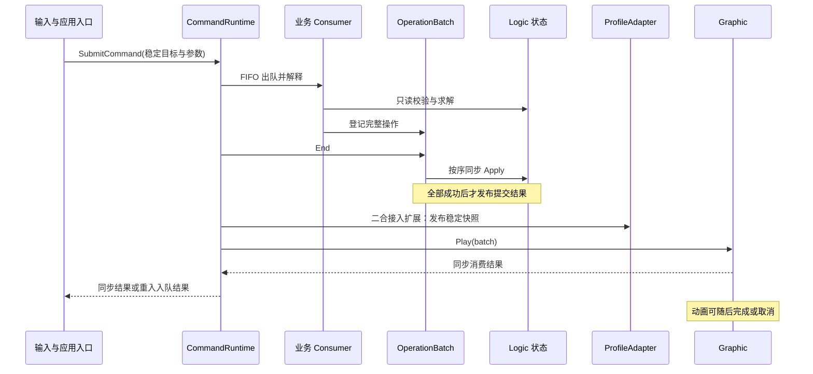

# 架构与参考取舍

建议采用 ProjectIdea 已固定的 Command／Operation 执行机制，在二合内实现普通 C# 规则，UGUI 表现消费结果。HomeHub 是骨架参考，旧 Lua 是业务证据，三合是局部经验来源。所有推荐仍是讨论稿，已确认的产品范围见 [09](09_决策与接续记录.md)。

## 选择的是复用范围

这里先比较工程接入范围。建议采用 ProjectIdea 文档内部已固定的队列／Batch 语义；这仍是本次方案建议，用户可以决定改变。若要改变，应明确记录契约差异，不能继续把它称为未经修改的参考核心。

| 方案 | 优点 | 工作量与风险 | 建议 |
| --- | --- | --- | --- |
| 以现有 MergeCore 扩展二合模式 | 立即获得实体、系统和 Proxy | 表面工作中，实际需剥离三合地图、合成收集、HungUp、动画 ACK、Profile；可能影响当前三合 | 不推荐作为本轮基线 |
| 二合独立模块，按规范移植最小核心 | 边界清楚，业务和资源可独立验收；不牵动现有玩法 | 中等；需要自己的规则、适配和小型表现实现 | **推荐** |
| 先从多个项目提取通用玩法框架，再实现二合 | 多玩法可统一维护核心 | 高；需要跨仓库版本、依赖及迁移验证，范围大于当前独立棋盘 | 等出现真实跨玩法复用任务再做 |

不恢复旧 Lua 框架。旧包的 AppServices、PanelManager、协议和脚本 GUID 不是当前项目运行基础设施。

## 模块职责

| 模块 | 负责 | 写入权限 |
| --- | --- | --- |
| Host／Facade | 打开、隐藏、关闭、配置与 Profile 装配、资源就绪、系统时间输入、外部边界 | 应用生命周期；通过 Command 请求业务修改 |
| CommandRuntime | FIFO、重入、注册、Batch 执行和诊断 | 队列和运行时门禁 |
| Logic | 棋盘、物品、能力、生成、时间、撤销；消费意图 | Operation.Apply 内写自身状态 |
| ConfigAdapter | 旧 JSON → 已校验、只读配置 | 仅构建配置；不保存玩家数据 |
| ProfileAdapter | 加载稳定状态、发布已完成状态快照、请求现有 Profile 落盘 | 二合 Profile 的唯一接入写入口 |
| Graphic | View、输入命中、拖拽跟手、Tween、图标、表现冲突和资源池 | 仅表现状态 |
| ExternalAdapter | 后续宿主钱包、奖励、活动、广告等 | 只调用其权威 API，不让它们反向操纵 View |

这些是职责，不要求每行都有一个抽象基类、Manager 或单独程序集。规则简单时先用直接方法；不引入 ECA／BT／ECS。生成器的时间状态可用明确字段和状态转换表达，不必先写通用 FSM 编辑器。

## 执行主线



Profile 发布位置是本玩法新增接入工作，见下一节；图不能被理解为现成 CommandRuntime 已有该回调。

## 采用参考核心时应保留的语义

来自 A《实现规范》§3–5，并与 H 的 CommandRuntime／OperationBatch／GraphicOperationPlayer 对照：

1. 所有收集先完成，再正序 Apply；所有 Apply 成功后才表现分发。
2. 同类型多个 Consumer 按注册顺序运行。某个返回 false 或抛异常，已登记操作仍保留，后续 Consumer 继续。
3. 因此一次合成、生成或售出由**一个业务归属 Consumer**完成全部正常校验，不能让多个独立 Consumer 分别负责扣费与产物，再期待自动全有全无。
4. 无操作的 Batch 拒绝；无 Graphic Consumer 的 Operation 合法。需要表现的类型由注册表验收发现漏接。
5. Apply 异常停止本批，不回滚前序变化；基础 Runtime 可继续排队命令。
6. Graphic 返回 false 仍继续其它消费者；抛异常则传播。逻辑可能已成功，禁止按 bool=false 重试扣款或生成。
7. 重入提交仅入 FIFO，不递归写状态；此时 true 只表示入队。动画不会阻塞此 FIFO。
8. 同步“表现分发结束”不是动画完成；动画使用自身结束／取消协议。
9. 运行时 CommandId 不提供业务去重，也不是 Profile revision。提交同一 Command 两次可能执行两次。

## 二合需要补的两项接入能力

### 完整逻辑结果的提交出口

本地存档需要知道“全部必要 Apply 已成功”，不能等动画，也不能看 Submit 的 bool。建议在二合接入版本的 `End 成功 → Play 之前`增加一个明确提交观察点，发布本次成功的状态快照和业务结果。

这是相对规范基础参考实现的**显式接入扩展**，需在实施前确认并单独测试；不静默修改 Consumer 失败、FIFO、Apply 或 Player 算法，不修改 ProjectIdea／TileScape 原文件。纯表现、选择变化、最终资源回收等没有持久变化的请求不必发布新 Profile 快照。

快照发布不得 Submit 新业务、重新 Apply 或触发正常业务校验。若决定保持核心文件逐字不改，备选是在同一 Consumer 末尾登记专用发布操作；但它容易被遗漏且不能替代真正的整批成功观察点，暂不推荐。

### 一致性故障收口

基本规则拒绝、表现缺图和状态执行故障分开处理。Apply 异常或提交快照失败后，二合宿主需要结构化故障通知，立即 BeginShutdown 废弃待执行项，结束实例或从最后可信 Profile 重建。不能依靠解析日志文本或 bool 推断阶段。

A §11、§12.5 已说明此服务不在基础 Runtime 内。本方案把它列为二合本地存档的接入工作；在故障发生点通知宿主，确保下一条命令执行前关闭，不等最外层 Submit 返回。Graphic 可恢复错误只刷新表现，不回退已完成逻辑。恢复后不自动重新提交失败请求。

## 对象和能力

新增 [10 Function 与 Effect 建模讨论](10_Function与Effect建模讨论.md)：推荐 Function 继续承载行为实现，Effect 记录可附加的规则影响，通过统一查询参与求解。该选择不改变 Command／Operation 主链，Q11 确认后再更新具体状态模型。

- `ItemEntity` 表达一个物品实例，配置 ID 决定种类／能力。普通物品与生成器可以共用实例模型，专用状态为显式可选数据。
- `BoardState` 与格子结构先作为领域容器；不强制每个格子都建完整 Entity＋Function 树。
- `ItemView` 与 `CellView` 只绑定已确定的逻辑身份与状态。View 的 GameObject 可以回收，业务实例不能由对象池决定寿命。
- 逻辑 Function 与 Graphic Function 分开；只有明确的组合需求才引入两套功能集合。优先让 DropRules、GeneratorRules、RemovalRules 的主链可直接阅读。
- 一个 Operation 可以同步修改多个共同维护不变量的字段；“原子操作”是职责单元，不是自动数据库事务，也不要求“一字段一操作”。

## 从三套实现中取什么

| 来源 | 采用／参考 | 改造或不搬用 |
| --- | --- | --- |
| 旧二合 | nextId 合成链、格子与物品状态分开、生成器轮次、资源 ID 映射 | UI 内扣费、动画后删占位、动态全局服务、旧网络协议、已知概率／序列化问题 |
| HomeHub | 两阶段装配、Command／Batch、显式注册、Entity／View／资源三段生命周期、退役、回调失效保护 | Home 关卡／云／角色／DLC／Capability 表达式和固定 Flow 优先级；它们是地图业务 |
| 当前三合 | 能力组合、运行实例与存档身份区分、宿主 Proxy、表现冲突处理经验 | 三合数量规则、吸附、连锁、HungUp；尤其不能以 MgMergeViewGatherDone 才推进产物规则 |

H 自身仍使用静态 Instance 和 Unity 数学类型。建议二合用实例注入、整数格坐标，满足当前仓库的领域纯 C# 规则；这是本项目接入选择，不宣称 H 已达到“完全无 Unity 依赖”。

## 目录与程序集建议

正式代码建议放 `Assets/Game/MergeTwo/`，当前 `Assets/MergeTwo/` 保留参考资料与本计划。**路径尚待确认，本轮不创建该代码目录。**

```text
Assets/Game/MergeTwo/
  Core/       纯 C# 执行契约、Logic、状态、只读配置 DTO
  Runtime/    Host、Graphic、输入、Profile 和宿主适配
  Res/        新接线的运行资源
  Editor/     后续棋盘配置工具
  Tests/      Core 规则和 Unity 集成测试
```

建议先用 `MergeTwo.Core`、`MergeTwo.Runtime` 两个边界：Runtime → Core，Core 禁止 UnityEngine／ProfileHub／Tween。Editor 单独程序集。跨活动模块需要引用公开服务时再建立最小 `MergeTwo.Interface` 契约，避免直接依赖 MergeCore／TileScape 实现。内部一个稳定实现不为每类都加接口；时钟、存档、资源等真实边界可使用契约与替身。

实际新增 asmdef 时按程序集 skill 检查 GUID 引用、Editor／Runtime 和热更边界。当前没有新增 asmdef，也没有验证候选名字是否最终采用。

## 实现顺序建议

1. **Step 1：固定二合接入契约。** 确认核心复用方式、目录、提交观察点和故障通道；沿用 A 的基础算法。
2. **Step 2：装配最小系统树。** 注入配置、时钟、Profile 适配和 Player，先全部 Init 再 Start；完成注册清单与逆序关闭。
3. **Step 3：贯通 Move／Merge。** 同一输入走校验、Apply、稳定快照和可见结果；验证表现取消后状态正确。
4. **Step 4：逐个加入领域能力。** 遵循 03–07，保持主业务只有一条写入链；需要跨弹窗／下载的演出时才讨论应用 Flow。
