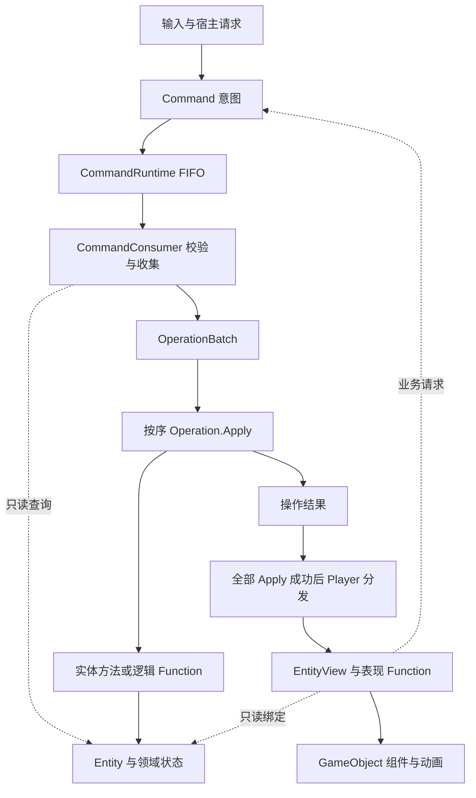

# 逻辑表现分离：Entity、EntityView、Function、Command 与 AtomicOperation

本页集中解释用户原有架构，回答每个概念负责什么、如何协作、在哪里改变状态，以及如何创建和释放对象。建议先读本页，再读 [02 架构与参考取舍](02_架构与参考取舍.md) 中的新二合适配方案；Function 与 Effect 的建模选择另见 [10](10_Function与Effect建模讨论.md)。

以下区分三类内容：**原设计契约**来自 ProjectIdea 架构概览与实现规范（A）；**现有实现**来自 TileScape HomeHub（H）的静态源码；**二合建议**尚待选择，没有因此新增玩法实现。A、H 是本机外部资料，完整路径与源码导航统一见 [00](00_参考资料与证据.md)。本次核对日期为 2026-09-25，不代表已经运行参考项目测试。

术语统一使用 `Entity`、`EntityView`（简称 View）、逻辑／表现 `Function`、`Command`、`AtomicOperation`（简称 Operation）。`commond` 是 Command 的拼写误差，不是另一个概念。

## 1. 分离的是职责、状态写入和执行时机

Logic 决定业务事实：谁存在、处于什么位置、当前允许什么行为、一次请求会造成什么变化。Graphic 根据已经确定的结果组织画面、声音和交互反馈。动画可以尚未播放完，但业务结果已经成立，之后的合法请求读取这个结果。

这套设计同时包含两条关系：对象关系是 Entity → 逻辑 Function，以及 EntityView → 表现 Function；执行关系是 Command → CommandConsumer → OperationBatch → Apply → OperationConsumer。Function 是对象行为的组织方式，Command／Operation 是请求和执行的组织方式，不能把它们当成同一组可相互替代的类型。

| 概念 | 职责与典型内容 | 不承担的职责 |
| --- | --- | --- |
| Entity | 运行身份、领域数据、对象关系、逻辑功能集合 | 资源加载、动画、Transform 层级 |
| EntityView | 绑定 Entity 身份，持有表现功能、组件与资源上下文 | 决定物品是否存在、能否合成或扣多少费用 |
| 逻辑 Function | 组合实体能力；进行只读规则判断，或在 Apply 内执行领域修改 | 绕过执行入口随时改业务、直接操作 View |
| 表现 Function | 组件绑定、输入接线、视觉刷新、动画与取消 | 扣费、创建业务物品、改变占位 |
| Command | 表达一个请求及参数，例如“把 A 放到格子 B” | 自行执行规则、保证请求一定成功 |
| CommandConsumer | 解释请求，校验当前条件，准备并登记 Operation | 在收集阶段偷偷提交活跃状态变化 |
| AtomicOperation | 持有准备好的输入，在 Apply 执行同步步骤，暴露后续所需结果 | 自动事务回滚、默认可撤销、等待动画 |
| OperationBatch | 保存一次收集的有序操作，统一执行 | 推断操作依赖、补齐遗漏操作、保证整批事务性 |
| OperationConsumer／Player | 按类型分发表现结果，驱动 View 或其它表现模块 | 再做一遍业务求解、等待全部动画后才允许下一条命令 |



箭头表示职责与调用关系，不表示每个操作必须经过一个 Function。Logic 内部、Graphic 内部仍可直接调用普通方法；按压缩放、拖拽跟手等局部反馈可直接处理，真正落子再提交 Command。Graphic 可以只读查询 Logic，但不能用当前画面反推业务状态。

原设计不限定所有规则都用 ECA、FSM、BT 或 ECS；这些规则组织方式与 Command／Operation 执行机制是不同层次。逻辑表现分离也不自动提供多线程、无 Unity 依赖、确定性回放或存档事务。H 仍有静态 `Instance`、Unity 数学类型以及 Runtime 对具体 Graphic 模块的访问；新二合的纯 C# 边界是额外适配选择。依据：A §1–2、§9、§12；H 的 Runtime 与实体类型。

## 2. Entity：业务对象及其逻辑能力

Entity 是有运行身份的领域对象。H 的 `EntityBase` 提供 `EntityId`、`EntityType`、逻辑 `FunctionController` 和 `Init／Start／Trigger／Release`；具体子类补充自己的数据。例如 `EntityLevel` 保存所属 Segment、关卡编号、节点序号、逻辑位置和关卡状态。

Entity 不是一份只能被动读取的数据表，它可以有领域方法和逻辑 Function；但**改变业务的调用必须来自正确的执行阶段**。例如逻辑 Function 可以执行退役，但调用链应处于某个 Operation.Apply 内。把写入从 Operation 方法体委托给领域方法，不会破坏边界；从点击回调直接调用同一写方法，则绕过了边界。

`EntityId` 表示当前运行实例的身份，`EntityType` 用于工厂和分类索引。配置 ID 表示种类，持久 ID 表示跨保存／恢复的业务身份，它们不能混用；GameObject 的实例号也不能作为业务身份。二合的持久身份方案见 [03](03_状态模型与Profile.md)。

### 创建、索引和关系

原设计的创建顺序是：

```text
Create…Operation.Apply
  → EntityManager 分配运行 ID
  → EntityFactory 按 EntityType 显式创建
  → Init(id, birthData)：领域字段与逻辑 Function
  → 登记 ID 索引、类型索引
  → Start
  → 返回 Entity，保存到 Operation 输出
```

Factory 负责类型构造与 Init 失败清理；Manager 负责索引、Start 和失败时撤回索引。Start 时对象已能通过 Manager 查询。父子／容器关系由领域代码明确建立，例如 `CreateSegmentOperation.Apply` 将新 Segment 加到 Theme；关系不由 Transform 的父子层级决定。

若 Function.Init 需要子类字段，应先从 birthData 写好这些字段，再初始化功能。A 明确要求这一顺序；H 的具体子类仍要逐个核对，不能看到 `base.Init` 就假定字段已准备好。释放和退役另见第 8 节。

## 3. EntityView：逻辑绑定与可视资源之间的一层

H 的 `EntityViewBase` 是普通 C# 包装对象，记录与 Entity 相同的 ID／类型，绑定 Entity，持有表现 Function、HUD 和可为空的 Transform。它的存活不等于 GameObject 的存活。

| 生命周期 | 何时存在 | 结束意味着什么 |
| --- | --- | --- |
| Entity | 业务对象创建后；退役时可暂时保留收尾引用 | 最终释放业务对象 |
| EntityView | 需要绑定这个对象的表现上下文时 | 解除表现绑定和功能 |
| GameObject／资源实例 | 当前可见或需要播放时 | 回池或销毁可视资源 |

一个 Entity 可以没有 View；一个 View 可以暂时没有 GameObject；装饰特效也可以不建 Entity。H 的 ViewManager 对同一 EntityId 只允许一个 View，并非要求每种粒子／光效都各占一个业务对象。

### 创建与可视绑定

```text
创建 Operation 的表现 Consumer
  → 读取 Apply 已创建的 Entity
  → 按 EntityId 查 View，已有则复用，没有才创建
  → View.Init：记录身份、绑定 Entity、初始化表现 Function
  → 登记 View 索引 → Start
  → CreateGraphic，或登记可见性节点等待创建
```

H 中“查找后复用”由具体 Consumer 完成；直接调用 `EntityViewManager.CreateView` 创建重复 ID 会抛异常，不能把它当作 GetOrCreate。逻辑对象必须先存在，表现不能先造一个默认 Entity 来补缺。

`Init／Start` 时 Transform 可以仍为空。实际创建可视对象时，依次取得资源实例、设置挂载点、保存 Transform、设置初始显示，再触发 `GraphicBound`；表现 Function 在此时建立组件缓存和输入接线。回收时停止动画，触发 `GraphicRecycled` 解绑，再归还原池、清空引用。

H 的 `EntityViewLevel.CreateGraphic／RecycleGraphic／Release` 展示了这种配合：`Release` 先回收资源，再调用基类释放功能与绑定。单独清空 Transform 不能替代回池、取消句柄和解绑。离开可见区域只回收 GameObject，不改变关卡或棋子的业务状态。二合是否需要 Home 的可见性管理，见 [06](06_表现与资源.md)，不因采用三段生命周期就自动搬入地图分块系统。

## 4. Function：两层分别组合行为

两侧 Function 都有 Init、Start、Trigger、Release，但绑定对象和写入权限不同。H 的逻辑基类是 `EntityFunctionBase`，持有 Entity；表现基类是 `EntityViewFunctionBase`，持有 View。两个命名空间各有自己的 FunctionFactory 和 FunctionController。

| 逻辑侧例子 | 表现侧例子 | 协作方式 |
| --- | --- | --- |
| 判断对象能否参与某规则；Apply 内更新关系 | 注册点击、拖拽反馈 | 输入产生 Command，规则由 Logic 判断 |
| `Logic.FunctionCloudRetire` 将云移入退役集合 | `Graphic.FunctionCloudRetire` 播放消失动画 | 操作结果／退役凭据把两段工作接起来 |
| EntityLevel 直接保存关卡状态 | LevelNormal、LevelClick 等表现功能 | 不要求逻辑侧有同名、同数量的 Function |

Function 的价值是组合与复用，不是增加调用层数。一个明确的领域方法已能表达行为时，无需强制包装 Function；多个对象确实复用能力、同一对象需组合多种能力时再拆。逻辑 Function 也不等同于“允许操作”的布尔开关：是否可用还需查询状态、配置、效果和上下文。

### 创建与触发的精确语义

实体／View 声明 FunctionType 列表，工厂按显式类型键创建功能，先 Init 后加入 Controller，再统一 Start。H 的 Controller 按 FunctionType 的数值升序调用，Release 逆序执行。业务优先级必须有明确约定，不能依赖反射发现顺序。

某个 Function.Init 失败时先释放该功能，再由外层释放之前已成功创建的功能并传播异常。Trigger 本身也不把任意异常自动变成 Failed，最终影响取决于调用处是在收集、Apply 还是表现阶段。

H 的触发入口为 `Trigger(string triggerType, params object[] args)`，每个功能自行识别事件和参数：

| FunctionResult | 含义 | 后续功能 |
| --- | --- | --- |
| Failed | 该功能未处理此触发 | 继续 |
| Success | 已处理，但允许继续传播 | 继续 |
| SuccessAndAbort | 已处理，并终止当前 Controller 的触发链 | 停止本次局部分发 |

全部为 Failed 才返回 Failed；否则保留最后一个非 Failed 结果，遇 SuccessAndAbort 立即返回。例如结果依次为 Failed、Success、Failed，最终仍为 Success。**这里的 Abort 不是 Batch.Abort，也不是业务事务失败。** H 的 View.Trigger 在 Controller 返回后还会通知 EntityHud，所以停止功能链也不等于取消 View.Trigger 内的全部后续动作。

当前 H 的 FunctionController.Add 不去重，也不自动补 Start；相同 Type 的相对顺序不能当成稳定业务协议。Get／Remove 按 Type 找到首项，Remove 释放该项。需要动态添加、唯一性或同型多实例时，应明确补齐协议，不能把源码现有 Add 当作完整的动态组件框架。

必需 Function 的缺注册应在装配时发现。A 明确要求不能静默缺能力，但 H 的两个基类当前会跳过工厂返回 null 的情况；采用时要补必需项检查。字符串与 object[] 的参数也不是编译期类型安全，示例代码中的类型检查不能省略。

Function 和 Effect 不同：前者组织行为代码，后者表达可附加的玩法影响及其数据。Effect 可以由 Function 或普通规则函数处理，但不会因此获得一条绕过 Operation 的写入通路。Effect 选型仍是 Q11，详见 [10](10_Function与Effect建模讨论.md)。依据：A §6.4；H 两侧 FunctionController、FunctionFactory、基类与云退役功能。

## 5. Command：意图、解释与登记

Command 记录“希望发生什么”，Consumer 根据执行时的当前状态决定如何处理。用户输入、系统时间输入、宿主请求都可以产生 Command；纯表现请求也可以使用 Command。它不必来自鼠标点击，也不必修改持久数据。

以下为 A／H 核心接口的摘录，枚举和命名空间省略；这是接口说明，不是新建的二合代码：

```csharp
interface ICommand
{
    int CommandId { get; }
    CommandType CommandType { get; }
}

interface ICommandConsumer
{
    CommandType CommandType { get; }
    bool TryConsumer(ICommand command, IOperationRecorder recorder, out string reason);
}

interface IOperationRecorder
{
    void AddOperation(IAtomicOperation operation);
    void AddOperations(IEnumerable<IAtomicOperation> operations);
}
```

业务 Command 另加目标身份与参数；基础接口没有 Execute，执行入口是 Runtime。CommandType 将请求路由到 Consumer，CommandId 用于关联和诊断，不自动去重；同一命令对象提交两次也可能执行两次。

Consumer 先做命令类型、目标是否仍活跃、当前能力、参数及业务条件校验，再登记 Operation。预览时的“可合成”不能代替执行时校验。收集阶段允许只读计算和构造临时方案，不能提前扣款、占格、删实体或推进正式随机源。

一个 CommandType 可注册多个 Consumer，按注册顺序全部分发；它不是“第一个认领后就停止”的处理链。登记多个 Consumer 是原机制能力，是否让多个 Consumer 共同写一笔业务则是玩法方的设计选择。注册表避免同一 Consumer 实例重复登记，不按类型名或 CommandId 提供业务幂等。

Command 和 Operation 两侧都应在装配／释放边界注册和注销 Consumer，不在正在遍历的消费回调里改同一个注册列表。

Command 的 get-only 属性也不意味着输入对象深度不可变。H 的 BuildMapCommand 持有 SceneData 引用，部分内部命令还持有回调；排队期间应保证输入稳定，不能把这些运行对象直接当作可持久化的命令日志。依据：A §4–5；H CommandRuntime、注册表、BuildMapCommand、RetireCloudCommand。

## 6. AtomicOperation、Batch 与表现消费

### Operation 是执行步骤，也承载执行结果

```csharp
interface IAtomicOperation
{
    OperationType OperationType { get; }
    void Apply();
}

interface IOperationConsumer
{
    OperationType OperationType { get; }
    bool Consume(IAtomicOperation operation);
}

interface IOperationBatchPlayer
{
    bool Play(OperationBatch batch);
    void RegisterConsumer(IOperationConsumer consumer);
    void UnregisterConsumer(IOperationConsumer consumer);
}
```

OperationType 路由执行结果，和 CommandType 不要求一一对应。一个请求可以生成多种 Operation；多种请求也可以复用同一种 Operation。

Operation 通常先保存确定的输入，在 Apply 中完成同步工作，再提供输出。例如 CreateThemeOperation 的 ThemeEntity 在构造时尚不存在，Apply 创建后才可读取。CreateSegmentOperation 持有前者的引用，在自己的 Apply 读取已创建 Theme，因此依赖顺序必须通过登记顺序保证，不能在收集时提前读取实体输出。

Operation 有几种合理形态：修改状态、查找／捕获表现目标、发布已确定的逻辑消息，或仅承载表现请求。纯表现操作的 Apply 可以为空；最终退役释放也有专用路径。不能根据“没有改某字段”就认定一个 Operation 必须删除。

“原子”表示职责与调度单元，接口并不提供事务原子性。一个 Operation 可以修改多个共同维护不变量的字段；它内部中途抛异常也可能留下部分修改。没有内置 Revert，没有自动保存旧值，更不会因加入 Batch 就自动支持 Undo。

### 一次正常执行的顺序

```text
SubmitCommand
  → 入 FIFO；正在执行时不递归，只排队
  → 出队，找到全部匹配的 CommandConsumer
  → Batch.Begin，依次收集全部 Operation
  → 非空校验
  → Batch.End，按登记顺序同步 Apply 全部 Operation
  → Player.Play，按操作顺序调用匹配的 OperationConsumer
  → 同步分发结束通知
  → 处理下一条排队命令；动画可以仍在运行
```

不能改成“Apply 一个 → 等它的动画完成 → 再 Apply 下一个”，否则后续业务结果重新依赖表现。Apply 内也不等待网络、资源加载或异步动画；需要资源的构建应在资源准备就绪后提交。

Batch.Begin 打开收集；AddOperation 只在收集期间使用；End 执行后关闭收集，即使 Apply 抛异常也会关闭。Apply 期间不得增删本批列表。Abort 清理批次记录，**不会撤回已写状态**。Batch 本身可结束空列表，但 H 的 Runtime 会在 End 前拒绝空批。

全部 Apply 完成后，Graphic 读取 Entity 看到的是本批最终状态。例如同一实体在一批内 A→B→C，第一段动画不能靠读取当前 Entity 找到 B；需要 Operation 显式保留每段的起点和终点。Operations 暴露只读集合也不保证 Entity 引用、回调或其它结果深度不可变，它不是现成的历史存档。

### 失败与返回值不能混成一个“成功”

| 发生位置 | A／H 的基础行为 | 调用方必须知道 |
| --- | --- | --- |
| 入口已关闭／Command 为 null | 返回 false，不入队 | 未接收请求，与提交后发生故障的阶段不同 |
| CommandConsumer 返回 false 或抛异常 | 记录问题，保留已登记操作，继续后续 Consumer | Consumer 失败不会自动拒绝整批；最后仍可能有可执行操作 |
| 没有 Consumer／收集后为空 | Runtime 拒绝，不进入表现 | bool=false 不唯一对应这种“没有业务变化”的情况 |
| 某个 Apply 抛异常 | 停止本批后续 Apply，Abort，不进入 Play；基础队列仍可继续 | 前面及当前操作已经写入的部分不会回滚 |
| Operation 没有表现 Consumer | Player 视作无需处理，继续 | 需要表现却漏注册时，不会自动报失败 |
| 表现 Consumer 返回 false | 汇总为失败，仍处理其它 Consumer 和 Operation | 逻辑已执行，不能据此重复扣费／重试生成 |
| 表现 Consumer 抛异常 | 向外传播，打断本次队列处理 | 当前逻辑已经执行；余下队列可能在后续 Update／Submit 继续 |

同步提交返回 true，至多说明该批已执行且同步表现分发返回成功；它不证明每个 CommandConsumer 都成功，更不证明动画、磁盘保存或外部业务成功。**重入提交返回 true 只表示已入队。** 同步提交还可能在处理随后排队的另一条命令时遭遇异常，不能用最外层异常反推原请求完全没执行。

H 在 Player 正常返回后派发 `PresentationFinished`，即使 Player 返回 false 也会派发；若收集／Apply 被拒绝或 Play 抛异常，则不走这条通知。它表示本次同步分发走到末尾，没有等待动画。动画结束协议见第 8 节；二合怎样增加完整提交与故障出口，见 [02](02_架构与参考取舍.md)。依据：A §4–5、§11；H Runtime、Batch、Player。

## 7. 用实际调用链连接这些概念

### 例一：HomeHub 构建地图

以下取普通地图路径，省略角色、箱子、云和相机的并行职责分支，不把它误写成现有源码只有三个操作：

1. `BuildMapCommand` 带 SceneData 进入 Runtime，`BuildMapCommandConsumer` 调用 `Logic.MapModule.BuildMap`。
2. BuildMap 计算布局，登记 CreateThemeOperation、各 Segment 与 Level 等创建操作，最后登记 CompleteMapBuildOperation。此时只有操作和输入，目标实体尚未创建。
3. Batch.End 中，Theme 先创建；Segment.Apply 取得 Theme 的输出并建立关系；Level.Apply 取得 Segment 的输出，再经 EntityManager 创建 EntityLevel。
4. 最后 CompleteMapBuildOperation 提交地图数据并发布 MapReady。**这个逻辑通知发生在 Play 前，不能认为所有 View 都已创建。**
5. 进入 Play 后，LevelCreateOperationConsumer 取得 EntityLevel；需要显示时查询／创建 EntityViewLevel，并登记可见范围、CreateGraphic、RecycleGraphic。
6. 可视对象创建时触发 GraphicBound，LevelNormal／LevelClick 等表现 Function 建立显示和输入；离开可见区可以只回收 GameObject。

这一链说明为什么 Entity、View、资源要分开创建，也证明原设计允许一个 Command 内有多个依赖 Operation。数据和通知的“逻辑就绪”，与资源／画面的“可用”，必须分别定义。

### 例二：HomeHub 的云退役，两侧 Function 各做一段

以 `SyncCloudOperation` 后直接处理退役表现的路径为例：

```text
SyncCloudOperation.Apply
  → CloudModule.Reconcile 找到需退役的云
  → EntityCloud.Trigger(Retire, context)
  → Logic.FunctionCloudRetire
  → EntityManager.BeginRetirement：退出活跃索引，生成 Ticket
  → Ticket 成为 SyncCloudOperation 的结果

全部 Apply 后，CloudSyncOperationConsumer
  → 按 Ticket 的 EntityId 找旧 EntityViewCloud
  → View.Trigger(Retire, finish)
  → Graphic.FunctionCloudRetire 播放或跳过消失动画
  → finish 提交 FinalizeEntityRetirementCommand
  → 最终释放操作的表现 Consumer 解绑、回收 View
  → finally 完成 Ticket 对应的 Entity 释放
```

这里逻辑 Function 的修改实际由 SyncCloudOperation.Apply 调用；它不是从动画回调才开始删云。Graphic 使用旧 View 完成演出，但新逻辑查询已经找不到这片云。

H 另有延后演出的分支：先把已生成的 Ticket 交给流程，之后通过 RetireCloudCommand／RetireCloudOperation 请求演出。该 RetireCloudOperation.Apply 为空，是因为逻辑退役已经做完，不能据此推断所有退役操作都不写逻辑。最终释放命令若在 Consume 中同步提交，只会先进入 FIFO。

### 例三：二合的一次拖拽合成（建议，非现有代码）

为对应本玩法，下面使用概念名，不声称仓库已有 DropCommand 或 MergeOperation：

1. ItemView／拖拽表现 Function 做跟手，松手后提交包含源物品身份和目标格的 DropCommand；拖动过程中不改占位。
2. Consumer 用执行时状态重新校验，调用普通规则方法或逻辑 Function，求出源／目标消费、结果物、占位、解锁及附加物的完整变化。Function／Effect 只参与这次求解，不在动画里补规则。
3. 按二合当前建议，完整构造一个业务 MergeOperation 后一次登记。Apply 同步执行全部业务变化，旧物退出活跃集合，新物已经占格；若内部故障则进入一致性故障出口，不假设自动回滚。
4. 二合接入扩展在完整逻辑成功后发布稳定 Profile 快照；实际落盘另行跟踪。
5. MergeOperationConsumer 根据结果驱动两个旧 View 汇聚、新 View 出现。取消演出时对齐最新逻辑状态；旧资源的结束回调只收尾，不再创建产物、扣费或解除锁。

这条示例中的“一个完整业务 Operation”和 Profile 出口是 [02](02_架构与参考取舍.md) 的适配建议；原设计仍支持例一那样的多 Operation。具体状态与权限分别以 [03](03_状态模型与Profile.md)、[04](04_棋盘交互与合成.md) 为准，不在本页另列一套规则表。

## 8. 异步表现、退役与整体关闭

### 动画完成是一份独立协议

表现 Consumer 返回只代表本次同步消费结束。需要等待演出的流程应使用专门的结束／取消通知，并处理零时长、缺少可选 View、回池、中断和关闭。无参数完成回调通常只能表示“已不再等待”，若业务需要区分成功、取消、失败，应显式带结果。

回调可能就在 Consume 内同步触发，因此等待标记和必要输入门禁必须在 Submit 前建立。调用回调前先清空保存的回调或设置完成标志，以防重入和重复触发。动画开始时捕获本次目标，不在延迟回调里从变化中的 Entity 重新求旧目标。

对象关闭／换绑后，旧回调必须失效；同时停止它拥有的 Tween、协程、定时器和订阅。单纯检查版本不能停止仍在运行的动画，单纯停止 Tween 也不能保证晚到的资源回调不会写入新对象。二合采用的 SessionGeneration、绑定代际与表现版本见 [06](06_表现与资源.md)。

### 退役与最终释放

需要旧 View 收尾的对象，按原设计经历：

```text
Active：参与业务查询
  → Apply 解除领域关系、移出活跃索引
Retiring：Ticket 保留 Entity，旧 View 可收尾，不能参与规则
  → 动画完成／取消／无可视对象
  → 最终释放命令与操作
  → 注销可见性，回收资源，释放 View
Released：从退役集合移除，Entity.Release
```

最终释放操作的 Apply 可以为空，由它的表现 Consumer 先清理 View，再在 finally 中调用专用 Entity 释放入口。这是处理跨层对象寿命的受控路径，不是允许 Graphic 写占位、发奖励或决定合成成功。

H 的 EntityManager 将活跃、退役索引分开；同一 Ticket 重复完成，只有从退役集合移除成功的调用才执行 Release。不过当前方法按 EntityId 移除，不能仅靠它保证 Ticket 来自当前实例；A 要求的实例有效性仍需由会话／调用边界保证。旧凭据不得释放重建后碰巧同号的新对象。

只有确定没有 View 绑定和待收尾引用时，才可直接 RemoveEntity。关闭整个实例时则不等待退役命令继续运行：先关入口，Graphic 直接释放全部 View，Logic 再释放剩余活跃及退役 Entity。二合若以后选择结果副本使 Entity 可以提前释放，要完整替换这套引用依赖，选择说明见 [06](06_表现与资源.md)。

### 系统装配也要遵守生命周期

A／H 用显式系统树组织 Init、Start、Update、Release。先让全树 Init 完成，再开始 Start；父节点在子节点前初始化／启动，释放时子节点逆序，再释放父节点。SystemComponent 按具体类型获取直接子系统，不递归查子树，也不自动按接口或基类查找。固定树在启动前装配，运行中 Add 不会自动补 Init／Start。

H 的逻辑命令模块在 Init 创建 Consumer，Start 注册，Release 注销；Graphic 的 Operation 注册表在自身 Init 装配。注册阶段可以不同，关键是第一次提交构建或开放输入前，资源、双方注册表和桥接都已就绪。

关闭时先 BeginShutdown 停止新请求并清待处理队列，使旧回调失效，取消输入／时间／表现，随后释放 Graphic、Logic、Runtime 及上下文。正在主线程同步执行的 Apply 不会被神奇地回滚或抢占；不能在它的消息回调里立即拆除仍被它使用的系统。初始化失败的整体清理由组合根负责，基础系统树不提供通用事务回滚。隐藏和真正销毁须分开处理。依据：A §3、§7–8；H 的装配、资源回收与退役链。

## 9. 继承原设计与二合新增约束的分界

| 主题 | 原设计／H 机制 | 本二合目前的建议 |
| --- | --- | --- |
| 规则组织 | 普通领域方法，可按需组合两侧 Function | 简单规则先直接表达；有复用需求再拆 Function |
| 执行 | FIFO；全部收集、全部 Apply，再分发表现 | 保留该顺序和失败语义 |
| Consumer／Operation 数量 | 同类型多 Consumer；一批多 Operation | 合成、生成、售出等一次业务由一个归属 Consumer 完整求解、一次登记；理由见 02 |
| 状态持久化 | 基础 Runtime 没有完整业务提交收据或存档事务 | 增加表现前快照发布和结构化故障出口，见 02／03 |
| 分离程度 | Logic 不依赖具体 View；H 仍依赖 Unity 和静态模块 | 纯 Core、实例注入、整数格坐标，见 02 |
| 生命周期 | Entity、View、资源分开；引用存续时使用 Ticket 退役 | 首版按实际引用选退役或完整结果副本，见 06 |
| Effect | Function 不限制附加效果的表示 | Function＋Effect 为待讨论方案，Q11 尚未确认 |
| Undo／Replay | 基础接口不自动提供；A 另有扩展契约 | 按 D03 只做售出／删除专用撤销 |

学习 A 的契约时也要检查 H 的具体落点：基类不会替所有子类填好出生数据、必需功能不会自动校验、ViewManager 不会自动复用重复创建、资源回收依赖具体 View 实现、退役凭据的实例隔离也不能省略。它们说明应如何对照源码使用这套设计，不代表本轮已修改外部项目。

本页维护基础概念与时序；02 维护二合适配取舍，03 维护状态／存档，04 维护行为权限，06 维护具体表现接入，10 维护 Function／Effect 选择。实施顺序与验收仍集中在 [08](08_实现顺序与验证.md)，不另开一份实现计划。
