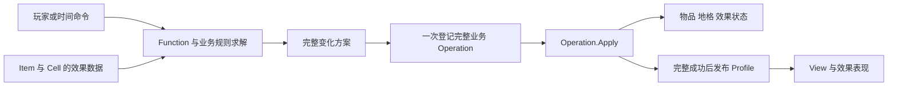

# Function、Effect 与 State 的建模讨论

专题始于 2026-09-23，迁仓复核于 2026-09-25。用户希望评估并尝试为 Entity 引入效果；尚未确认具体实现，更没有确认删除所有状态。建议采用 **Function 表达行为实现，Effect 表达可附加的玩法影响，State 保存必要运行事实与互斥阶段**。本页不新增玩法功能或运行代码。

公开来源与阅读边界见 [11 外部实现调研](11_外部实现调研.md)。原架构的两侧 Function、触发结果和写入阶段先读 [02a 第 4 节](02a_逻辑表现分离架构详解.md#4-function两层分别组合行为)，二合架构取舍见 [02](02_架构与参考取舍.md)。这里的 Effect 指影响规则的 GameplayEffect；动画、粒子等使用 View／VFX 表达。

## 先区分三种“状态”

| 所说的状态 | 例子 | 引入 Effect 后如何处理 |
| --- | --- | --- |
| 运行数据的当前值 | 占位、生成次数、剩余层数、截止时间 | 仍然存在，Effect 自己也需要这些状态 |
| 互斥的业务阶段 | 宝箱未开启／开启中／可领取；关卡 Locked／Current／Completed | 可以继续用 enum／小型状态机，Effect 不替代过程顺序 |
| 可叠加的附加条件 | 冰冻、锁、护盾、倍率增益 | 很适合拆成独立 Effect 实例，再派生有效能力 |

因此可以取消某个“大而互斥的物品状态枚举”，但无法消除状态本身。用 `HasEffect(Lock)` 代替 `State == Locked` 只是表达位置的变化；收益来自独立组合、生命周期和统一规则查询，而不是换名字。

现阶段不需要为了避免 State 一词，把冷却次数、物品位置、选中、实体退役全部包装成效果。

## Function 和 Effect 如何区分

它们不是严格对等的两个“能力类型”。Function 是现有架构组织行为代码的单元；Effect 是玩法中可以附加、变化和移除的对象。Effect 的行为可以用 Function 实现，也可以由普通规则函数处理。

| 概念 | 回答的问题 | 二合例子 |
| --- | --- | --- |
| Entity／宿主 | 谁拥有身份和数据？ | 一个生成器实例、一个地格 |
| Function | 哪段代码实现某种行为？ | 合成求解、生成、使用物品 |
| Effect | 当前附着了什么玩法影响？ | 浅锁、深锁、气泡；以后可能有冰冻 |
| State／Data | 当前事实是什么？ | 轮次、次数、效果层数、截止时间 |
| 能力查询 | 结合当前上下文，现在允许做什么？ | 能拖动、能作为合成源／目标、能生成 |
| Operation | 本次已经决定的变化如何提交？ | 消耗两物、创建结果、解除锁、移除效果 |

**不能按“长期＝Function、短期＝Effect”硬分。** 效果可以永久存在直到满足解除条件，Function 也可以动态加入或移除。Effect 还可能授予行为，而不只是禁止行为。例如未来附加一个临时自动产出效果，可以复用产出规则；不应复制一套“效果专用生成算法”。

本项目建议：保留生成／合成等行为实现，执行前查询宿主及格子的效果和业务前置条件。锁效果不靠销毁 MergeFunction 来禁止合成，否则重新创建可能丢失功能状态，也不容易同时表达“不能主动拖，但能被合成”。

## 现有项目说明了什么

| 来源 | 已核对的代码事实 | 对本次建模的启发 |
| --- | --- | --- |
| 旧二合 | `ArticleStateBase.AddListerer` 按 `processFuncMap` 决定 Function 事件注册；浅锁仅保留 Merge，深锁为空，同时 State 类控制外观 | State 混合了权限、事件接线和显示；这部分可拆为 Effect 数据＋统一查询＋Graphic |
| 宿主三合 | `ElementState` 是 Normal／Locked／HungUp；`ElementEntity.TransitionState` 分发通知并管理格子关系；存在 AreaStateLockFunction 等状态处理函数 | State 与 Function 已经协作；应按业务条件、阶段、表现协调分别拆，不把 HungUp 机械改为锁 Buff |
| HomeHub | `EntityLevel.State` 是关卡进度，`LevelState` 为 Locked／Current／Completed；FunctionController 负责有序触发 | 进度状态仍有意义；引入附加效果不要求移除全部业务枚举 |
| 宿主 TileV2，新增局部参考 | Logic 的 `Effect : Actor`，有独立 EffectData／EffectView；EffectData 同时含 Life、State、Position、绑定 Tile 等数据 | 现有项目已经有“Effect＋自身状态＋独立表现”的实例；这类效果也可能是棋盘机关实体，不仅是 RPG 属性 Buff |

以下分别标明本仓库与外部宿主路径，来源根见 [00](00_参考资料与证据.md)：

- `参考项目/FA/实现/Lua/Game/TwoMerge/Article/State/ArticleStateBase.lua`、同目录 `ArticleStateLock.lua`、`ArticleStateDeepLock.lua`。
- `/Users/betta/Company/Projects/meatloaf_client/client/Assets/Game/Merge/Scripts/Runtime/Logic/Entities/Entity/Element/ElementState.cs`、`ElementEntity.cs`；`Function/Factory/FunctionController.cs` 位于同一 `Entities/` 下。
- H 根为 `/Users/betta/Company/Projects/TileScape/Assets/Module/HomeHub/HomeScene/Scripts/`，关注 `Logic/Entity/Level/EntityLevel.cs`、`Define/LevelState.cs`、`Logic/Entity/Function/FunctionController.cs`。
- `/Users/betta/Company/Projects/meatloaf_client/client/Assets/Game/TileV2/Scripts/GameCore/Logic/GameLogic/Entity/Effect.cs`、`Data/EffectData.cs`（相对同一 `GameLogic/`）；`/Users/betta/Company/Projects/meatloaf_client/client/Assets/Game/TileV2/Scripts/Config/Effect/EffectConfig.cs`、`EffectState.cs`；`/Users/betta/Company/Projects/meatloaf_client/client/Assets/Game/TileV2/Scripts/GameCore/View/GameView/Views/TileEffect/EffectBase.cs`。

TileV2 这里只作概念对照：没有完成整个 ECA、攻击传播和表现时序审计，也不建议搬入整套机制。其 EffectData 已含显示协调数据，不能直接当作新二合的纯领域 DTO。

## 冰冻、箱子、炸弹不一定属于同一建模层

按玩法角色和生命周期判断，比按美术名称判断可靠。

| 具体语义 | 建议模型 | 原因 |
| --- | --- | --- |
| 给现有物品附着冰冻，解除后原物仍在 | Item 上的 FreezeEffect | 它修饰原物品的行为 |
| 锁住一块土地，换物品也不改变土地锁 | Cell 上的 LockEffect | 效果留在位置，不随物品移动 |
| 给生成出来的物品加锁，物品迁移时应跟随 | Item 上的 LockEffect | 归属是物品实例 |
| 箱子占据格子，有自己的生命／掉落／身份 | 障碍 Entity＋受击／掉落行为 | 它本身是棋盘对象，不必附着在另一个物品上 |
| 一层木箱外壳包住原有物品 | Item／Cell 上的 CoverEffect | 壳和被包物的身份不同，可分开解除 |
| 可移动、可合成的炸弹道具 | ItemEntity＋爆炸 Function | 炸弹是物品，爆炸是能力；倒计时是该能力的数据 |
| 给普通物品附加“被消耗时爆炸” | ExplodeOnConsumedEffect | 原物仍保留种类，附加触发后果 |

冰冻／木箱／炸弹只是帮助比较的例子，本轮不据此新增三个正式功能。

如果某机关同时覆盖多个格子、独立受击或独立移动，可以进一步成为 EffectEntity；首期单格锁与气泡只用宿主下的效果数据即可。不因为引入 Effect，就强制每个 Cell 创建完整 Entity／Function 树。

## 锁效果不能只有一个 CanOperate

建议至少按当前需求区分 Select、Drag、MergeAsSource、MergeAsTarget、Activate、Remove 等意图。仓库接入时再加 Store，不预列几十个未使用权限。

各业务状态的权限只维护在 [04 的权限矩阵](04_棋盘交互与合成.md#锁与能力矩阵建议)，不在这里复制另一张表。浅锁不阻止合法目标合成，不表示它能越过其它限制；若同一目标还存在禁止合成的冰冻，最终仍应拒绝。冰冻只作组合示例。

候选查询过程：

```text
EvaluateIntent(意图, 源实例, 目标实例, 源格, 目标格)
  → 实例仍活跃、坐标与身份有效
  → 物品具备相应行为／配置关系
  → 棋盘与区域前置条件
  → 源／目标 Cell 和 Item 的有效效果限制
  → 该行为自己的次数、费用、空间等校验
  → 可执行，或明确拒绝原因及来源
```

第一版可采用“所有必需条件满足，任一适用效果禁止则拒绝”。解除一个锁时，移除该效果后重新查询；不能直接把 `CanDrag=true`，否则可能错误覆盖仍然存在的其它限制。若未来有“穿透某一种锁”的能力，按具体效果匹配例外，不能让任意 Allow 抹掉全部 Deny。

查询结果／标签可以缓存，但只是派生值。不要同时持久化 `Locked=true` 和 `LockEffect` 并允许两处分别修改。

## 与 MMO／RPG／MOBA Buff 的关系

附着宿主、改变规则、有来源、可叠加／解除、有持续或触发条件，这些性质与 Buff／Debuff 很相近。UE GAS 的 Effect 支持瞬时、有限期和无限期，也有独立的运行期描述与叠加策略；官方还提供 Effect 阻止 Ability 的标签机制。可借鉴概念边界，不需要引入联网预测、复制与完整属性聚合系统。[Epic：Gameplay Effects](https://dev.epicgames.com/documentation/unreal-engine/gameplay-effects-for-the-gameplay-ability-system-in-unreal-engine)、[Effect 阻止 Ability](https://dev.epicgames.com/documentation/en-us/unreal-engine/API/Plugins/GameplayAbilities/UBlockAbilityTagsGameplayEffectC-)

棋盘需要额外关心宿主是物品还是地块、覆盖范围、合成后的效果继承，以及一次变化引起的空间竞争。这些并不能仅靠传统“加属性、过几秒减回来”解决。

命名建议：持续附加的规则对象叫 GameplayEffect／EffectInstance；本次一次性变化继续叫 Operation；动画叫 EffectView／VFX。避免“爆炸效果”同时指爆炸规则、扣除操作和粒子，导致三个模块都负责修改数据。

## 三种兼容方式

| 方案 | 好处 | 代价／限制 | 适用判断 |
| --- | --- | --- | --- |
| 维持少量 State＋Function | 最少代码，互斥规则直接 | 多种独立状态组合时条件与枚举膨胀 | 机制很少且确定互斥时仍合理 |
| **Function＋独立 Effect 数据与规则处理** | 身份／叠加／存档与行为实现各有归属；权限统一查询 | 需要小型效果集合和求解约定 | **本次推荐试验方向** |
| Effect 直接继承 EntityFunctionBase | 复用已有注册、触发、释放代码 | FunctionType 与 EffectInstanceId 不同；宿主三合同类型 Function 去重，难以直接容纳多个来源和多份效果；也易出现两套顺序 | 只有证明生命周期和实例规则完全一致才采用 |

推荐方案不要求两套庞大的管理框架。Entity 可以直接拥有 Effects 集合与少量 EffectRules；如果现有装配必须通过 Function，可用一个 EffectHostFunction 做接入，具体效果不要重复注册成多个普通合成消费者。

EffectDefinition 描述只读规则；EffectInstance 保存该次附加数据；普通规则处理器参与查询与求解。只读定义和运行实例分开的方向，也可对照作者的 [Stray Pixels 状态效果文章](https://straypixels.net/statuseffects-framework/)；其中协程直接改宿主的示例不按原样迁入本项目。

## 最小数据与写入边界

最小效果数据可先内嵌在 Cell／Item 下：DefinitionId 与该类型专用数据即可，宿主由容器确定。只有需要同类型多份、外部精确引用或独立生命周期时才加 EffectInstanceId；不要在内嵌记录中重复保存一套可写 HostId。期限、层数、来源按机制添加，不创建万能字符串参数字典。

例如 LockEffect 可以有 Deep／Shallow 阶段，或以配置定义替换表达阶段；BubbleEffect 有截止时间与替换规则。效果里保留局部阶段没有问题，避免恢复旧的“整个物品只能处于一个状态”。

| 数据／行为 | 唯一拥有者 | 写入与恢复 |
| --- | --- | --- |
| 效果定义与规则参数 | ConfigSnapshot | 导入时校验，运行只读 |
| 附着集合、层数／阶段／截止时间 | Logic 的 Cell 或 Item | 对应 Operation.Apply 内写 |
| 有效权限与拒绝原因 | 规则查询／派生缓存 | 从业务事实计算，不另存可写布尔值 |
| 效果持久记录 | 03 的 ProfileAdapter | 和所属棋盘／物品同一完整快照保存 |
| 图层、粒子、材质、动画句柄 | Graphic | 根据结果创建和清理，不参与权限计算 |

锁附着到哪个宿主由产品语义决定；CellEffect 和 ItemEffect 不代表必须重复记录同一个锁。旧配置导入时只映射到选定的一个权威位置。必须明确允许组合，第一版不自动开放“深锁＋气泡＋任意其它效果”的全部笛卡尔积。

效果存在与效果当前是否生效也要分清：若未来有压制机制，不必删除再重建原实例。首版没有压制需求时，不提前实现通用条件树。

## 如何进入原来的 Command／Operation 链



Effect 不另开一条可以随时写实体的回调链。预览／CanExecute 只读；效果触发先参与局部求解，结果进入 Operation；动画结束只释放表现资源。

以“普通物品合成进浅锁目标”为例：统一校验源与目标 → 求解新物品、目标锁移除、四邻锁阶段变化及附加物落点 → Apply 完成 → 发布 Profile 快照 → Graphic 播放（实际落盘另行跟踪）。若某个效果解除后还要改变邻居，在这次规则求解中确定；不要在播放解锁动画时补发业务。

以后真有炸弹连锁时，再使用局部有序工作队列、同次去重和终止约束处理派生变化；不改变全局 Command FIFO。当前只做锁时无需预建通用反应引擎。若配置会无限触发，应在 Apply 前诊断并拒绝该变化，不能提交半个连锁后静默截断。

## 合成、移除与恢复必须先定的协议

1. **随谁移动**：ItemEffect 随持久物品身份走；CellEffect 留在原地。换位不能交换地块效果。
2. **合成后的去向**：两个旧物品消费后，效果是移除、转移、按新配置重建还是阻止合成，按类型明确。不能默认把两边效果都复制给新物品。
3. **深浅锁的阶段变化**：可以是同一个锁实例降级；也可以替换效果定义。二者择一，保证引用和存档稳定，不同时保存另一个可写 CellLock 枚举。
4. **撤销恢复**：售出／删除记录需要带回属于物品的完整效果数据；原地块效果由地块自己保留，不能一并覆盖。期限自然流逝还是暂停仍按 Q05 裁定。
5. **时间推进**：效果到期沿用 05 的时间命令；选中气泡的保护仍查询逻辑选择。EffectView 的可见／销毁不重置期限。
6. **注册与释放**：本次 Runtime 装配规则处理器并在关闭时释放；宿主持有效果实例；退役后立刻退出业务查询，效果表现独立收尾，旧回调检查实例与代际。

63 格、每对象少量效果时，按参与对象遍历效果即可，复杂度约为 O(参与对象数×每对象效果数)。先保持直接可读，不先加全盘每帧 Tick、通用标签语言或全量属性聚合。

Q11 的选型与待决规则集中在 [09](09_决策与接续记录.md)，实现和验证顺序见 [08](08_实现顺序与验证.md)。允许先用少量直接规则验证锁效果，无需先实现完整 Buff 管理器。
