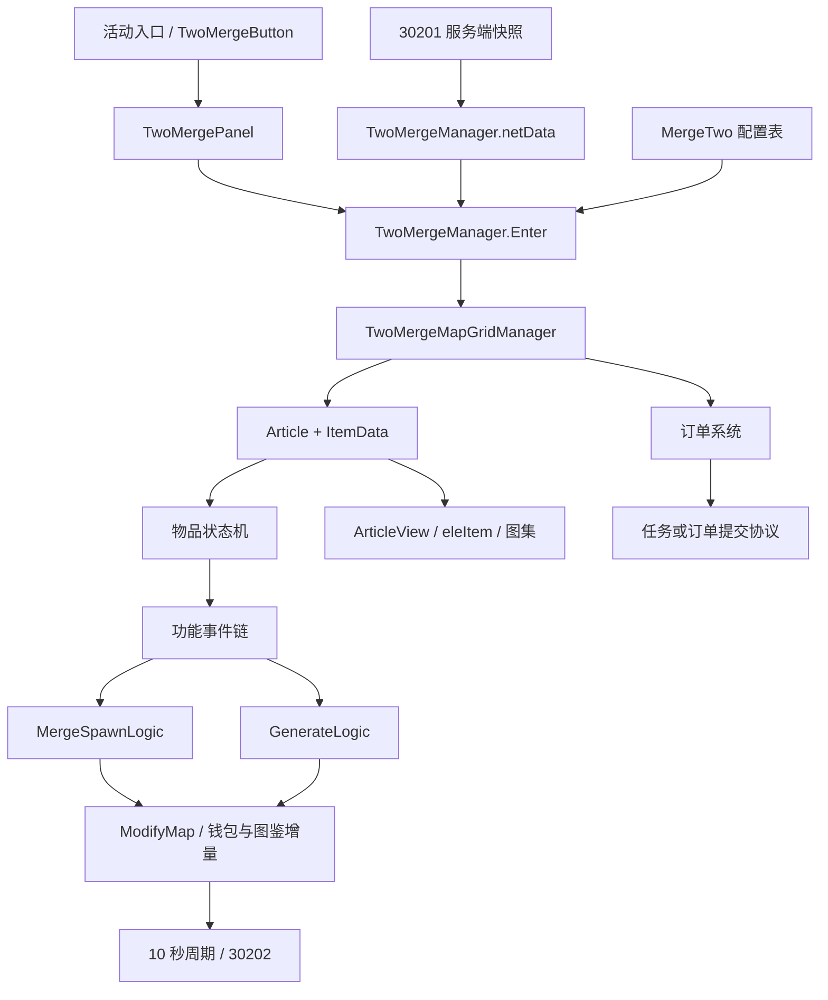

# 历史实现分析

## 架构与入口

这套二合主要运行在 UGUI 面板中，不是独立 Unity Scene。核心是 64 个 Lua 模块，两个 Manager、一个活动管理器以及 UI 的 Panel/Proxy/Mediator 组合负责接入原游戏。C# 提供 Unity 组件、Lua 输入桥、UI 效果；实际玩法判定主要在 Lua。

`TwoMergeActivityManager` 检查活动等级、任务、场景和时间，30241 打开活动后请求棋盘。`TwoMergeManager:TwoMergeInfoRequest` 通过 30201 构造 `netData[mapId]`。UI 的 `TwoMergePanel:InitGrids` 调用 `TwoMergeManager:Enter`，先准备区域、棋盘和物品，再启动图鉴、订单与周期同步。

图中的调用关系结合图谱与原函数源码核对。Lua 动态事件、全局服务和字符串 require 不能仅靠静态调用图判定完全性。

## 数据与状态

| 数据层 | 代码 | 责任 |
| --- | --- | --- |
| 活动持久数据缓存 | `Lua/Manager/TwoMergeManager.lua` | grids、bags、queue、gotItems、orders、randomOrders、fixOrderIds、BP、钱包增量 |
| 当前棋盘 | `Lua/Manager/TwoMergeMapGridManager.lua` | 格子、Article、空位搜索、合成链/物品索引、ModifyMap |
| 单物品数据 | `Lua/Game/TwoMerge/DataPack/ItemData.lua` | ID、位置、数量、格子/物品状态、类型专用数据 |
| 实体和显示 | `Article/Article.lua`、`ArticleView.lua`、`ArticleAnimation.lua` | 生命周期、状态、功能集合、Prefab 克隆与动画 |
| 序列化 | `DataPack/DataPack.lua` | Lua 数据和 GridInfo、ItemGeneratorMsg、ItemBoxMsg、ItemStateBubbleMsg 的转换 |

格子位置编码 `row * 1000 + col`，棋盘行列从 1 开始。当前客户端以 `position >= 1000001` 判定仓库。格子状态 0/1/2 = 解锁/锁/深锁；物品状态 0/1/2/3 = 解锁/锁/深锁/气泡。区域锁来自初始棋盘单元中的任务 ID，与前两种状态分别判断。

不要把原协议注释中的气泡值 1 或仓库 1001001 当成现行逻辑。具体差异见已知问题。

## 输入与功能链

`ArticleView` 使用 `EventTriggerForLua` 接收 PointerDown/BeginDrag/Drag/EndDrag，经过 `OperationLogic` 分发到物品当前状态。`TwoMergeConfig.FunctionMap` 根据物品类型装配功能，功能按注册顺序处理，`SuccessAndAbort` 会终止后续处理。

配置中的普通物品顺序为 Merge(50)、Drag(1)、Replace(10000)；数字是功能标识，不代表显式排序优先级，具体事件只有注册了的功能参与。生成器增加 ClickDrop(10)，特殊物品增加减 CD(20)、使用(30)、箱子(70/80)、剪刀(90)。因此失败放下通常走换位/回位，合成成功后不能再执行换位。万能合成(40)有实现，但当前 FunctionMap 未给普通物品类型装配，且其 require 路径已有错误。

## 合成

1. `MergeFunction:EnableMerge` 要求拖动物品解锁，双方存在、没有删除或移动、区域已解锁。
2. `MergeSpawnLogic:EnableMerge` 接受解锁/浅锁状态，拒绝深锁/气泡；普通合成物要求有 `nextId`，已消耗过次数的普通宝箱拒绝合成。
3. 普通合成目标有 Merge 功能时要求 ID 相同。锁住的目标可以作为被合成对象，主动拖动物必须解锁。
4. `MergeSuccess` 用源配置的 `nextId` 在目标格生成全新 ItemData，替换目标，删除源格物品，刷新选中、解锁、图鉴、提示和动画。
5. 随后按新物品配置检查气泡克隆与衍生物，在有空位时生成；使用目标物品 `mergeEffect` 选择强/弱特效。

生成出来的是新的物品实例，生成器历史状态并非自动相加保留。重写时应明确合并后生成器状态的产品规则。

## 生成器

`ClickDropFunction` 找落点后调用 `GenerateLogic.OnGenerate`。使用 `MergeTwoItemGenerateTemplate` 中的 `num[]` 与 `cd[]`，`historyCount % #num + 1` 得到轮次，`curCount` 记录轮内已产出次数。

这里的 `historyCount` 在代码中按完成轮次递增，和 proto 的“历史产出次数”注释不完全相同。非最后轮与最后轮的计时起点不同：最后轮耗完次数才开启 CD。`cd < 0` 且次数用完会销毁生成器。不要简化成统一的“一次点击开始一个冷却”。

固定产出按点击次数依次取；用完后走权重池；没有权重池时回退固定产出的最后一个。代码把 `generateNum` 写死为 1，表字段并不控制多颗产出。

倍率存储 0/1/2 对应普通/2×/4×。2×/4×会沿 `nextId` 跳一/两级并扣二/四倍费用；费用不足或链不够长时会退回普通产出，不是一次生成 2/4 颗。4×失败不会自动降为2×。付费分层克隆概率与此独立。

被动生成器由初始化、落位、冷却跨零、周围空格变化触发，0.1 秒递归调度继续尝试邻格产出。原实现借助 Unity 动画与计时器控制执行节奏；新实现应把规则调度和表现解耦。

## 仓库、队列、道具

`TwoMergeNetBag` 管理格子购买、移入/移出以及时间暂停/恢复。`pause` 和 `end` 保存剩余冷却关系。待领取队列由 `TwoMergeNetQueue` 处理，和仓库是不同容器；没有棋盘空格时应保留队列物品。

其他功能：普通宝箱开箱/限次产出、自选宝箱选择奖励、Use 兑换钱包道具、剪刀拆分、减 CD 道具、气泡付费解锁/超时变化、删除及撤销。参考相应 Function、ArticleStateBubble、ArticleDeleteLogic、UndoLogic，而不是把它们塞进普通合成函数。

## 订单

订单类型为主线(1)、支线(2)、固定位置(3)、简单随机(4)、普通随机(5)、固定(6)。前 3 类主要读 MergeTwoOrderTemplate，后 3 类由 OrderItem 系列表和玩家历史状态生成；固定订单和随机订单 ID 另有规则。

`TwoMergeOrderManager` 负责合并各来源、需求标记和完成度。`TwoMergeNetOrder.GetConsumeResult` 先合并同 ID 的需求，再收集可用位置。当前 `GetItemCount` 统计解锁棋盘物品和仓库；**队列参与订单的逻辑已注释掉**。

支线/随机/固定订单提交主要走 30207，成功回调后删除实际消耗位置并更新完成集合；原主线/修复建筑还依赖 Task / BuildingRepair。客户端 UI 中的“可提交”不代表可以省略服务器结果或重复提交保护。

## 同步边界

棋盘操作先改客户端状态并标记脏格子；`TwoMergeNetSyncLogic` 每秒检查，每 10 秒调用 30202。`TwoMergeManager:SynGridInfoRequest` 汇集格子、仓库、钱包、图鉴增量；发出后清理部分缓存，失败时把对应增量并回等待重试。

该设计说明客户端响应与协议批同步分离。代码里未见可直接作为新项目完整幂等/冲突模型的操作序列号机制。服务端源码不在包中，不能断言其验证强度。订单、购买、开格等仍是独立请求。重写需要明确断网、重连、多请求并发和存档版本策略。

## 可参考的设计与应重做的部分

可参考：表驱动的合成链、状态与功能组合、输入与表现分层、分类型订单、棋盘增量同步、统一资源图集。

应重做：跨模块的 AppServices 全局读写、纯规则直接依赖 UI/音效/时间、弱类型配置和空值兼容、游戏宿主商业系统耦合、历史序列化与随机错误。建议先做可测试的数据规则层，再适配宿主 UI、存档和钱包。
