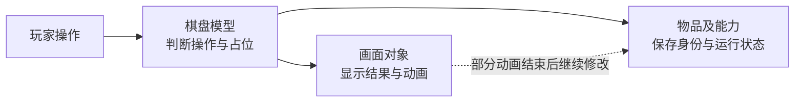

# 01｜棋盘、物品和画面各自管什么

> Gossip Harbor 3.99.0（版本号308）｜复核日期：2026-09-26｜静态分析，未运行游戏。

## 1. 这套实现的整体结构

**棋盘记录“谁在什么位置”，物品记录“自己是什么、还能做什么”，画面负责显示和交互。** 例如，生成器从左边移到右边，只改变位置，编号、次数和冷却仍属于同一个物品；两件物品合成时，则消费两个旧物品，创建一个新的结果物品。

对应到代码，MainBoardModel协调棋盘操作；ItemManager管理物品编号和存档属性；ItemModel是带行为的物品对象，内部组合生成、吞入等能力；MainBoardView和ItemView处理触摸、显示与动画。



这些职责可以分开辨认，但**它没有一个完全脱离画面的规则核心**。普通合成先建立业务结果，再播放动画；批量吞入却等物品飞到目标才消费，活动区域障碍也有动画结束后才解除格内锁的路径。判断分离程度必须具体到流程，不能只看Model和View的命名。

物品能力采用Lua对象组合，尚不是“集中存放数据、由独立系统处理”的ECS。模型也会访问全局服务GM中的时钟、钱包、音频、活动和界面；ItemModel含向量换算和图片查询。复制这些文件并不能直接得到无画面测试环境。

### 分析范围与可信程度

本次核对的是包名`com.mergegames.gossipharbor`、版本3.99.0／308、arm64客户端的恢复Lua及对应字节码，并非原开发工程。当前资料保留376个相关模块；历史提取曾覆盖2456个模块。本次深入追读主盘载入、拖放、合成、生成、售出撤销和画面生命周期，并核对活动迷雾、区域障碍、容器、时间及同步边界，没有逐行审计全部模块。

正文未另作标注的代码行为均为**已确认（静态证据）**；**较强推断**表示结构支持但缺少关键运行条件；**待验证**表示目前不能下结论。静态确认不等于已经复现线上行为。

本次重新核对了376份Lua与376份luac，共752项保留清单哈希，全部匹配；另对两处画面空引用顺序、障碍奖励参数及移动后的时间更新方法作了字节码核对。历史记录中的376项保留脚本语法通过、2456项全量语法通过和重提取一致，均不冒充本次重跑。哈希一致只证明材料未变，不能保证全部反编译语义正确。

原始XAPK的历史SHA-256为`4196b88058b03575a1c090b46004a0fc9e87105fb9176643163bbc611149ae78`；本次未重新读取或下载原包，也未运行Unity、游戏、自动跑盘、离线、性能或服务端实验。

## 2. 格子保存位置，物品拥有身份

### 2.1 棋盘怎样存放物品

主盘有7列、9行。运行中的二维数组按`[y][x]`保存物品编号；存档占位表以`x_y`为键，完整物品属性则放在另一张表。运行时另外维护物品集合与空格计数。

下面是说明性示例，不是实际存档摘录：

```text
位置表：(3,4) → A的编号
物品表：A → 种类、剩余次数、冷却开始时间……

移动到(4,4)：换占位，保留A。
合成：移除A和B，创建新物品C。
```

物品自身也保存当前位置。一次移动必须协调占位表与物品位置：`SetItem`只改占位、索引和空格计数，调用者另用`SetPosition`更新物品并通知画面。存入仓库只是清除棋盘占位，旧坐标可能仍留在物品上；因此，是否在盘上以“该格找到的对象是否仍是它”为准，不能只看有没有坐标。

**格子不是完整的物品式实体。** BoardPosition主要表示坐标和缓存的坐标键，没有独立业务编号、能力或生命周期。背景格另由图片渲染组件显示。空格是没有物品编号，越界是无效位置；已读主盘实现没有独立洞格或临时预留格记录。新产物在飞行动画开始前已经占位。

纸箱、蛛网等锁住的是格内物品。活动棋盘另有横跨多个坐标的矩形障碍对象，由专门的障碍层管理；这不能证明它具有通用多格物品或地格效果系统。

### 2.2 物品的几种编号不能混用

| 数据 | 回答什么问题 | 实际含义 |
| --- | --- | --- |
| Type：种类 | 它是什么？ | 如105可解析为链1、等级5；合成结果仍取配置的MergedType |
| Code：创建编码 | 怎样创建它？ | 普通种类、包装前缀和内部编码，或某个配置阶段的种类 |
| id：实例编号 | 是否还是刚才那件物品？ | 移动、入仓保留；新生成、合成和包装替换通常新建 |
| Lua对象引用 | 当前绑定的是哪个运行对象？ | 物品集合和画面映射直接使用它，不是另一份持久编号 |
| BoardPosition：坐标 | 它在哪里？ | `1_1`表示位置，不表示物品身份 |

数字种类可拆成链和等级，字符串种类也可解析末尾等级，但不能据此把合成简化为数字加一。新实例编号由ItemManager请求生成并查重；底层编号生成器未保留，不能认定为UUID或全局递增值。恢复存档会使用旧编号；恢复出来的Lua对象则是重新创建的。

普通物品、生成器、宝箱共用ItemModel，能力根据配置装配。有配置阶段的物品还可保留基础Type，用阶段Code决定当前能力参数、外观和共享产出池的键。这里的ItemStateCollection记录配置阶段，和生成能力内部的“未开／开启中／可用”是两层不同状态。

### 2.3 纸箱里的生成器，解除前并没有运行

初始配置中的`pb#c#1002`表示纸箱套蛛网，再包着物品1002的创建描述：

```text
纸箱A：保存“c#1002”
  邻格合成冲击 → 删除A，创建蛛网B

蛛网B：保存“1002”
  普通1002合入 → 删除B和拖入物，创建1003
```

A或B存在时，内部并没有另一个独立运行、持续计时的1002。解除包装会换物品身份，并按配置初始化内物；它适合尚未真正创建内物的场景，不等同于给已有生成器移除一个保留进度的限制效果。

主盘合成生成器也按结果配置重新初始化，没有通用的旧进度复制。活动棋盘另有专项补偿：某些有限自动生成器合成后，把旧物尚未产出的物品送入缓存。这保留的是剩余产物价值，不是自动继承全部能力状态。

## 3. 坐标、显示位置和查找顺序

主盘逻辑坐标从1开始，x向右、y向下，`(1,1)`是左上格。每格尺寸常量为145，画面再通过相机、Transform换算到屏幕。145不是已经确认的屏幕像素数；Prefab缩放与锚点未完整还原。

下面是源码公式的说明性展开，W、H为列数和行数，`//`为向下取整的整除：

```text
格左下角 = ((x-1)×145, (H-y)×145)
格中心   = ((x-0.5)×145, (H-y+0.5)×145)
反向坐标 = (floor(localX)//145+1, H-floor(localY)//145)
显示层级z = (W×H-W×(y-1)-x+1)×10

7×9主盘：
(1,1) → 左下角(0,1160)，中心(72.5,1232.5)
(7,9) → 左下角(870,0)，中心(942.5,72.5)
```

拖拽时图片跟手，不改棋盘占位；松手后才把输入位置交给规则。规则不根据动画中的实时Transform判断物品归属，不过格子尺寸和坐标换算仍在模型中，布局与规则也没有彻底分离。

| 查询 | 实际顺序与代价 |
| --- | --- |
| 遍历有效格 | 从左上开始，先x后y；另有逆y和对角遍历。成本随总格数增长 |
| 普通手动产出空位 | 从源物外圈向外扩，每圈按右、下、左、上走；第一圈先查正上、右上、右、右下等。包括越界测试，最坏与最大边长的平方同阶 |
| 可恢复自动生成器 | 只查八邻，顺序为上、右上、右、右下、下、左下、左、左上；固定最多8格 |
| 一次性自动生成器 | 收集全盘空格，再随机取一格；需要遍历和临时列表 |
| 落点优化开启时 | 找同种物品，含蛛网内物，按曼哈顿距离（横向差＋纵向差）、x、y排序；先遍历方向，再遍历这些物品。没有合适位置时改找同链、按等级差排序，最后退回基础搜索。含筛选和排序，约O(N log N)量级 |
| 合成提示 | 按类型分普通、蛛网和Temp组；有普通物时优先配蛛网，再Temp、普通和橙树组；触碰对象另有近邻优先分支。会随机选组／物品，不是全盘最优匹配 |
| 是否满盘 | 直接检查空格计数，O(1)；只回答有没有空格，不回答还有没有合成或领取动作 |

落点优化的方向优先为左、右、上、下，再左上、右上、左下、右下。同种物品分支并非“先把最近物品周围全部查完”；领取缓存和普通生成的最终回退搜索也不同，前者按全盘有效格顺序，后者按源物外圈顺序。

上述复杂度均为静态估计，N为物品数，没有耗时实测。

## 4. 数据具体归谁管理

这里的“权威”仅指客户端当前采用的数据，不代表服务端最终裁决。字段名保留必要的原始名称，以便区分容易混淆的数据。

| 数据对象 | 主要数据 | 谁修改、怎样保存 |
| --- | --- | --- |
| MainBoardModel | 7×9尺寸、m_itemManager、m_itemLayerModel、m_gameMode | 协调操作并连接多张存档表；BoardType.Main是模型类型，未证实为跨会话唯一ID |
| MainBoardItemLayerModel／Matrix | m_items矩阵、内部m_data[y][x]、m_mapItems物品集合、m_emptyCount | SetItem改占位；存档另用坐标键记录itemId，数组、集合与计数为运行缓存 |
| BoardPosition | m_x、m_y、m_key | 坐标与坐标键缓存，不保存独立Cell实例 |
| ItemManager | m_itemTable[id]、m_idGenerator、m_dbTable | 分配编号、登记／删除物品、复制存档字段；物品表独立于占位表 |
| ItemModel | m_id、m_type、m_code、m_position、m_boardModel、m_components | 物品与能力共同修改；id和code保存，位置由占位表恢复 |
| ItemSpread等能力 | 阶段、开始时间、当前次数、储备次数、累计产出量、实例产出池 | 能力自行改状态，ItemManager显式保存专用列；能力没有独立持久ID |
| 纸箱／蛛网／气泡／迷雾／Locked | 内部编码；气泡时间与临时保护；迷雾组号 | 包装关系主要由Code恢复；气泡起时戳保存，界面保护不保存 |
| BaseUIBoardObstacleModel | index、矩形两角、curLevel／maxLevel、reward | 范围和奖励来自配置；活动表按棋盘编号＋障碍编号保存进度 |
| ItemView及能力画面 | m_model、m_components、m_tweens、m_effects、m_flying | 显示、订阅、动画和资源绑定，不进入物品存档；部分类型可回池 |
| BoardRemoveContent | m_itemModel | 界面临时持有已售物品，供一次撤销；未见持久撤销记录 |
| ItemCacheModel／ItemStoreModel | 缓存codeStr／cacheItemId；仓库itemId／storeTime | 独立容器表，引用完整物品或记录未来创建资格 |
| ItemFixedSpreadModel | 按type或阶段type存pairs、sequence | 全局服务拥有共享池；sequence实际保存剩余Code-Weight，不是固定播放顺序 |
| 钱包与存储服务 | 收入、Consume、TrySaveAll等入口 | 棋盘或能力调用外部服务，跨物品、占位、货币的原子保存未证实 |

## 5. 从存档恢复棋盘

### 5.1 实际载入顺序

1. **准备配置。** ConfigModel汇总主盘和活动物品配置，ItemDataModel建立种类、合成链与外观索引。
2. **建立服务。** 主盘创建物品管理器、位置层、缓存和仓库，连接各自存档表。
3. **恢复物品。** 按Code和当前配置创建ItemModel及能力，再填回旧编号和能力进度。
4. **恢复位置。** 物品表、位置表都为空才使用初始地图；否则按坐标键与物品编号恢复数组、物品坐标、集合和空格计数。
5. **恢复容器和画面。** 关联缓存、仓库，刷新统计与开箱状态；画面遍历现有物品建立显示，并注册输入和消息处理。

这些局部先后已确认。磁盘读取、整个应用何时完成资源准备并开放输入，以及首帧和逐秒更新的总体顺序，仍缺完整调度实现。此载入链也没有统一完成所有离线结算。

保存的能力进度包括生成阶段、开始时刻、次数、储备、累计产出、实例池，气泡／转换／加速时间，已吞数量和需求，以及拆分使用次数。配置阶段由Code恢复；程序不保存完整旧配置，而是重新读取当前配置。

**恢复不一定是无副作用的字段回填。** 新核对到的吞入路径会先执行初始化：未被教程固定目标覆盖时，从按类型共享的需求序列取出一个目标并写回序列，然后才用旧存档的swallowInfo覆盖这个新目标。可见调用链没有跳过这次取号。这说明恢复可能推进共享需求序列；对后续新物品需求分布的实际影响，仍需结合加载顺序验证。吞入物的1秒点击保护也从本次初始化重新起算，并非保存的业务进度。

### 5.2 容器保留什么

仓库清除棋盘占位但保留原物品编号和进度；取出时先找空格，再移除仓库记录、占位、更新物品坐标。没有空格就拒绝取出。

缓存有两种条目：只保存Code的条目在领取时新建物品；带cacheItemId的条目尝试恢复原物品。因此，缓存条目编号与物品编号不同。**只有引用仍存在且Code一致，才保留原实例；引用缺失或编码不符时，会按Code重新生成。** 缓存领取也先检查空位，再弹出条目，未见后续创建异常的统一回滚。

缓存不是简单先进先出：Type2排在Type1前；同为Type2按条目编号降序，同为Type1按编号升序。编号生成算法缺失，因此只能确认排序规则，不能直接把编号大小等同于时间。

### 5.3 写入表、落盘和同步是三件事

运行状态改变后，ItemManager将物品字段交给`BatchSet`；占位、仓库和产出池分别写各自的表。同步流程会请求`TrySaveAll`，再打包相关表和货币上传。冲突处理可改用服务端存档，并在非加载场景重启游戏。

“方法已经写了表”不能证明磁盘写入已完成，也不能证明几张表和钱包会一起成功、失败时一起撤回。客户端本地计算与上传已确认，服务端是否逐操作校验未知。

未知数据只见局部处理：无法创建的物品会清理记录，气泡另检查内物配置；占位或仓库引用丢失会清理引用。缓存装载主要过滤不能识别的Code，并不等于把所有异常缓存记录都删掉。固定产出池有旧序列转换和配置变化重置，尚不能据此承诺所有旧版本数据无损迁移。

## 6. 复用、性能与可测试性的边界

活动棋盘复用公共基类、物品管理器、工厂与能力，再增加迷雾、障碍、滚屏及产物安置规则。但重写也会带来差异：活动拖放没有主盘同样的源对象身份核对，另有Fog与Static配置限制移动。因此，复用同一基础不等于边界检查完全一致。

主盘逐帧、逐秒复制盘上物品集合，再分发能力更新；逐帧仅调用有Update的组件。复制避免了遍历集合时直接增删的冲突，但不能保证副本中的每个旧对象仍有效。画面创建还会遍历现有绑定检查同位置旧画面；部分占位修改暂缓统计，随后集中刷新。63格上这可能是合适的简单实现，属于**较强推断**，并无性能测量支持。

包内自动跑盘工具依赖GM、画面有效性检查、界面与等待逻辑，不是纯规则单元测试。若要独立验证，需要隔离时间、随机、钱包、保存等服务，并处理动画继续写业务的路径。

当前保留子集缺少事件总线、底层存储、编号生成器、钱包、资源加载及部分调度实现，清理清单能解释这些缺口。**未找到只说明本地材料不足，不表示原游戏没有实现。** 因而事件是否同步、异常传播、真实扣费失败、磁盘事务、迟到回调取消及后台调度仍有明确证据边界。

---

分析对象：`参考项目/GossipHarbor_3.99.0/`；报告位置：该目录下的`_分析实现方案/`。路径从MergeTwo仓库根起算。
