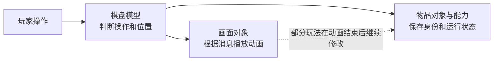

# 01｜棋盘、物品和画面各自管什么

> Gossip Harbor 3.99.0（版本号308）｜2026-09-25｜依据恢复的Lua代码做静态分析，未运行游戏。

## 1. 先分清三个对象

理解这套实现，可以先只记住三件事：**棋盘记录“谁在什么位置”，物品记录“自己是什么、还能做什么”，画面负责把这些内容显示出来。**

例如，一个生成器从左边移到右边时，改变的是位置，它仍是同一个物品，剩余次数和冷却信息应当继续跟着它。两个物品合成时则不同：两个旧物品被消费，程序创建一个新的结果物品。这是这里区分位置、身份和显示对象的实际用途。[E03](04_证据索引.md#e03)、[E04](04_证据索引.md#e04)、[E10](04_证据索引.md#e10)

| 本文称呼 | 代码中的主要名称 | 它负责什么 |
| --- | --- | --- |
| 棋盘模型 | MainBoardModel | 判断移动、合成、生成等操作，协调占位变化 |
| 物品管理器 | ItemManager | 按物品编号找到对象，并读写它的存档属性 |
| 物品对象 | ItemModel | 保存种类、编号、位置，以及生成、吞入等能力 |
| 能力组件 | ItemSpread等 | 实现一种能力，并持有次数、阶段、计时等状态 |
| 画面对象 | ItemView、MainBoardView | 显示物品、处理触摸、播放和清理动画 |

这些职责能分开辨认，但边界并不完全隔离。界面直接调用棋盘方法；棋盘发消息让界面播放动画；少数玩法又在动画结束时继续修改数据。这里的“模型”和“画面”是实际职责名称，不能理解成已经实现了完全独立的逻辑核心。[E18](04_证据索引.md#e18)、[E19](04_证据索引.md#e19)、[E20](04_证据索引.md#e20)、[E31](04_证据索引.md#e31)



上图只画主要关系。源码使用带行为的Lua对象和组件组合，尚不是“数据组件集中存放，再由独立系统统一处理”的ECS。模型还会访问全局服务`GM`，包括时间、钱包、音频、活动和界面；ItemModel本身也包含向量及图片查询。因此，把这些Lua文件单独拿出来，并不能立即得到无画面测试环境。[E05](04_证据索引.md#e05)、[E12](04_证据索引.md#e12)、[E13](04_证据索引.md#e13)

## 2. 位置表和物品表为何要分开

主棋盘是一张7列、9行的二维表。**格子中记录的是物品编号，完整物品数据由另一张表管理。** 存档中的占位表用`x_y`这样的坐标键记录编号；运行时另外建立二维数组、物品集合和空格计数，方便查询。[E02](04_证据索引.md#e02)、[E03](04_证据索引.md#e03)

下面是说明性示例，不是实际存档摘录：

```text
位置表：(3,4) → 物品A的编号
物品表：物品A → 种类、剩余次数、冷却开始时间……

移动到(4,4)：换位置，保留物品A。
合成：移除旧物品A和B，创建新物品C。
```

程序还在ItemModel中保存当前位置，因此一次移动要协调两边：先改棋盘占位，再改物品的位置。`MainBoardItemLayerModel.SetItem`只处理前者，调用者必须随后调用`SetPosition`。仓库里的物品可能还留着旧坐标；判断它是否真的在盘上，要核对“该格当前找到的对象是不是它”，不能只看它有无位置字段。[E03](04_证据索引.md#e03)、[E05](04_证据索引.md#e05)、[E09](04_证据索引.md#e09)、[E27](04_证据索引.md#e27)

**格子本身没有完整的物品式身份和生命周期。** 它主要是坐标与数组位置，背景另用图片渲染组件显示。空格表示没有物品编号，越出矩形范围表示无效位置；已读主棋盘代码没有独立的洞格或临时预留格记录。产物在飞行动画开始前就已经占位。[E02](04_证据索引.md#e02)、[E03](04_证据索引.md#e03)、[E20](04_证据索引.md#e20)、[E21](04_证据索引.md#e21)

未解锁也不等于“这个格子另有一个锁实体”。主盘的纸箱、蛛网等占据的是物品位置。活动棋盘中确实有跨多个格子的矩形障碍，但它由专门的障碍层管理，不能据此推导出通用的多格物品系统。[E06](04_证据索引.md#e06)、[E31](04_证据索引.md#e31)

<a id="identity"></a>

## 3. 同一种物品，不等于同一个物品

代码区分了几种容易混淆的编号：

| 要回答的问题 | 对应数据 | 例子或含义 |
| --- | --- | --- |
| 它是哪一种物品？ | Type（种类） | `105`是一个配置种类；数字编码可拆成链1、等级5 |
| 怎样创建它？ | Code（创建编码） | 普通物品可直接用种类；包装物还带外壳和内部物品的信息 |
| 它是不是刚才那个物品？ | id（实例编号） | 移动、入仓时保留；新生成和合成时分配新编号 |
| 当前程序引用的是哪个对象？ | Lua对象引用 | 运行中的物品集合、画面绑定使用它；它不是另一份持久编号 |
| 它现在在哪？ | BoardPosition（坐标） | `1_1`表示一个位置，不表示物品身份 |

合成链可以由数字编码或字符串末尾的等级解析出来，但**实际合成结果仍以配置的`MergedType`为准**，不能只靠“等级加一”推算。实例编号由ItemManager请求生成；底层生成器没有保留，不能断言它使用UUID或某种全局递增算法。[E04](04_证据索引.md#e04)、[E07](04_证据索引.md#e07)

### 纸箱里的生成器，解除前是否已经存在

这是包装物最重要的区别。初始配置中有`pb#c#1002`，意思是纸箱里还包着蛛网，蛛网里记录着物品1002的创建编码。程序按下面的顺序处理：

```text
纸箱A：只记录内部编码“c#1002”
  邻格合成冲击纸箱后，删除A，创建蛛网物品B

蛛网物品B：只记录内部编码“1002”
  普通1002拖进来合成后，删除B和拖入物，创建1003
```

在A和B存在时，里面并没有另一个持续运行、独立计时的1002对象。所以，这不是“给同一个生成器依次移除箱子效果、蛛网效果”，而是每一步都建立新物品。[E06](04_证据索引.md#e06)、[E17](04_证据索引.md#e17)

主盘合成生成器也按结果配置重新初始化，没有复制旧生成器进度。活动棋盘另有专门规则：某些有限自动生成器合成时，会把尚未产出的物品送入缓存。这是针对价值保留的补偿，不是所有能力状态都会自动继承。[E10](04_证据索引.md#e10)、[E29](04_证据索引.md#e29)

缓存也有两种语义：有的条目引用完整旧物品，可以保留其状态；有的只保存创建编码，等出队时再生成。**缓存条目的编号与物品编号不是同一回事。**[E27](04_证据索引.md#e27)

## 4. 坐标怎样变成画面位置

主盘坐标从1开始：x向右增加，y向下增加，所以`(1,1)`是左上格。模型用145作为每格的逻辑尺寸，画面通过相机和Transform做位置换算。玩家拖动时只是图片跟手移动，真正松手后，规则才根据逻辑坐标决定落子。[E02](04_证据索引.md#e02)、[E08](04_证据索引.md#e08)

145不能直接认定为屏幕像素数，因为Prefab的缩放和锚点资料尚未完整还原。规则判断不依赖图片此刻飘到了哪里，但格子尺寸常量仍放在逻辑基类里，说明布局与逻辑也没有完全拆开。需要核对换算或落点顺序时，可直接查[文末坐标与搜索细节](#coordinates)。[E02](04_证据索引.md#e02)、[E05](04_证据索引.md#e05)

<a id="persistence"></a>

## 5. 保存了什么，重开时怎样恢复

恢复一个物品不是把旧Lua对象原样取回来。程序先用保存的创建编码和当前配置，重新建立物品及其能力，再把旧编号、剩余次数、计时等进度填回去，最后关联棋盘位置。完整载入顺序见[02流程一](02_功能扩展与执行流程.md#load)。[E03](04_证据索引.md#e03)、[E04](04_证据索引.md#e04)

保存的能力进度包括：生成阶段、开始计时的时刻、当前次数、储备次数、累计产出量和实例产出池；气泡、转换和加速的时间；已吞入数量；拆分使用次数等。包装层次和配置阶段通过创建编码恢复。程序重新读取当前配置，并未保存一份完整旧配置。[E04](04_证据索引.md#e04)、[E06](04_证据索引.md#e06)、[E32](04_证据索引.md#e32)

**“数据已经改了”不等于“磁盘已经保存完了”。** 这里至少有四步：

1. 改运行中的物品和棋盘对象。
2. 将物品属性、格子占位分别写入存档表。
3. 请求底层存储把表保存下来。
4. 将相关表打包上传，用于同步。

可见的物品写入入口是`SaveItemProperty`，最终调用表的`BatchSet`；占位另行写入；同步时会调用`TrySaveAll`。底层存储实现缺失，所以目前无法证明这些表总能一起成功保存，或中途失败时会一起撤回。[E04](04_证据索引.md#e04)、[E28](04_证据索引.md#e28)、[E36](04_证据索引.md#e36)

遇到未知配置，恢复代码会删除对应物品记录；占位或仓库指向找不到的物品时，也会清理引用。固定产出池有旧数据转换和配置改变后重置的处理。这些说明它有局部恢复策略，但不能据此认定所有旧版本数据都能无损迁移。[E03](04_证据索引.md#e03)、[E04](04_证据索引.md#e04)、[E15](04_证据索引.md#e15)、[E27](04_证据索引.md#e27)

逻辑删除后，旧对象可能暂时仍被动画或撤销界面持有，随后才有机会被Lua回收。相关释放及撤销顺序见[02流程六](02_功能扩展与执行流程.md#retire)。[E23](04_证据索引.md#e23)、[E25](04_证据索引.md#e25)、[E26](04_证据索引.md#e26)

## 6. 活动复用、性能和测试的边界

主盘继承公共棋盘基类；活动棋盘也复用物品管理器、工厂和公共能力，但可另加迷雾、区域障碍，或重写拖放、滚屏和产物安置规则。例如，活动版拖放没有主盘同样的源物品引用核对。因此，“复用一套基础”不意味着所有棋盘的边界处理完全一致。[E29](04_证据索引.md#e29)

这套实现大量使用小范围遍历。主盘逐帧和逐秒复制当前物品集合，再调用需要更新的能力；建立物品画面时也会遍历已有绑定，查同位置的旧画面。部分占位操作会暂缓统计刷新，等一组修改结束后集中更新。小棋盘上这样做可能足够简单有效，但这是**较强推断**，本轮没有帧率或耗时测量。[E09](04_证据索引.md#e09)、[E12](04_证据索引.md#e12)、[E20](04_证据索引.md#e20)

包内有自动跑盘工具，但它使用全局服务、画面有效性检查和等待逻辑，不是纯规则单元测试。要真正验证“没有画面也能完成同样操作”，还需要隔离时间、随机、钱包等服务，并移除由动画继续修改业务的路径。[E19](04_证据索引.md#e19)、[E31](04_证据索引.md#e31)、[E35](04_证据索引.md#e35)

<a id="fields"></a>

## 查代码时再看：字段归属

下表保留原始名称，用于定位字段。前文的“物品表、位置表、能力、画面”分别对应这些实际类型；这里的权威仅指客户端当前采用的数据，不代表服务端最终裁决。

| 实际类型/记录 | 关键字段 | 归属、身份与可写者 | 保存或缓存 | 证据 |
| --- | --- | --- | --- | --- |
| MainBoardModel | HorizontalTiles=7、VerticalTiles=9、m_itemManager、m_itemLayerModel、m_gameMode | 棋盘服务对象；BoardType.Main区分模型类型，不是已证实的跨会话唯一ID | 尺寸来自类；持久数据由多表挂接 | E02/E12 |
| Matrix / MainBoardItemLayerModel | m_data[y][x]、m_items、m_emptyCount、m_mapItems | 占位由SetItem写；矩阵存itemId；对象缓存用于遍历 | 矩阵/计数/对象集合是运行缓存，Board表为持久投影入口 | E03 |
| BoardPosition | m_x、m_y、m_key | x_y键、坐标缓存；不是带业务生命周期的格子实体 | 不单独存Cell实例记录 | E02 |
| ItemManager | m_itemTable[id]、m_idGenerator、m_dbTable | SetItem生成ID/保存；RemoveItem摘除运行及DB记录 | Item表独立于Board表 | E04 |
| ItemModel | m_id、m_type、m_code、m_position、m_boardModel、m_components | Lua领域对象；业务字段和对象身份；位置能直接写 | id和code持久；位置靠Board表恢复 | E04/E05 |
| ItemSpread等 | state、startTimer、restNumber、storageRestNumber、spreadCount、weights | 组件无独立持久ID，由宿主+组件类寻址；组件自己写运行状态 | ItemManager显式拷贝专用列 | E04/E12/E13 |
| ItemPaperBox/Cobweb/Bubble/Fog/Locked | innerItemCode；Bubble计时/保护；FogId | 包装Item下的能力/限制对象；不是同一物品上的通用效果列表 | innerCode来自codeStr；Bubble起时戳保存，UI保护不保存 | E06/E17/E18/E30 |
| BaseUIBoardObstacleModel | index、leftTop/rightBottom、curLevel/maxLevel、reward | 活动障碍层中的独立矩形对象，跨多个坐标；不是一格一个Entity | 活动DB的boardIndex+obstacleIndex进度 | E31 |
| ItemView / ItemSpreadView等 | m_model、m_components、m_tweens、m_effects、m_flying | Unity可视对象；模型对象为绑定键；组件View按逻辑组件类索引 | 不入物品存档；可按type回池 | E20/E22/E23 |
| BoardRemoveContent | m_itemModel | UI临时持有已售物品对象，用于单次撤销 | 已见链不持久化撤销引用 | E25/E26 |
| ItemCacheModel / ItemStoreModel | codeStr、cacheItemId；itemId/storeTime | 队列条目身份与物品身份分开；仓库引用ItemManager | 独立缓存/库存表 | E27 |
| FixedSpreadNew | type键、pairs、sequence | GM.ItemFixedSpreadModel拥有共享池 | sequence实际存剩余Code-Weight，不是固定播放顺序 | E15 |
| 钱包/同步基础设施 | Consume / AcquireRewardsLogic / TrySaveAll | GM外部服务；Board/组件调用，未见完整实现 | 不能证明与Item/Board表原子落盘 | E13/E25/E28/E36 |

<a id="coordinates"></a>

## 查代码时再看：坐标公式与搜索顺序

下面是源码公式的说明性展开。W、H分别表示列数和行数，`//`表示向下取整的整除；左下角与中心是两个不同换算入口。[E02](04_证据索引.md#e02)

```text
逻辑 (x,y)        格左下角 ToLocalPosition      格中心 ToLocalPositionSetZ
(1,1) 顶左       (0, 8×145)                  (72.5, 1232.5)
(7,9) 底右       (6×145, 0)                  (942.5, 72.5)

左下角 = ((x-1)×TileSize, (H-y)×TileSize)
中心   = ((x-0.5)×TileSize, (H-y+0.5)×TileSize)
反向   = (floor(localX)//TileSize+1, H-floor(localY)//TileSize)
```

显示层级z为`(W×H-W×(y-1)-x+1)×10`。背景格子的图片保存在`m_tileMap[position]`中，不是独立的业务实体。[E05](04_证据索引.md#e05)、[E20](04_证据索引.md#e20)

下表的复杂度只表示随数据量增长的大致成本，不是实测耗时。N为物品数；例如O(N)意味着需要遍历一遍物品。

| 搜索 | 实际顺序/缓存 | 估计成本 |
| --- | --- | --- |
| 有效格迭代 | 从(1,1)开始，x先递增，再y；逆y和对角迭代另有方法 | O(W×H) |
| 常规手动产出空位 | 从中心每圈走到左上外一格，按右、下、左、上走2i步；先测试的近圈格是正上，再右上、右、右下等 | 最坏O(max(W,H)²)，包括越界点；见BaseItemLayerModel L25–40 |
| 可恢复自动母体 | Dir8顺序：上、右上、右、右下、下、左下、左、左上 | O(8)；局部封住时可停产，即使远处空 |
| 一次性自动母体 | 收集全盘空位，随机取一处 | O(W×H)和临时列表 |
| 新落点优化开关 | 同type（含蛛网内部类型）按曼哈顿距离、x/y排序，再按左/右/上/下/斜方向优先查；否则按同链等级差找，最后退回基础搜索 | O(N log N)量级，含筛选/排序/邻格搜索；未实测 |
| 合成提示匹配 | 扫格按类型分Normal/Cobweb/Temp；有可用普通物时优先网，再Temp，再普通，再橙树组；触碰对象有近邻优先分支 | O(N)分组+临时表；随机选组/物品，不是全局最优匹配 |
| IsBoardFull | `not HasEmptyPosition()`，直接用emptyCount | O(1)；不等于“没有可做动作” |

源码方法和范围见[E02](04_证据索引.md#e02)、[E09](04_证据索引.md#e09)、[E11](04_证据索引.md#e11)。`IsBoardFull`只回答“有没有空格”，不回答“还有没有能合成或领取的东西”。

---

资料路径从MergeTwo仓库根起算：目标为`参考项目/GossipHarbor_3.99.0/`，本报告位于其`_分析实现方案/`目录。源码位置及证据限制见[04 证据索引](04_证据索引.md)。
