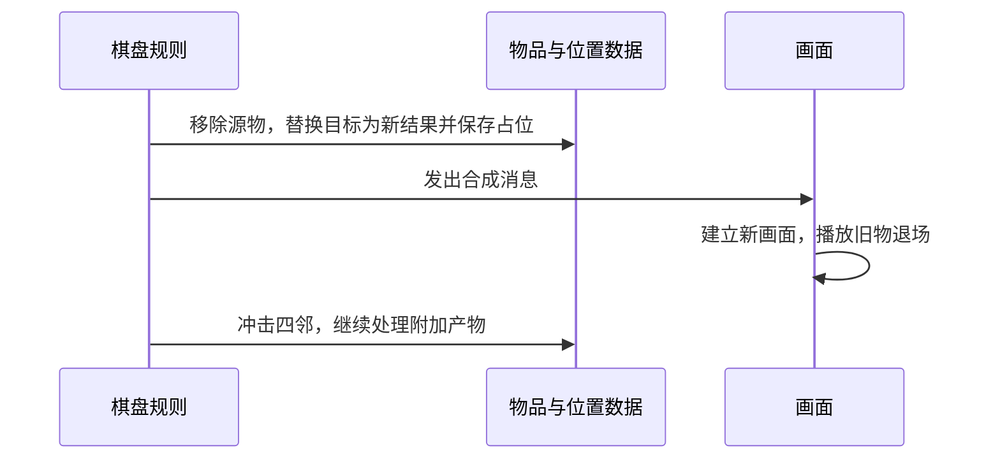

# 02｜一次操作怎样完成，特殊能力怎样协作

> Gossip Harbor 3.99.0（版本号308）｜复核日期：2026-09-26｜静态分析，未运行游戏。

## 1. 能力装配和操作权限

程序先创建ItemModel，再按配置加入生成ItemSpread、吞入ItemSwallow、转换ItemTransform等能力。即使`Spread_Auto=0`，生成能力仍然存在，只是默认由点击触发。表现侧另外装配图标、倒计时和动画组件，两侧不要求一一对应。

**配置说明“能做什么”，能力状态说明“现在能否做”。** 生成器不会因为冷却或正在开箱就失去生成能力；阶段、次数和开始时间仍由同一个能力对象管理。

这套组合机制有两个限制：每种组件类只放一份，再加同型组件会覆盖引用；实际装配主要发生在工厂，没有已确认的通用运行时移除、存档结构调整和画面组件增删协议。多个组件响应同一事件时使用无业务顺序保证的遍历，不看返回值，也不因某个组件替换了宿主而自动停止。现有配置是否会触发冲突，仍待验证。吞入满足需求时还会直接调用转换能力，说明组件间存在依赖，不能仅凭工厂允许组合就认为任意组合都有效。

### 为什么权限不能只有一个“可操作”开关

蛛网不能主动拖动，却能接收匹配物品合成。样本分别检查不同操作，但检查位置并不统一：

| 操作 | 实际检查及边界 |
| --- | --- |
| 选中 | 主盘画面提前排除纸箱 |
| 主动拖动 | 画面查CanItemMove；主盘DragItem核对源身份和目标范围，却不重查源移动权限 |
| 作为合成目标 | CanItemMerge检查匹配类型、合成结果、宝箱是否用过等；蛛网按内部编码参与匹配 |
| 交换 | 合成和吞入都未成立后，才检查目标能否移动；因此蛛网可被合成、不可被交换 |
| 点击生成 | 能力检查阶段、次数、空间及费用 |
| 入仓 | 模型入口检查资格与容量；气泡、Temp、定时转换物、开启中的宝箱等被排除 |
| 售出 | 资格方法检查卖价及合成链保护；实际SellItem不重新核对资格或源身份 |
| 开箱 | 界面限制同时开启；OnOpen直接切换阶段，没有完整重复检查 |

活动棋盘还会限制Fog和配置为Static的物品移动。不同操作由不同入口判断，不能假定解除一个限制就会正确恢复全部权限，也不能把界面按钮不可点当作业务入口绝对不可执行。

## 2. 拖拽与合成：先改变棋盘，再播放普通动画

### 2.1 从手指位置到业务请求

按下时从屏幕换算到棋盘，选中物品；拖动时只让图片跟手。松手后才调用模型。界面还有落点辅助：最近0.15秒内指向过可匹配对象，且它与当前落格在相邻范围内时，会优先使用那个目标。教程也可强制源格或目标格。

主盘DragItem先检查目标是否越界、源坐标上是否仍是原对象，再依次尝试：**空位移动或原格回落 → 特殊工具作用 → 合成 → 吞入 → 交换 → 拒绝。** 因此，分支先后本身就是玩法规则。普通拒绝会重新设置原坐标让画面回弹，不消费物品；这不等于处理中途异常也会回滚。

移动先清旧格、占新格，再改物品坐标；交换先改两格占位，再依次改两个物品坐标。若位置通知立即触发读取，可能观察到另一物品位置尚未更新，这是**较强推断**，需要监听者与事件机制补证。

### 2.2 普通合成的生效顺序

正常合成消费两个旧实例，结果来自配置MergedType；Temp参与时有专门的结果选择分支。新物在画面开始前已存在，两个旧画面约0.1秒后回收，新画面从缩放0开始出现。取消这段动画不会撤回已发生的合成。

但“合成消息”不是完整操作的成功收据：局部消息、全局ItemMerged事件之后，模型还会冲击四邻，主盘还可能生成卡牌、气泡或金币等附加产物。事件底层未保留，所以是否同步进入监听者、监听者异常会否打断后续步骤仍待验证。图中画面与后续规则的时间关系，不应理解为已经验证了事件总线的调度方式。

纸箱邻击可进一步替换物品，活动合成还可能缓存旧生成器的剩余有限产物。已读链没有先收集完整变化再统一提交，也没有通用回滚保证。

## 3. 生成器：阶段、次数、时间与产物是不同问题

### 3.1 同一能力里的四个阶段

| 阶段 | 怎样进入 | 怎样离开 |
| --- | --- | --- |
| Initializing：初始化等待 | 配置了初始化时长 | 到期直接进入Opened |
| Closed：未开启 | 无初始化等待，但有开箱时长 | 点击开启进入Opening |
| Opening：开启中 | OnOpen写阶段并启动计时 | 到期进入Opened |
| Opened：可生成阶段 | 无前置等待，或等待已完成 | 仍可能因次数、空间或费用不足而暂时不能生成 |

这些阶段不是四种物品，也不意味着“Opened必定能产出”。次数不足时通常仍保持Opened。画面读取阶段、次数和时钟显示倒计时，不靠倒计时动画结束来恢复业务资格。初始化、开箱、短恢复和长恢复分别有配置时长及加速费用；付费加速另查余额，再调整计时或结束等待。

包内默认配置的三个例子如下；它们不代表线上账号最终下发的配置：

| 类型 | 规则示例 |
| --- | --- |
| 105 | 手动生成，基础共享产出池为35／2／5，共42份 |
| 1006 | 自动生成、不耗能，当前容量6，短恢复3600秒，储备恢复7200秒 |
| 2701 | 开箱等待480秒，8次有限产出 |

宝箱是“自身可开启、可领取的生成物”，与地图中包住其它物品的纸箱不同。使用过的宝箱不能合成；代码用“配置了开启时长，且剩余量不等于初始容量”判定用过。开启中的宝箱不能入仓，移动保留阶段。有限产出领完后，手动生成路径移除它。

### 3.2 一次手动点击的完整过程

选中后再次点击，界面先处理开箱、激活、破泡或选择箱等专门动作；其余点击广播给物品能力。生成能力的普通路径为：

1. **前置检查。** 检查阶段、当前次数、可用落点和能量；拒绝时尚未抽产物、扣次数或扣费，但可能已发送提示消息。
2. **选择产物。** 按策略抽取，再应用教程或活动修正。普通分支改变产出池、当前次数、累计产出次数，更新计时并保存物品。
3. **扣费。** 调用钱包消费；调用者未根据扣费返回值撤回此前变化。落点优化开启时再调整放置位置。
4. **建立产物。** 创建新物、保存属性与占位，然后通知画面播放飞出动画。
5. **处理母体。** 达到转换阈值就替换；一次性次数耗尽则移除；仍保留的生成器可能继续处理冷却加成。

这里的当前次数不一定“每产一件减1”：倍率、产物策略可改变扣除量；普通分支的累计产出次数则每次调用加1。两者不能混为同一计数。

**活动产出存在例外。** GenerateItemCode里的幸运产出和某些Disco分支会提前返回，跳过普通池、次数、累计量更新；另有分支把本次次数成本改为0。因此，“每次产出都先扣次数”过于绝对，也不能从跳过次数扣减推断免能量，费用仍由后续入口决定。

前置拒绝和中途失败要区分：普通分支抽取后已经产生副作用，未见整次自动撤回。钱包真正失败时怎样处理尚缺实现。另外，返回false有时仅表示“已成功产出，但母体耗尽或转换，不能继续连点”，不能据此安全重试。

### 3.3 冷却何时开始，恢复的究竟是什么

**可恢复生成器从当前量低于容量时就可以开始计时，并不必等次数归零。** 没有计时器时，逐秒检查会记录当前时刻；已有计时器不会因为再次点击而简单重置。

短恢复到期会把当前量补到容量，并从储备扣除本次补足量。储备降到0后开始长恢复；代码将起点推进一个短恢复时长，再立即检查长恢复是否也已结束。因此，离开较久后可在一次更新中接着补完长恢复。长恢复结束时同时补满当前量与储备。

例如容量6、尚有4次，短恢复到期需要补2次，就从储备扣2，而不是无条件扣6。次数和储备是两层资源，不是两个独立的自动产物计时器。

时间来自GameModel：它调用`DeviceInfo.GetCpuTime()`加服务端偏移，可再加测试偏移；强网络等待条件下还可能暂留入后台时刻。底层时钟实现未保留，不能仅凭GetCpuTime名称认定为CPU占用时间或保证单调。主盘只在对应游戏模式下扫描盘上物品，库存不在这份扫描集合中，另有增益事件刷新。

**较强推断**：保存的开始时刻能让重开后的正常更新补到相应恢复阶段；但这不等于逐个离线周期补发所有产物。库存是否另有补时、首帧与逐秒更新的先后、时钟回拨处理仍待验证。

### 3.4 自动生成，以及被堵住时的手动补充

自动模式复用ItemSpread的阶段、次数、计时和产出策略。逐帧更新连续尝试产出，直到次数用完、找不到位置或物品转换；没有额外的“每隔N秒只出一颗”字段。1006的3600秒因此是次数恢复规则，多个可用次数可能在同一次更新里连续产出。

主盘可恢复自动生成器仅找八邻；一次性自动物品随机找全盘空格。没有落点时通常在抽样和扣次数之前停止。若同时满足“一次性、递减池、棋盘有缓存接口、服务开关开启”，则可把剩余有限产物转入缓存并清空可产量。

**八邻堵住并不表示只能等待玩家腾出邻格。** 手动点击自动生成器时，CheckSpreadPosAndAuto先看自动落点：若还有自动位置，就不重复手动生成；若自动找不到位置，则继续在更大范围找空格。于是周围满、远处仍空时，玩家可能通过点击把产物放到远处；整盘满时仍拒绝。这是自动和手动入口的配合，而不是自动搜索本身扩大了范围。

自动入口没有执行手动入口的能量检查和扣费函数；1006本身也是不耗能配置，不能据此假定随意配置“耗能自动生成器”就能工作。自动路径还没有调用手动路径的统一耗尽删除方法，主要按转换阈值收尾，ItemDig另有例外；是否消失依赖相应配置与能力，不能一概写成“自动吐完就销毁”。

### 3.5 随机池属于类型，还是属于这件物品

Fixed策略是**按物品类型或阶段类型共享的有限池**。每次从剩余权重抽一项并扣一份，整池耗尽重置，剩余池另行保存。105的35／2／5约束的是完整基础池的构成，顺序仍随机；切换同型生成器会继续消耗同一个池。配置改变会重置，旧序列有转换处理。

Decremental则在能力实例中持有递减池，每次抽中扣份额并移除耗尽项，随物品保存。两者都包含“有限剩余量”，但归属、重置和跨实例共享语义不同。另有按订单需求或分值选择的策略，只能用来说明这部分依赖外围系统，不构成我们的新增需求。

教程、智能产出、活动提前返回和倍率修正，都可能绕过基础池或改变最终产物。因此，完整42份基础池不等于连续42次点击一定观测到原始35／2／5分布。随机底层及种子未保留，也不能据此声称可确定性回放。

## 4. 包装和区域解锁：相似画面背后是不同规则

### 4.1 纸箱靠邻击，蛛网靠参与合成

纸箱、蛛网通过前缀`pb#`、`c#`或兼容数字编码创建，只保存内部创建描述；解除时替换物品，旧画面释放，新画面建立。

纸箱有OnShock：收到四邻合成冲击且未被等级门槛锁住时，删除外层并创建内物。新物可移动、且此次不是按等级解锁，才继续冲击右、下、左、上四邻；开出蛛网时因新物不可移动而不继续传播。等级解锁接口另有处理，但主盘继承的门槛默认0，不能认为主盘已经启用玩家等级解锁。

蛛网没有对应的OnShock，靠匹配普通物合入而被消费；不能把“合成冲击解纸箱”推广成“相邻合成也会解蛛网”。某些蛛网内码还会使工厂加上障碍清除能力，这是特定装配分支，不是任意效果都可独立叠加。

部分纸箱还带按位置配置的额外奖励，在解箱后处理中结算并附入消息。主盘基类纸箱解除动画时长为0，等级解除可有显示延迟；不能推广到所有活动覆盖动画。未见通用连锁去重或终止预算，异常配置的传播边界仍待验证。

### 4.2 气泡的到期保护不是暂停时钟

气泡保存内部Code、创建时间及购买价格等信息。默认60秒后替换为金币，可由配置改时长；购买则替换为内物，即时气泡还会再触发新物一次点击。移动、换位允许，入仓禁止；移动不改开始时间，买开或到期都换物品身份。

界面选中与广告流程共同写`m_lockBreak`。它只阻止逐秒更新执行到期替换，**不会把开始时间顺延**；解除保护后，已经到期的气泡可在下一次更新消失。标志不保存，重开只恢复Code和开始时间。多来源共写一个布尔值可能互相覆盖，是**较强推断**，尚未复现。

购买入口还由模型直接打开确认窗口。迟到确认的保护不充分：_Break重新查原对象当前坐标，只检查查询到的物品有没有气泡组件，没有核对是否仍是原气泡，也未先处理空格。界面是否保证确认期间对象不变、会不会误用另一物品，仍待验证。

### 4.3 迷雾先改变内容，最终消雾画面可以延迟

迷雾由共享雾区编号的一组Fog包装物组成，布局、组别和顺序来自活动配置。FogModel维护解锁次序和进度，雾中物品不可主动移动。

两种入口不能混写：

- **交物解锁**：只处理当前首个雾区，检查所交类型和所需数量；每交一件就删除该物、保存进度，并发出“飞向锁”的消息。数量达到要求才替换整个雾区。
- **等级解锁**：查找配置等级匹配的雾区；该方法本身不执行同样的交物扣除，可按参数推迟最终画面通知。

真正的UnlockFog先移除组记录、把组内包装逐一替换为内物，然后才发送或暂存最终FogUnlock消息。**较早的钥匙飞行动画消息可以在替换前发出，但区域替换不等待它完成。** 原稿笼统写成“全部逻辑结束才通知画面”不够精确。

画面消雾时延迟建立新显示、淡出旧雾，并暂时锁输入。所以逻辑已解锁与玩家此刻能否操作，是两件事。交物进度及当前物品编码保存；待播消息属于内存表现状态，不是同一份持久进度。

### 4.4 区域障碍的最终解锁仍依赖动画

区域障碍是有编号、矩形范围和进度的独立对象；区域内可放Locked包装物，画面另有碰撞区域。范围来自配置，进度按棋盘编号和障碍编号保存。

活动合成路径检查的是**被合成的目标是否带ItemObstacleClear**，再推进当前第一个障碍的进度；不是任意“合成出清除道具”都会推进。达到上限后，从运行障碍列表移除并进入奖励处理；但范围内Locked包装的逐格解除还未发生。

最后一步来自画面：清除物飞入进度条，进度动画到达指定回调后，调用障碍模型OnRemove，再逐格移除Locked、按内部编码建物并冲击邻格。内部编码为空或0时，只解除占位，不创建新物。因此，障碍移出列表与区域真正开放之间存在一段业务未完成的时间。

重载时发现保存进度已满，会补做区域解锁。这是已确认的恢复路径，不代表当前会话取消动画后会立即补做。

奖励还需保留一个边界：自定义棋盘物品分支会派发物品；另一分支却读取障碍层的m_reward，而不是刚取得的障碍奖励，已读层中没有相应赋值，字节码也确认该读取。当前查到的该层奖励配置采用自定义棋盘物品，尚不能把另一分支的疑点写成已经发生漏奖。

## 5. 吞入：拖入立即消费，批量点击等飞行完成

ItemSwallow最多保存两组目标Code、需求数量和已吞数量，配置决定是否允许点击，通常配合转换能力。不能点击的吞入物也被禁止移动；初始化后1秒内有点击保护。目标可以从按类型共享的需求序列抽取，存档保存本物品已确定的需求与进度。

**拖入一件物品**时，棋盘先查类型和剩余需求，再立即增加进度、保存、删除源物，发消息播放吞入。**点击批量吞入**时，模型只扫描棋盘并收集所需源物，尚未消费；画面让每件物飞向目标，抵达回调才调用Swallow写进度、删除源物。全部到达后界面才解锁输入。

需求满足后，转换能力替换宿主；某些不可点击类型还会冲击邻格。未完成进度跟随物品移动并进入存档。

批量时的输入锁不等于逻辑已预留源物。Swallow本身没有再次检查源是否仍在盘上，也不完整重查剩余需求。源被其它逻辑替换、飞行取消或界面销毁后是否补做，缺少统一协议。这里是规则依赖表现完成的直接反例，不适合用来证明整个模型可无画面运行。

## 6. 其它能力及外观表达

转换能力可在时间到期、手动扣能，或生成／吞入达到条件时，按权重替换宿主。选择箱按当前候选项与索引替换物品；候选多于3项时，主盘还可能按现有物品和订单需求筛选，活动分支可取前三项。它们复用替换和消息机制，但选择入口并没有完整的索引、旧绑定等校验。

ItemCommand只是配置分派的活动能力，如解地块、激活动物或交物解雾，并非通用业务命令队列。ItemStateCollection则提供当前配置阶段，不是统一控制所有能力的状态机。

加速器保存激活时间，到期转换或移除。目标的ItemAccelerateTime保存加速截止和上次更新时间，方法会扫描八邻并取最长有效截止；生成计时也读取该字段。**启用链仍待验证**：当前376个模块没有定位到扫描方法的调用者；移动后的_UpdateAccelerate实际只是连续调用两次棋盘逐秒更新，字节码确认如此，不能拿这个近似名称当作扫描已接通的证据。

外观并不总代表业务限制。箱、网、气泡有业务含义；生成倒计时由能力状态派生；工具拖动时的半透明只是“不适用”的预览，会把透明度降到至多0.5并隐藏能力画面，逻辑组件仍在。非当前雾区采用颜色`(0.84,0.84,0.9,1)`。ItemView里的Effect枚举主要是视觉特效，不能当作通用GameplayEffect集合。

## 7. 售出、撤销和画面回收

### 7.1 售出及专用撤销的先后

售出由界面处理资格和稀有物确认，再调用模型：非零卖价先发收入，然后删除占位和物品记录，最后通知画面缩小退场。卖价0走同一路径，语义是删除。信息栏保留旧物品引用提供撤销，切换内容会清理这次机会。

撤销恢复的是旧对象及旧编号，不是新生成同种物品：

1. 原格空着就选原格；被占则找附近空位。
2. 若整盘无空位，先删除原格现物，腾出位置。
3. 尝试扣回原卖价，调用处不以扣款返回值决定是否继续。
4. 改回物品坐标、保存旧物属性、恢复占位，再建立画面。

所以，满盘撤销可能影响无关物品，而且腾位在扣款之前。余额不足时到底怎样处理，取决于缺失的钱包实现。这个逻辑也没有冻结旧计时字段；恢复后时间仍由更新决定。撤销记录只见界面临时引用，不能承诺进程重启后仍可撤销。

### 7.2 回收画面不等于删除业务物品

逻辑摘除后，动画或撤销界面仍可持有旧Lua对象。显示对象回池时，调用能力画面清理，解除已登记订阅，停止登记在动画表中的Tween，并处理特效；有些特效保留资源但停止播放。透明度和缩放主要在**下次重新绑定时**重置，不是每次回池都立即完成。

对象池按Type复用；纸箱、蛛网、Temp、Fog等部分类型直接销毁，服务开关也可关闭池。复用已有View时只重新初始化已有能力画面，没有通用地按新能力集合增删所有画面的协议。

售出退场回调会核对当前物品映射是否仍指向旧画面，避免快速撤销时错误移除新绑定。但异步加载、部分同类型特效检查和未登记延迟回调没有同等保护；资源加载器是否取消旧请求未知，迟到回调影响新绑定属于**较强推断的风险**。

### 7.3 两处已核对字节码的保护缺口

前版把以下代码列为“可能是反编译异常”，本次已确认对应字节码具有同样顺序：

- SetJumpTween发现已有跳跃动画时，停止旧动画，把整个m_tweens表设为nil，随后又向该表写入新动画。按普通Lua字段语义，这条分支会出现空表引用错误；实际重叠调用是否到达该分支，尚未运行复现。
- PlayMergeAnimation先给源、目标View写toBeRemoved，再检查它们是否为nil。后面的空值判断无法保护前面的访问；触发仍取决于画面映射是否会缺失。

因此，确认的是代码中的保护缺口，待验证的是可达条件和线上影响。普通动画取消不会自动撤回已提交的合成；而吞入、障碍等依赖动画继续执行业务的路径，还需分别验证取消和恢复。

---

分析对象：`参考项目/GossipHarbor_3.99.0/`；报告位置：该目录下的`_分析实现方案/`。路径从MergeTwo仓库根起算。
