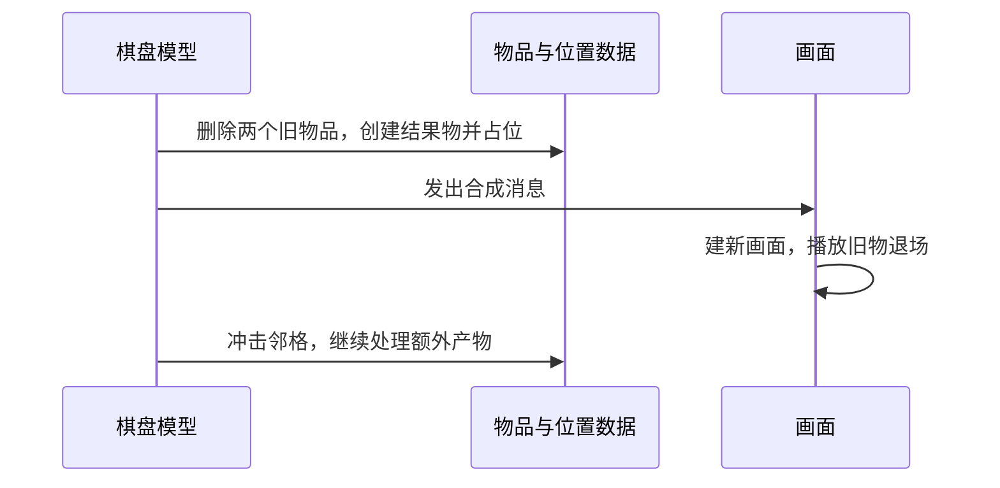

# 02｜生成、合成和解锁是怎样完成的

> Gossip Harbor 3.99.0（版本号308）｜2026-09-25｜依据恢复的Lua代码做静态分析，未运行游戏。

## 1. 怎样给物品增加一种能力

这里没有为普通物品、生成器、宝箱各建一套完全不同的基础对象。程序先创建ItemModel，再根据配置给它加入所需能力。例如，有生成配置就加入`ItemSpread`，有吞入配置就加入`ItemSwallow`；表现侧另外建立需要的图片、倒计时或动画组件。[E05](04_证据索引.md#e05)、[E06](04_证据索引.md#e06)、[E22](04_证据索引.md#e22)

能力自己保存运行状态。所以，一个物品可以保留生成能力，同时处于“正在开启”或“暂时没有次数”的状态。这与只读配置不同：配置说明容量和时长，能力对象记录当前还剩多少、从何时开始等待。[E12](04_证据索引.md#e12)

这种组合有两个已知边界。第一，每种能力只允许一个位置，同型能力再次加入会覆盖旧引用，不能直接表示“来自两个来源的两份冻结”。第二，虽然有添加方法，但实际调用主要集中在创建工厂；已读范围没有配套的通用移除、保存格式变更和画面增删流程。**创建时组合能力已确认，任意运行时增删仍待验证。**[E05](04_证据索引.md#e05)、[E06](04_证据索引.md#e06)

多个能力响应同一事件时，代码遍历组件并调用同名方法，没有规定业务先后，也不根据返回值停止后续调用。如果前一个能力已经替换宿主，后一个是否还应执行，需要玩法自己处理。这是扩展时的风险，尚未证明现有配置必然出错。[E05](04_证据索引.md#e05)

## 2. 从具体玩法理解这些能力

本节先讲玩家操作背后的行为，再讲数据归属、组合和恢复。执行先后集中在[第4节的六条流程](#flows)。除明确标为推断或待验证的部分外，以下均为代码中可见的事实。

### 2.1 点击生成：能力一直在，但不一定随时可用

手动生成器的能力属于物品，不另有独立编号。它记录当前阶段、开始计时的时刻、可用次数、储备次数、累计产出量和产出池；容量、费用、恢复时长来自配置。即使`Spread_Auto=0`，也会装配生成能力，只是需要点击触发。[E06](04_证据索引.md#e06)、[E12](04_证据索引.md#e12)

玩家选中后再次点击，程序才尝试产出。它先检查阶段和次数，再找空格、检查能量。冷却结束只是恢复可用次数，**不会因此自动生成一颗物品**。画面读取阶段与次数来显示提示和倒计时；倒计时动画负责显示变化，不决定次数何时恢复。[E08](04_证据索引.md#e08)、[E12](04_证据索引.md#e12)、[E13](04_证据索引.md#e13)、[E34](04_证据索引.md#e34)

生成能力可以与转换、加速计时等能力并存。累计产出达到配置阈值时，物品可以转换成另一种；一次性物品也可能在次数耗尽后移除。可恢复的生成器则保留，等待下一次恢复。入仓保留原物品状态，合成通常创建新物品。[E13](04_证据索引.md#e13)、[E27](04_证据索引.md#e27)

这些进度由ItemManager逐项保存，重开时重新建立能力并回填。按类型共享的产出池另行保存。一次产出究竟先扣次数还是先扣费，以及失败后有什么风险，见[流程三](#spawn)。[E04](04_证据索引.md#e04)、[E15](04_证据索引.md#e15)

### 2.2 自动生成：恢复次数后，尽快把当前能产的物品放出来

自动生成仍使用同一个ItemSpread，只是配置启用了自动模式。它与手动生成共享次数、储备、计时和产出选择机制，没有额外记录“下一颗必须在第几秒生成”的字段。[E12](04_证据索引.md#e12)、[E14](04_证据索引.md#e14)

处于可用阶段且还有次数时，逐帧更新会连续尝试产出，直到没次数、没空位或物品转换。因此，配置1006的“恢复3600秒、容量6”不能读成“每小时只产一颗”；它表示次数恢复规则，恢复后的多个可用次数可能在一次更新中连续使用。该配置的储备恢复时长为7200秒。[E14](04_证据索引.md#e14)、[E16](04_证据索引.md#e16)

主盘可恢复的自动生成器只找周围八格；一次性自动物品可以找全盘随机空格。这意味着周围被堵住时，即使远处有空格，前一种也可能停产。找不到落点通常保留次数；但当服务开关启用、物品是一次性的有限递减池，并且棋盘支持缓存接口时，剩余产物可直接转入缓存。[E14](04_证据索引.md#e14)

自动入口没有调用手动入口的能量检查和扣费函数；1006本身也配置为不耗能。不能由此推断随意加一份“耗能自动生成器”配置就能正确工作。自动路径的耗尽/转换条件也与手动路径不同，不能默认两者都在耗尽时调用同一个销毁方法。[E14](04_证据索引.md#e14)、[E16](04_证据索引.md#e16)

自动产物仍先占位，再播放飞出动画。保存字段与手动生成相同；主盘不在当前游戏模式时不扫描它，重开后如何补时间见[流程四](#time)。[E12](04_证据索引.md#e12)、[E21](04_证据索引.md#e21)

### 2.3 宝箱：开启过程是生成能力的一种阶段

需要等待开启的宝箱仍是普通物品加ItemSpread。它与地图上挡住其它物品的纸箱不同：这个宝箱自身就是可以开、可以领取的物品。开启时长和加速开箱费用来自配置；例如2701配置了480秒开启时间和8次有限产出。[E16](04_证据索引.md#e16)

没有初始化等待、但配置了开启时间的宝箱，从“未开启”开始。玩家点击开启后进入“开启中”，记录开始时间；到时变为“可领取”。阶段决定能否产出，画面只据此显示按钮、提示和倒计时，重开游戏也不需要靠重新播放开箱动画来恢复阶段。[E12](04_证据索引.md#e12)、[E24](04_证据索引.md#e24)

已领取过的宝箱不能再合成，开启中的宝箱不能入仓。代码以“有开启时长，且剩余量不等于初始容量”识别是否用过。移动保留阶段；合成结果通常重新初始化；有限池领完后移除。阶段、计时和领取进度均进入物品存档。[E04](04_证据索引.md#e04)、[E11](04_证据索引.md#e11)、[E12](04_证据索引.md#e12)

同时开几个箱子的限制至少部分放在界面。`OnOpen`自身会直接切换阶段，并未重复检查已有开启过程。这意味着“按钮不能点”和“任何调用者都不能执行”不是同一个保证。[E24](04_证据索引.md#e24)

### 2.4 纸箱和蛛网：外观相似，解除规则不同

纸箱和蛛网都是占据一个物品位置的包装物，保存内部物品的创建编码。工厂根据`pb#`、`c#`等前缀或兼容的数字编码建立外层对象；存档保存当前编码，重开时按当前这一层恢复。嵌套和身份变化的例子见[01物品身份](01_架构与数据模型.md#identity)。[E06](04_证据索引.md#e06)

**纸箱可以响应相邻合成的冲击，蛛网不能据此类推。** 纸箱有`OnShock`处理，解除时删除纸箱并创建内部物；蛛网没有对应处理，它是允许一个匹配的普通物品合入，从而被合成消费。纸箱不能被普通选中/拖动；蛛网也不能主动拖动或被交换，但可以成为合法合成目标。[E08](04_证据索引.md#e08)、[E11](04_证据索引.md#e11)、[E17](04_证据索引.md#e17)

纸箱解除后，如果新物品能移动、且这次不是按等级解锁，就可能继续冲击四邻，顺序为右、下、左、上。若开出来的是蛛网，新物仍不能移动，这次就不继续传播。代码也有按等级解锁的接口，但主盘所用门槛默认是0，不能仅凭接口认定主盘启用了玩家等级解锁。[E02](04_证据索引.md#e02)、[E17](04_证据索引.md#e17)

外观由专用纸箱画面或“内部图标加蛛网覆盖”显示；解除时旧画面回收，新画面建立。某些蛛网内部编码还会附加障碍清除能力，但这仍是明确的工厂分支，并不是任意效果都可独立叠加、解除。连锁冲击尚未见统一去重或终止预算，异常配置能否循环仍待验证。[E06](04_证据索引.md#e06)、[E17](04_证据索引.md#e17)、[E34](04_证据索引.md#e34)

### 2.5 气泡：选中状态会影响它何时到期

气泡也是包装物，里面保存创建编码，而不是一个已经运行的内部生成器。工厂按普通或即时气泡的编码创建它，恢复时再填回旧起始时间。它还记录购买价格、是否属于即时触发型等信息。默认倒计时60秒，可被配置覆盖；到期会替换成金币物品，购买后则替换成内部物品，即时型还会再触发新物品的一次点击。[E06](04_证据索引.md#e06)、[E18](04_证据索引.md#e18)

主盘允许气泡物品移动或换位，但禁止入仓；移动不改变开始时间。买开或到期都会创建新的物品身份。画面根据内部编码显示图标和气泡外壳，模型在购买入口还会直接打开确认窗口。[E11](04_证据索引.md#e11)、[E18](04_证据索引.md#e18)、[E34](04_证据索引.md#e34)

一个容易忽略的细节是：信息栏选中气泡、广告相关流程会改同一个`m_lockBreak`标志。标志启用时，逐秒更新不执行自动到期替换；气泡能力本身仍存在。这个临时标志不保存，保存的是创建编码和开始时间。**多处界面共同写一个开关可能互相覆盖，是较强推断，尚需实际流程验证。**[E04](04_证据索引.md#e04)、[E18](04_证据索引.md#e18)

迟到的购买确认也有待核对：`_Break`重新查当前位置，只检查那里有没有气泡组件，没有核对是否仍是原物品，也直接访问查询结果。界面能否保证回调时对象仍有效，目前资料不足，不能把它写成已经复现的缺陷。[E18](04_证据索引.md#e18)

### 2.6 迷雾和区域障碍：一个先解锁，一个还要等动画

**迷雾是一组物品包装，共享一个雾区编号。** 每格的ItemFog记录内部编码，棋盘的FogModel记录组别、解锁顺序和进度，布局和分组来自活动配置。解锁可由指定物品或活动等级条件触发，所需类型、数量与顺序分别检查；雾中物品不能直接移动。[E29](04_证据索引.md#e29)、[E30](04_证据索引.md#e30)

迷雾解锁先扣除所需物品、更新进度，再替换组内各格的包装物。此时数据已经解锁，程序才发出或暂存表现消息，等待雾消散、显示新物品。所以，**画面仍被雾遮住，不代表逻辑尚未解锁**。进度与当前包装编码会保存，等待播放的消息不会作为同一份业务状态保存。[E30](04_证据索引.md#e30)

**区域障碍另有自己的对象，保存编号、矩形范围和进度。** 它不是一个普通物品占多个格子；区域内还可放不可移动的Locked包装物，障碍画面另有碰撞区域。合成出指定清除物后，障碍进度先写入存档；进度满时移出障碍列表并处理奖励，但逐格解除包装还要等动画回调。[E31](04_证据索引.md#e31)

这两个机制因此不能合称“解锁都先改数据”。区域障碍确实有恢复办法：重载时发现进度已完成，会补做区域解锁。但若本次动画中途取消，是否立即补做，仍待验证。配置重新提供障碍范围，存档以棋盘编号和障碍编号记录进度；这也不是通用的地格效果集合。[E31](04_证据索引.md#e31)

### 2.7 吞入：拖进去和点击批量吸入，生效时点不同

吞入能力记录最多两组目标编码、所需数量和已吞数量，并可与转换能力组合。它由吞入配置装配；点击有出生后1秒的保护时间，也可被配置为完全不允许点击。不能点击的这类吞入物还会被禁止移动。[E11](04_证据索引.md#e11)、[E19](04_证据索引.md#e19)

两种触发方式走不同的时序：

- **拖入一件物品**：先检查编码和剩余需求，随后立即增加进度、保存、删除源物品，再播放吞入画面。
- **点击批量吞入**：先扫描棋盘并记下要吸入的物品；每件飞到目标的动画完成时，才调用`Swallow`增加进度和删除源物品。

需求满足后，转换能力把宿主替换成新物品；某些不可点击类型还会冲击邻格。未完成的进度随物品移动和存档保留，`swallowInfo`保存目标编码、已吞数量和需求数量。[E19](04_证据索引.md#e19)

批量期间界面会锁住输入，等全部到达才解锁，但这不等于逻辑已经预先消费或预留了所有源物品。直接Swallow也没有再核对源是否仍在棋盘。动画中断后的处理尚无统一协议可见；这是无法把整个规则层视为完全独立于画面的直接证据。查证可对照[OnTap/Swallow](../source/Lua_Core/Board/Model/Item/ItemSwallow.lua) L26–98和[飞行动画回调](../source/Lua_Core/Board/View/BaseBoardView.lua) L289–331。[E19](04_证据索引.md#e19)

### 2.8 其它已找到的能力

转换能力`ItemTransform`可在时间到期或手动扣能后，按权重替换物品。选择箱`ItemChoose`根据玩家选中的候选项执行替换。它们复用已有的物品替换和消息机制，不需要为每种结果另建一套棋盘。[E32](04_证据索引.md#e32)

加速器会保存激活时间，到期后转换或移除；目标的`ItemAccelerateTime`方法会扫描八邻，采用最大的加速结束时刻，生成器计时也会读取这一字段。**但完整启用链待验证**：当前376个模块中未找到该扫描方法的调用者，不能仅因字段、保存和方法都存在，就认定运行时已经接通。[E04](04_证据索引.md#e04)、[E33](04_证据索引.md#e33)

## 3. “不能操作”为什么不能只用一个开关

蛛网就是一个明确例子：它不能被主动拖动，却可以接收匹配物品的合成。因此，拖动、作为合成目标、点击产出等必须分别判断。样本确实分开了这些判断，但没有把所有限制收束到一个统一入口。[E11](04_证据索引.md#e11)

| 玩家意图 | 谁作判断 | 需要注意的地方 |
| --- | --- | --- |
| 选择物品 | 主棋盘画面 | 纸箱在这里提前拒绝 |
| 拖动物品 | 画面先查CanItemMove | DragItem本身只再查源身份和目标范围，没有重查源能否拖动 |
| 与目标交换 | 棋盘查目标能否移动 | 检查晚于合成，所以蛛网可被合成，但不能交换 |
| 合成 | 棋盘的CanItemMerge | 看类型关系、合成结果、宝箱使用情况等 |
| 点击产出 | 生成能力 | 看阶段、次数、空间和费用 |
| 售出或入仓 | 各自的资格方法 | 售出入口不再重复资格检查，入仓入口会检查 |
| 开宝箱 | 界面按钮与开启方法 | 开启方法不再完整检查阶段及其它正在开启的箱子 |

源码入口见[E08](04_证据索引.md#e08)、[E09](04_证据索引.md#e09)、[E11](04_证据索引.md#e11)、[E13](04_证据索引.md#e13)、[E24](04_证据索引.md#e24)。界面检查能改善交互，但不能自动约束未来从其它系统直接发起的同一操作。

外观也不能直接当作权限。箱、网、气泡有业务含义；倒计时根据生成状态派生；工具拖动时的半透明则只是提示“这个物品不适用”。此时`UpdateItemAffectedEffect`会把透明度降到至多0.5，并隐藏能力的画面对象，业务组件仍在。非当前雾区也会换颜色显示，颜色值为`(0.84,0.84,0.9,1)`。[E34](04_证据索引.md#e34)

连续输入主要依赖源物品身份核对、画面拖拽状态、动画替换和界面输入锁，未追到统一的业务请求队列。遍历前复制物品集合，能避免集合本身边遍历边改变，但不保证副本中的每个物品仍有效。事件总线的同步、异常传播和嵌套调用处理没有保留，相关风险需要补证。[E05](04_证据索引.md#e05)、[E09](04_证据索引.md#e09)、[E12](04_证据索引.md#e12)、[E36](04_证据索引.md#e36)

## 4. 六条流程：数据在哪一步真正改变

下面按调用顺序解释。“写入存档表”只表示代码已调用表接口，不等于磁盘已完成保存；这一区别见[01存档说明](01_架构与数据模型.md#persistence)。

### 流程一：载入棋盘

1. **准备配置。** ConfigModel汇总物品配置，ItemDataModel建立种类、合成链和外观索引。
2. **建立棋盘服务。** MainBoardModel初始化物品管理器、位置表、缓存和仓库，并接上存档表。
3. **恢复物品。** ItemManager通过`CreateWithData`按编码建立能力，再回填实例编号和能力进度。未知配置的物品记录会被清理。
4. **恢复位置。** 若物品表和位置表都为空，按初始棋盘配置创建；否则按坐标键找到物品编号，填入数组和物品位置，同时重建空位计数。找不到物品的占位记录会被删除。
5. **恢复容器和画面。** 缓存、仓库关联旧物品，模型刷新统计；棋盘画面遍历现有物品建立显示对象，并注册输入与消息处理。

这些局部先后可见，但底层怎样从磁盘读取、整个应用何时确认资源就绪并开放输入，没有完整总调度证据。也未见这一段统一补完所有离线计时。[E03](04_证据索引.md#e03)、[E04](04_证据索引.md#e04)、[E07](04_证据索引.md#e07)、[E12](04_证据索引.md#e12)、[E20](04_证据索引.md#e20)、[E27](04_证据索引.md#e27)、[E36](04_证据索引.md#e36)

### 流程二：拖拽、移动、交换、合成

玩家拖动时，图片跟手；松手后，画面检查源物能否移动，再调用`DragItem`。模型核对目标范围，以及源位置上是否仍是原对象，然后依次尝试：空位移动、特殊工具作用、合成、吞入、交换。目标不能移动又不满足前面规则时，就回到原位。[E08](04_证据索引.md#e08)、[E09](04_证据索引.md#e09)

移动会先清旧格、占新格，再更新物品自身位置。交换会先改两格占位，再依次更新两个物品的位置。如果监听位置变化的代码立即读取另一个物品，可能读到尚未更新的位置；是否有这种监听依赖，仍待验证。[E09](04_证据索引.md#e09)

普通合成的关键顺序如下：

新物在动画前已经存在，两个旧画面约0.1秒后回收，新画面从缩放0开始出现。取消普通合成动画不会撤回已经发生的合成。另一方面，合成消息之后仍有邻格与附加产物处理，所以这条消息并不表示“整次操作的所有结果都已完成”。事件处理是否同步、异常会否打断后续步骤，缺底层事件实现确认。[E10](04_证据索引.md#e10)、[E21](04_证据索引.md#e21)、[E36](04_证据索引.md#e36)

越界、源对象已变或目标不能接受操作的普通拒绝，会重新设置原位置让画面回弹，不消费源物品。这与执行到一半抛出异常是不同情况。[E09](04_证据索引.md#e09)

### 流程三：点击产出

1. **检查能不能产。** `_TrySpread`先检查阶段和次数，再找位置、预查余额。不满足条件时，到此返回，还没有抽产物、扣次数或扣费。
2. **决定产什么，并修改生成进度。** `GenerateItemCode`选择并修正产物，改变产出池和次数，更新计时并保存。这时新物品尚未建立。
3. **扣费。** `SpreadCostEnergy`调用钱包；代码没有使用扣费返回值来撤回上一步。开启落点优化时，还会重新选择更合适的位置。
4. **创建和显示产物。** `SpreadItem`建立新物、写属性和占位，再发消息播放飞出动画。
5. **处理生成器自身。** 到转换阈值就替换，或在一次性次数耗尽时删除；否则还可能处理冷却加成。

方法范围可直接查[ItemSpread.lua](../source/Lua_Core/Board/Model/Item/ItemSpread.lua) L599–630、L896–942。[E13](04_证据索引.md#e13)

这里需要区分两种“失败”：前置检查拒绝时，经济数据尚未改变；但开始抽产物后已经有副作用，未见整次操作自动撤回的机制。钱包实际会怎样失败仍未知。另外，返回`false`有时表示“已经产出，但生成器用完了”，不能简单据此重试，否则可能重复执行。[E13](04_证据索引.md#e13)、[E36](04_证据索引.md#e36)

产出随机也有明确的数据归属。名叫`Fixed`的策略实际是**按物品类型共享的有限权重池**：抽中一项就减少一份，整池耗尽后恢复。例如105的基础池为35、2、5，共42份，约束一轮的数量分布，顺序仍随机。同型生成器共用进度；配置变化会重置池，旧序列数据有转换处理。教程和加成还可能修正最终产物，因此不能把基础池数量直接当作线上账号的观测分布。[E15](04_证据索引.md#e15)、[E16](04_证据索引.md#e16)

### 流程四：时间推进、离线与自动产出

时间由GameModel提供，主要使用CPU时间与服务端时间偏移，并可加入测试偏移；某些强网络等待条件下，取时会停留在入后台的时刻。主盘只有在对应游戏模式下，才逐秒检查棋盘物品。[E12](04_证据索引.md#e12)、[E28](04_证据索引.md#e28)

生成器根据“开始时刻+当前阶段时长”判断是否到期：初始化或开启等待结束，就进入可用阶段；短恢复会补当前可用次数并消耗储备；储备用尽后进入长恢复，到期补满当前次数与储备。如果短恢复早已结束，代码可接着处理已经流逝的长恢复时间。[E12](04_证据索引.md#e12)

手动生成器到这里只是恢复可用次数。自动生成器随后在逐帧更新中尝试落子；无落点时通常停在抽样和扣次数之前，特定有限产物则可走前述缓存分支。画面不负责推进这段计时。[E14](04_证据索引.md#e14)

**较强推断**：重开后，保存的开始时刻足以让正常更新补到当前恢复阶段。但代码没有按离线的每个周期补出无限产物；库存也不属于当前棋盘扫描集合，另有增益事件处理。首帧更新顺序、库存是否另有后台补时、底层时钟是否始终单调，仍需总调度补证。不要把“能恢复次数”扩大成“已经实现全部离线收益”。[E04](04_证据索引.md#e04)、[E12](04_证据索引.md#e12)、[E27](04_证据索引.md#e27)、[E28](04_证据索引.md#e28)、[E36](04_证据索引.md#e36)

### 流程五：解锁或解除遮挡

| 情况 | 真正改变数据的时点 | 之后才发生什么 |
| --- | --- | --- |
| 纸箱邻击 | PaperBox响应冲击，删除外物并创建内部物；满足条件还会继续冲击邻格 | 发解除消息，回收旧画面、建立新画面；按等级解除可有显示延迟 |
| 蛛网合成 | 匹配的普通物合入，消费蛛网目标并创建升级物 | 普通合成动画；不是靠相邻冲击自动去网 |
| 迷雾群组 | 消费钥匙/更新进度，替换整组迷雾物品 | 消散旧雾，延迟显示新画面；消息可以暂存 |
| 区域障碍 | 进度先保存；但区域内锁包装要等动画调用OnRemove才解除 | 新物建立并冲击邻格；若此前中断，重载可按已完成进度补做 |

纸箱、蛛网依据[E11](04_证据索引.md#e11)、[E17](04_证据索引.md#e17)，迷雾依据[E30](04_证据索引.md#e30)，区域障碍依据[E31](04_证据索引.md#e31)。主盘基类纸箱画面的解除动画时长返回0；不能据此推广到活动中的所有覆盖动画。

障碍依赖动画的直接链为：[画面OnFlyToSlider](../source/Lua_Core/Board/View/UIBoard/BaseUIBoardObstacleView.lua) L72–115调用[模型OnRemove](../source/Lua_Core/Board/Model/UIBoard/BaseUIBoardObstacleModel.lua) L33–35，再执行[逐格解锁](../source/Lua_Core/Board/Model/UIBoard/BaseUIBoardObstacleLayerModel.lua) L66–85。当前会话取消动画后是否立即补做，仍待验证。

### 流程六：售出、撤销和画面释放

售出按钮先处理界面资格及稀有物确认，然后调用`SellItem`。模型先发放非零卖价，再从占位和物品表中删除对象，最后通知画面缩小退场。卖价为0时，同一路径表现为删除；信息栏仍持有旧物品引用，用来提供专用撤销。[E24](04_证据索引.md#e24)、[E25](04_证据索引.md#e25)、[E26](04_证据索引.md#e26)

撤销不是重新生成同种物品，而是恢复这个旧对象和旧编号。原格空着就放回原格；原格有物品就尝试附近空位；**如果整盘没有空位，代码会删除原格现物，再恢复旧物品。** 随后扣回卖价，恢复物品属性与占位并建立画面。扣款返回值没有用于阻止或撤回恢复。[E25](04_证据索引.md#e25)

撤销期间没有冻结旧物品的计时字段，恢复后如何补时仍由时钟与更新顺序决定。撤销引用属于界面临时状态，未见持久保存，不能假定关掉进程后还能撤销。[E26](04_证据索引.md#e26)

画面释放与业务删除是两回事。通用回收会解除事件订阅、停止已登记的动画，调用组件清理，重置透明度和缩放，再按类型回池；部分包装类型直接销毁。售出动画另有专门保护：结束时先看当前绑定是否仍是自己，避免快速撤销后误删新画面。[E22](04_证据索引.md#e22)、[E23](04_证据索引.md#e23)、[E26](04_证据索引.md#e26)

但异步加载和某些延迟回调没有同等的“这次绑定是否仍有效”检查。一张画面已被复用，旧加载稍后返回时是否会改错对象，是**较强推断的风险**，需要补资源加载器和运行验证。普通动画取消也不能自动撤回已提交的业务；验证安排见[03待验证问题](03_借鉴评估与待验证问题.md#validation)。[E23](04_证据索引.md#e23)、[E36](04_证据索引.md#e36)、[E38](04_证据索引.md#e38)

---

资料路径从MergeTwo仓库根起算：目标为`参考项目/GossipHarbor_3.99.0/`，本报告位于其`_分析实现方案/`目录。源码位置及证据限制见[04 证据索引](04_证据索引.md)。
