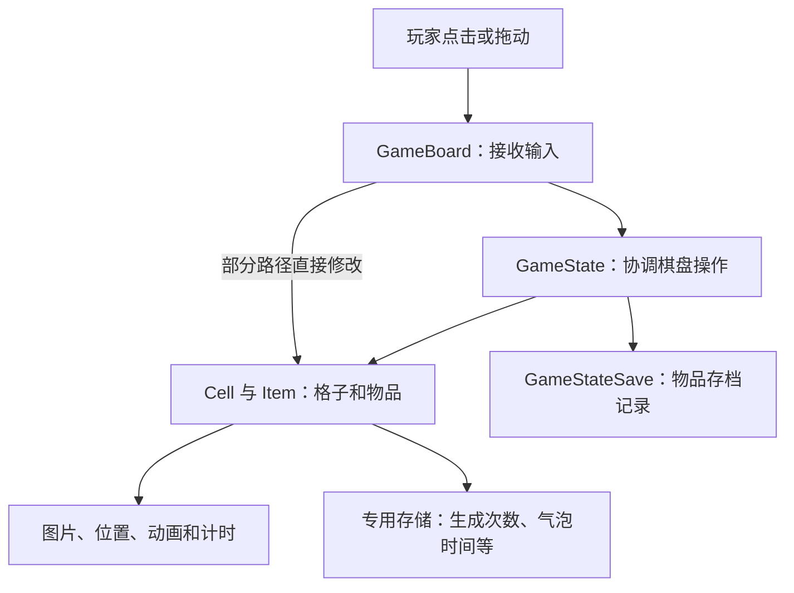
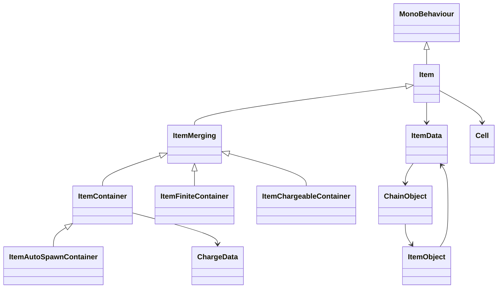

# Merge Inn 8.7｜棋盘和物品怎样组织

本文先解释项目自己的模型，再说明坐标、身份和保存方式。**除明确标注“较强推断”或“待验证”的内容外，实现描述均为已确认（静态证据）；没有运行验证。** 与我们的架构比较放在 [03](03_借鉴评估与待验证问题.md)。

## 1. 先认识四个主要对象

理解这个项目，可以先记住四个名字：`GameBoard` 接收玩家输入，`GameState` 协调棋盘操作，`Cell` 表示一个格子，`Item` 表示格子里的物品。它们都是 Unity 行为组件（MonoBehaviour）。其中 Item 同时管理业务数据和图片、动画，并没有单独拆出一个只负责显示的 ItemView。[E01](04_证据索引.md#e01)



这是依据源码整理的职责图，不是项目原有的分层设计。一个典型例子是从库存放回棋盘：`GameBoard.FieldInteraction` 会直接把物品与格子关联起来、播放放置动画并请求保存坐标。输入对象不只是传递请求，也参与修改业务状态。[E08](04_证据索引.md#e08)

### 哪些数据由谁保存和修改

下表供查具体字段，不必第一次就记住全部名称。“活跃物品”指当前仍参与棋盘玩法的物品；退场动画中的旧物可能已不在这个集合里。

| 对象及职责 | 关键字段 | 身份、归属和写入方式 |
| --- | --- | --- |
| `GameState`：协调棋盘 | cells、fieldItems、gameStateSave、chains、itemsPool | 持有格子集合、活跃物品列表和存档对象；创建或移除物品，也调用界面与目标系统。[E01](04_证据索引.md#e01) [E06](04_证据索引.md#e06) |
| `GameBoard`：接收输入 | selectedItem、selectedCellCoordinates、hasDragging、inputLocked、dragCoroutine | 保存选择、拖动和输入锁定状态；部分路径直接改格子占位。[E01](04_证据索引.md#e01) [E08](04_证据索引.md#e08) |
| `Cell`：单个格子 | coordinates、item、isEmpty、isInteractable、selectable、sizeFactor | 以坐标定位，只放一个物品；可见字段没有独立持久 CellId。它也持有显示用的 Transform。[E01](04_证据索引.md#e01) [E04](04_证据索引.md#e04) |
| `Item`：一个物品 | id、cell、itemData、isLocked、isAlive、selected、placing、isFtue | id 标识保存的物品；cell 记所在格子。多个方法可改这些字段，移动时还须更新 Cell 一侧。[E04](04_证据索引.md#e04) [E05](04_证据索引.md#e05) |
| `ChainObject`、`ItemObject`：种类配置 | chainName、items、currentItems、ItemObject.data | 两者是可共享的 ScriptableObject 配置；链内位置决定普通合成的下一等级。[E05](04_证据索引.md#e05) [E10](04_证据索引.md#e10) |
| `ItemData`：配置与部分实例状态 | itemCode、order、chain、itemType、locked、lockedData、boxedItem、isItBubble、cooldown、chargeData、items、weights | 创建物品时会克隆。它既有配置引用，也有会变化的包装和气泡标志，因此不能当成完全只读的配置。[E05](04_证据索引.md#e05) [E06](04_证据索引.md#e06) |
| 包裹、锁与气泡 | boxed 类型、boxedItem、isLocked、locked、isItBubble | 分别保存在物品类型或物品字段里。已读范围未见通用效果集合，也未定位独立的地块锁存档。[E19](04_证据索引.md#e19) [E23](04_证据索引.md#e23) |
| 物品和格子的画面 | Image、CanvasGroup、RectTransform、Tween、UISpriteAnimation、topField、bottomField | 这些字段仍在 Item 或 Cell 内，与身份、权限和计时由同一对象管理。[E01](04_证据索引.md#e01) [E26](04_证据索引.md#e26) |
| `GameStateSave`：棋盘存档 | field（ItemDataSave 列表）、questIdx、Inventory | 增删物品或更新坐标时修改这份记录，再请求保存；它不是场景中的 Item 对象。[E24](04_证据索引.md#e24) |
| 生成器和气泡的专用存储 | ChargeData、ContainerDataStorage、ProfileStorage 中的气泡时间、Timer | 次数、预设产物进度和计时不全在主物品记录中，功能代码会另行保存。[E14](04_证据索引.md#e14) [E15](04_证据索引.md#e15) [E23](04_证据索引.md#e23) |
| `UndoManager`：售出撤销 | Cell、ItemDataSave、ItemData、gameState、undoID | 暂存一份旧物的信息，用于专门的售出恢复；不是完整操作历史。[E27](04_证据索引.md#e27) |

**由此能确认的是，相关状态分布在多个对象中。** 这意味着操作需要同时维护它们，但不能仅凭数据分散就断言游戏已经出现不同步问题。

## 2. 同一张棋盘有三种表示

配置回答“这个关卡起初有哪些格子和物品”，运行对象回答“现在格子里放着什么”，存档回答“下次打开时怎样恢复”。Merge Inn 没有让三者使用完全相同的结构。

| 用途 | 实际结构 | 怎样理解 |
| --- | --- | --- |
| 关卡配置 | FieldData 的 size、tiles、fieldGroup；格子含 isHole，初始物品含 itemCode、isLocked、isBoxed | 一维格子表描述初始布局；GetLayout 首次创建并缓存 LevelLayout。[E02](04_证据索引.md#e02) |
| 运行中的棋盘 | cells 按二维数组访问，fieldItems 另存活跃物品列表 | 导出声明写成 object[]，但实际方法访问两个维度的上下界，因此以二维访问行为为准；原始类型拼写没有完整恢复。[E01](04_证据索引.md#e01) [E03](04_证据索引.md#e03) |
| 存档 | 每个 ItemDataSave 记录物品及其坐标 | 当前包没有发现“每个格子一条持久记录”的集合。关卡中的洞也不是靠保存一条空物品记录表示。[E02](04_证据索引.md#e02) [E24](04_证据索引.md#e24) |

### 2.1 坐标怎样对应配置下标

`GameBoardConstructor.PosToIndex(x,y)` 使用公式 `x + width*y`。例如宽度为 3 时：

```text
配置坐标       (0,0) (1,0) (2,0) (0,1) (1,1) (2,1)
tiles 下标       0     1     2     3     4     5
```

这是说明性示例，不是实际关卡。创建初始物品的循环从 0 开始，x 小于宽度、y 小于高度。**这些代码能说明配置下标，不能说明屏幕左上角还是左下角是原点，也不能直接代表运行数组的内存排列。** [E02](04_证据索引.md#e02) [E07](04_证据索引.md#e07)

### 2.2 格子和物品为什么要同时改

```text
Cell A.item ──→ Item #123       格子记录“里面是谁”
Item #123.cell ──→ Cell A       物品记录“自己在哪”
ItemDataSave ──→ id=123、A坐标  存档另记一份位置
```

`Cell.SetItem` 更新格子里的物品和空格标志；`Item.SetCell` 更新物品所在格子，并调整显示位置和尺寸。移动、交换的调用者必须分别更新两边，再更新存档坐标。只调用其中一个方法，不足以完成整次移动。[E04](04_证据索引.md#e04)

### 2.3 空格、洞、锁和显示层不是一回事

- **空格**：Cell 对象存在，但没有物品；`SetItem` 同步更新 `isEmpty`。[E04](04_证据索引.md#e04)
- **洞或无效位置**：配置有 `isHole`，按坐标查找也可能找不到 Cell。**较强推断**是两者有关，但缺少完整构造代码，尚不能确定洞是“不建对象”还是“禁用对象”。[E02](04_证据索引.md#e02) [E03](04_证据索引.md#e03)
- **锁定物品**：锁保存在 Item 及其数据中，包裹物也占物品槽。Cell 的 `isInteractable`、`selectable` 是输入控制，不能直接解释为持久地块锁。[E09](04_证据索引.md#e09) [E19](04_证据索引.md#e19)
- **预留位置**：在已读核心字段和找空位方法中，没有定位到预留格集合。自动生成会在动画结束后重新找空格，这本身不是提前占位；是否另有预留机制仍待验证。[E17](04_证据索引.md#e17)
- **上下显示层**：`topField`、`bottomField` 是 Transform，不能据此认为同一格能放两层业务物品。已见结构是一格一物，多格障碍等能力待验证。[E01](04_证据索引.md#e01) [E04](04_证据索引.md#e04)

### 2.4 逻辑坐标与画面位置并未完全隔离

格子构造器持有屏幕布局参数；物品放置和合成会直接读写 Transform。输入代码还会把画面位置差值传给生成器，参与落点选择。因此，部分规则入口依赖画面位置提供的信息，并非只处理整数格坐标。[E02](04_证据索引.md#e02) [E04](04_证据索引.md#e04) [E08](04_证据索引.md#e08) [E13](04_证据索引.md#e13)

完整的缩放、锚点和屏幕方向仍待验证。构造器虽有 `CELL_SIZE_INITIAL=160`、边距等常量，但 `CalculateFieldSize` 和 `LoadLevel` 只保留了方法开头，不能把 160 当成所有设备上的实际格子尺寸。[E02](04_证据索引.md#e02)

### 2.5 找格子与找空位的规则

| 方法 | 实际做法 | 需要注意 |
| --- | --- | --- |
| GetCellByPos：按坐标找格 | 扫描二维集合，比较每个格子的 coordinates | 不是直接用 x、y 取数组元素。一次查找最多检查 N 个槽位，静态复杂度为 O(N)。 |
| FindFreeAroundCell：找周围空格 | 检查周围八格，找到第一个存在且为空的格就返回 | 每次检查仍要调用全盘查格，最多八次扫描，即 O(8N)。 |
| FindNearestFreeCell：找最近空格 | 先按传入方向检查正交候选；必要时扫描全盘，比较距离平方 | 近零方向可考虑源空格；等距时保留先遇到者。静态复杂度为 O(N)。 |
| TryUnboxing：查可拆包裹 | 只检查上下左右四个邻格 | 与八邻找落点的规则不同。 |

需要核对精确顺序时：八邻扫描为 `(-1,-1)、(-1,0)、(-1,1)、(0,-1)、(0,1)、(1,-1)、(1,0)、(1,1)`；四邻拆箱为 `(-1,0)、(0,-1)、(0,1)、(1,0)`。最近空格搜索中，正 delta 对应减坐标方向；没有结合调用位置确认前，不宜把它解释成“朝手指方向”。[E03](04_证据索引.md#e03) [E20](04_证据索引.md#e20)

这些是代码层面的复杂度估计，没有性能实测。已读方法未见邻接表或空格索引缓存，是否需要优化取决于棋盘大小与调用频率。

## 3. “哪种物品”与“哪一个物品”怎样区分

两个相同等级的物品可以共用种类配置，但仍是玩家拥有的两个不同实例。它们的 ID 不同；即使以后用了同一个池中对象显示，也不能因此混为一物。

| 名称 | 含义 | 创建或恢复时的处理 |
| --- | --- | --- |
| Item.id、ItemDataSave.id | 具体哪一个物品 | 新建调用 GetUnicID；加载和撤销可以使用原 ID。 |
| itemCode | 物品的配置代码 | 用于找配置、匹配充能材料等，不等于实例 ID。 |
| chain、chainName | 物品属于哪条合成链 | 运行时使用链对象；存档主要记链名称，恢复时按名称查找。 |
| Order、order | 链内的等级或位置 | ItemData.Order 可以通过链索引取得；不能假定它始终只是直接读取 order 字段。 |
| Unity 对象引用 | 当前承载物品的场景对象 | 对象池可以复用它，因此不适合替代持久物品 ID。 |

`GetUnicID` 会生成候选值，并检查棋盘和库存中是否重复；候选值怎样生成尚未解析，所以不能断言它是递增编号、UUID 或跨会话全局唯一。售出撤销还使用 `undoID`，但这个去重方法的可见部分没有直接检查它。[E05](04_证据索引.md#e05) [E27](04_证据索引.md#e27)

### 3.1 不同功能靠子类和配置建立



读这张图时，先看三条分支：`ItemContainer` 是点击生成器，`ItemAutoSpawnContainer` 在它的基础上增加自动产出；`ItemFiniteContainer` 是开启型有限宝箱，`ItemChargeableContainer` 是喂料充能容器，后二者直接继承 ItemMerging。这里仅列已重点分析的类型。枚举还包含 consumable、rewardsBox、boxed、stimulusChest、targetBooster、energyGenerator 和 predictable 变体，存在这些名称不代表规则都已研究完整。[E05](04_证据索引.md#e05) [E06](04_证据索引.md#e06) [E14](04_证据索引.md#e14) [E21](04_证据索引.md#e21) [E22](04_证据索引.md#e22)

`GameState.AddItem` 负责把配置变成可用物品，主要步骤是：

1. 克隆或取得实际使用的数据（activeData），按物品类型从池里取得对象。
2. 关联格子，绑定找空位的回调，加入活跃物品列表。
3. 分配新 ID 或恢复原 ID，设置数据、锁和气泡状态。
4. 按类型绑定生产、消耗、耗尽等回调，启动出现效果并发出物品加入通知。[E06](04_证据索引.md#e06) [E13](04_证据索引.md#e13)

所以，扩展主要依靠固定类型、继承、配置和回调配合。`IPoolingItem`、`IBoosterSpeedup`、`IEnergyConsumption` 等接口提供特定约定，但不能证明能力可以任意动态装卸；已读范围也未找到这样的 Function 列表或 Effect 实例集合。[E06](04_证据索引.md#e06) [E14](04_证据索引.md#e14) [E16](04_证据索引.md#e16) [E22](04_证据索引.md#e22)

### 3.2 普通合成会产生新身份

普通合成建立一个新结果物品，再消耗两件旧物。喂料充能则不同：调用会返回原目标对象的引用，但内部填满分支也可能销毁目标，不能据此保证目标一直保留。两种交互的具体顺序分别见 [普通合成流程](02_功能扩展与执行流程.md#flow-merge)和[充能案例](02_功能扩展与执行流程.md#feature-bubble-charge)。[E10](04_证据索引.md#e10) [E22](04_证据索引.md#e22)

## 4. 改了棋盘，不等于已经完整存好

### 4.1 保存分为三个时点

| 时点 | 已经发生什么 | 还不能保证什么 |
| --- | --- | --- |
| 修改运行状态 | 格子占位、次数、锁或气泡状态已经变化 | 所有相关对象是否通过一个入口一起完成修改。 |
| 更新存档记录并请求保存 | GameStateSave 的列表已增删或改坐标；通常延后一帧合并保存请求 | 操作返回时是否已有一份完整、固定的快照。 |
| 交给存储系统 | 协程将当前存档对象交给 DataStorage，再调用 InventorySave.Save | 实际何时写入磁盘、多个键能否一起成功，以及失败或退出时怎样处理。 |

这里最容易误解的是“延后一帧保存”：它可以合并同一帧的请求，却不会自动撤销失败操作，也不阻止事件订阅者在中途读取状态。`Save(forced)` 在已有保存协程时也会直接返回；从现有代码只能确认，新建协程在 forced 时可跳过首次等待，不能保证调用后已经落盘。[E24](04_证据索引.md#e24)

另外，主物品记录只保存 ID、链名、等级、坐标、锁和气泡标志等信息。生成器次数、预设产物序列进度、气泡剩余时间还有单独的保存入口。因此，复制 `GameStateSave.field` 并不等于取得完整游戏快照。[E14](04_证据索引.md#e14) [E15](04_证据索引.md#e15) [E23](04_证据索引.md#e23) [E24](04_证据索引.md#e24)

### 4.2 加载会重建对象，也会修复部分记录

`Load` 有将旧 chainType 转成 chainName 的兼容路径。`CreateField` 遇到重复占位时，可以寻找空格并修改存档坐标。这说明存在局部修复，但还不能证明有完整的存档版本迁移或失败恢复机制。[E07](04_证据索引.md#e07) [E24](04_证据索引.md#e24)

恢复后至少需要检查三件事：格子与物品互相指向正确，存档 ID 和坐标与运行对象对应，已经消耗的旧物不再参与玩法。生成操作还要核对产物、费用和次数是否属于同一次修改。现有材料未完整说明缺配置、无空格、加载异常时怎样补偿；输入何时开放、图标是否加载完也待验证。载入次序见 [02 流程一](02_功能扩展与执行流程.md#flow-load)。[E04](04_证据索引.md#e04) [E11](04_证据索引.md#e11) [E13](04_证据索引.md#e13)

## 5. 能否复用到多个棋盘或脱离画面测试

**普通棋盘与季节棋盘复用了加载入口，但同时运行是否互不干扰仍待验证。** 它们共用 LoadLevel 主流程，配置与存档定位又受 FieldGroup、任务或章节参数影响。GameState 的全局依赖及 ContainerDataStorage 的静态数据，需要进一步检查是否按棋盘隔离。[E28](04_证据索引.md#e28)

**较强推断：现有类不能直接搬进不启动 Unity 的纯 C# 测试。** 依据是已读规则调用依赖 Unity 对象、Transform、协程、DOTween，以及存储、钱包、新手引导（FTUE）和目标系统（Goals）。同链匹配、空格搜索和次数规则有抽取空间，但包内未发现替换时钟、随机数和存储的测试接口。这只说明当前资料的范围，不能评价原团队是否有其它测试工程。[E01](04_证据索引.md#e01) [E03](04_证据索引.md#e03) [E13](04_证据索引.md#e13) [E16](04_证据索引.md#e16)

可以确认这些计算在客户端执行；是否还有服务器校验或云存档，当前包无法回答。订单、活动和广告仅用于解释依赖，不据此扩大我们的需求。[E23](04_证据索引.md#e23) [E28](04_证据索引.md#e28)

## 资料定位

> 项目：Merge Inn 8.7（目录标称，未独立校验版本）；资料日期：2026-09-24；分析及整理日期：2026-09-25。  
> 仓库根：`/Users/betta/Company/Projects/MergeTwo/`。目标目录：仓库根下 `参考项目/MergeInn_8.7_APKPure_code_reference_20260924/`；输出目录：目标目录下 `_分析实现方案/`。源码路径以目标目录为起点，Markdown 链接以所在报告为起点。
