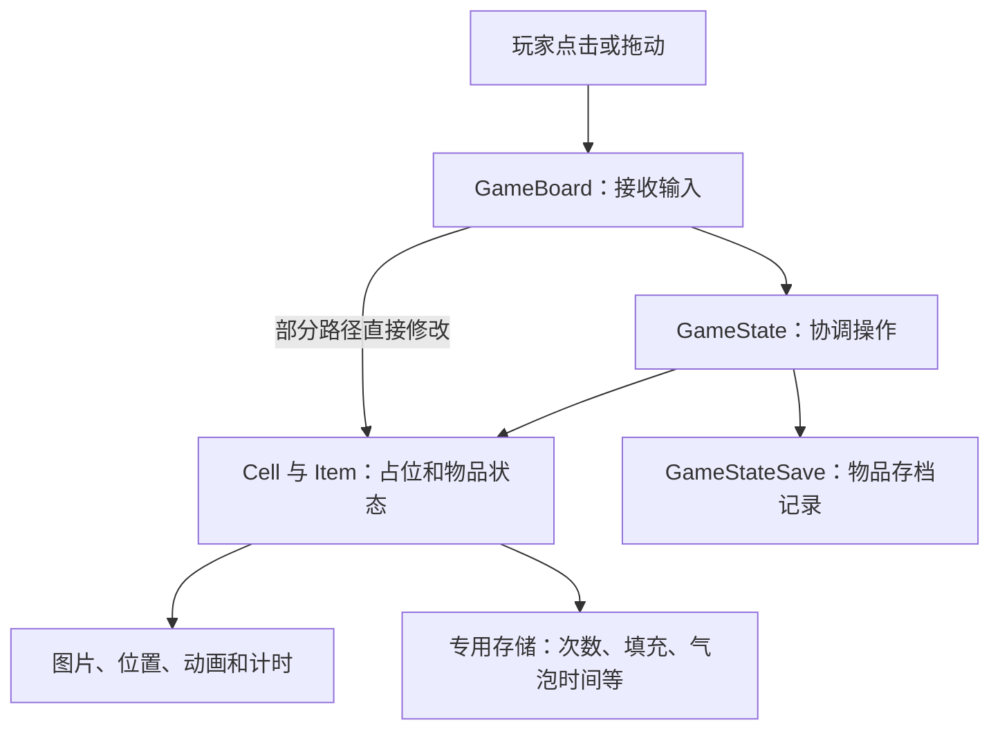
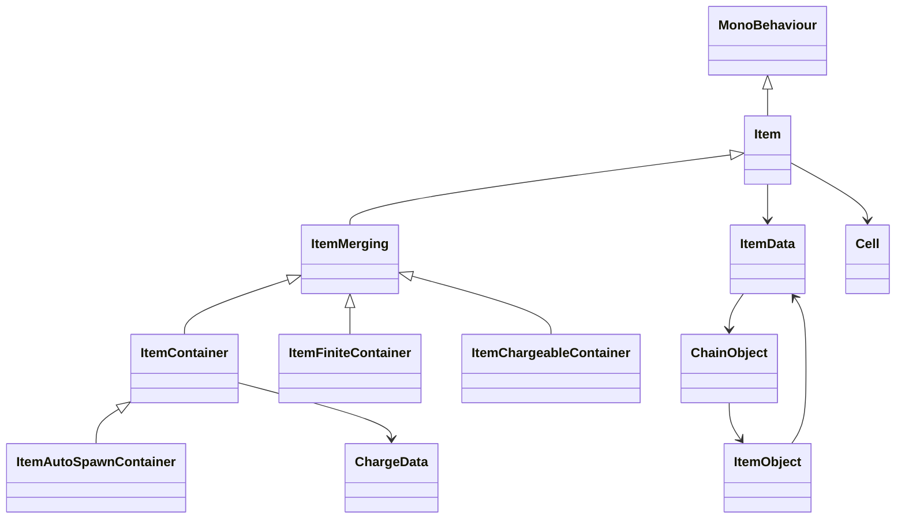

# 01｜Merge Inn 的架构与数据模型

Merge Inn 的核心由四类 Unity 对象协作：`GameBoard` 接收输入，`GameState` 协调棋盘，`Cell` 表示格子，`Item` 表示物品。物品对象同时管理业务数据、图片、动画和计时，已见主流程没有独立的纯逻辑层。理解它的关键，是分清**物品实际状态、画面状态和存档记录**这三者何时变化。

本次复核日期为 2026-09-26。版本 8.7 与资料日期 2026-09-24 采用目录标签，包内没有 APK 或 Manifest 可独立校验。原资料共 123 个文件：68 个附 ARM32 汇编注释的 C# 文件、52 个原生伪代码文件、3 个比较器伪代码文件；没有实际关卡配置和美术资源。C# 文件并非完整可编译源码，部分方法只有签名或开头；伪代码的类型、参数及自动生成的调用标签也可能失真，分析已结合字段、调用者和汇编交叉核对。

三篇中的实现描述，除另有标注外，均为**已确认（静态证据）**；“较强推断”表示有代码依据但缺关键环节，“待验证”表示资料不足。此次没有运行 Unity／APK、性能测试或故障注入。覆盖范围是棋盘装载、身份与占位、合成、生成、计时、限制、删除、撤销和保存的主要路径；宝箱及特殊工具只确认可读分支，不代表逐方法审计了整个游戏。

## 1. 谁保存数据，谁修改数据



这是按实际调用整理的职责图。输入层也会直接修改业务：例如库存物品放回棋盘时，`GameBoard.FieldInteraction` 会关联格子、播放放置动画，再请求更新存档坐标。

| 对象 | 保存什么 | 身份、归属与修改方式 |
| --- | --- | --- |
| GameState | cells、fieldItems、gameStateSave、chains、itemsPool | 持有格子、活跃物品列表和存档；创建、移除物品，也调用目标与界面系统。退场中的旧物可能已不在活跃列表中。 |
| GameBoard | selectedItem、selectedCellCoordinates、hasDragging、inputLocked、dragCoroutine | 保存选择与拖动状态；既调用 GameState，也直接处理部分占位变化。 |
| Cell | coordinates、item、isEmpty、isInteractable、selectable、sizeFactor | 以坐标定位，一格一物；未见独立持久 CellId。还持有显示位置和尺寸。 |
| Item | id、cell、itemData、isLocked、isAlive、selected、placing、isFtue | id 标识具体物品，cell 记录所在格子；多个方法可写入。isFtue 是与新手引导相关的标志。 |
| ChainObject、ItemObject | chainName、链内物品、ItemObject.data | 可共享的 ScriptableObject 配置；合成链中的位置参与决定下一等级。 |
| ItemData | itemCode、order、chain、itemType、locked、boxedItem、isItBubble，以及冷却、费用和产物配置 | 创建时会克隆；配置引用与可变的锁、包装、气泡标志混在一起，不能视为完全只读配置。 |
| 显示与限制 | 锁图片、Image、CanvasGroup、RectTransform、Tween、上下显示层等 | 显示字段仍属于 Item／Cell；锁与气泡在物品字段中，包裹是物品类型，未见通用玩法效果集合。 |
| GameStateSave、ItemDataSave | field 物品列表、章节信息、库存，以及每件物品的 ID、链名、等级、类型、坐标、锁和气泡标志 | 是独立存档记录，不是场景 Item；增删和移动会修改记录并请求保存。 |
| 功能专用存储 | ChargeData、预设产物索引、喂料数据、Timer、气泡剩余时间 | 由 ContainerDataStorage、ProfileStorage 等入口按物品 ID 另行保存。 |
| UndoManager | 原 Cell、ItemDataSave、ItemData、GameState 引用，配合 undoID | 暂存一件售出物品，支持专用撤销；没有完整操作历史。 |

状态分散意味着一次操作要同步维护多份记录；仅凭这一点，不能认定游戏已经发生不同步。

## 2. 棋盘的三种表示

| 用途 | 实际结构 | 边界 |
| --- | --- | --- |
| 初始配置 | FieldData 的 size、tiles、fieldGroup；格子含 isHole，初始物品含 itemCode、isLocked、isBoxed | 一维格子表描述初始布局；GetLayout 创建并缓存 LevelLayout。 |
| 运行状态 | cells 按二维数组访问，fieldItems 另存活跃物品 | 导出声明写成 object[]，但方法访问两个维度，应以实际访问行为为准。 |
| 存档 | 每件物品一条 ItemDataSave，记录坐标 | 未发现每个格子各有一条持久记录的集合；空格、洞格不靠空物品记录保存。 |

### 坐标、格子与占位

`GameBoardConstructor.PosToIndex(x,y)` 使用 `x + width × y`。宽度为 3 时，下列配置坐标对应连续下标；这只是说明性示例：

```text
坐标       (0,0) (1,0) (2,0) (0,1) (1,1) (2,1)
tiles 下标   0     1     2     3     4     5
```

初始物品按 `0 ≤ x < width、0 ≤ y < height` 遍历。这个公式不能确定屏幕原点、y 方向或运行数组的内存排列。构造器有 `CELL_SIZE_INITIAL=160` 和边距等参数，但尺寸计算与完整建格方法缺体，不能据此认定所有设备的实际格子尺寸。

运行时，占位由两边各记一份，存档再记一份：

```text
Cell A.item       → Item #123   格子里是谁
Item #123.cell    → Cell A      物品在哪
ItemDataSave      → #123、A坐标  下次怎样恢复
```

`Cell.SetItem` 更新物品引用和 isEmpty；`Item.SetCell` 更新所属格子，并调整显示位置、尺寸。调用者必须分别更新两边，再更新存档，单个 setter 不能完成整次移动。逻辑坐标与显示也没有完全隔离：放置、合成直接读写 Transform，输入还会将画面位置差传给生成器参与落点选择。

几个容易混淆的状态分别是：

- **空格**：Cell 存在，isEmpty 为真，没有物品。
- **洞或无效位置**：配置有 isHole，查格也可能无结果。两者相关属于较强推断；缺少构造器完整实现，不能确定洞是不建对象还是禁用对象。
- **锁定物品**：限制属于物品；包裹也占物品槽。Cell 的 isInteractable、selectable 是输入控制，不能直接解释为持久地块锁。
- **预留格**：核心字段与找空位方法未见预留集合。自动生成在动画回调中重新找格，不等于提前占位；外围是否另有预留机制待验证。
- **显示层**：topField、bottomField 是 Transform，不表示一格能存两层业务物品。已见结构是一格一物，多格障碍和多层占位未确认。

### 找格与找空位

| 方法 | 实际规则 | 静态成本 |
| --- | --- | --- |
| GetCellByPos | 扫描二维集合，比较格子的 coordinates，而非直接用 x、y 取数组元素 | 最多检查 N 个槽位，O(N) |
| FindFreeAroundCell | 按顺序检查周围八格，返回第一个存在且为空的格；每次调用 GetCellByPos | 最多八次全盘查格，O(8N) |
| FindNearestFreeCell | 先按传入方向检查正交候选，必要时扫描全盘比较距离平方；近零方向可考虑源空格，等距保留先遇到者 | O(N) |
| TryUnboxing | 只检查上下左右四邻，与八邻落点不同 | 固定四次邻格检查 |

八邻顺序为 `(-1,-1)、(-1,0)、(-1,1)、(0,-1)、(0,1)、(1,-1)、(1,0)、(1,1)`；四邻拆包为 `(-1,0)、(0,-1)、(0,1)、(1,0)`。最近空格搜索中，正 delta 对应减坐标方向，不能直接解释成“朝手指方向”。已读方法未见邻接表或空格索引缓存；这些复杂度不是性能实测。

## 3. 物品的种类、身份与装配

| 标识 | 含义 |
| --- | --- |
| Item.id、ItemDataSave.id | 玩家拥有的具体哪件物品。新建申请 ID，加载和售出撤销可恢复旧 ID。 |
| itemCode | 物品配置代码，用于查配置、匹配喂料材料等。 |
| chain、chainName | 所属合成链；运行时用链对象，存档主要记链名。 |
| Order、order | 链内等级或位置。Order 可通过链索引计算，不一定直接读 order 字段。 |
| Unity 对象引用 | 当前承载物品的场景对象；对象池可复用它，不能替代持久物品 ID。 |

`GetUnicID` 生成候选值并检查棋盘与库存是否重复。候选生成器未解析，不能断言它使用递增编号、UUID 或保证跨会话全局唯一；可见去重部分也没有直接检查售出保留的 undoID。



点击生成器与自动生成器有继承关系；有限宝箱和喂料容器则分别继承 ItemMerging。枚举还有消耗品、奖励箱、包裹、stimulusChest、工具、energyGenerator 和 predictable 变体，不能仅凭名称补出其完整规则。

`ItemsPool` 按类型选择预制体与复用队列；`GameState.AddItem` 克隆／取得实际数据，从池中取对象，关联格子与找空位回调，加入活跃列表，分配或恢复 ID、建立存档，再设置物品数据、限制和各类型回调。图标请求、出现效果和物品加入通知也在这条创建链中发生。部分池分派跳表缺失，不能逐一确认每个枚举最终使用哪个预制体。

因此，扩展主要靠**固定类型、继承、配置和回调**。IPoolingItem、IBoosterSpeedup、IEnergyConsumption 等接口只说明特定约定，不能证明能力可任意动态装卸。EnergyEffect、SparklesEffect 的已见用途是画面提示，也不能据此认定存在通用玩法 Effect 系统。

## 4. 载入怎样重建棋盘

| 顺序 | 实际处理 |
| --- | --- |
| 1. 取得布局、建格 | GameBoard.LoadLevel 清合成提示；未传布局时取 FieldData.GetLayout，再调用构造器。 |
| 2. 交出格子集合 | constructor.cells 交给 GameState，然后同步调用加载物品的回调。此刻不表示物品已建完。 |
| 3. 读取记录 | SetGameStateAndLoadField 请求清旧场景，创建 GameStateSave 并 Load；旧 chainType 有转成 chainName 的兼容路径。 |
| 4. 恢复已有物品 | CreateField 调用重复检查、整理记录、清理旧占位，按链、等级、坐标重建，恢复包裹与锁等状态。 |
| 5. 装配功能与画面 | AddItem 恢复身份、回调、限制及各类状态；SetItemData 请求图片，图片可以异步完成。 |
| 6. 无存档时初始化 | CreateItemFromLevel 按配置宽高建立初始物品并请求保存。 |

CreateField 的修复不只是“把重叠物品挪开”，还有以下分支：

- **重复占位**：寻找附近空格，找到后改存档坐标再创建。
- **保存的类型与当前配置不符**：ResetItemSave 按旧类型清理专用状态。例如普通容器清次数、预设索引和计时；喂料容器清次数与填充数据。各类清理分支并不完全相同。
- **位置无效或重复占位且无空格**：可见部分分支调用外部处理后，从棋盘存档列表移除该记录；无空格时还受 FieldGroup 分组限制。外部处理的去向尚未解析，不能断言它必然丢失物品，也不能承诺已完整补偿。

这些是局部兼容与修复，尚不能证明有完整版本迁移或恢复事务。缺配置时的处理、负坐标等异常边界、重复 ID 的完整处置、旧场景清理是否取消全部回调，以及何时开放输入，仍待验证。

## 5. 保存的三个时点

| 时点 | 已发生的事 | 尚不能保证的事 |
| --- | --- | --- |
| 修改运行状态 | 占位、次数、锁或气泡已经变化 | 所有相关对象是否一起完成修改 |
| 更新存档并请求保存 | 增删 ItemDataSave 或改坐标；通常延后一帧合并请求 | 调用返回时已获得完整、固定的数据副本 |
| 交给存储系统 | 保存协程将当前 GameStateSave 交给 DataStorage，随后调用 InventorySave.Save | 何时真正落盘、多键是否一起成功、退出或失败怎样恢复 |

`GameStateSave.Save` 在已有保存协程时直接返回，包括 forced 请求。只有新建协程才根据 forced 决定是否跳过首次等待；这不能视为“强制调用后一定已落盘”。协程持有当前对象，也没有显示出先冻结一份快照的步骤。

次数、预设产物进度、喂料数据和气泡时间不全在主物品列表中，复制 field 不能获得完整游戏快照。延后一帧可减少写入请求，却不提供失败回滚，也不阻止同步通知在操作中途读取状态。恢复时应同时核对占位、物品身份、费用和这些专用状态。

## 6. 复用与独立测试的边界

普通棋盘和季节棋盘复用 LoadLevel 主流程，但配置及存档又受 FieldGroup、章节等参数影响。静态存储和全局服务是否按棋盘隔离尚未确认，不能据此认为多个棋盘能同时独立运行。

**较强推断：现有核心类不能直接搬进不启动 Unity 的纯 C# 测试。** 已读流程依赖 Unity 对象、Transform、协程、DOTween、钱包、新手引导和目标系统；包内未见可替换时钟、随机数、存储的测试接口。匹配、空格搜索和次数计算有抽取空间，但这不证明原团队没有其它测试工程。

这些规则确实在客户端执行；服务器校验、云存档及其算法没有资料支持。订单、活动和广告仅用于解释依赖，不扩充本次设计范围。
