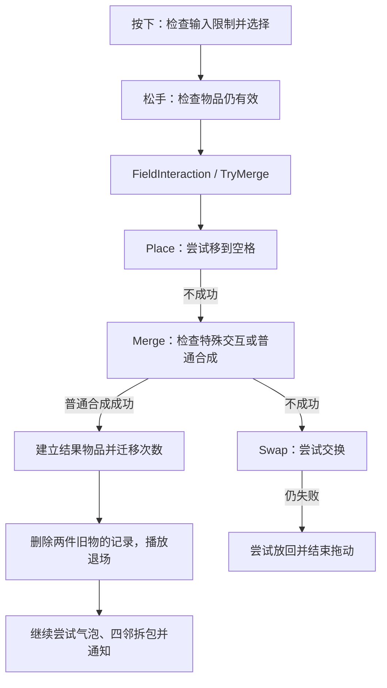

# Merge Inn 8.7｜功能怎样运行，一次操作怎样完成

本文先说明生成器、锁、包裹、宝箱和气泡各自怎样实现，再按六条流程追踪“检查条件、修改数据、播放画面、请求保存”的先后。**除明确标注“较强推断”或“待验证”的内容外，实现描述均为已确认（静态证据）；没有运行验证。**

## 1. 功能、限制和画面分别是什么

这个项目主要用物品子类承载功能，再用字段和条件限制操作。例如，生成器具备生产能力，但锁或气泡可以让它暂时不能生产。宝箱的“正在开启”则是一次过程的阶段。它们不是同一种状态，不适合只看字段名就归为一类。[E06](04_证据索引.md#e06) [E14](04_证据索引.md#e14) [E19](04_证据索引.md#e19) [E21](04_证据索引.md#e21)

代码中虽然有 EnergyEffect、SparklesEffect 等名称，已见职责却是显示能量或闪光提示，不能把它们当成一套通用玩法效果系统。创建对象及类关系见 [01](01_架构与数据模型.md)。[E14](04_证据索引.md#e14) [E16](04_证据索引.md#e16) [E21](04_证据索引.md#e21)

### 不同操作的限制并不相同

这里的“源物品”是玩家拖动的物品，“目标物品”是接收拖入的物品。**不能拖走，不等于不能参与合成。** 锁定物就是最有价值的例子：它不能作为主动拖动的一方，但可以作为符合条件的合成目标。

| 物品状态 | 选择与拖动 | 接收合成或交换 | 点击生成 |
| --- | --- | --- | --- |
| 正常物品 | 这些状态检查不禁止选择、拖动 | 普通合成仍须同链、同等级且未满级；可作为交换目标 | 只有具备容器功能才会生产 |
| 锁定（isLocked） | 可以通过选择检查；按下和 TryMerge 都拒绝它作为拖动源 | 允许继续检查能否合成，使用实际内容数据 activeData；不允许作为交换目标 | 容器 Select 拒绝 |
| 包裹（boxed） | 选择检查拒绝，不能正常启拖 | TryMerge 拒绝，不能作为普通合成或交换目标 | 不走普通容器点击产出 |
| 气泡（bubble） | 选择、锁和包裹检查本身不禁止它被移动 | Merge 拒绝带泡的源或目标；交换检查本身不排泡，库存路径另有限制 | 容器 Select 拒绝 |

本表只说明已读核心条件。格子输入控制、新手引导（FTUE）、费用和具体物品规则还可能阻止操作；“此处未禁止”不等于玩家一定能完成操作。售出、删除和入库的全部权限也未在这里确认。[E08](04_证据索引.md#e08) [E09](04_证据索引.md#e09) [E13](04_证据索引.md#e13) [E27](04_证据索引.md#e27)

这些检查分别写在不同入口里，已读范围未见统一的权限汇总方法。一个相关细节是：`SetLockedState(false)` 只改标志后就返回，没有在该分支统一清除锁图片；正常解锁会替换物品对象。因此，不能单看这个 setter 就判定游戏有显示错误，也不宜直接把它当成通用的“移除限制”接口。[E09](04_证据索引.md#e09) [E19](04_证据索引.md#e19)

## 2. 代表功能：先看行为，再看实现差别

下面仍按原模板的十个维度比较，方便查漏；具体执行顺序集中在第三节，不必在表格中来回拼接函数名。

### 2.1 点击生成与自动生成：就绪不等于已经产出

点击生成器冷却结束后恢复可用量，仍需玩家有效点击；自动生成器在就绪后继续启动产出动画，并在完成回调中创建物品。两者共享部分数据，但产出发生的时点不同。[E16](04_证据索引.md#e16) [E17](04_证据索引.md#e17)

次数还有两个层次：`charges` 表示可用轮次，`capacity` 表示当前轮内剩余产出数。`hasCapacity` 检查前者，`itemsReadyToSpawn` 读取后者，不能仅按方法名把二者混为一个“剩余次数”。轮内次数耗尽后才继续处理轮次变化；具体容量和阈值缺少实际配置。[E14](04_证据索引.md#e14)

| 维度 | 点击生成器 ItemContainer | 自动生成器 ItemAutoSpawnContainer |
| --- | --- | --- |
| 归属 | 是一种 Item，使用物品 ID，没有独立能力 ID。 | 继承点击生成器，沿用物品身份。 |
| 数据 | 保存轮次、轮内次数、冷却、费用、候选产物及预设序列或权重。 | 沿用这些数据，另有启动延迟和动画句柄。 |
| 创建与装配 | 根据 container 或 containerPredictable 类型选池中对象，并绑定生产回调。 | 根据 autoSpawnContainer 类型选专用对象；不是给普通物品临时附加一个能力。 |
| 触发 | 有效再次点选；冷却由协程推进。 | 就绪后调用 StartAutoSpawn；完成回调区分手动和自动找空位的方式。 |
| 规则权限 | 检查锁、气泡、次数、费用、引导和落点。 | 启动前检查已有动画、次数、锁和泡；完成回调再次检查空位与次数。 |
| 执行 | 同步生产，然后扣费和次数，见[流程三](#flow-click)。 | 在动画完成回调中生产、扣次数，见[流程四](#flow-time)。 |
| 表现 | 显示选择、能量、时钟和闪光；基类就绪方法只提示。 | 播放缩放等动画，其中一个完成点负责真正产出。 |
| 组合与冲突 | 锁和泡也会影响冷却结束时的补充；未见统一限制汇总。 | 新限制还必须覆盖已启动动画的完成回调，不能只检查启动入口。 |
| 解除与迁移 | 合成时有次数迁移；Hide 停计时并清理相关回调和数据。 | Hide 等方法调用 SafeKill；是否仍触发完成回调待验证，迁移也不能套用基类全部分支。 |
| 保存与恢复 | 次数按物品 ID 单独保存；预设产物进度另存；补冷却方法缺少关键实现。 | 复用部分保存入口；完整周期、满盘重试和离线补产待验证。 |

字段定位：普通容器使用 ChargeData、rechargeTime、activationEnergy、items、predefinedItems、weights；自动容器增加 startDelay、spawnTween、sequence、scaleTween。已见 0.2、0.5 常量，但不能据此认定真实生产周期。证据见 [E06](04_证据索引.md#e06)、[E11](04_证据索引.md#e11)、[E13](04_证据索引.md#e13)、[E14](04_证据索引.md#e14)、[E15](04_证据索引.md#e15)、[E16](04_证据索引.md#e16)、[E17](04_证据索引.md#e17)、[E18](04_证据索引.md#e18)。

### 2.2 包裹和锁：拆包后可能仍然不能拖动

包裹物本身占据一个格子。`Unboxing` 会删除这个外壳，再在原格创建内容物，并将新物设为锁定。独立的 `Unlock` 入口也通过删除旧物、创建新物来完成替换。有限宝箱走的则是“开始开启、等待计时、结束开启”的另一条流程，不能与拆包混用。[E19](04_证据索引.md#e19) [E21](04_证据索引.md#e21)

| 维度 | 包裹 boxed 与锁定 locked | 开启型有限宝箱 ItemFiniteContainer |
| --- | --- | --- |
| 归属 | 都属于物品；包裹保存内容配置的引用，不是格子上的锁。 | 有自己物品 ID 的容器子类。 |
| 数据 | 包裹类型及 boxedItem；锁标志、锁定数据与内容配置。 | 次数、掉落、开启时长、当前进度与 openInProgress。 |
| 创建与装配 | CloneAsBoxed 或 CloneAsLocked 生成对应数据，再由 AddItem 建物。 | AddItem 的专用分支调用 SetupFiniteContainer，绑定开启和销毁等回调。 |
| 触发 | 成功合成后检查四邻包裹；另有显式 Unlock 入口，其完整界面来源待验证。 | TryOpenChest 开始，TimerEndHandler 处理结束；完整点击分支待验证。 |
| 规则权限 | 见前述权限表；未见可任意叠层的限制容器。 | 正在开启时防止重复开始，还会调用 checkIfOpeningIsLimited 判断是否允许开启。 |
| 执行 | 通过替换物品解除包装或锁，见[流程五](#flow-unlock)。 | 通过限制检查后停旧计时、开新计时、标记开启中，再调用并清除一次性开启回调。 |
| 表现 | 有锁图片、包裹图片和新旧物动画；缺资源，不能确认蜘蛛网或透明度等美术细节。 | 时钟、能量图标、闪光与容器刷新动画。 |
| 组合与冲突 | 包裹转锁定是固定协议；与气泡的全部组合是否可达待验证。 | 既有物品限制，又有宝箱自己的限开回调。 |
| 解除与迁移 | 消耗旧物并建立新 ID；若物品发生移动，限制随物品数据归属。 | 有恢复和耗尽接口，但开启后取物、耗尽替换的完整流程缺失。 |
| 保存与恢复 | 记录类型、链、等级和锁状态，再重建物品；包裹与内容不同时占两个位置。 | 主记录保存身份与类型；独立计时和次数怎样完整恢复仍待验证。 |

宝箱结束处理会先通知，再清除开启阶段并刷新。其字段包括 timeToUnlock、currentTimeToOpen、openInProgress、destructionItems、destructionDrop；详细位置见 [E21](04_证据索引.md#e21)。包裹、锁与恢复对应 [E02](04_证据索引.md#e02)、[E06](04_证据索引.md#e06)、[E09](04_证据索引.md#e09)、[E19](04_证据索引.md#e19)、[E20](04_证据索引.md#e20)、[E24](04_证据索引.md#e24)。

**较强推断**：包裹转锁定的过程可以作为“去掉外层后，里面仍受限制”的参考。但“深锁／浅锁”只是我们用来理解的类比，不是游戏原有状态名。

### 2.3 气泡与喂料充能：同一次拖入不一定是升阶合成

气泡是在原物品上附加标志、画面和倒计时。充能容器则接收符合条件的材料：拖入材料后增加填充量并消耗材料，不能按普通的“同链同级合成”解释。[E22](04_证据索引.md#e22) [E23](04_证据索引.md#e23)

| 维度 | 气泡 bubble | 喂料充能 ItemChargeableContainer |
| --- | --- | --- |
| 归属 | 仍是原物品，没有独立效果 ID。 | 专用容器类型，配合 fillData、dropSystem、fillView 等辅助对象。 |
| 数据 | isItBubble 标志、剩余时间、暂停标志和计时协程。 | 材料配置代码、填充数据、冷却和掉落数据；不能只用普通 ChargeData 解释。 |
| 创建与装配 | AddItem 可设置气泡，合成后也有尝试生成气泡的路径。 | AddItem 绑定类型回调；Merge 在普通合成前尝试充能交互。 |
| 触发 | 倒计时推进；手动或广告移除有订阅入口，但完整界面链缺失。 | 把材料拖到目标，调用 TryMergeChargeableContainer 和 TryAddFill。 |
| 规则权限 | 禁止合成和容器生产，不等于禁止移动。 | 由目标填充规则判断能否接收材料，不要求源和目标同链同级。 |
| 执行 | 设置气泡时同时处理标志、计时与存储；到期调用 createCoin 和 onBubbleTimerEnd。 | 成功后清源格、消耗材料，返回原目标引用；填满分支还可能调用 DestroyItem。 |
| 表现 | 同一对象控制图片、动画、粒子和订阅。 | 填充显示与冷却组件参与，完整视觉规则未审计。 |
| 组合与冲突 | 数据上可与容器类型共存，所有组合是否实际出现待验证。 | 属于既有类型特例，交互顺序由 Merge 和内部条件决定。 |
| 解除与迁移 | 关闭气泡时清标志、停协程、时间归零；选中是否保护气泡待验证。 | 两个充能容器升阶还有 DropFilledItems 特例，完整掉落规则未覆盖。 |
| 保存与恢复 | 主记录存标志，ProfileStorage 按 ID 另存剩余时间，启动时可读回。 | 可见专用持久数据线索，完整保存恢复链尚未确认。 |

关键限制是：**返回原目标引用，不代表目标保证存活；出现气泡结束回调，也不代表金币创建的完整链已经查清。** 证据见 [E09](04_证据索引.md#e09)、[E11](04_证据索引.md#e11)、[E22](04_证据索引.md#e22)、[E23](04_证据索引.md#e23)。

## 3. 六条操作流程

读下面的流程时，请分别关注两个时点：**数据何时已经改变，画面何时才播放完。** 保存请求也单独标出，因为请求保存不等于已经写入磁盘。

### 流程一：载入棋盘

加载先建立格子，再根据存档或初始配置建立物品。图片可能在之后才加载完成。

| 顺序 | 发生什么 | 关键函数与缺口 |
| --- | --- | --- |
| 1. 取得布局并建格 | 没有传入布局时，从 FieldData 获取；清除合成提示，调用格子构造器。 | GameBoard.LoadLevel、GameBoardConstructor.LoadLevel；构造器缺完整方法体。 |
| 2. 交出格子集合 | 将 constructor.cells 交给 GameState，再同步调用 LoadField 回调。 | 此时有格子，不代表物品已经全部建立。 |
| 3. 读取存档 | 请求清旧场景，建立 GameStateSave 并 Load；有记录则调用 CreateField。 | SetGameStateAndLoadField；旧场景是否清掉全部未完成回调待验证。 |
| 4. 恢复物品 | 按链、等级和坐标重建；恢复包裹和锁；重复占位时尝试迁到空格并改记录。 | CreateField；缺配置或没有位置时的全部补偿未查清。 |
| 5. 建立可用对象 | 从池中取对象，关联格子、ID、配置和回调，再请求图标、设置限制与计时。 | AddItem、SetItemData；图片可以异步到达。 |
| 6. 无存档时初始化 | 按配置宽高从 0 遍历，创建初始物品并请求保存。 | CreateItemFromLevel；外层何时正式开放输入仍待验证。 |

证据：[E02](04_证据索引.md#e02)、[E06](04_证据索引.md#e06)、[E07](04_证据索引.md#e07)、[E26](04_证据索引.md#e26)。

### 流程二：拖放、移动、交换与合成

松手后，GameBoard 检查物品仍有效，再由 FieldInteraction 调用 GameState.TryMerge。尽管方法名叫 TryMerge，它实际依次尝试三种操作：移到空格、合成、交换。[E08](04_证据索引.md#e08) [E09](04_证据索引.md#e09)

图中没有展开拖动中的处理，因为 `OnDrag.MoveNext` 缺少方法体，不能假定拖动时只改画面。

**移动到空格。** Place 先清原格，修改 Item 和目标 Cell 的对应关系，再更新存档坐标并请求保存；成功后才播放放置动画。如果存档找不到物品 ID，更新坐标会返回失败，但占位已经变了。在该方法内没有看到恢复旧占位的代码，外层“放回画面”是否连同记录修复仍待验证。[E04](04_证据索引.md#e04) [E12](04_证据索引.md#e12)

**交换两个物品。** Swap 先改两边的位置关系并启动放置动画，再分别更新存档坐标。它不等待两段动画结束，也没有把两个保存更新的返回值合成一个整体成功结果。[E12](04_证据索引.md#e12)

**普通合成。** 匹配要求同一合成链、相同 Order 且未满级；结果取 `GetItemAt(Order+1)`。成功后的顺序是：清目标格，创建新物，普通容器迁移次数，清源格，再删除两件旧物的存档和活跃记录。关键方法为 MergeTwoItems、CalculateCharge、SetupCharges、MergeWithAnimation。[E10](04_证据索引.md#e10) [E11](04_证据索引.md#e11)

旧物的记录在各自退场动画之前已被删除；新物的出现效果又可能在 AddItem 内较早启动。因此，准确结论是“普通合成不等动画完成”，而不是“所有数据都改完后才开始任何动画”。增删物品会分别请求保存，随后同一次调用还会尝试气泡、四邻拆包和通知。[E06](04_证据索引.md#e06) [E11](04_证据索引.md#e11) [E20](04_证据索引.md#e20) [E24](04_证据索引.md#e24)

**较强推断：通知可能暴露中间状态。** AddItem 在旧物删除前发出 itemAdded；如果订阅者立即读取棋盘，就可能同时看见新旧物。依据是这个调用顺序；缺少的是全部订阅者和外层控制代码，所以尚不能认定实际发生了错误。

### 流程三：点击生成物品

以下描述正常需要能量的生产分支。首次选择、再次有效点选、引导和免能量分支并不完全相同。

| 顺序 | 发生什么 | 方法或数据 |
| --- | --- | --- |
| 1. 判断这次点击是否生产 | 先处理选择显示，读取点击前是否已选；检查锁、泡、轮内次数及 withAnim。 | ItemContainer.Select、BaseSelect、selected、capacity |
| 2. 检查能量和引导 | 按模式计算费用，读取当前能量，再检查引导条件。 | activationEnergy、ProfileStorage.numEnergy、FTUE |
| 3. 找空格并选产物 | 找到落点后，按预设序列或权重选择产物。 | GetNearestFreeCell、SelectItemToSpawn |
| 4. 创建物品 | 同步调用生产回调，由 GameState.AddItem 建立物品、占格、请求保存并设置外观。 | onSpawnItem；回调在 AddItem 装配时绑定 |
| 5. 扣能量与次数 | 创建回调返回后才继续扣能量，再扣轮内次数并更新专用存储。 | SpendEnergy、ReduceContainerCapacity、ContainerDataStorage |

这一顺序可在 [ItemContainer.Select](../native/ARM32-annotated-CSharp/Assembly-CSharp/ItemContainer.cs) L917–1362 及其生产回调中核对；具体定位见 [E13](04_证据索引.md#e13)、[E14](04_证据索引.md#e14)。

几个失败条件需要分开理解：

- **锁、气泡或点击条件不满足**：不会进入正常生产流程，但选择画面可能已经变化。
- **能量不足**：普通分支转向补能或提示；特殊免能量回调另走一条路径。
- **没有空格**：正常分支只提示满盘，不继续选产物、扣费或扣次数。
- **选好产物后创建失败**：预设序列进度可能已经保存。生产回调是 Action，没有“创建成功／失败”的返回值；正常返回并不证明产物已经建立，抛异常则可能阻断后续扣费。没有在该链看到统一补偿。[E13](04_证据索引.md#e13) [E15](04_证据索引.md#e15)

随机部分只能确认预设序列与累计权重选择两条路径；随机源、种子和状态没有完整定位，不能断言可以重复回放相同结果。[E15](04_证据索引.md#e15)

### 流程四：冷却结束与自动产出

| 阶段 | 点击生成器 | 自动生成器 |
| --- | --- | --- |
| 开始计时 | 有 StartCapacityTimer、RestoreTimer，但缺关键方法体。 | 继承这部分基础，并覆盖 ReadyToSpawn。 |
| 在线倒计时 | 协程每次恢复时减少 rechargeTime，等待下一帧；到期取消计时。 | 就绪后进入 StartAutoSpawn，并检查是否已有活动动画。 |
| 冷却到期 | 非锁、非泡时补充一轮，再调用 ReadyToSpawn；基类只提示可用了。 | 继续启动自动产出流程；Spawn(Cell,bool) 缺体，完整调度周期未确认。 |
| 产生新物品 | 仍需有效点击，按流程三执行。 | SpawnItemAfterAnimation 的完成回调重新找空格、查次数、创建物品，再扣次数。 |
| 满盘 | 点击时提示，不进入正常生产。 | 完成回调找不到格时返回，该分支不扣次；之后何时重试未知。 |
| 暂停后重开 | OnUnpause 调 RestoreTimer；Timer 类使用 DateTime.Now 计算时间差。 | 现有证据不足以说明离线会补出多少物品。 |

证据：[E13](04_证据索引.md#e13)、[E16](04_证据索引.md#e16)、[E17](04_证据索引.md#e17)。部分原生时间调用未识别，不能把每个浮点时间差都解释为 Unity.Time.deltaTime；TimerManager 的开始、保存和补时策略也缺完整代码。

**较强推断：取消动画可能阻止自动产出。** 产物和扣次数发生在完成回调里；如果隐藏、禁用或取消使该回调不再执行，生产可能停在“动画准备了，物品还没产生”。但 SafeKill 是取消还是同时触发完成、外层是否补触发，都仍待验证。因此这是一项条件风险，不是已复现的游戏缺陷。[E18](04_证据索引.md#e18)

### 流程五：拆开包裹与解除锁定

成功合成后，TryUnboxing 检查结果格的上下左右四个邻居；发现包裹后进入 Unboxing。其顺序是：

1. 读取包裹中的物品配置。
2. RemoveItem 删除旧包裹的存档和活跃记录，启动旧画面的结束处理。
3. 清空旧格的物品引用。
4. 在同一个格子 AddItem，建立新物品，并明确传入 `isLocked=true`。

**此时包裹已解除，内容物却仍受锁定限制；新物已经占格，旧画面可以尚未结束。** 参数与调用位置见 [GameState.cs](../native/ARM32-annotated-CSharp/Assembly-CSharp/GameState.cs) L4376–4395，原生地址核对记录见 [E19](04_证据索引.md#e19)。四邻查找见 [E20](04_证据索引.md#e20)。

另一个入口 `GameState.Unlock(item)` 会取得锁定物实际内容的链与等级，删除旧物，尝试周围拆包，清原格，再创建新物。它同样通过物品替换实现变化。[E19](04_证据索引.md#e19)

锁定物作为普通合成目标时，也不是等动画结束再“去掉锁”：旧目标被消费，结果按新配置创建。结果是否仍锁定取决于配置，不能承诺每次结果都完全可操作。[E09](04_证据索引.md#e09) [E11](04_证据索引.md#e11)

### 流程六：删除、动画结束与售出撤销

删除一件物品，可以分成“退出玩法”和“收回画面对象”两个时点。

| 顺序或分支 | 已经发生的变化 | 尚需留意 |
| --- | --- | --- |
| RemoveItem 开始 | 先做 PreDispose，删除存档记录和活跃列表中的物品，并请求保存。 | Cell.item 由调用方另行清理。 |
| 需要退场动画 | DestroyWithAnim 标记 isAlive=false，清旧动画与协程，再播放缩放或移动。 | 旧物可能仍看得见，但已不再参与活跃棋盘。 |
| 不需要动画 | 直接 ReturnToPool。 | 删除业务记录不需要等待画面。 |
| 回到对象池 | 清物品的 cell、标记不可用并禁用对象；子类清计时、特效和相关回调。 | 清理分布在多个生命周期方法，不能仅检查一个方法就认定全部完成。 |
| 旧回调之后才到达 | 自动生成回调或图标加载回调仍可能持有旧对象引用。 | 缺少 SafeKill 和加载器实现，是否会影响复用后的对象待验证。 |

证据：[E25](04_证据索引.md#e25)、[E26](04_证据索引.md#e26)。整个棋盘的关闭清理方法缺少完整实现，单个物品的清理不能证明整体关闭安全。

售出另有专用撤销：UndoManager.Save 留下原格、存档和配置，移除物品并加金币；Restore 经 UndoItem 用原 ID 重建，再按类型恢复、扣回金币并清 undoID。这不是任意操作都可撤销的历史系统。原格被占、金币不足、计时跨越或重新打开游戏后会怎样，仍需验证。[E27](04_证据索引.md#e27)

## 4. 连续输入和新增限制怎样处理

已见控制主要是局部检查：棋盘的 inputLocked、hasDragging，物品的 placing、selected、isAlive，以及自动生成器是否已有动画。输入代码还会对 Transform 调用 DOKill，传入 complete=true。已读入口未发现统一的先进先出命令队列、重复请求识别 ID，或先收集整组修改再一起执行的机制。[E08](04_证据索引.md#e08) [E17](04_证据索引.md#e17) [E25](04_证据索引.md#e25)

回调是同步直接调用的，但外层是否另有防止嵌套操作的控制，还不能从缺失的调用者代码中排除。新增冻结、地块锁或连锁影响时会改哪些地方，见 [03 扩展推演](03_借鉴评估与待验证问题.md#extensions)；失败后只完成部分修改、旧回调影响新物等问题，都在 [待验证清单](03_借鉴评估与待验证问题.md#validation)中作为条件风险处理。

## 资料定位

> 项目：Merge Inn 8.7（目录标称，未独立校验版本）；资料日期：2026-09-24；分析及整理日期：2026-09-25。  
> 仓库根：`/Users/betta/Company/Projects/MergeTwo/`。目标目录：仓库根下 `参考项目/MergeInn_8.7_APKPure_code_reference_20260924/`；输出目录：目标目录下 `_分析实现方案/`。源码路径以目标目录为起点，Markdown 链接以所在报告为起点。
