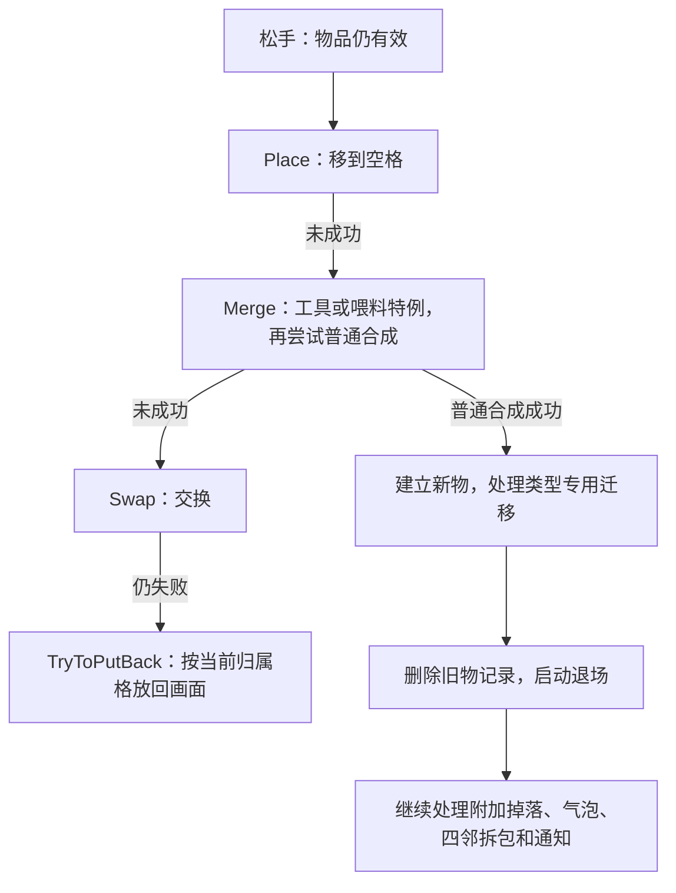

# 02｜Merge Inn 的操作规则与执行流程

**普通合成不等旧物退场动画结束，自动生成却在动画回调中创建产物。** 两者的生效时点不同，不能将整个项目概括成“逻辑与表现已经分离”。以下按实际操作说明检查、数据变化、画面和保存的先后；未另行标注的实现描述均为已确认的静态事实。

## 1. 选择、拖动、合成和生产分别检查权限

“源物品”是玩家拖动的一方，“目标物品”是接收拖入的一方。限制由各入口分别判断，已读范围未见统一的权限汇总。

| 状态 | 选择与拖动 | 接收合成或交换 | 点击生成 |
| --- | --- | --- | --- |
| 正常物品 | 这些状态检查不禁止选择和拖动 | 普通合成仍须匹配种类与等级；可继续检查交换 | 须有对应容器能力 |
| 锁定 isLocked | 选择检查允许；按下与 TryMerge 拒绝它作为拖动源 | 可作为符合条件的普通合成目标，读取实际内容 activeData；不能作为交换目标 | 拒绝 |
| 包裹 boxed | 选择检查拒绝，不能正常启拖 | TryMerge 拒绝包裹目标 | 不走普通容器生产 |
| 气泡 bubble | 锁与包裹检查本身不禁止其移动 | Merge 拒绝带泡源或目标；交换检查本身不排泡，库存路径另有限制 | 拒绝 |

**锁定目标可参与普通合成，不代表能接收所有交互。** 喂料容器的 TryAddFill 会拒绝锁定或带泡的目标。格子输入控制、新手引导、空间、费用和类型规则也可能继续阻止操作；售出、删除与入库的完整权限未全部确认。

GameBoard 按下时检查输入限制并处理旧动画，松手时检查物品仍有效。连续输入主要靠 inputLocked、hasDragging、placing、selected、isAlive 和“是否已有活动动画”等局部条件控制；部分输入入口对 Transform 调用 DOKill，并传入 complete=true。未见统一命令队列或重复请求标识。拖动中的 OnDrag 状态机缺体，不能认定跟手期间只改画面。

## 2. 一次拖放怎样决定结果

FieldInteraction 调用的 `GameState.TryMerge`，实际上依次尝试移动、合成、交换。Merge 内部再根据类型尝试工具或喂料，未成功时才检查普通同级合成。



### 移到空格与交换

**Place 先改占位，再更新存档。** 它清原格，修改 Item.cell 与目标 Cell.item，随后按 ID 更新存档坐标并请求保存；成功后才播放放置动画。存档找不到 ID 时会返回失败，但前面的占位修改已经发生。

复核外层后可以进一步确认：**TryToPutBack 不是回滚。** 它对物品当前的 cell 播放放置动画、重新选择并播音效，没有恢复原格，也没有补回缺失的存档记录。CompleteDrag 的可见处理同样没有补偿这些数据。缺失存档条件下存在一致性风险；该异常在正常游戏中是否可达，以及更外层是否修复，尚未运行验证。

**Swap 先改双方关系并启动动画，再分别更新两份存档坐标。** 它不等待动画结束，也没有将两次坐标更新合并成一个整体成功结果。库存换入路径还会直接由 GameBoard 调用 SetCell、SetItem、AnimatePlacing、ForceUpdateCoordinates，进一步说明写入不只集中在 GameState。

### 普通同级合成

TryMergeRegularItem 要求双方使用同一个合成链对象、Order 相同，且还有下一等级，结果取 `GetItemAt(Order+1)`。这里的底层比较器返回 0 表示相等，比较的是运行对象，不能替换成“链名字一样即可”。喂料容器升阶还附加填充与空格条件。

`MergeTwoItems` 的关键顺序是：

1. 清目标格，AddItem 创建有新 ID 的结果物品并占格。
2. 按类型处理次数或已投入材料。
3. 清源格，通过 MergeWithAnimation 等入口删除两件旧物的存档与活跃记录，播放退场和缩放。
4. 回到 Merge，按条件处理附加掉落、气泡、四邻拆包及通知。

新物出现效果可能在 AddItem 内提前启动；旧物业务记录则在各自退场动画之前删除。准确结论是“合成不等退场结束”，不能写成“所有数据全部修改后才开始任何动画”。增删物品各自请求保存。

**较强推断：同步通知可能暴露中间状态。** AddItem 的 itemAdded 通知早于旧物删除，立即读活跃列表的订阅者可能同时看到新旧物。尚缺完整订阅者和外层防重入控制，不能认定已造成运行错误。

### 拖放工具是另一组专用分支

TryApplyBooster 先调用工具的目标检查，再按 boosterType 分派：wildcard 取目标下一等级并进入合成；divider 调用 DividedItems，建立两件低一级物品；speedup 消耗工具，再通过 IBoosterSpeedup 调整并恢复目标计时。拆分优先使用工具原格；工具没有棋盘格时，先要求有额外空格。

这些工具依靠配置、类型分支和接口协作，并非通用效果注册。目标检查的完整实现、工具适用范围、特殊状态迁移和失败补偿没有全部确认，不把这些分支当作完整道具规则。

## 3. 点击生成器：选择产物、创建、再扣费用

ItemContainer 是物品子类，以物品 ID 保存状态；container、containerPredictable 类型由 AddItem 装配生产、耗尽等回调。它保存 ChargeData、冷却 rechargeTime、activationEnergy、候选 items、weights 和 predefinedItems，同时控制能量图标、时钟与闪光。

### 次数分为轮次和轮内次数

`charges` 是可用轮次，`capacity` 是当前轮内剩余产出数；hasCapacity 检查前者，itemsReadyToSpawn 读取后者。正常扣次路径 ReduceContainerCapacity 先扣 capacity；本轮耗尽后扣 charges，仍有轮次则把 capacity 恢复为配置的一轮容量，再尝试启动补充计时。次数按物品 ID 单独保存；最后一轮耗尽还有引导和回调处理。

**普通容器合成后的次数，并非只把旧次数相加。** CalculateCharge 先将两件旧容器各自的剩余量换算为：

```text
旧容器剩余量 = max(0, 旧每轮容量 × (旧 charges − 1) + 旧 capacity)
S = 两件旧容器剩余量之和
C = 新容器每轮容量（必须大于 0）
S ÷ C 得到整数商 q、余数 r

r > 0：新 charges = q + 2，新 capacity = r
r = 0：新 charges = max(q + 1, 1)，新 capacity = C
```

在有效配置、数值未溢出的条件下，按同一口径换算，新物剩余量等于 **S + C，即旧剩余量再加新配置的一整轮**。例如 S=7、C=5 时，结果为 charges=3、capacity=2，共可产 12 次；这是公式示例，不是实际配置。

这条合成迁移只见于普通 container／containerPredictable 分支，不能套到自动、有限或喂料容器。CalculateCharge 未按新配置总轮数截断；SetupCharges 接收并保存结果，在轮次达到或超过配置值时清计时。缺少实际配置，不能据此断言游戏中一定会超过常规容量上限。

### 有效点击的执行顺序

以下是正常耗能分支；首次选择、引导和特殊免能量分支有所不同。

| 顺序 | 实际处理 |
| --- | --- |
| 1. 检查点选 | ItemContainer.Select 先处理选择显示，读取点击前的 selected，再检查锁、泡、capacity 与 withAnim。 |
| 2. 检查费用 | 按能量模式计算费用，读当前能量并检查引导条件。 |
| 3. 找格、选产物 | 先找落点，再由 SelectItemToSpawn 选择数据。 |
| 4. 创建物品 | 同步调用 onSpawnItem，由 GameState.AddItem 建物、占格、请求保存并设置外观。 |
| 5. 扣费、扣次 | 创建回调返回后 SpendEnergy，再 ReduceContainerCapacity 更新专用存储。 |

锁、气泡或点击条件不满足时，正常生产不继续，但选择画面可能已经变化。能量不足时转向补能／提示；无空格时只提示满盘，不继续选产物、扣费和扣次。特殊免能量回调另有执行路径，不能把所有分支当作同一费用规则。

onSpawnItem 是没有成功结果的 Action 回调。它正常返回不证明产物已创建；抛异常又可能阻断后续扣费。已读链未见把产物、费用、次数统一补偿的机制。

### 预设序列、随机权重与双倍能量

SelectItemToSpawn 的两条路径有明确条件：

- **预设序列**：只有 isFtue 为真、预设数组非空且索引未耗尽时使用。索引按物品 ID 保存，并在返回产物、实际创建之前先推进；该分支直接返回配置，不经过后面的能量倍率转换。仅有 predefinedItems 配置，不代表每个容器都会先走预设段。
- **权重选择**：其余情况累计权重并抽取候选，再交给 SelectItemDataToSpawn。当容器配置允许能量倍率且模式为 Double 时，尝试把候选升一级；找不到下一项时取链末项，并有保留包裹／锁定表示的分支。Disabled 或 Single 保留原候选。

若未命中权重区间，或候选转换返回失败，方法有返回候选列表第一项的兜底；这不等于空数组、负权重等非法配置都安全。随机源、种子和保存方式没有完整定位，也没有证明可确定性回放。创建失败后，已经推进的预设索引是否被补偿仍待验证。

## 4. 冷却与自动生成：恢复可用量不等于产出

### 点击生成器的在线冷却

计时协程减少 rechargeTime，并等待帧末继续。到期先取消计时记录；物品非锁、非泡时调用 `AddCharges(1)` 请求补一轮。**AddCharges 的完整方法体缺失，不能补写它内部如何更新容量与保存。**

此后有两个重要条件：

- 是否调用 ReadyToSpawn，还要经过能量提示组件的一次状态判断，并非到期后无条件调用。该状态方法的含义未完全解析；基类 ReadyToSpawn 的可见职责只是显示能量与闪光，不创建产物。
- 当前 charges 若仍少于配置轮数，会再次进入 StartCapacityTimer；否则隐藏时钟。因此可确认存在继续计时、逐轮补充的控制路径，不能只描述成一次冷却补一次后永久停止。

TryToStartChargeTimer 可见部分检查已有协程、轮次、锁与泡，后续启动部分不完整；StartCapacityTimer 和 RestoreTimer 也缺关键方法体。OnUnpause 会调用 RestoreTimer，Timer 使用 DateTime.Now 计算时间差，但这不足以证明具体离线补时、时钟回拨或满盘处理策略。部分原生时间调用未识别，不能一律解释成 Unity.Time.deltaTime。

### 自动生成器真正产出的时点

ItemAutoSpawnContainer 继承 ItemContainer，增加启动延迟和 spawnTween、sequence、scaleTween。ReadyToSpawn 先调用基类提示，再调用 StartAutoSpawn；启动入口可见“已有活动动画、容量、锁、泡”检查，但后半段截断，Spawn(Cell,bool) 也缺体。代码中的 0.2、0.5 常量不能直接当作真实完整生产周期。

**能够完整确认的是 SpawnItemAfterAnimation 的生产回调：**

1. 缩放序列的完成回调重新找格：手动参数走最近空格，自动参数走周围八邻空格，不固定使用之前看中的落点。
2. 无空格时直接返回；另有一个未识别的全局对象判空检查，然后检查 capacity。
3. 若 onSpawnItem 已绑定，调用它创建物品；接着 ReduceContainerCapacity 扣次。

这段回调没有重新检查锁、泡、isAlive 或对象是否已经换成另一个物品 ID。另一个静态可见分支是：**onSpawnItem 为空时会跳过创建，却仍继续扣次。** 正常创建会绑定回调，清理又会取消动画，因此该分支是否能在实际运行中触发，不能仅凭它存在就认定为缺陷。

完成回调无空位时不扣次数，之后何时重试、暂停后是否补产仍未知。Hide、RemoveTweensCorotines 会调用 SafeKill 并清理画面，但 SafeKill 实现不在包内。

**较强推断：取消方式会影响业务完成。** 若取消使回调不执行，产物与扣次可能都不发生；若取消仍触发完成，或旧回调在对象复用后到达，又需检查身份与当前权限。确切结果取决于取消和外围调度，尚未运行复现。

## 5. 包裹、锁与有限宝箱

### 拆包建立的是一个仍锁定的新物品

boxed 是占格物品类型，boxedItem 保存内容配置。CloneAsBoxed、CloneAsLocked 建立包装／锁定数据，AddItem 再据此装配物品，没有独立的通用效果实例。

成功合成后，TryUnboxing 检查上下左右四邻。发现包裹时，Unboxing 依次读取内容配置、RemoveItem 删除旧包裹的业务记录、清旧格，再在原格 AddItem，明确传入 `isLocked=true`，建立新 ID。**此刻内容物已占格，却仍不能主动拖出；旧包裹画面可以尚未结束。** 包裹与内容不会同时作为两个业务物品占据原格。

显式 Unlock 入口也通过替换实现：取得锁定内容的链和等级，删除旧物，尝试周围拆包，清原格再建新物；完整界面触发来源待验证。锁定物参与普通目标合成时，旧目标被消耗，结果依配置创建，不能承诺结果一定完全解锁。

SetLockedState(false) 本身只改标志后返回，没有统一清锁图片；正常替换流程不等同于只调用这个 setter，不能据此断言显示错误。缺少美术资源，也不能确认蜘蛛网、透明度等外观细节。“包裹转锁定”可类比去掉外层后仍受限制，但“深锁／浅锁”不是该游戏原有状态名。

### 有限宝箱有单独的开启阶段

ItemFiniteContainer 直接继承 ItemMerging，保存次数、掉落配置、timeToUnlock、currentTimeToOpen、openInProgress；AddItem 的 SetupFiniteContainer 分支绑定开启、产出和销毁等回调。

TryOpenChest 防止重复开启，并通过 checkIfOpeningIsLimited 判断限开条件；通过后停止旧计时、启动新计时、标记开启中，再调用并清除一次性开启回调。TimerEndHandler 先调用已绑定的结束通知，再清理时钟、按条件刷新能量提示，清 openInProgress，刷新闪光和其它订阅者。

宝箱有时钟、能量和刷新动画，限制既来自物品，也来自自身开启阶段和限开规则。主记录保存身份与类型，专用次数、开启计时及 Restore 的完整恢复流程缺失；开启后取物、最后一次领取与耗尽替换不能按普通容器推定。

## 6. 气泡：物品状态与额外掉落要分开

气泡标志属于某一件物品，没有独立效果 ID。SetActiveBubble 同时处理 isItBubble、图片、粒子、广告相关订阅、倒计时协程和按物品 ID 保存的剩余时间；关闭时清标志、停协程并将时间归零。主存档保存气泡标志，ProfileStorage 另存时间，启动时可读取恢复。

**合成后的气泡掉落，是额外建立一件带泡物品。** TryToSpawnBubble 用合成结果数据在空格中 AddItem，分配新的物品身份，并非直接把主合成结果包进气泡。此路径会排除 chargeContainer、energyGenerator、chargeContainerPredictable，要求气泡配置存在、新手引导完成、抽取结果符合概率条件，并在适用配置下检查场上气泡上限；最后还必须有落点。工具源分支不会进入这次气泡尝试。实际概率、上限与哪些配置启用，包内资料不足。

倒计时在非暂停状态递减并保存，到期处理链调用 createCoin 与 onBubbleTimerEnd。BubblePaused／Unpaused 可直接改暂停标志，但调用者缺失，不能断言“选中就暂停”。手动／广告移除有订阅入口，完整付费与金币创建链未查全。

气泡可与某些容器数据共存，但这不证明任意类型、锁或包装组合均可达；它会禁止合成和生产，却不在已见移动／交换条件中统一禁止移动。

## 7. 喂料容器：接收材料与同级升阶是两种操作

ItemChargeableContainer 有自身物品 ID，配合 fillData、dropSystem、fillView 和冷却组件工作；AddItem 为此类型绑定回调。Merge 优先尝试 TryMergeChargeableContainer，将源物品 itemCode 交给目标 TryAddFill，不要求材料与目标同链同级。

**喂入一件材料时：**

1. 目标拒绝锁、泡和已经填满的状态。
2. 找到匹配且仍有需求的材料项，将它的剩余需求数减 1。
3. 若因此填满，numberOfFills 为 0 时调用 DestroyItem；否则设置可用次数、更新图片，再尝试冷却或启用容器提示。
4. 保存填充数据并刷新显示；成功后清源格、消耗源材料，向调用者返回原目标数据和对象引用。

因此，“返回原目标”不保证目标仍存活；填满后的销毁分支必须单独考虑。完整产出配置、各轮填充语义和离线恢复尚未确认，不能只用普通 ChargeData 概括它。

**两个同级喂料容器升阶时：** CanMerge2ChargeableContainers 要求双方均未填满，并在消耗旧物前统计空格，要求空格数至少容纳双方已经投入的材料数量；空间不足会拒绝。成功后建立新容器、消耗旧容器，DropFilledItems 按 ItemPack 数量逐件找空格创建材料。这里是把已投材料放回棋盘，不是把旧填充进度直接移给新容器；填充辅助方法和全部异常补偿仍未完整覆盖。

## 8. 删除、回池与售出撤销

### 退出玩法和收回画面不是同一时点

| 阶段 | 已发生的变化 |
| --- | --- |
| RemoveItem | 先 PreDispose，再删存档与活跃列表并请求保存；Cell.item 由调用者另行清理。 |
| 有退场动画 | DestroyWithAnim 标记 isAlive=false，清旧动画与协程，再播放缩放或移动。旧物仍可看见，却已退出活跃棋盘。 |
| 无退场动画 | 直接 ReturnToPool。 |
| 回池清理 | 清 Item.cell、标记不可用并禁用对象；子类在 Hide 等入口清计时、特效、回调与相关数据。 |

清理分散在多个生命周期方法中，不能检查一个方法就认定全部完成。DestroyItemsFromField 缺完整体，因此单件清理不能证明关棋盘时所有回调都被取消。

SetItemData 会重置运行字段并请求图标，RemoteSprite 完成回调持有先前对象引用；可见层未见换绑版本检查，加载器的取消机制又缺失。**较强推断**是迟到图标可能影响复用后的对象，成立与否取决于加载器和完整清理链，尚未证实。

### 售出撤销只保存一件旧物

UndoManager.Save 保存原格、ItemDataSave 和 ItemData，设置 undoID，移除物品并按 GetCostCoins 增加金币。Restore **先检查原格是否为空**：已被占用时直接返回该格，不重建、不扣回金币，也不清 undoID；方法返回 Cell 本身不能当作恢复成功的证明。

原格空闲时，经 UndoItem 用原 ID 重建，按物品类型恢复功能，然后调用 SpendCoins 扣回金币并清 undoID。售出与恢复时分别查询 GetCostCoins，当前结构未单独保存一份成交金额；恢复方法内也未见先检查金币余额。余额不足的最终行为取决于 CoinsSystem，不能补造。

UndoManager 构造时调用 ReleaseSavedID，后者可清此前保留 ID 的相关状态；现有结构不能证明撤销凭据可跨关闭恢复。各类型计时怎样恢复、撤销何时失效、旧 ID 在期间是否被严格保留，仍待验证。这是一套售出恢复机制，不是任意操作都可撤销的历史系统。
