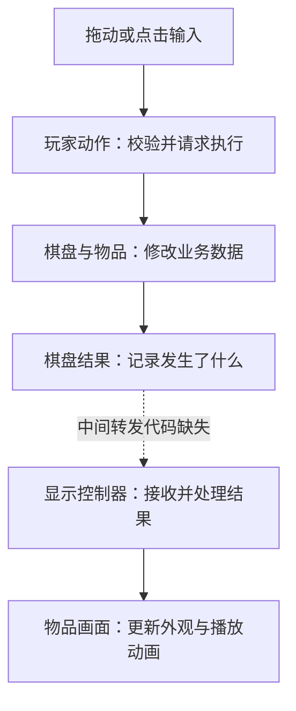
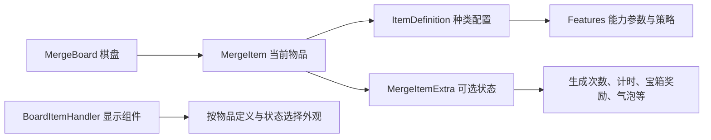

# Merge Mansion：棋盘数据与画面如何配合

> Merge Mansion **26.08.01**｜分析日期 **2026-09-25**｜仅静态分析，未运行游戏。版本据包内提取记录。  
> 仓库根：`/Users/betta/Company/Projects/MergeTwo`；目标目录：`参考项目/MergeMansion_26.08.01_APKPure/`；输出目录：目标目录下 `_分析实现方案/`。源码路径从目标目录起算，链接从本文起算。

这篇先解释三个问题：棋盘和画面谁保存规则数据，一个位置与一个物品有什么区别，以及这些数据怎样恢复。具体功能与操作步骤见 [02_功能扩展与执行流程](02_功能扩展与执行流程.md)。

## 1. 棋盘先变化，画面再呈现变化

**已确认（静态证据）：** 棋盘上的物品由 `MergeBoard` 管理，每个物品是一个 `MergeItem` 对象。它们保存规则所需的数据。画面另外使用 `UnityBoardController` 和 `BoardItemHandler`，负责位置、图片、动画和输入。[E03](04_证据索引.md#e03)、[E07](04_证据索引.md#e07)、[E14](04_证据索引.md#e14)、[E24](04_证据索引.md#e24)

例如，假设两个符合条件的同类物品合成出一个新物品。**这是解释流程的例子，不代表包内某组真实配置。** 业务代码先把目标位置改成结果物品，再清掉来源位置；之后产生一条“发生了合成”的结果。显示代码收到结果，才播放靠拢、合成和消失动画。所以画面上旧物品尚未消失时，它在业务棋盘中已经不再占位。[E10](04_证据索引.md#e10)、[E12](04_证据索引.md#e12)、[E15](04_证据索引.md#e15)



图中概括了已见的分工。输入经执行器到玩家动作的具体调用、结果监听器到显示控制器的转发，均未完整恢复，不能把图当成已贯通运行的调用链。[E13](04_证据索引.md#e13)、[E14](04_证据索引.md#e14)、[E15](04_证据索引.md#e15)

这里说“业务数据是依据”，只是在比较客户端模型与画面，**并不判断服务器最终由谁裁决**。普通合成的关键占位修改已能确认先于动画，但还不能推广成“所有业务都完全不依赖表现”：产出表现处理器里另有发起业务动作的线索，其实际影响待验证。[E12](04_证据索引.md#e12)、[E13](04_证据索引.md#e13)、[E32](04_证据索引.md#e32)

## 2. 棋盘中的格子，首先是一个位置

### 数据怎样摆放

**已确认（静态证据）：** 业务棋盘用一维列表 `BoardItems` 保存物品，空位置记为 `null`；业务坐标通过访问器转换成列表下标。画面则另有二维显示槽位。以下只是结构示意，不表示真实布局或坐标方向。[E03](04_证据索引.md#e03)、[E04](04_证据索引.md#e04)、[E06](04_证据索引.md#e06)

```text
业务棋盘 MergeBoard
  宽度 Width、高度 Height
  物品列表 BoardItems = [物品 A, 空, 物品 B, …]

业务坐标 Coordinate(x, y)
  ├─ 转成列表下标 → 找到当前位置的物品
  └─ 计算显示位置 → 放到画面上的对应位置
```

在所查的棋盘、配置、玩家模型和界面类型中，**没有找到带独立实例编号和行为的运行格子对象**。`BoardCell` 虽然名字里有 Cell，但它是初始布局配置，主要描述放什么物品、初始显隐是什么。它不能证明每个运行格子都是一个 Entity。[E03](04_证据索引.md#e03)、[E04](04_证据索引.md#e04)

空格、范围之外的坐标和被遮挡的物品也要分开：空格没有物品；无效坐标不能按普通格子访问；被遮挡的物品仍存在于棋盘中。某个显隐值带有 `Blocking`，并不意味着这里存在一份固定地块锁数据。[E03](04_证据索引.md#e03)、[E04](04_证据索引.md#e04)、[E20](04_证据索引.md#e20)

### 坐标和画面怎样对应

`GetIndex` 的指令使用棋盘宽度和乘加运算；反向方法也有除法、余数的线索。因此 `index = y × Width + x` 是**较强推断**。但关键指令没有完整转换，工具输出还存在不一致，不能当成已确认公式。是否从 0 开始、原点在哪、坐标朝哪个方向增长，仍待验证。[E02](04_证据索引.md#e02)、[E04](04_证据索引.md#e04)

显示控制器读取边界对象、宽高和比例，计算格子显示位置与拖动范围。玩家拖动物品时，先改变画面位置；松手后的候选位置再换算成业务坐标。没有证据表明合成规则靠两个图片的实时像素距离判断。[E06](04_证据索引.md#e06)、[E14](04_证据索引.md#e14)

**待验证：** 实际棋盘尺寸、洞位、保留位置、多层内容、多格物品，以及格距、锚点和缩放。当前包缺少配置资源，不能凭游戏印象补成“固定 7×9”或某种布局。[E01](04_证据索引.md#e01)、[E03](04_证据索引.md#e03)、[E06](04_证据索引.md#e06)

### 占位、找空格和邻格搜索

物品对象本身没有在所查字段中重复保存业务坐标，因此移动主要修改棋盘列表。但移动后还会更新坐标增益、时间候选缓存和显示槽位；这不是完全没有同步成本。[E03](04_证据索引.md#e03)、[E07](04_证据索引.md#e07)、[E12](04_证据索引.md#e12)、[E19](04_证据索引.md#e19)

落点由 `IPlacement` 一类策略提供。移动到已占用的位置时，`ProcessMove` 可以寻找替代空格；找不到就返回原坐标，不能把“判定结果为 Move”理解成覆盖目标物品。邻格传播使用 `CrossNeighbours`，合成提示另有可见／部分可见候选缓存。各配置究竟选哪种策略、按什么方向搜索和平局时选哪格，尚未确认。[E05](04_证据索引.md#e05)、[E11](04_证据索引.md#e11)、[E12](04_证据索引.md#e12)、[E20](04_证据索引.md#e20)、[E30](04_证据索引.md#e30)

## 3. 同一种物品，不是同一个物品

假设棋盘上有两件完全相同的工具。**这只是身份关系的说明例子。** 两者可以使用同一个 `ItemId`，因为这个值表示“哪一种物品”；但它们是两个不同的 `MergeItem` 对象，各自保存当前状态。把其中一件移走后，原位置还能放另一件物品，所以坐标也不能永久代表原物。[E07](04_证据索引.md#e07)、[E12](04_证据索引.md#e12)

| 要区分的内容 | 代码中对应什么 | 能说明什么 |
| --- | --- | --- |
| 物品种类 | `ItemId`、配置的 `ConfigKey` | 读取同一类物品的定义；不是每次创建分配的唯一编号 |
| 合成链和等级 | `MergeChainDef`、`LevelNumber` | 说明配置关系；等级相同本身不足以证明能合成 |
| 当前运行物品 | `MergeItem` 对象引用 | 移动可以继续用原对象；普通合成可以创建新对象 |
| 当前所在位置 | 棋盘编号与 `Coordinate` | 找到此刻占用该位置的物品；不能保证以后还是原物 |

以上结构已确认；跨存档后怎样按稳定身份重新找到同一个实例，仍待验证。所查 `MergeItem` 等声明没有独立实例 UUID，不等于整个游戏任何系统都没有实例编号。[E03](04_证据索引.md#e03)、[E07](04_证据索引.md#e07)、[E08](04_证据索引.md#e08)、[E11](04_证据索引.md#e11)、[E27](04_证据索引.md#e27)

### 配置说“能做什么”，状态说“现在做到哪里”

`MergeItem` 是普通业务类，不是挂在场景里的 Unity 组件。物品定义保存它具有什么能力、采用什么策略；可选状态容器 `MergeItemExtra` 保存这个实例的进度。显示组件 `BoardItemHandler` 再读取有关数据选择外观。[E07](04_证据索引.md#e07)、[E08](04_证据索引.md#e08)、[E09](04_证据索引.md#e09)、[E24](04_证据索引.md#e24)



这个结构允许同一类物品对象携带多种状态。创建物品时可从定义构造新对象，也可把已有对象放回棋盘；恢复时，`RestoreInternalState` 按能力补建或重新绑定状态。它并不是“每一种生成器或宝箱都必须写一个 Unity 子类”。[E07](04_证据索引.md#e07)、[E09](04_证据索引.md#e09)

普通合成则有明确的状态迁移工作：合成策略经 `Combine`、`ResetStates`、`FlushStorages` 处理各类状态，再建立结果物品。生成、宝箱、次数等状态有各自处理分支，所以新增一种状态后，不能指望它自动得到正确的合成行为。[E10](04_证据索引.md#e10)

这里的 `State` 不一定是“开启／关闭”这样的互斥阶段。例如宝箱状态还保存剩余奖励。表现代码里的 Effect 对象又可能管理显示资源；没有足够证据把所有名为 Effect 的类型都归为纯粒子，或都归为统一业务限制系统。[E08](04_证据索引.md#e08)、[E22](04_证据索引.md#e22)、[E24](04_证据索引.md#e24)、[E29](04_证据索引.md#e29)

## 4. 字段归属：需要查数据放在哪里时再看

下表是字段查阅表。规则代码与显示代码的详细写入顺序见第 02 篇，源码位置见各行证据。

| 内容与实际类型 | 关键数据、归属和写入者 | 身份与保存／表现关系 |
| --- | --- | --- |
| 棋盘 `MergeBoard` | `BoardItems`、宽高、修改时间、合成次数；由增删移合方法修改 | `BoardIdentifier` 标识棋盘；主要字段有保存标记，显示槽另存。[E03](04_证据索引.md#e03)、[E12](04_证据索引.md#e12) |
| 格子位置／布局 `Coordinate`、`BoardCell` | 前者定位运行槽位；后者配置初始种类、显隐与布局 | 所查范围没有独立运行 Cell ID；不把布局配置当运行格子。[E03](04_证据索引.md#e03)、[E04](04_证据索引.md#e04) |
| 物品 `MergeItem` | 定义引用、显隐、创建时间、`extra`；物品、棋盘及扩展方法共同处理 | 对象引用表示当前实例；运行对象也承载可序列化数据。[E07](04_证据索引.md#e07)、[E09](04_证据索引.md#e09)、[E27](04_证据索引.md#e27) |
| 能力配置 `ItemDefinition / Features` | 合成、生成、落点、周期等规则和策略 | 配置键标识种类；显示组件缓存当前物品类型。[E08](04_证据索引.md#e08)、[E24](04_证据索引.md#e24) |
| 物品附加数据 `MergeItemExtra` | 生成、宝箱、气泡和附件等具体状态 | 从属于物品；没有已确认的统一附加效果身份协议。[E09](04_证据索引.md#e09)、[E23](04_证据索引.md#e23)、[E29](04_证据索引.md#e29) |
| 物品遮挡 `ItemVisibility` | 存于物品，由显隐更新方法修改 | 随原物移动并保存；画面另有显隐缓存。[E12](04_证据索引.md#e12)、[E20](04_证据索引.md#e20)、[E24](04_证据索引.md#e24) |
| 棋盘范围的状态与缓存 | 冷却移除／OnFire 时间、棋盘气泡状态；另有坐标增益和时间排序缓存 | 持久事实与临时缓存需要分开；不能全部归为物品 Effect。[E03](04_证据索引.md#e03)、[E19](04_证据索引.md#e19) |
| 画面 `UnityBoardController / BoardItemHandler / Draggable` | 显示槽、资源、交互标志、拖动位置；由显示代码更新 | 物品画面可回收复用；未见持久 View 身份。[E14](04_证据索引.md#e14)、[E24](04_证据索引.md#e24)、[E25](04_证据索引.md#e25) |
| 费用 `Player.Wallet` | 激活动作和售出逻辑处理钱包；界面做预判 | 最终校验不由图片决定；与棋盘修改能否共同恢复待验证。[E13](04_证据索引.md#e13)、[E16](04_证据索引.md#e16)、[E26](04_证据索引.md#e26) |
| 撤销 `ProgressState` | 原物引用、棋盘编号、坐标；售出时记下 | 属于临时撤销记录，不是跨重启的历史栈。[E26](04_证据索引.md#e26) |
| 多棋盘 `PlayerModel / CustomMergeBoardsState` | 主／活动棋盘、棋盘集合、当前活跃棋盘编号 | 多处复用 `MergeBoard`；未全面分析活动特殊规则。[E03](04_证据索引.md#e03)、[E19](04_证据索引.md#e19)、[E31](04_证据索引.md#e31) |
| 存档结构 | 玩家、棋盘、物品模型中的 `MetaMember` 字段；恢复时重绑配置和运行状态 | 没有找到完整独立文件存档层，不能据标记推断写盘成功。[E27](04_证据索引.md#e27) |

## 5. 有保存标记，不等于已经写入文件

**已确认（静态证据）：** 模型带有 `MetaMember` 等序列化标记，也存在“恢复玩家 → 恢复各棋盘 → 恢复物品”的调用。某字段同时有 `NonSerialized`，不能据此否定另一套 Meta 序列化机制。[E03](04_证据索引.md#e03)、[E07](04_证据索引.md#e07)、[E27](04_证据索引.md#e27)

**待验证：** 谁读取文件、何时生成快照、何时写盘、写失败怎样恢复，以及未知状态类型和旧版本数据怎样迁移。部分修复代码存在，仍不足以证明完整保障。因此全文所说“已经生效”，若无特别说明，指内存中的业务修改，不表示已经保存到磁盘。[E27](04_证据索引.md#e27)

## 6. 时间、随机与性能能判断到什么程度

时间事件由棋盘集中收集到排序字典，物品提供下一次事件；并非每张物品图片各自开一个业务计时器。状态里同时有绝对时间和相对进度。随机也有明确的玩家随机状态和生成上下文，部分生成序列另存进度。[E19](04_证据索引.md#e19)、[E28](04_证据索引.md#e28)

这些结构让固定时间、固定随机源的测试**看起来可行（较强推断）**，但还需处理玩家接口、配置、钱包和执行器等依赖。本次没有运行无画面测试，也没有服务端证据，不能据此宣称可确定性重放或证明服务器算法。[E13](04_证据索引.md#e13)、[E28](04_证据索引.md#e28)、[E32](04_证据索引.md#e32)

时间缓存重建、提示搜索和画面对账都可见扫描与缓冲。一次遍历的工作量随项目数增长，是静态成本判断；一次更新还可能处理多个过期事件，所以不能用“一次线性扫描”代表整体性能。同刻事件顺序、离线补算上限、手机耗时和内存分配仍待验证。[E19](04_证据索引.md#e19)、[E30](04_证据索引.md#e30)
