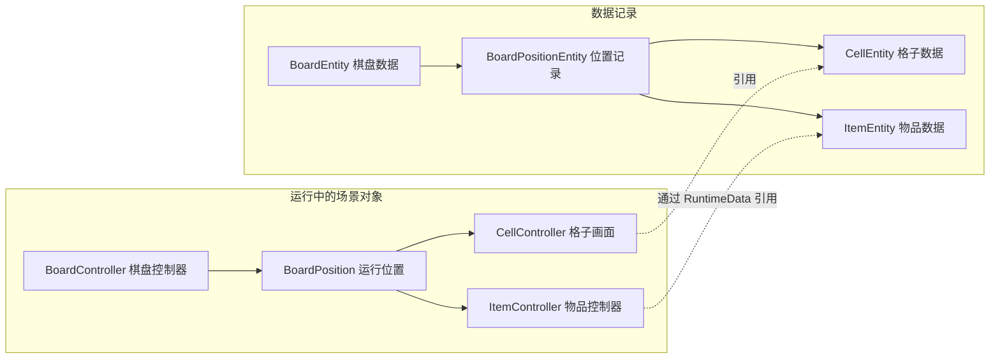

# Merge Studio 4.5.0：棋盘数据、物品和画面怎样配合

**先抓住一个区别：物品的数据记录和屏幕上的物品对象是分开的，但操作它们的代码没有完全分开。** 理解这一点，就能看懂后面的坐标、生成、保存与回收问题。

本文只依据静态材料。下文“已确认”均指**已确认（静态证据）**；推断和待验证问题另行标明。完整出处在 [04](04_证据索引.md)，操作步骤在 [02](02_功能扩展与执行流程.md)。

## 1. 先认识三种对象：记录、配置与控制器

对于一件棋盘物品，先区分三个问题：它现在是什么状态、这一类物品有什么规则、玩家怎样看到和操作它。

| 要回答的问题 | 主要对象 | 可以怎样理解 |
| --- | --- | --- |
| 这件物品在哪，还有多少次数，是否被包住？ | `ItemEntity` | 一件物品的数据记录 |
| 这一类物品的等级、图标、生成规则是什么？ | `BoardItemData` 及其子类 | 种类配置；这里还包含一部分规则方法 |
| 怎样响应点击、拖动、创建图标和播放动画？ | `ItemController` | Unity 场景中的物品控制脚本；它还会直接修改物品数据 |
| 本次运行需要记住哪些临时信息？ | `ItemRuntimeData` | 下次更新时间、旧位置、动画对象和临时输入限制等；内容并不全是纯表现数据 |

例如，生成器的剩余次数在物品记录里；点击后扣次数的动作却发生在物品控制器里。箱子是否存在也是记录中的标记，解除标记和销毁箱子画面的动作则由控制器一起处理。**所以“有单独的数据类”不等于“规则已经独立于画面”。** [物品结构 MS04](04_证据索引.md#ms04)、[扣次数 MS22](04_证据索引.md#ms22)、[拆箱 MS29](04_证据索引.md#ms29)

棋盘也采用类似分工：`BoardEntity` 保存整局数据，`BoardController` 管位置、创建删除和交互，同时持有场景资源。还有少量状态变更写在 ItemEntity 方法里，并会调用控制器刷新状态。因此可见的写入者有三类：棋盘控制器、物品控制器、物品记录自身的方法。[MS02](04_证据索引.md#ms02)、[MS24](04_证据索引.md#ms24)、[MS28](04_证据索引.md#ms28)

这些结论描述的是客户端内存里的状态管理。资料中没有服务端实现，不能据此判断整个游戏是否由客户端决定最终结果。

## 2. 格子和物品分别保存什么

**格子记录“这个位置怎样”，物品记录“放在这里的东西怎样”。** 未解锁的地块属于格子；箱子外壳、Jelly 和气泡属于物品。格子还可以保存尚未展开的内容描述，例如将来解锁后出现什么物品，以及它是否带箱子。[MS03–MS04](04_证据索引.md#ms03)

每个位置在代码中有两种记录：一份指向数据，一份指向正在显示的 Unity 对象。



这是对象关系图，不是一次操作的调用顺序。两份位置记录都存在的事实已确认；它们如何更新，下一节会具体说明。[MS02](04_证据索引.md#ms02)

### 格子有没有自己的身份

格子有数据、坐标和独立画面对象，因此并非一张背景图上的装饰。但保留类型中没有看到独立实例编号、动态能力集合或完整的领域实体生命周期。将它称为**轻量格子数据＋格子画面**更准确，不必因为类型名叫 CellEntity，就套入你的整套 Entity 定义。[MS03](04_证据索引.md#ms03)

### 怎样区分两件同种物品

`SetID` 和 `Level` 表示物品所属合成链与等级。两件物品可以有相同的这两个值，它们不能单独标识“到底是哪一件”。

已确认：保留的 ItemEntity 字段没有稳定实例 ID；`BoardEntity.IsItemExist` 会比较数据对象的引用，移动时则修改原记录的坐标。**较强推断**：核心棋盘主要用“对象引用＋当前位置”识别活动物品。工厂和其它容器的完整实现没有恢复，所以不能断言整个游戏没有其它 ID。售出前的旧坐标字段也不能代替稳定的撤销身份。[MS04](04_证据索引.md#ms04)、[MS08–MS10](04_证据索引.md#ms08)、[MS35](04_证据索引.md#ms35)

### 空格、锁格和覆盖物怎样区别

| 情况 | 当前材料中能确认的表示 |
| --- | --- |
| 可放入物品的空格 | 运行位置没有 Item，且格子的 IsLocked 为 false |
| 存档中的空物品 | Item 为 null，或 SetID 与 Level 同时为零 |
| 尚未解锁的地块 | CellEntity.IsLocked；锁留在格子上 |
| 被包住或受限的物品 | ItemEntity 上的 IsBoxed、IsJelly、IsBubbled；它们属于物品记录 |

每个位置只有一个主要 Item 引用。当前材料不足以确认地图空洞、临时预留格、多格物品或任意多层覆盖；输入暂时被锁住，也不等于另有一套格子预约机制。[MS03–MS04](04_证据索引.md#ms03)、[MS08](04_证据索引.md#ms08)、[MS11](04_证据索引.md#ms11)

## 3. 移动物品时，哪些记录必须一起改变

把一次移动想成“从 A 格移到 B 格”，这里的 A、B 只是说明用的两个位置。程序至少要同步三处：

1. 物品自己的 `BoardIndex` 要改成 B。
2. 保存用的位置记录要变成“A 没有这件物品，B 有这件物品”。
3. 运行中的位置记录也要作同样修改，画面和后续点击才能找到正确对象。

此外，还有按合成链查找物品的辅助索引，需要同步增删。这个索引用于加快查询，不能自己成为另一套物品事实。[MS09–MS11](04_证据索引.md#ms09)

已确认的职责分工是：`SetItemOnBoard` 写两种位置记录；`BoardPositionEntity.SetItem` 还更新链查询索引，**但不修改物品自己的坐标**。因此移动调用者必须先改坐标，再清旧格、放新格。完整顺序与保存标志见 [02 的移动流程](02_功能扩展与执行流程.md#42-拖拽移动换位与合成)。

这解释了为什么一致性值得关注：如果一件物品说自己在 B，但位置表仍把它放在 A，后续查找就可能互相矛盾。**这是由数据关系说明的风险，不是已复现的游戏错误。** 目前还缺事件分发、保存复制和异常补偿的完整实现，不能断言正常运行会丢物或保存一半状态。

## 4. 坐标和画面位置如何对应

棋盘主要使用一维 List 保存位置。已恢复的转换公式是：

```text
列表下标 = x × RowCount + y
```

**说明性例子**：若 RowCount=3，则 `(0,0)→0`、`(0,2)→2`、`(1,0)→3`。这只是帮助理解公式，不是该版本棋盘的实际尺寸。List 下标从零开始，但实际坐标范围、屏幕朝向和空洞设置还需要配置实例确认。[MS06](04_证据索引.md#ms06)；[原生实现](../code/Ghidra/ghidra_data_pseudocode.c) L18982–19002。

显示位置并非在已读路径中单靠这个公式算出。`GetWorldPosition` 先查位置，再拿到格子的画面对象，经两个外部调用得到坐标。**较强推断**：这两个调用是在取 Transform 和位置；具体是世界位置还是局部位置的符号未恢复。可以确定的是，它依赖 CellController，拖放目标也依赖场景碰撞查询。[MS07](04_证据索引.md#ms07)、[MS15–MS16](04_证据索引.md#ms15)

BoardData 中有行列、初始位置、默认缩放和 Jelly 缩放；`GetFirstCellPosition` 的常量对应 `(-3, 3.5)`。这些仍不足以恢复整套间距、锚点或父级变换。配置、Prefab 和实际美术资源均未保留，不能按这个常量推算完整画面。[MS05–MS07](04_证据索引.md#ms05)

查空格主要靠扫描位置列表，查产出位置还会排序；比较函数未恢复，无法说明“最近”究竟按什么距离、平局时先选哪里。小棋盘这样实现可能已经够用，但本次没有性能实测。具体查询和静态复杂度见末尾的 [查询表](#查询方式与静态成本)。

## 5. 保存请求到哪里为止

“数据已经改了”和“重新启动后还能恢复”之间，至少隔着几个不同步骤：

```text
修改内存中的棋盘
  → 发出保存请求
  → 上层取得要保存的数据
  → 写入文件并确认成功
```

前两步有直接证据：多种操作会修改记录并请求 SaveBoard。请求经过 SceneController 转交给 MasterController。但后面的复制、序列化和文件写入方法没有恢复，**不能确认它取得的是完整快照，也不能确认请求返回就代表磁盘保存成功**。[MS36](04_证据索引.md#ms36)

读取方向则可见 DataSaveWrapper 取字符串、可选解压、JSON 反序列化。完整载入顺序尚有缺口，详见 [02 的载入流程](02_功能扩展与执行流程.md#41-载入棋盘)。[MS12](04_证据索引.md#ms12)

物品记录不仅存种类，还存容量、阶段、气泡和充能截止时间，以及入库／商店剩余时间。临时运行数据是否全部保存不能只看 `[Serializable]` 标记，仍需实际保存调用确认。[MS04](04_证据索引.md#ms04)、[MS27](04_证据索引.md#ms27)

主棋盘与活动棋盘会共用控制器，在位置列表和能量入口上选择不同记录。这说明代码有复用，但不能证明多个棋盘实例完全互不影响。本报告只把它作为依赖关系说明，不扩展你的活动或订单需求。[MS39](04_证据索引.md#ms39)

## 6. 可测试性

已确认的依赖包括 Unity 控制器、场景命中、全局时间和经济服务。因此现有调用链不能直接作为无画面规则核心运行；包内也没有测试工程，未找到完整的可替换时钟、随机和保存接口。[MS07](04_证据索引.md#ms07)、[MS22](04_证据索引.md#ms22)、[MS25](04_证据索引.md#ms25)、[MS36](04_证据索引.md#ms36)

**较强推断**：坐标转换、下一等级、容量计算和权限判断可以抽出来测试。需要改造的是它们的输入和依赖，而不只是把类改名为 Logic。与你方案的取舍比较见 [03](03_借鉴评估与待验证问题.md)。

## 查阅资料：字段和查询方式

下面两张表保留实现细节，适合查字段或继续研究时使用；顺读到这里已能理解主要结构。

### 字段归属表

| 层或概念 | 实际类型、关键字段 | 归属及用途 | 身份与限制 | 证据 |
| --- | --- | --- | --- | --- |
| 棋盘存档根 | `BoardEntity.Positions/User/Inventory/OpenedCloudLevels/LastSaveTimestamp` | 整局数据；还包含外围系统记录 | 不是不可变快照类；多个系统共用的可写对象图 | MS02、MS36 |
| 棋盘运行容器 | `BoardController._positions/_spawnerList/SelectedPosition` | 位置表、生成器列表、选中状态 | Controller 引用；还持有活动棋盘及 Unity 资源 | MS02 |
| 持久位置记录 | `BoardPositionEntity.Index/Cell/Item` | `BoardEntity.Positions` 或活动棋盘的位置列表 | 坐标和列表槽位；无另一个位置实例 ID 字段 | MS02、MS09、MS39 |
| 运行位置记录 | `BoardPosition.Index/Cell/Item` | `_positions`；引用 CellController、ItemController | 与持久位置表并存，需同步 | MS02、MS10–MS11 |
| 格子数据 | `CellEntity.IsLocked/UnlockLevel/BoardIndex/LockedItemSetID/LockedItemLevel/IsItemLocked/IsItemBoxed` | 地格锁及未展开内容的描述 | 有数据；未见独立 ID、能力集合或实体管理器注册 | MS03、MS31 |
| 格子表现 | `CellController.CellEntity`、碰撞器、SpriteRenderer、动画 | 可视格子和命中、背景反馈 | MonoBehaviour；不是只有数据槽，也不是我方完整 Entity | MS03 |
| 物品记录 | `ItemEntity.BoardIndex/SetID/Level/CurrentCapacity` 及各种状态 | 被位置或其它容器引用，运行数据也指向它 | 保留字段里无稳定实例 ID；种类 ID 不等于实例身份 | MS04、MS09 |
| 附加限制 | `ItemEntity.IsJelly/IsBubbled/IsBoxed`，气泡期限、拆箱等级 | 附在物品记录；不另占棋盘位置 | 固定布尔字段，未见每个限制的独立 ID／层数集合 | MS04、MS19、MS29–MS30 |
| 业务阶段 | `ChestState`、`SpawnerState`、`SkippedState` | ItemEntity | 枚举；容量和时间仍是另外的事实 | MS24、MS28 |
| 运行状态 | `ItemRuntimeData.NextSpawnerUpdateMs/UpdateStepMs/AutoOfflineCount`、各种锁 | ItemController | 混合调度与表现状态；`[Serializable]` 本身不证明被实际保存 | MS04、MS25–MS27 |
| 种类及链配置 | `BoardItemData.SetID/Level/Image`；`BoardItemSetData.Items/ItemSpawnedByLastLevel` | ScriptableObject＋配置适配器 | `SetID + Level` 定位类型／等级；资源实例未保留 | MS05、MS17、MS20 |
| 物品表现与模块 | `ItemController`、`ItemControllerModuleBase` 子模块、模块工厂 | 图标、锁、箱、气泡等 | Controller 不只是 View；模块工厂不能证明领域组件装配 | MS14、MS29–MS30 |

### 查询方式与静态成本

| 查询 | 可见实现 | 静态成本及限制 | 证据 |
| --- | --- | --- | --- |
| 坐标查位置 | 坐标转一维下标，List 索引 | O(1)；正常合法索引范围的前提由调用者承担 | MS06 |
| 全盘空位 | 扫 `_positions`，过滤空 Item 和未锁 Cell，构造 List | O(N)＋新列表；没有实测耗时 | MS08 |
| 产出坐标候选 | 空格列表→投影→排序 | 典型 O(N + K log K)；比较器未恢复，不能写“顺时针／曼哈顿最近” | MS08 |
| 拖拽匹配对象 | Movable 碰撞集合、筛选、排序、取候选 | 依赖场景命中；比较器和部分泛型恢复不全 | MS15–MS16 |
| 邻格拆箱 | 扫 `_positions`，比较同 x／同 y 与另一轴差值 1 | O(N)；可确认四邻接判定，但这是活动拆箱路径 | MS32 |
| 自动产出邻位 | 调用 `GetAvailableNeighborCellPositions` | 函数边界失真，搜索次序及复杂度不定 | MS08、MS26 |
| 链物品查询 | SetItem／Clear 同步调用 ItemChainManager 加／删索引 | 缓存存在；整个索引一致性、容器编码没有完整审计 | MS09 |

上述 O(N) 等表示随格子数量增长的大致工作量，是静态估计，不是实际耗时；生成器列表的存在也不能证明使用了到期优先队列。

## 分析范围与文件位置

目标：Merge Studio 4.5.0，版本依据为包内记录；分析日期：2026-09-25。仓库根 `/Users/betta/Company/Projects/MergeTwo`；目标根 `参考项目/MergeStudio_4.5.0_APKPure/`；输出根为目标下 `_分析实现方案/`。行内源码路径从目标根起算，链接从本文起算。本次未运行游戏；证据范围见 [04](04_证据索引.md#使用约定与覆盖范围)。
