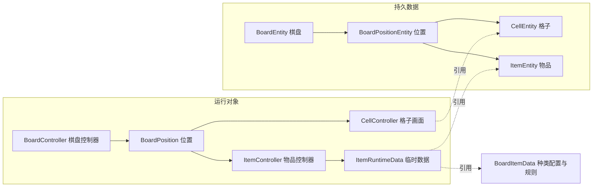

# 01｜Merge Studio 4.5.0：架构与数据模型

**这个项目把物品数据和场景对象分开保存，但仍由 Unity 控制器同时处理规则、数据修改和画面。** 它有明确的数据归属，却没有在已恢复路径中形成可直接脱离 Unity 运行的规则核心。

本文及后续两篇以 2026-09-26 的复核结果为准。“已确认”指**已确认（静态证据）**；“较强推断”表示有上下文支持但缺关键实现；“待验证”表示当前材料不能回答。本次未运行游戏，也未实测性能或复现故障。

## 1. 材料能还原到什么程度

这是 Unity 的 IL2CPP 项目。包内来源记录指向 `Merge+Studio_+Fashion+Makeover_4.5.0_APKPure.xapk`，原生库为 ARM32 `libil2cpp.so`，metadata v31；使用 AssetRipper 1.3.14.0、Il2CppDumper 和 Ghidra 12.1.2 提取。版本依据是这些记录，裁剪目录没有原安装包可供独立复验。

| 材料 | 保留数量 | 本次如何使用 |
| --- | --- | --- |
| AssetRipper 的 C# 文件 | 218 个 | 确认类、接口和字段；空方法、`return false`、`default` 等占位不能证明实际行为 |
| Il2CppDumper 类型块 | 671 个 | 用字段偏移、方法地址和接口顺序核对原生代码中的访问与调用 |
| Ghidra 的 C 风格伪代码 | 581 个方法，分布在三个 `.c` 文件 | 还原可信范围内的分支、写入与调用顺序；不是原作者手写的 C，也不是恢复完整的 C# |
| 方法索引 | 3642 项 | 其中 2962 项在本目录仅有签名或占位，另有 99 项反编译结果因范围筛选被省略 |

本目录没有恢复原始 C# 方法体。例如，C# 导出的默认 `BoardItemData.IsMergeable` 写着占位 `false`，三个原生重载却返回 `true`。本次分析用类型和偏移辨认数据，再用原生方法判断行为，不根据占位代码作结论。未恢复名称的调用若只能按上下文解释，仍标为推断。

已复核棋盘和物品模型、坐标查询、移动与合成入口、手动和自动产出、补容量、暂停恢复、限制解除、删除撤销及保存转发。未逐行审计全部方法。载入、合成和放置动画的部分异步执行体缺失；数据工厂、回收、保存工作线程多只有结构。配置实例、Prefab、材质和动画资源没有保留，全部特殊物品、MiniBoard 和外围系统不在完整审计范围内。

## 2. 数据、配置和场景对象的分工

一件物品至少涉及三类职责：`ItemEntity` 记录它当前是什么状态，`BoardItemData` 定义这一类物品的配置和部分规则，`ItemController` 在场景中响应输入、修改数据并更新画面。`ItemRuntimeData` 则把记录、配置和临时运行信息连在一起。



这是对象关系，箭头不表示一次操作的执行顺序。各项事实的归属如下。

| 实际类型 | 关键数据与用途 | 身份和边界 |
| --- | --- | --- |
| `BoardEntity` | `Positions`、`User`、`Inventory`、`OpenedCloudLevels`、`LastSaveTimestamp` | 可写的整局对象图，还包含外围系统记录；并非不可变快照 |
| `BoardController` | `_positions`、`_spawnerList`、`SelectedPosition`，以及场景资源和主盘／活动盘引用 | 负责交互、放置、删除和运行调度，也直接改业务数据 |
| `BoardPositionEntity` | `Index`、`Cell`、`Item` | 保存用的位置记录，凭坐标和列表位置定位；未见另一个位置实例 ID |
| `BoardPosition` | `Index`、`CellController`、`ItemController` | 运行位置，和保存用位置表并存，需要同步 |
| `CellEntity` | `BoardIndex`、`IsLocked`、`UnlockLevel`；`LockedItemSetID/LockedItemLevel`、`IsItemLocked/IsItemBoxed` | 地格状态及锁区待展开内容；地格锁固定在位置上 |
| `CellController` | Cell 数据引用、碰撞器、SpriteRenderer、动画 | 每格有自己的画面和命中对象 |
| `ItemEntity` | `BoardIndex`、`SetID`、`Level`、`CurrentCapacity`、`ChargeAmount`、充能期限、`ChestState/SpawnerState/SkippedState` 和限制标记 | 物品当前事实；保留字段中没有稳定实例 ID |
| Item 上的限制 | `IsBoxed/UnboxLevel`、`IsJelly`、`IsBubbled/BubbleFinishAtTick/BubbleSpawnTrigger` | 固定字段，不另占格；未见每个限制的独立实例、来源或层数集合 |
| Item 上的进度与迁移数据 | `CurrentTaskIndex`、选择箱记录、奖励历史、`InventoryRemainingChargingTick`、`ShopRemainingChargingTick` | 特殊物品进度和容器迁移所需数据；不能仅凭字段存在推断完整迁移规则 |
| `ItemRuntimeData` | Entity／配置引用、`NextSpawnerUpdateMs/UpdateStepMs/AutoOfflineCount`、旧位置、价格、Tween、Animator、运行锁 | 同时包含业务调度和表现信息；可序列化标记不证明它被完整保存 |
| `BoardItemData`、`BoardItemSetData` | 链 ID、等级、图标；链的 `Items/ItemSpawnedByLastLevel` | `SetID + Level` 定位种类与等级；ScriptableObject 配置还带行为方法 |
| `ItemController` 及外观模块 | 图标、Box、Lock、Bubble、粒子和动画 | 控制器并非纯 View；模块工厂不能直接等同于领域能力系统 |

已确认的业务写入者不止一个：棋盘控制器修改占位，物品控制器扣容量、解除限制，ItemEntity 的状态方法也写字段并反调控制器刷新。这里说的是客户端内存管理；本目录没有服务端实现，不能判断整个游戏的最终权威归属。

## 3. 格子、物品身份与“空”的含义

### 格子是轻量记录，有独立画面

格子有坐标、地块数据和生命周期相关的场景对象，因此不是背景上的装饰。但保留类型中没有独立实例编号、动态能力集合或完整的领域实体注册。称为“轻量格子数据＋格子画面”比直接套用完整 Entity 更准确。

每个位置只有一个主要 Item 引用。物品外壳、Jelly、气泡放在物品记录中；锁区尚未展开的物品描述放在 Cell 中。没有足够证据确认地图空洞、临时预留格、多格物品或任意覆盖层堆叠；输入被临时锁住也不等于格子被预约。

### 同种物品怎样区分

`SetID` 和 `Level` 是种类信息，不能区分两件同种同级物品。移动会修改原 ItemEntity 的坐标，`BoardEntity.IsItemExist` 则用对象引用比较。**较强推断**：已读核心路径主要用对象引用和位置辨认活动物品；工厂及其它容器未恢复完整，不能推广为整个游戏都没有其它 ID。售出前的旧坐标也不能替代稳定的撤销身份。

尤其要注意，`IsItemExist` 不是无条件检查引用是否出现在棋盘中：它跳过锁格、空记录，以及带 Jelly、Bubble 或 Box 的非活动物品。因此返回 `false` 也可能表示“被查询条件排除”，不等于该物品已被删除。

### 三种查询有不同条件

| 查询 | 已确认条件 | 含义 |
| --- | --- | --- |
| `IsItemNull` | Item 为 null，或 `SetID == 0 && Level == 0` | 数据层的空物品判定；不是任一字段为零就算空 |
| `IsEmptyCell` | Cell 未锁，且满足上述空物品条件 | 没有物品的锁格仍不算可用空格 |
| `GetAvailableCells` | 运行位置上的 Unity Item 对象为空，且 Cell 未锁 | 面向运行对象查可用格，不能与存档哨兵值判定混用 |

## 4. 占位为什么需要同步

把物品从 A 移到 B，至少要同步物品自己的 `BoardIndex`、保存用的位置表和运行位置表；另外还要更新按合成链查找的辅助索引。

已确认：`SetItemOnBoard` 写运行和持久位置；`BoardPositionEntity.SetItem` 写 Item 引用并加入 `ItemChainManager` 查询索引，但不改 ItemEntity 的坐标。移动调用者因此先改物品坐标，再清旧位置、写新位置。工厂创建新物时如何赋坐标，需要各自的方法体确认。

`ClearCell` 清运行槽和持久位置；数据位置的 `Clear` 删除链索引并清 Item，同时清 `LockedItemSetID/LockedItemLevel`。这不等于重置整个 Cell：该局部方法没有清 `IsLocked/IsItemLocked/IsItemBoxed`。普通删除还受 `resetInfo` 参数影响，不能把所有清理入口视为同一行为。

多份记录是实际结构，部分写入之间能否被事件或保存观察，则尚未确认。**较强推断的风险**是某个环节失败后产生坐标、占位或索引不一致；本次没有证据把这种风险写成已发生的丢物故障。

## 5. 坐标、显示位置与查询成本

`BoardData.GetListPosition` 的已恢复公式为：

```text
列表下标 = x × RowCount + y
```

说明性例子：假设 RowCount 为 3，则 `(0,0)→0`、`(0,2)→2`、`(1,0)→3`。这不是该版本的实际尺寸。List 下标从零开始；实际坐标范围、屏幕方向和空洞配置尚未确认，也不能把这个公式当作其它坐标编码方法的实现。

`GetWorldPosition` 先取对应的 CellController，再经两个未命名调用取得位置。**较强推断**是读取 Transform 及其位置，依据是对象类型、调用形态和返回坐标；具体读世界还是局部属性尚未恢复。能确认的是这条路径依赖场景对象，拖放候选也来自碰撞查询。

BoardData 有行列、初始位置、默认缩放和 Jelly 缩放；`GetFirstCellPosition` 的常量对应 `(-3, 3.5)`。缺少配置和 Prefab，仍不能恢复完整间距、锚点、父级缩放与屏幕布局。

| 查询 | 可见方式 | 成本与限制 |
| --- | --- | --- |
| 坐标查位置 | 换算后取 List 项 | 合法索引下为 O(1)；完整越界保护未审计 |
| 全盘可用格 | 扫运行位置并新建列表 | O(N)，N 为格子数 |
| 产出落点 | 可用格投影后排序 | 通常为 O(N + K log K)，K 为候选数；比较器缺失，不能断言最近距离或平局顺序 |
| 拖拽目标 | 碰撞集合筛选、排序、取候选 | 依赖场景，部分闭包和泛型未恢复 |
| 活动邻格拆箱 | 扫位置，判断同 x 或同 y、另一轴差 1 | O(N)，可确认四邻接；不是主棋盘所有消耗事件的通用机制 |
| 自动生成的邻位 | 调 `GetAvailableNeighborCellPositions` | 函数边界失真，顺序和复杂度未确认 |
| 链物品查询 | 放置／清理时增删辅助索引 | 缓存存在；完整容器编码和一致性未审完 |

以上是静态工作量估计，没有实测耗时。存在生成器列表也不能证明调度使用了到期优先队列。

## 6. 保存、复用与独立测试边界

保存可确认到如下位置：

```text
修改内存记录 → 请求 SaveBoard → SceneController 转交 MasterController
                                      ↓
                             复制、序列化、写文件：方法体缺失
```

因此“请求保存”不等于取得不可变快照，更不等于已经成功写入磁盘。读取方向可见 DataSaveWrapper 取字符串、可选解压和 JSON 反序列化；坏档、未知类型、配置版本迁移的完整处理仍待验证，不能因载入链不全就认定没有兼容措施。

容量、阶段、绝对期限及入库／商店剩余时间都有记录字段。它们如何在不同容器间暂停、恢复、转换，仍需调用链确认。保存边界不能只按字段是否带可序列化标记来判断。

主盘与活动盘的一些操作共用 BoardController，并根据活动标志选择位置记录和能量来源。这是条件式复用，不证明多个棋盘完全隔离；另有 MiniBoard 类型，本次未把其完整规则归入同一模型。活动、经济和其它外围字段只用于解释耦合，不扩展我们的产品范围。

现有路径依赖 Unity 对象、碰撞、全局时间和经济服务，不能直接作为无画面规则核心运行。包内没有测试工程，也未定位完整的时钟、随机和保存替换接口。**较强推断**：坐标转换、下一等级、容量和局部权限判断适合提取后测试，但需要隔离依赖，不能只靠重命名类完成。

本次目标目录为 `/Users/betta/Company/Projects/MergeTwo/参考项目/MergeStudio_4.5.0_APKPure/`，输出仅位于其 `_分析实现方案/`。原代码、资源记录和共享设计文档保持只读。复核时 892 个代码文件的 SHA-256 全部与随包清单一致；这只核对材料完整性，不代表验证了原安装包或运行行为。
