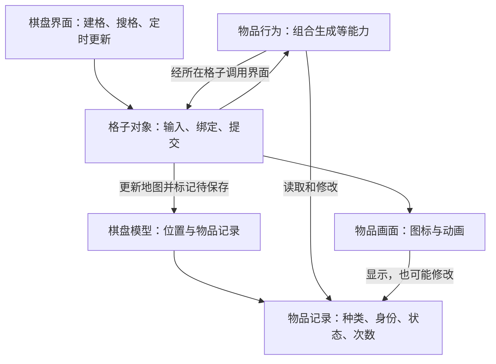

# 01 架构与数据模型

**Merge Cooking 1.59.0｜复核日期：2026-09-26。** 本报告依据恢复代码说明项目自身的实现，再评价它对我们设计的意义。版本来自目录名，尚无原包元数据验证。

材料包括 175 份恢复 C#（可读代码）和 175 份同源 IL（中间指令）；IL 文件头标注由 Mono.Cecil 从解密后的 CDPH 方法体生成。可核对分支、字段写入和异步流程，但仍有缺引用、乱码和空方法；空方法不证明原游戏没有实现。原包／DLL、完整提取记录、配置实例及 Prefab 等资源缺失，因此不能独立验证提取完整性，也不能从代码推断所有分支都已上线。

正文直接描述的代码行为属于**已确认（静态证据）**；适用性或故障可能性标为**较强推断**，缺关键材料的标为**待验证**。本次没有运行、编译或性能测试。已深入复核核心棋盘、生成、计时、限制、回收与保存；器具、其它工具、背包、网络和活动仅覆盖与这些结论相关的路径，未逐文件通读全包。

## 1. 一件物品分成三部分，但它们还没有完全独立

这个项目用三种对象共同表示一件物品：

| 部分 | 负责什么 | 代码对应 |
| --- | --- | --- |
| 物品记录（VO） | 记住它是什么、当前状态、剩余次数、计时和待产出内容 | GameGoodsVo，后文简称“记录” |
| 物品行为与能力 | 执行点击产出、冷却等规则，并保存它所在格子的引用 | GameGoodsBase 及其 Attribute 能力 |
| 物品画面（View） | 显示图标、覆盖物和动画，响应部分输入 | GameLevelItem，即物品 View |

关键在于：**行为对象和画面通常引用同一份记录，而不是各自保存一份副本。** 所以界面代码修改状态时，改的就是规则随后读取的状态。

棋盘和格子也参与执行。棋盘界面负责创建格子、搜索空位、定时更新；格子负责拖放、绑定物品和发起保存。这里的“标脏”指记下数据需要保存，不代表已经写入磁盘。下图保留主要关系，省略钱包、图鉴等外围依赖。



这是一种职责有所划分、执行仍互相依赖的结构。能力对象是普通 C# 类，但它会直接调用 Unity 格子和画面；单凭“有能力组件”不能认定它已具备独立运行的规则核心。

## 2. 谁保存数据，谁可以改数据

棋盘模型保存两张主要表：一张记录“哪个位置放着哪个物品”，另一张记录“哪个位置已经解锁”。运行时，棋盘界面还有一张表，用位置编号找到实际的格子对象。

因此，需要保持一致的不只是物品记录本身，还包括这些关系：模型里的位置、格子当前持有的物品、物品记住的所在格子、画面当前绑定的物品。移动或交换要一起更新这些关系；拥有数量、生成器编号等附带记录也要同步。

一个容易误解的细节是：`GetGameLevelMap()` 默认虽然返回一张新字典，但字典里的物品记录仍是原对象。改返回值中的某个物品，也会改原记录。它不能直接作为撤销或后台保存所需的独立快照。

某些看似查询或刷新的接口也会写数据。例如，查询免冷却时长可能更新标志，重载时查询地块是否解锁可能顺便补写解锁，而界面的 `UpdateItemState` 直接改物品状态。**较强推断**：要限制业务写入时点，需要梳理这些实际调用，不能只根据方法名划分读写。

## 3. 棋盘如何表示位置和空间

### 3.1 默认是九行七列，用位置编号查找

行和列都从 1 开始，格子编号为 `行 × 10 + 列`。例如，11 是第一行第一列，23 是第二行第三列；它不是连续的 0～62 下标。

```text
说明性示例，使用代码中的默认布局：
        第1列 第2列 第3列 … 第7列
第1行     11    12    13  …   17
第2行     21    22    23  …   27
 …
第9行     91    92    93  …   97
```

画面上列向右增加，行向下增加。格子间距默认横竖都是 86，物品尺寸初始值为 85；局部位置计算为：

```text
x = (列 - 1) × GridWidth  + InitialPositionX
y = -(行 - 1) × GridHeight + InitialPositionY
```

两个初始位置属性默认返回 0，原点属于棋盘父节点。最终位置还受屏幕适配、锚点和资源影响，缺少 Prefab（预先制作的界面资源模板），实际显示效果待验证。`GridId` 表示位置，另一个 `GridIndex` 主要用于底色交错。

拖放目标有两种来源。启用合成吸附且不在引导中时，先从**符合合成条件的物品**里选最近目标：跳过未解锁格、工作中物品和不能合成的器具，检查下一等级配置，再比较画面距离。默认半径约为格宽的 0.75 倍，同距离取较小编号。没有合适的吸附目标，才使用指针射线命中的格子或物品。因此，它不是把所有移动、交换都吸到最近格；普通落子仍依赖画面命中。

### 3.2 “看起来空着”不一定能够放物品

| 情况 | 数据如何表示 | 是否可当作空位 |
| --- | --- | --- |
| 有效空格 | 格子存在，物品记录为空或物品编号无效 | 还要检查是否解锁、是否被多格物品占用 |
| 无效位置 | 运行格子表中找不到该编号 | 不可使用 |
| 未解锁地块 | 位置解锁记录不满足 | 不可使用，即使没有物品 |
| 多格物品的其它占用格 | 指向保存物品记录的主格 | 已被占用，只是这里不重复保存物品 |
| 被箱壳等覆盖的物品 | 物品记录仍在，状态为覆盖中 | 不是空格 |
| 可堆叠数量 | 数量保存在单个物品内 | 不等于一格中保存多个独立物品层 |

多格物品只在主格保存一个物品身份，其它格保存“归哪个主格占用”的关系。形状配置记录相对行列偏移，实际位置按 `主格编号 + 行偏移×10 + 列偏移` 计算；宽高由偏移范围确定。加载时重建这些关系，换物时先清除旧关系。

目前拖拽入口禁止拖动带形状配置的物品，普通交换也拒绝任一方为多格物品。因此，代码支持多格占位，不等于支持多格物品自由移动。

**格子在数据层与运行时有不同职责。** 持久数据层更接近“一个位置和它的解锁属性”；运行时却是带输入、物品协调和画面的 Unity 对象。没有找到独立 Cell 实例编号，以及与它分开的 CellView 模型。

### 3.3 找空位并不只有一种规则

普通“附近空位”会先扫描全盘。传入产物种类时，它可能优先把搜索中心改到盘上第一个同种、可匹配物品附近，再选择距离最小的位置。先比横竖距离之和，再比横竖距离的较大值；仍相同时保留先遍历到的位置。

被动自动产出用另一套规则：依次查**上、下、左、右、左上、右上、左下、右下**，找到第一个空位就停止。所以邻格满了，即使远处有空格，也可能暂时不自动出货。

另外，检查空位数量按从上到下、从左到右遍历，够数就停；“最低空位”则先选较下方的行，再选较左的列。附近空位搜索中的“同种候选”只检查部分限制，不保证存在下一等级；它与拖拽吸附时更严格的合成筛选不同。

**较强推断**：默认只有 63 格，直接扫描容易理解和维护。单次全盘搜索大致随格子数增长；带形状检查还要乘以形状面积，排序最低格则多一次排序开销。源码中有临时列表分配，但没有设备耗时或内存实测，不能据此断言性能好坏。

## 4. 移动、合成之后，物品还是原来那一件吗

需要区分三种身份：

| 身份 | 表示什么 | 移动或合成时怎样变化 |
| --- | --- | --- |
| 种类编号 goodsID | 它是哪种物品 | 移动不变，升级合成后改变 |
| 实例编号 UUID | 它是具体哪一件物品 | 移动保留；普通合成创建新的编号 |
| 位置编号 gridID | 它现在在哪个格子 | 移动改变；不是物品自己的永久身份 |

合成链和等级另由配置中的 `series/level` 表示。加载存档会保留已有 UUID，缺失时补齐；编号生成使用种类编号、对象哈希及冲突处理，格式字符串未可靠恢复，跨设备唯一性待验证。也未找到把所有 UUID 统一解析为运行实体的通用管理器。

普通合成会建立一份新记录，转移代码明确列出的生成次数、额外次数和待掉落列表，不会自动复制旧物品的全部状态。工厂先构造并初始化新能力，再按结果类型累加转入的次数；因此结果不应简单理解为“两件旧物库存相加”，它还可能含新类型的初始次数，并受后续更新规则影响。普通合成按同种 goodsID 匹配，再按 series 和 level＋1 查结果。实际主入口是格子的 `EndDragToTargetGrid`，不是物品基类的 `Merge` 辅助方法。移动和交换保留旧记录与行为对象，但换绑还会调用能力更新，不能理解为只改位置、其它数值一定不变。

画面还具有另一层身份：对象池会保留用完的画面供后续复用，同一个对象可以先显示物品 A，再显示物品 B。`InitGoodsVo` 会回收旧画面并绑定新记录，之后更新格数据；`ChangeGridGameGoods` 则可保留原画面用于移动。旧动画如何与新绑定隔离，是回收问题的关键。

物品类型的差异也不全靠一种机制：工厂按配置选择子类，子类组合生成等能力；一些工具仍是普通物品，由拖拽分支单独处理。

## 5. 数据与画面究竟分离到什么程度

**常规结果通常先于动画生效。** 普通合成的目标物品和源格先更新，普通生成也先把产物放进数据中的目标格，再播飞行动画。不过，合成成功后的其它影响仍会穿插执行，例如动画开始后才处理邻格覆盖和额外掉落。

**界面仍参与业务修改。** 物品画面可以写状态；特定 Inn 转换器把补充次数放在进度动画完成回调里。这个分支可能受资源缺失或动画取消影响，但 AB 实验（按实验配置选择实现）是否启用这一分支，还没有证据。

连续操作主要靠“正在拖动”“正在播动画”“引导中”等标志允许或拦截，并配合停止动画、复位位置。能力依次调用，普通事件立即执行监听函数，另有 TryDispatch 包裹异常；事件处理还可能再次进入其它规则，也就是同步重入。已查主链没有统一排队和集中应用修改的协议。

**较强推断**：若我们要提取一个可脱离界面测试的核心，需要明确改数据的入口，并替换它直接依赖的界面、时钟、钱包、随机和保存服务。只把物品类改名为 Entity 不会解决这些依赖。

## 6. 保存之后，数据到了哪里

### 6.1 修改记录、准备保存、写入磁盘是不同阶段

代码里调用“保存格子”，主要效果是更新内存地图，并标记模型需要保存。之后定时任务才把记录转换成 JSON；真正让保存设施写入磁盘，还要经过另一个入口。

| 阶段 | 做了什么 | 关键方法 |
| --- | --- | --- |
| 更新内存 | 将格子对应的物品记录替换或清空 | SaveGridData → ChangeMapById → ChangeGameLevelMap |
| 标记待保存 | 把 SaveData 设为 true | SaveLevelMapData |
| 生成保存内容 | 将当前地图序列化，并调用 PlayerPrefs.SetString 更新缓存 | SaveDirtyModels → SaveDataToDB／SaveItem |
| 请求写盘 | 处理待保存模型，再调用 PlayerPrefs.Save 和 MMKVSave.Save | SaveToDisk／SaveToDiskForce |

一个容易被方法名误导的细节：`SaveGameMapToDisk` 给下一层传入 `bforce=true`，但那层仍然只是设置待保存标志，IL 也确认了这一点。

待保存模型约每秒处理一次。写盘入口有频率限制：暂不允许写盘时先记下请求，距离上次写盘达到 60 秒且还有待写请求才强制执行；进入后台另有强制入口。因而“某格调用了保存”不代表该时刻已经完成磁盘写入，单纯标脏也不等于已经登记了写盘请求。

**保存失败还有一个边界。** 地图序列化或 SaveItem 出错时，SaveLevelMapDataLogic 会捕获异常；如果后续日志、统计等正常返回，外层 SaveDirtyModels 仍会清除 SaveData 标志。**较强推断**：这次地图内容可能没有更新，却失去自动重试依据，直到后续操作再次标脏。代码路径已经确认，真实存档能否触发、底层保存是否另有补偿仍待验证；MMKV 的写盘原子性也不能由这些调用证明。

### 6.2 恢复的是记录，运行能力需要重建

物品行为对象和动画不直接存入记录。恢复时读出次数、时间、待产物等字段，再按类型重新创建能力；初始化和后续更新还可能补算冷却。因此恢复过程会执行规则，而非单纯重现画面。

代码有无存档时用配置初始化、缺 UUID 时补齐、部分配置适配，以及 JSON 解析异常处理。未知类型可退回普通物品，缺配置时可能保留旧的受限记录或返回空值；网络列表按字段数量兼容读取。这些是具体容错，不能直接视为完整的版本迁移制度。

本地保存与网络发送也不是同一份字段清单：网络列表未同样包含 Initiative/PassiveProduceList、SequenceList、SequenceID 等产出队列和序列字段。**待验证**：服务器可能另行处理，缺少服务端实现及真实存档，无法判断跨端恢复是否保持相同产出顺序。

保存入口没有冻结独立快照，也未见地图、费用中途失败后的整体回滚保证。

### 6.3 时间和随机也会影响恢复结果

主冷却时间经过两层时间工具，最终读取 `ServerManager.ServerTimeV3`。最内层实现缺失，所以校时方式和可信度待验证。

普通生成维护“剩余序列候选”和“当前产物列表”，逐项取出，而非每次点击独立抽签。当前列表用完时，随机选取并移除一个序列候选，再建立下一份列表；主动生成另有优先产物分支。

建立列表有两种方式：配置了非空 fixedProductions 时，**直接复制数组并保留顺序**；否则才按条目的数量展开，通过分段随机插入生成序列。这不是所有排列等概率的普通洗牌，也不应把数量字段直接理解为每次独立抽取概率。固定数组在列表耗尽后还能再次建立，不能认定它只作为每实例一次的固定前缀。未用完的列表可随本地记录保存。

选序列使用 Unity 随机，插入辅助函数还会用随机字节生成种子，再新建 Random。没有发现一个统一、可保存和替换的随机状态接口。因此，保存待产物列表并不等于能凭一个种子重放所有历史操作。

## 7. 其它棋盘是否复用同一个核心

材料中还有 Independent 和 MiniMerge 两套活动棋盘，各有自己的界面、格子、记录和能力类型，并非直接继承主棋盘核心。组织方式相似，但部分 Independent 类缺失，本次未深入调查活动规则。

主盘规则还直接依赖钱包、图鉴、任务统计、引导、AB 实验、资源池等服务。扣费甚至会同步通知多个外围系统。这些调用需要在独立核心设计中另作边界划分，不能因参考游戏有它们就扩充我们的需求。

## 8. 数据归属汇总

| 保存或管理的内容 | 实际类型与主要字段 | 归属与身份 |
| --- | --- | --- |
| 棋盘物品、解锁、背包 | GameLevelModel.mGameLevelMap、mGameGridUnlockDic、mGameBagMap | 以位置为键；地图为 `Dictionary<int,GameGoodsVo>`，解锁为 `Dictionary<int,int>` |
| 运行中的棋盘格子 | GameLevelViewLogic.mGridObjectDic、GridKeyList、Rows/Columns | 位置编号查格子，界面创建和扫描 |
| 单格运行状态 | GameLevelGrid.GridId、mIsLock、mGameGoodsBase、gameLevelItem、mShapeHeadGridId | Unity 格子持有物品、画面及多格关系，无独立 Cell UUID 证据 |
| 物品的业务记录 | GameGoodsVo.UUID、goodsID、GoodsState、次数、时间、队列、材料、Buff | 一个物品实例的数据，地图和背包引用它 |
| 物品规则和能力 | GameGoodsBase、Goods 子类、mAttributesDic | 持有记录、配置、所在格子 |
| 静态定义 | IGoodsBaseVo、IGoodsProduceVo、IGoodsShapeVo | 种类、链、等级、生成与形状规则；这些 I 开头的类型是配置类，不是接口，具体配置实例缺失 |
| 物品限制与阶段 | GameGoodsVo.GoodsState | 单值同时表示锁、气泡、生产阶段等 |
| 系列增益 | GoodsBuffModel 与 GoodsBuffVo 的 activityID、startTimestamp、duration、buffValue | 按类型和系列保存多个来源，非每件物品的独立效果集合 |
| 物品画面（View） | GameLevelItem.gameGoodsVo、gameLevelGrid、图标和动画标志 | 可重复绑定的画面对象，也能写记录状态 |
| 费用与保存 | ItemDataModel；Model.SaveData；ObjectManager | 钱包持余额；模型标脏，管理器安排序列化及写盘 |

分析对象：`/Users/betta/Company/Projects/MergeTwo/参考项目/Merge_Cooking_1.59.0_APKPure/`；报告位于其 `_分析实现方案/`。原始代码与 IL 保持只读。
