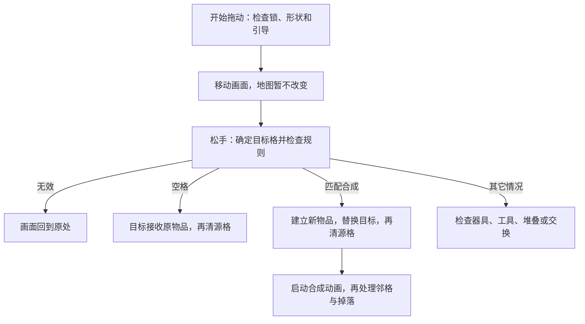

# 一次操作怎样改变棋盘

**Merge Cooking 1.59.0｜2026-09-25。** 版本来自目录名，尚未核对原包。本篇从实际行为解释功能和六条执行流程，再给出代码对应。默认实现结论为**已确认（静态证据）**，风险和缺口另标；没有运行验证，实际配置数值及资源效果未知。

## 1. 先区分能力、状态和画面

“能做什么”与“现在是什么情况”是两件事。生成器的产出能力由 Attribute 对象执行；剩余次数、冷却起点等保存在物品记录中。物品被锁住时，能力对象通常还在，只是相关入口和更新受限制。它并不是每次上锁就删除能力、解锁再重新创建。[E04](04_证据索引.md#e04)/[E13](04_证据索引.md#e13)

创建物品时，工厂按配置选择子类，再装入相应能力。执行时逐个调用能力方法，没有明确的优先级或“由某个能力终止后续调用”的结果协议；同一种能力键只能存一个对象。虽然有移除方法，但它只从集合中移出对象，没有配套释放流程，主链也未见完整的运行中拆装用法。[E03](04_证据索引.md#e03)/[E04](04_证据索引.md#e04)

物品的 `GoodsState` 是一个单值状态，既表示锁、气泡等限制，也表示冷却、工作中等阶段。另一个系列增益系统可以保留多个活动来源，按剩余时间最长的来源生效。合成闪光、消失粒子等则只是视觉资源，不是这两套规则数据。[E13](04_证据索引.md#e13)/[E22](04_证据索引.md#e22)/[E28](04_证据索引.md#e28)/[E33](04_证据索引.md#e33)

因此，新增一种已有规则的物品可能只需加配置；新增行为则可能同时改工厂、能力、记录、权限和画面。具体功能按归属、数据、触发、迁移、保存等十个方面的核对表，放在 [文末附录](#feature-reference)，不必先逐格读完。

## 2. 锁住一个物品，并不等于禁止所有操作

最有代表性的规则是：**物品处于 Lock 状态时，不能主动拖走，但仍可以成为同种物品合成的目标。** 地块锁则不同：它锁住这个位置，源格和目标格的操作都会被拦截。[E10](04_证据索引.md#e10)/[E11](04_证据索引.md#e11)/[E13](04_证据索引.md#e13)

| 情况 | 主动拖动 | 作为普通合成目标 | 普通交换 |
| --- | --- | --- | --- |
| 正常物品 | 基础允许 | 还需同种、存在下一等级等条件 | 基础允许 |
| 物品锁 Lock | 禁止 | 可以继续检查匹配条件 | 不匹配时拒绝 |
| 覆盖中或障碍物 | 禁止 | 拒绝 | 拒绝 |
| 特殊物品锁 SpecialLock | 禁止 | 拒绝 | 拒绝 |
| 气泡 Bubble | 基础允许 | 拒绝 | 可进入交换分支 |
| 位置未解锁 | 禁止 | 拒绝 | 拒绝 |
| 占多个格子的物品 | 禁止起拖 | 需看目标和类型规则 | 任一方为多格物品即拒绝 |

这是基础规则表，实际操作还可能受引导、器具工作状态、动画等条件限制。覆盖中包括 Covered、FakeCovered、SpecialCovered；障碍物为 Obstacle。判断分散在配置工具、物品行为、格子和界面中，没有一处统一汇总全部限制。[E10](04_证据索引.md#e10)/[E11](04_证据索引.md#e11)/[E13](04_证据索引.md#e13)/[E34](04_证据索引.md#e34)

外观也不能代替规则判断。Covered 会隐藏本体、显示箱壳；Lock 显示网图；特殊锁和障碍使用其它图标。冷却时的变灰颜色仍保持不透明度为 1，不能直接称为“半透明锁”。真实贴图、材质和点击遮挡效果因缺少资源而待验证。[E28](04_证据索引.md#e28)

## 3. 流程一：重新进入棋盘

加载过程先恢复记录，再建立行为和画面，但建立画面也可能触发规则更新。[E03](04_证据索引.md#e03)–[E07](04_证据索引.md#e07)

1. **读回棋盘数据。** 模型读取地图、解锁及背包等保存内容；没有存档时按初始配置建物品，缺实例编号时补齐。入口为 `GameLevelModel.InitModel/InitData`，部分异常会被捕获，但未验证所有损坏存档。
2. **建立格子。** 棋盘界面进入后创建背景和默认九行七列的格子，设置位置。`CreateGameGrid` 在此期间标记“正在初始化”；池中取不到格子时会记录并跳过。
3. **恢复每件物品的行为。** 工厂使用原记录创建物品子类和能力，能力根据状态决定是否补算冷却。调用位置在本次 `Grid.Init` 绑定编号之前，因此池中旧对象的复用时序仍需留意。
4. **绑定画面和输入。** 格子读取解锁状态，绑定物品画面、注册事件并更新能力；随后重建多格占位关系，结束棋盘初始化。部分能力还要等加载界面完成标志。

**状态生效与保存。** 记录读取后就已存在；能力恢复期间还可能修改记录。`InitGoodsVo(isSave:false)` 只是不让这一次绑定直接保存，不能证明整个载入过程没有写入或标脏。[E13](04_证据索引.md#e13)/[E16](04_证据索引.md#e16)/[E23](04_证据索引.md#e23)

**待验证**：指针按下监听已在 `Awake` 中找到，但点击事件的外部绑定、全部资源就绪后何时开放输入还没贯通。保存各阶段见 [01 第 6 节](01_架构与数据模型.md#persistence)。[E14](04_证据索引.md#e14)/[E36](04_证据索引.md#e36)

## 4. 流程二：把一件物品拖到另一格

拖动过程中先移动画面，松手后才决定是移动、交换、合成、使用工具，还是退回原位。[E10](04_证据索引.md#e10)/[E11](04_证据索引.md#e11)

入口分别是 `OnBeginDrag`、`OnEndDrag` 和 [EndDragToTargetGrid](../code/Assembly-CSharp/GameLevelGrid.cs) L3136–3366。形状从格会转到主格处理；图中没有展开所有工具规则。

**移到空格时**，目标格先接收原来的行为对象和画面，更新物品的所在格子并保存格数据；然后源格才清空，最后播放移动动画。普通交换也逐格重新绑定，保留两件物品的记录和身份。[E09](04_证据索引.md#e09)/[E11](04_证据索引.md#e11)

**普通合成时**，先检查种类、下一等级和器具状态，再调整拥有数量等附带记录，建立新物品并转入指定次数、待掉落内容。之后目标格换成新物品，源格清空，才进入 `MergeSuccess`。但该方法内部会先启动合成动画，再处理四邻覆盖解除和额外掉落；不能说整个合成的所有影响都在动画前完成。[E11](04_证据索引.md#e11)/[E12](04_证据索引.md#e12)

还有两个需要分开的分支：目标为 AwaitRemove 且同种时，会消耗双方而不建立普通升级结果；拖入背包则先让背包接收原记录，成功才清源格。[E10](04_证据索引.md#e10)/[E11](04_证据索引.md#e11)

**保存与失败。** 改格会更新内存并标脏；结果是生成器、器具或等级不低于 7 时，还会请求有限频率的写盘。早期拒绝调用 `ResetItem` 让画面归位。**较强推断**：由于两个格子分步修改，中途异常或同步事件再次进入规则，可能看到一半完成的结果；目前未复现，而且画面归位不能撤回已经写入的数据。[E10](04_证据索引.md#e10)–[E12](04_证据索引.md#e12)/[E23](04_证据索引.md#e23)/[E24](04_证据索引.md#e24)/[E34](04_证据索引.md#e34)

## 5. 流程三：点击生成器，生成一件物品

一次点击不一定出货：首次按下可能只是选中；已选中、阶段允许且没有相应动画或引导限制时，才调用物品的 `Use`，再执行生成能力。[E14](04_证据索引.md#e14)

普通手动生成的主要顺序如下。重点是第 3 步与第 4 步的先后。[E15](04_证据索引.md#e15)/[E27](04_证据索引.md#e27)

1. **检查能否生成。** 看剩余次数或免冷却条件，检查配置，并确认至少有一个一般空格。没有空格就返回。
2. **检查费用是否够。** 此时只是预检；不足时可以弹出提示或相关界面，不扣余额和次数。
3. **选出产物。** `GetInitiativeProduceGoodsID` 可能建立或消费产出队列。也就是说，“下一件是什么”的内部记录已经可能改变。
4. **找这个产物真正能放的位置。** `GetNearbyEmptyGrid` 会考虑具体物品及多格形状；找不到就返回。
5. **扣费并放入产物。** 钱包余额先变，再创建物品、更新拥有数量、放入目标格；目标格绑定画面并标脏。
6. **扣除生成器次数，再播放飞行。** 源物品更新使用总量、剩余次数和状态并保存。图鉴、消息等后续处理也穿插在这条直接调用链中。

主方法为 [InitiativeProduceAttributeInn.OnExecute](../code/Assembly-CSharp/InitiativeProduceAttributeInn.cs) L87–201。正常生成无需等飞行动画结束才在棋盘数据中成立。

**较强推断**：假如第 4 步才发现产物占不下，例如有单格空位却没有足够连续空间，第 3 步的队列修改不会自动撤回。实际配置能否产生这种情况仍待验证。早期满盘则明确在扣费前返回；两种失败不能混为一谈。扣费以后若工厂、画面绑定或事件调用异常，也未见统一补偿。[E15](04_证据索引.md#e15)/[E27](04_证据索引.md#e27)

## 6. 流程四：过了一段时间后，会发生什么

这里需要区分三种机制。**恢复可用次数、自动把物品放进格子、释放此前确定的奖励，不是同一件事。**[E16](04_证据索引.md#e16)–[E18](04_证据索引.md#e18)

### 6.1 手动生成器：时间主要用来恢复次数

棋盘界面大约每秒检查需要更新的物品，再由格子调用能力。能力读取冷却开始时间、当前冷却档位和可用次数，补回次数并限制上限；变成可点击状态后，仍由玩家点击才出货。数量耗尽可进入 CoolDown，部分有剩余次数时可以处于 HideCoolDown。[E16](04_证据索引.md#e16)/[E26](04_证据索引.md#e26)

这是主要定时入口，初始化和刷新也能触发能力更新。每帧只用一个条件消耗累计的一秒，没有在同一帧循环执行所有遗漏秒数；补时另通过时间差计算完成。[E26](04_证据索引.md#e26)

### 6.2 被动生成器：有库存，还要找到邻格才能出货

被动能力在满足费用及执行条件后，先检查周围八格。有位置才选择产物、扣费、放入物品并扣库存，每次更新最多尝试自动执行一次；随后再补算冷却。它先用现有库存出货，再补次数，这个顺序与只显示倒计时不同。[E17](04_证据索引.md#e17)

周围满了就保留库存，远处有空格也不会自动改用全盘搜索；玩家主动点击领取时可以走较大范围的找位。拖动、CD 动画、全局加速表现、引导和加载等条件也会限制执行。[E17](04_证据索引.md#e17)

重新进入后，冷却状态可以在初始化时补量；保存为 AutoProduce 的物品会跳过这段恢复，由后续更新继续出货和补算。**已查路径未见把离线期间每次产出逐件回放到棋盘**，不能从“补回次数”推断“离线已造出一盘物品”。[E13](04_证据索引.md#e13)/[E17](04_证据索引.md#e17)

### 6.3 待掉落队列：东西已经确定，只是在等空间

`AutoDropAttribute` 处理合成留下的待掉落列表。它先找空格，再从列表移除一件并放入棋盘；一轮可以释放多件，没有空格就保留余下内容。因此，这个名字里的 Auto 并不表示它自己每隔固定时间制造新品。[E18](04_证据索引.md#e18)

### 6.4 一个例外：某类转换器会等动画完成才补次数

代码中带 Inn 后缀的转换能力有一个特殊分支：更新冷却时，把“补次数”的回调交给进度动画，随后提前返回；动画完成后回调才增加次数和冷却档位。这是特定分支，不能概括为所有转换器的行为。[E19](04_证据索引.md#e19)/[E20](04_证据索引.md#e20)

这会使资源和动画条件参与业务推进：缺少钟表图标或被动画标志拦截时，本次动画可能不启动。回调又只检查物品种类，没有检查是否仍是同一个实例。**待验证**：AB 实验是否启用此分支，以及取消后的完整恢复；重新创建物品时另有补时，不能断言取消就永久卡住。[E19](04_证据索引.md#e19)

### 6.5 气泡有自己的计时差异

旧气泡使用累计游戏时长 `playtime`，新分支使用 `CurrentServerTime3`；两者不能都解释成关机期间继续流逝。到期处理会先启动消失表现，然后按配置换成其它物品、删除，或发奖励后清空。[E21](04_证据索引.md#e21)

真实冷却参数、服务器校时、后台和背包期间的规则仍待验证。时间来源与随机记录见 [01 第 6 节](01_架构与数据模型.md#persistence)，补证动作见 [03 第 7 节](03_借鉴评估与待验证问题.md#verification-gaps)。

## 7. 流程五：解除覆盖，或解锁一块地

### 7.1 相邻合成可以改变物品的覆盖状态

普通合成更新两格并启动动画后，会检查结果格的上、下、左、右邻格。只有位置已解锁且存在物品，才继续处理覆盖。这里是四邻，与自动出货的八邻不同。[E12](04_证据索引.md#e12)

| 原状态 | 变成什么 | 这意味着什么 |
| --- | --- | --- |
| Covered | Lock | 去掉一层覆盖，但仍保留不可主动拖动的物品锁 |
| FakeCovered | Normal | 恢复普通状态，同时补拥有记录、初始化能力并刷新／保存 |
| SpecialCovered | SpecialLock | 转为另一种特殊限制，并非直接自由操作 |

格子通过物品画面写入这些状态并保存，随后播放破壳。**规则限制可以先改变，而覆盖动画还没播完**；下一次输入仍需通过其它操作限制。[E09](04_证据索引.md#e09)/[E12](04_证据索引.md#e12)/[E13](04_证据索引.md#e13)/[E28](04_证据索引.md#e28)

### 7.2 解锁地块，改变的是位置记录

地块解锁先由模型按条件更新解锁表；重载时的查询也可能补写。格子初始化再读取这份记录，设置自己的锁标志并显示或隐藏对应节点。[E32](04_证据索引.md#e32)

解除云层的画面走另一条链：`GuideEvent` 发布事件 100060，界面的监听进入解锁动画，按 LastLevel 找到相关格子，再调用 `HideLockAnim`。通常等动画片段的时长后隐藏云层；缺少动画或片段时有提前返回。[E32](04_证据索引.md#e32)

**待验证**：玩家升级时如何刷新所有现存格子的锁标志，还未追完整。云层隐藏方法本身不改这个标志，不能把动画结束当成解锁数据生效的唯一时点。物品 SpecialLock 点击另发事件 100252，缺少的是它的监听者；100060 的发布和监听已经找到。[E32](04_证据索引.md#e32)/[E36](04_证据索引.md#e36)

## 8. 流程六：物品删除后，画面和回调怎样收尾

有限次数生成器用尽的删除路径已追通，适合作为代表；售出撤销的结算界面缺失，只能说明已查到的部分。[E22](04_证据索引.md#e22)/[E31](04_证据索引.md#e31)

1. **确认用尽。** 使用总数达到配置容量后，`DestroyLimitedProducer` 可以先启动独立消失特效。
2. **立即从棋盘删除。** 不等待特效完成，就减少拥有数量、取消选中、调用 `ChangeGameGoodsVo(null)` 清格并标记待保存。
3. **回收物品画面。** 停止常用动画，清定时任务，归还挂件，恢复显示标志；可见代码没有把物品记录和所在格子的旧引用置空。
4. **独立特效晚些回收。** 特效延迟结束后在清理代码中归还自己；它的存活不表示旧物品仍占据格子。数据再由后续保存流程写入磁盘。

以上顺序见 [E09](04_证据索引.md#e09)/[E22](04_证据索引.md#e22)/[E23](04_证据索引.md#e23)/[E29](04_证据索引.md#e29)。需要额外关注两类问题。

**事件是否清干净。** 格子初始化注册了五项事件，回收只显式注销三项，其中 203024 和 203030 没有对应注销；事件添加也不去重。这个差异为已确认事实，反复使用后重复触发则为**较强推断**，因为缺失的对象池实现可能另有清理。[E30](04_证据索引.md#e30)

**旧动画会不会影响新物品。** 同一个画面回收后可能绑定新物品，但飞行收尾会读画面当前绑定；转换器回调又只比较种类编号。已有停止动画操作可以减少风险，仍未见统一的实例或绑定次数校验。实际错误是否发生需要延迟回调实验，不能直接算已复现缺陷。[E19](04_证据索引.md#e19)/[E29](04_证据索引.md#e29)

售出撤销目前只确认：保存原格子和同一份物品记录的引用，界面有撤销参数，切换选中或隐藏会清理记录。缺少售出／撤销界面类，无法判断资金、位置冲突、实例编号和旧回调如何恢复。具体补证见 [03 第 7 节](03_借鉴评估与待验证问题.md#verification-gaps)。[E31](04_证据索引.md#e31)/[E36](04_证据索引.md#e36)

## 附录：功能细节对照，供查阅代码时使用

正文已经解释行为和顺序；以下按同一组问题核对每类功能的归属、数据、装配、触发、权限、执行、表现、组合、迁移与保存。表内类名保留原名，方便转到证据索引定位。

### A. 手动生成与被动生成

代码对应：手动为 GoodsInitiativeProduce＋InitiativeProduceAttributeInn；被动为 GoodsPassiveProduce＋PassiveProduceAttribute。

| 维度 | 手动生成器 | 被动生成器 |
| --- | --- | --- |
| 归属 | 附着物品，无独立持久 ID | 同左 |
| 数据 | 主动库存、额外次数、UseTotal、CD 起点／档位、产出队列；配置容量、frequency、费用 | 被动库存／CD／队列与加速字段；额外次数共用 InitiativeAdditionalNumber |
| 创建与装配 | 工厂 type→子类→主动 Inn 能力＋AutoDrop | 子类装 Passive；混合类装两种能力 |
| 触发 | 选中点击→Use→ExecuteAttribute；更新补库存 | 扫描→OnUpdate→OnExecute；点击以 normal:false 领取 |
| 规则权限 | 生产阶段／额外次数／无 CD，再查库存、空间、费用及入口限制 | 另查拖动、CD 动画、GlobalSpeedupState；自动受 CanExecute／引导限制 |
| 执行 | 先取产物再确认落点，提交细节见流程三 | 自动先找八邻落点再取物；主动领取用全盘搜索 |
| 表现 | 入格后飞行；源状态刷新可能经 View 写 VO | 入格后飞行，切换 AutoProduce/CoolDown 外观 |
| 组合与冲突 | 混合能力共享 GoodsState，部分分支专门保留 AutoProduce | 同左，无统一冲突结果 |
| 解除与迁移 | 移动保留 VO／能力；合成仅转移指定次数与队列 | 同左；满邻域保留库存 |
| 保存与恢复 | VO 标脏；初始化补库存封顶，出货仍需点击 | 冷却态可初始化补量；AutoProduce 后续 OnUpdate 先尝试出货再补 CD；详见流程四 |

证据：[E04](04_证据索引.md#e04)/[E14](04_证据索引.md#e14)–[E17](04_证据索引.md#e17)/[E23](04_证据索引.md#e23)/[E26](04_证据索引.md#e26)/[E27](04_证据索引.md#e27)。

### B. 物品限制、气泡与宝箱

| 维度 | 物品锁和覆盖 | 气泡（Bubble） | 宝箱物品 |
| --- | --- | --- | --- |
| 归属 | 原物品的 GoodsState 状态，非独立外壳 | 同左，无独立气泡 ID | 自身是物品子类／配置类型 |
| 数据 | 单枚举；与位置 mIsLock 分开 | BubbleGoodsOpt、Discount，复用 CDStarTime 计时 | 开启阶段、主动次数／用量、CD、产物配置 |
| 创建与装配 | 存档／初始状态进入工厂，原能力保留 | CreateNearbyGoods 建 Bubble VO，AB 选计时分支 | 工厂子类装普通 InitiativeConversionAttribute |
| 触发 | 邻接合成；SpecialLock 点击发 100252 | 初始化／OnBubbleUpdate 到期；购买入口缺失 | BoxWaitOpen 点击→CanOpenBox；就绪后领取 |
| 规则权限 | Lock 与 Covered 权限不同，见第 2 节 | 可拖／交换，不可普通合成 | Use 按阶段；匹配另查已使用情况 |
| 执行 | 改 VO；FakeCovered 解开还更新记账和能力 | 到期换物／删物，或钱包奖励后清空 | 写 CD 时间、CoolDown、CurrentOpenBox；能力负责出货 |
| 表现 | 网图／箱壳／特殊锁图标；Covered 隐藏本体 | 气泡挂件、倒计时、消失 | 箱子图标／计时器 |
| 组合与冲突 | 同一枚举限制互斥；格锁和 Buff 可并存 | 不能同时为 Bubble 与 Lock；能力仍在 | 阶段和限制共用枚举，需特殊组合分支 |
| 解除与迁移 | 三种覆盖转移及破壳时序见流程五 | 移动保留时间；到期换新物或清空，购买解除待验证 | 移动保留 VO；用过的箱子合成受限 |
| 保存与恢复 | 保存状态，恢复按状态初始化／拦截能力 | 保存分支和开始值，两种时钟见流程四 | 保存阶段／CD；新 LockGoodsBox 如何进入 BoxWaitOpen 待配置补证 |

证据：[E03](04_证据索引.md#e03)/[E12](04_证据索引.md#e12)/[E13](04_证据索引.md#e13)/[E20](04_证据索引.md#e20)/[E21](04_证据索引.md#e21)/[E28](04_证据索引.md#e28)。100252 订阅者、气泡购买界面缺失，支付和解除完整链**待验证**。[E36](04_证据索引.md#e36)

### C. 地块锁、有限产出、待掉落与系列增益

| 维度 | 固定地块锁 | 有限产出与待掉落 | 系列 Buff |
| --- | --- | --- | --- |
| 归属 | gridID 位置 | 有限生成器自身；MergeDropList 属于宿主物品 | 全局模型按类型／系列归组，多 activityID 来源 |
| 数据 | 解锁字典、配置 unlockLv、Grid.mIsLock 缓存 | 使用总数／最大容量；等待产物 ID 列表 | startTimestamp/duration/buffValue/activityID |
| 装配 | 模型初始化，Grid.InitGrid 读取 | type 30 对应有限能力；AutoDrop 由相关子类构造装配 | AddGoodsBuff 动态加入，独立于 Attribute 字典 |
| 触发 | 条件检查补解锁；进入引导事件 100060 播解锁 | 有限能力检查用尽；AutoDrop.OnUpdate 尝试清队列 | 活动添加／删除与查询，202116 等通知刷新 |
| 权限 | 源／目标格锁直接挡拖拽及时间更新 | 有限生成器另被下一等级合成检查拒绝；落物要可用空格 | 无 CD／加速经具体能力查询生效，非统一权限汇总 |
| 执行 | Model 改字典，Grid 初始化读；云层隐藏另走动画 | 用尽起效果后立刻减记账／清格；掉落先找到空格才 RemoveAt | 加删列表并保存；同类系列取最长剩余时间来源 |
| 表现 | LockNodeGo/云动画；不是物品 WebIcon | 消失效果独立延后回池；新产物飞行 | 事件与 Item 特定刷新；无通用 EffectView 证据 |
| 组合 | 可与物品任意枚举同时存储，但格锁屏蔽该格更新 | AutoDrop 可共装；while 受队列长度／空间限制，一次可释放多件，非通用连锁保护 | 多来源保留，非值求和；可跨多个同系列物品 |
| 解除／迁移 | 锁不随物品走；现存格刷新全部入口待验证 | 有限耗尽消失；合成可转移 MergeDropList，移动保留 | 按 activityID/series 移除；物品同系列可共享影响 |
| 保存／恢复 | 解锁单独存；重建 Grid 重新派生 | VO 字段保存；满盘队列保留；能力重建 | 单独 JSON 保存并调用服务器缓存入口；到期查询清理 |

证据：[E03](04_证据索引.md#e03)/[E18](04_证据索引.md#e18)/[E22](04_证据索引.md#e22)/[E26](04_证据索引.md#e26)/[E32](04_证据索引.md#e32)/[E33](04_证据索引.md#e33)。有限产出与 AutoDrop 为不同能力，仅在此并列比较。

资料位置：仓库 `/Users/betta/Company/Projects/MergeTwo` 下 `参考项目/Merge_Cooking_1.59.0_APKPure/`；本文输出于其 `_分析实现方案/`。源码路径以目标根起算，链接相对本文；E 编号详见 [证据索引](04_证据索引.md)。
