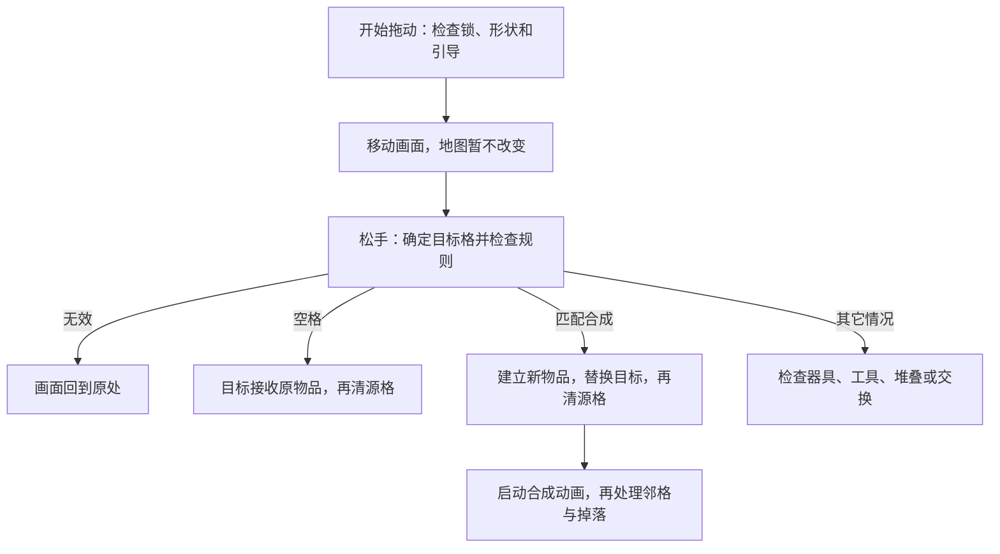

# 02 功能与执行流程

**Merge Cooking 1.59.0｜复核日期：2026-09-26。** 版本来自目录名，尚未核对原包。以下说明实际功能与六条操作流程。默认实现结论为**已确认（静态证据）**，推断和缺口另标；没有运行验证。

## 1. 先区分能力、状态和画面

“能做什么”与“现在是什么情况”是两件事。生成器的产出能力由 Attribute 对象执行；剩余次数、冷却（CD）起点等保存在物品记录中。这里的能力是规则代码，不是一个数值属性；“库存”是还能生成的次数，不是已经放到棋盘上的物品。物品被锁住时，能力对象通常还在，只是相关入口和更新受限制。它并不是每次上锁就删除能力、解锁再重新创建。

能力附着于物品，没有自己的持久实例编号，业务数据保存在宿主记录。工厂按配置选择子类，再由构造方法装配：GoodsInitiativeProduce 使用主动生成和待掉落能力，GoodsPassiveProduce 使用被动生成能力，混合类同时装入主动与被动能力。它们共用 GoodsState，部分分支专门保留 AutoProduce 阶段。

执行时逐个调用能力方法，没有明确的优先级或中止后续调用的结果协议；同一种能力键只能存一个对象。移除方法只从集合中移出对象，没有配套释放流程，主链也未见完整的运行中拆装用法。

物品的 `GoodsState` 是一个单值状态，既表示锁、气泡等限制，也表示冷却、工作中等阶段。系列增益则另存于全局模型，可以影响多件同系列物品。合成闪光、消失粒子等则只是视觉资源，不是这两套规则数据。

因此，新增一种已有规则的物品可能只需加配置；新增行为则可能同时改工厂、能力、记录、权限和画面。

## 2. 锁住一个物品，并不等于禁止所有操作

最有代表性的规则是：**物品处于 Lock 状态时，不能主动拖走，但仍可以成为同种物品合成的目标。** 地块锁则不同：它锁住这个位置，源格和目标格的操作都会被拦截。

| 情况 | 主动拖动 | 作为普通合成目标 | 普通交换 |
| --- | --- | --- | --- |
| 正常物品 | 基础允许 | 还需同种、存在下一等级等条件 | 基础允许 |
| 物品锁 Lock | 禁止 | 可以继续检查匹配条件 | 不匹配时拒绝 |
| 覆盖中或障碍物 | 禁止 | 拒绝 | 拒绝 |
| 特殊物品锁 SpecialLock | 禁止 | 拒绝 | 拒绝 |
| 气泡 Bubble | 基础允许 | 拒绝 | 可进入交换分支 |
| 位置未解锁 | 禁止 | 拒绝 | 拒绝 |
| 占多个格子的物品 | 禁止起拖 | 需看目标和类型规则 | 任一方为多格物品即拒绝 |

这是基础规则表，实际操作还可能受引导、器具工作状态、动画等条件限制。覆盖中包括 Covered、FakeCovered、SpecialCovered；障碍物为 Obstacle。判断分散在配置工具、物品行为、格子和界面中，没有一处统一汇总全部限制。尤其不能把“限制枚举”理解为自动停用所有能力：待掉落能力不单独检查物品锁状态，被动更新在附加次数大于零时也可尝试执行，仍须通过加载、引导、拖动、费用等各自检查。实际配置是否形成这类组合待验证。

外观也不能代替规则判断。Covered 会隐藏本体、显示箱壳；Lock 显示网图；特殊锁和障碍使用其它图标。冷却时的变灰颜色仍保持不透明度为 1，不能直接称为“半透明锁”。真实贴图、材质和点击遮挡效果因缺少资源而待验证。

## 3. 流程一：重新进入棋盘

加载过程先恢复记录，再建立行为和画面，但建立画面也可能触发规则更新。

1. **读回棋盘数据。** 模型读取地图、解锁及背包等保存内容；没有存档时按初始配置建物品，缺实例编号时补齐。入口为 `GameLevelModel.InitModel/InitData`，部分异常会被捕获，但未验证所有损坏存档。
2. **建立格子。** 棋盘界面进入后创建背景和默认九行七列的格子，设置位置。`CreateGameGrid` 在此期间标记“正在初始化”；池中取不到格子时会记录并跳过。
3. **恢复每件物品的行为。** 工厂使用原记录创建物品子类和能力。恢复检查遇到不能拖动的物品状态或格子锁，会把相应生成次数设为配置初始值并跳过一般补时；AutoProduce 也跳过这段恢复。调用发生在本次 `Grid.Init` 绑定编号之前，格子的旧锁标志如何影响初始化仍需结合复用时序验证。
4. **绑定画面和输入。** 格子读取解锁状态，绑定物品画面、注册事件并更新能力；随后重建多格占位关系，结束棋盘初始化。部分能力还要等加载界面完成标志。

**状态生效与保存。** 记录读取后就已存在；能力恢复期间还可能修改记录。`InitGoodsVo(isSave:false)` 只是不让这一次绑定直接保存，不能证明整个载入过程没有写入或标脏。

**待验证**：指针按下监听已在 `Awake` 中找到，但 GameButton 实现和 Prefab 缺失，点击事件的外部绑定、资源就绪后何时开放输入还没贯通。

## 4. 流程二：把一件物品拖到另一格

拖动过程中先移动画面，松手后才决定是移动、交换、合成、使用工具，还是退回原位。

入口分别是 `OnBeginDrag`、`OnEndDrag` 和 `EndDragToTargetGrid`。目标定位先尝试合成吸附，失败后用指针射线命中；形状从格转到主格处理。图中没有展开所有工具规则。

**移到空格时**，目标格先接收原来的行为对象和画面，更新物品的所在格子并保存格数据；然后源格才清空，最后播放移动动画。普通交换也逐格重新绑定，保留两件物品的记录和身份。目标换绑中的能力更新发生在源格清空之前；满足条件时可继续补时或自动落物，这也是移动期间仍可能出现额外业务变化的原因。

**普通合成时**，先检查种类、下一等级和器具状态，再调整拥有数量等附带记录，建立新物品并转入指定次数、待掉落内容。之后目标格换成新物品，源格清空，才进入 `MergeSuccess`。但该方法内部会先启动合成动画，再处理四邻覆盖解除和额外掉落；不能说整个合成的所有影响都在动画前完成。

目标为 AwaitRemove 且同种时，会清空双方而不建立普通升级结果，随后仍调用合成后续入口。这与正常升级合成不同。

**移入背包**先检查规则：气泡、传送门类型、开启冷却中的宝箱和多格物品被拒绝。符合专用生成器仓条件时优先进入专仓，否则检查普通背包容量；接收原记录成功后才清源格。普通背包重新排列槽位，专仓按种类归组，都不是创建一件新物品。取出时先找落点，用原记录重建能力，再通知背包成功并播放飞行；无空间则回调失败。

**保存与失败。** 改格会更新内存并标脏；结果是生成器、器具或等级不低于 7 时，还会请求有限频率的写盘。早期拒绝调用 `ResetItem` 让画面归位。**较强推断**：由于两个格子分步修改，中途异常或同步事件再次进入规则，可能看到一半完成的结果；目前未复现，而且画面归位不能撤回已经写入的数据。

## 5. 流程三：点击生成器或宝箱

### 5.1 生成器：先检查，再选物和扣费

一次点击不一定出货：首次按下可能只是选中；已选中、阶段允许且没有相应动画或引导限制时，才调用物品的 `Use`，再执行生成能力。

普通手动生成的主要顺序如下。选产物早于最终找位，这是失败分析的关键。

1. **检查能否生成。** 看剩余次数或免冷却条件，检查配置，并确认至少有一个一般空格。没有空格就返回。
2. **检查费用是否够。** 此时只是预检；不足时可以弹出提示或相关界面，不扣余额和次数。
3. **选出产物。** `GetInitiativeProduceGoodsID` 可能建立或消费产出队列。也就是说，“下一件是什么”的内部记录已经可能改变。
4. **找这个产物真正能放的位置。** `GetNearbyEmptyGrid` 会考虑具体物品及多格形状；找不到就返回。
5. **扣费并放入产物。** 钱包余额先变，再创建物品、更新拥有数量、放入目标格；目标格绑定画面并标脏。
6. **更新生成器次数，再播放飞行。** 源物品更新使用总量、剩余次数和状态，常规分支调用保存。图鉴、消息等后续处理也穿插在这条直接调用链中。

主方法为 `InitiativeProduceAttributeInn.OnExecute`。正常生成无需等飞行动画结束才在棋盘数据中成立。

**倍率、次数和体力并不相等。** 倍率功能先取一项基础产物，再尝试升成更高等级的一件物品，不是一次放入多件。费用预检按所选倍率，实际扣费按“倍率减去回退额度”；无法升满目标等级时可以降低费用。当前 GetGeneratorConsume 的 C# 与 IL 都固定返回 -1，所以这条路径通常只消耗一次库存，而不是按倍率消耗多次。额外次数优先扣除；免冷却时可不扣普通库存，使用总量仍会更新。免冷却也不等于免费体力，无限体力由钱包的另一分支判断。具体倍率与产物上限取决于缺失配置。

**较强推断**：假如第 4 步才发现产物占不下，例如有单格空位却没有足够连续空间，第 3 步的队列修改不会自动撤回。实际配置能否产生这种情况仍待验证。早期满盘则明确在扣费前返回；两种失败不能混为一谈。扣费以后若工厂、画面绑定或事件调用异常，也未见统一补偿。钱包 ChangeItemNum 自身可以返回 -1 拒绝修改，但上层扣费方法不把这个结果返回给生成流程；因此也不能只凭“调用了扣费”认定每种异常情况下钱与物都一致。正常预检成功后是否还能触发后续拒绝，仍需运行验证。

### 5.2 宝箱：开启、等待和领取是不同阶段

宝箱是有自身身份的物品，箱壳覆盖只是原物品的状态，地块锁则属于位置。GoodsTreasureBox 和 GoodsLockGoodsBox 都装入普通 InitiativeConversionAttribute，阶段、次数、用量、冷却和产物参数保存在记录或配置里；界面据此显示箱子和计时器。

普通宝箱进入初始化分支时，有开启冷却便设为 BoxWaitOpen，否则直接可领取。点击待开启宝箱先经 CanOpenBox 检查棋盘和普通背包中是否还有正在开启的宝箱；允许后写入冷却起点、转为 CoolDown，并记录 CurrentOpenBox。冷却补量后，点击再调用转换能力出货，不能把“开始开箱”当成已经领取产物。

移动保留原记录和开启进度；作为宝箱参与普通合成时，任一件已经有使用记录就会被拒绝。阶段和限制仍共用一个枚举，无法同时表达任意组合；保存后按记录重建能力。**待验证**：GoodsLockGoodsBox 虽有处理 BoxWaitOpen 的点击分支，初始化中显式设置该阶段的类型却只有普通和动态宝箱。新 LockGoodsBox 从哪里进入待开启阶段，还需初始记录或配置补证。

## 6. 流程四：过了一段时间后，会发生什么

这里需要区分三种机制。**恢复可用次数、自动把物品放进格子、释放此前确定的奖励，不是同一件事。**

### 6.1 手动生成器：时间主要用来恢复次数

主动生成记录保存普通次数、额外次数、使用总量、冷却起点／档位及产出队列；配置给出容量、每轮补量 frequency 和费用。棋盘界面大约每秒检查需要更新的物品，再由格子调用能力补回次数并限制上限；变成可点击状态后，仍由玩家点击才出货。数量耗尽可进入 CoolDown；有剩余次数时也可能处于 HideCoolDown，继续充能。普通主动生成器在库存不高于两倍 frequency 时启动或保留这类冷却，超过这一阈值可直接处于可点击状态，所以不是“未满容量就必然持续充能”。

这是主要定时入口，初始化和刷新也能触发能力更新；模型的 TimeUpdate 则只处理分析统计，不负责主产出循环。每帧最多执行一次秒级扫描；积压时间可以在后续帧继续消耗，但没有在同一帧逐秒回放。补次数另按时间差计算。加载条件主要拦截部分自动落物，不能据此推断初始化或冷却补算也全部暂停。

### 6.2 被动生成器：有库存，还要找到邻格才能出货

被动能力另有自己的库存、使用量、冷却、队列和加速字段，但额外次数共用 InitiativeAdditionalNumber。满足费用及执行条件后，先检查周围八格。有位置才选择产物、扣费、放入物品并扣库存，每次更新最多尝试自动执行一次；随后再补算冷却。它先用现有库存出货，再补次数，这个顺序与只显示倒计时不同。

周围满了就保留库存，远处有空格也不会自动改用全盘搜索；玩家主动点击领取改用全盘搜索。库存有无决定 AutoProduce／CoolDown 阶段及外观；补到容量时清除冷却起点及本次加速记录，后续消耗后再按条件开启计时，常规修改后保存源格。拖动、CD 动画、全局加速表现、引导和加载等条件也会限制执行。

重新进入后，冷却状态可以在初始化时补量；保存为 AutoProduce 的物品会跳过这段恢复，由后续更新继续出货和补算。**已查路径未见把离线期间每次产出逐件回放到棋盘**，不能从“补回次数”推断“离线已造出一盘物品”。

两条出货路径的空间检查也不同：自动出货先选一个邻格，再取产物，没有按最终产物形状复查整片占位；手动领取先消费队列，再按具体产物找位。**较强推断**：若允许多格产物，自动路径需要确认是否会越界或覆盖，手动路径则可能在找位失败前已经推进队列。相关配置是否存在尚未确认，不能把两条路径都描述为完整的“先验证空间再消费产物”。

### 6.3 待掉落队列：东西已经确定，只是在等空间

`AutoDropAttribute` 处理合成留下的待掉落列表。它先找空格，再从列表移除一件并放入棋盘；一轮可释放多件，循环只受当前列表和空间限制，并非通用的连锁保护；没有空格就保留余下内容；有变化后保存源格，并请求受频率限制的写盘。该列表随物品记录保存，移动保留，合成可转入新物品；恢复时重建能力继续处理。它不是周期制造新品的计时器。

### 6.4 一个例外：某类转换器会等动画完成才补次数

代码中带 Inn 后缀的转换能力有一个特殊分支：更新冷却时，把“补次数”的回调交给进度动画，随后提前返回；这里的回调是一段在动画结束时执行的代码，完成后才增加次数和冷却档位。这是特定分支，不能概括为所有转换器的行为。

type 3 的进度动画会从零按完整 cdTime 播放，没有使用已经算出的进度缩短剩余时长。**较强推断**：如果启动动画较晚，界面等待与时间戳到期可能不一致，实际影响需验证。

这会使资源和动画条件参与业务推进：缺少钟表图标或被动画标志拦截时，本次动画可能不启动。回调又只检查物品种类，没有检查是否仍是同一个实例。**待验证**：AB 实验是否启用此分支，以及取消后的完整恢复；重新创建物品时另有补时，不能断言取消就永久卡住。

### 6.5 气泡有自己的计时差异

CreateNearbyGoods 建立带 Bubble 状态的物品，保留原类型的能力，没有另建一个气泡实例；分支标记 BubbleGoodsOpt、折扣和开始值随记录保存，移动保留这些数据。气泡与 Lock 不能同时放进 GoodsState。

计时分支由 AB 或调试开关选择，复用主动冷却起点字段：旧分支记累计游戏时长 `playtime`，新分支记 `CurrentServerTime3`，不能都解释成关机期间继续流逝。初始化和后续更新处理到期，新分支还要求当前处于主棋盘场景；时间已到与已经结算是两个时点。到期先启动消失表现，再按配置换物、删除，或发奖励后清空。界面显示气泡挂件和倒计时；购买气泡的支付与解除链缺失，仍待验证。

### 6.6 系列增益：多个来源共存，由具体能力查询

GoodsBuffModel 按增益类型和物品系列保存记录，每条含活动来源、开始时间、持续时长和数值。添加和移除不经过物品的能力字典；活动可动态增加记录，也可按来源与系列删除，移动单件物品不会把这份全局增益搬走。它与物品状态、地块锁可以同时保存，但不代替操作权限检查。

同类同系列取**剩余时间最长**的有效来源，时长相同保留先遍历到的一条，不按最大数值选取，也不把数值相加。剩余时长查询确认该系列全部过期后才清理；免冷却、加速等由具体能力读取并生效。增删会保存独立 JSON，并调用服务器缓存入口，刷新通过 202116／202117 等事件和物品界面处理，未见通用 EffectView。恢复读回这些记录，最终跨端同步仍受服务端材料缺失限制。

### 6.7 入背包并不一律暂停时间

已查入包路径保留原时间字段，取出后用同一记录重建能力，符合条件的冷却能补算；超级加速还会直接提前普通背包和生成器专仓中的冷却起点。因此可以确认“入包不一律冻结时间”，但不能扩展为所有器具、气泡和后台行为均已核实。实际参数、服务器校时及完整后台调度仍待验证。

## 7. 流程五：解除覆盖，或解锁一块地

### 7.1 相邻合成可以改变物品的覆盖状态

普通合成更新两格并启动动画后，会检查结果格的上、下、左、右邻格。只有位置已解锁且存在物品，才继续处理覆盖。这里是四邻，与自动出货的八邻不同。

| 原状态 | 变成什么 | 这意味着什么 |
| --- | --- | --- |
| Covered | Lock | 去掉一层覆盖，但仍保留不可主动拖动的物品锁 |
| FakeCovered | Normal | 恢复普通状态，同时补拥有记录、初始化能力并刷新／保存 |
| SpecialCovered | SpecialLock | 转为另一种特殊限制，并非直接自由操作 |

格子通过物品画面写入这些状态并保存，随后播放破壳。**规则限制可以先改变，而覆盖动画还没播完**；下一次输入仍需通过其它操作限制。

### 7.2 解锁地块，改变的是位置记录

模型按配置中的解锁等级等条件更新位置解锁表，运行格子再据此设置 mIsLock；重载时的查询也可能补写解锁。事件 100052 进入 OnUpgradleSuccess；当前等级命中地块解锁配置时，ResetGameGrid 回收并重建整盘，再由 InitGrid 读取解锁记录。界面重新显示时，LastLevelUp 或重建标志也能触发同一过程。它不是只隐藏云层、继续保留旧格子的锁标志。

解除云层的画面走另一条链：`GuideEvent` 发布事件 100060，界面的监听进入解锁动画，按 LastLevel 找到相关格子，再调用 `HideLockAnim`。通常等动画片段的时长后隐藏云层；缺少动画或片段时有提前返回。

HideLockAnim 本身不改 mIsLock，UpdateLockGrid 也主要重画解锁条件提示；不能把这两个名字理解为就地更新所有业务锁。重建使规则重新读取解锁记录，云层动画单独收尾。

**待验证**：上游升级、解锁表写入与 100052 的完整先后顺序仍缺等级模型实现。物品 SpecialLock 点击另发事件 100252，但当前材料缺少它的监听者，无法贯通解除链。

## 8. 流程六：物品删除后，画面和回调怎样收尾

有限生成器（类型 30）由工厂装入专用能力，记录使用总量，配置规定最大容量；普通下一等级合成检查会拒绝这种类型。它与待掉落队列是两种能力。以下以用尽删除为例；售出撤销的结算界面缺失，只能说明已查到的部分。

1. **确认用尽。** 使用总数达到配置容量后，`DestroyLimitedProducer` 可以先启动独立消失特效。
2. **立即从棋盘删除。** 不等待特效完成，就减少拥有数量、取消选中、调用 `ChangeGameGoodsVo(null)` 清格并标记待保存。
3. **回收物品画面。** 停止常用动画，清定时任务，归还挂件，恢复显示标志；可见代码没有把物品记录和所在格子的旧引用置空。
4. **独立特效晚些回收。** 特效延迟结束后在清理代码中归还自己；它的存活不表示旧物品仍占据格子。数据再由后续保存流程写入磁盘。

需要额外关注两类问题。

**事件是否清干净。** 格子初始化注册了五项事件，回收只显式注销三项，其中 203024 和 203030 没有对应注销；事件添加也不去重。这个差异为已确认事实，反复使用后重复触发则为**较强推断**，因为缺失的对象池实现可能另有清理。

**旧动画会不会影响新物品。** 同一个画面回收后可能绑定新物品，但飞行收尾会读画面当前绑定；转换器回调又只比较种类编号。已有停止动画操作可以减少风险；格子也会清业务引用，但未见 Dispose 接入这条清理链或统一的实例／绑定次数校验。实际错误是否发生需要延迟回调实验，不能直接算已复现缺陷。

售出撤销目前只确认：保存原格子和同一份物品记录的引用，界面有撤销参数，切换选中或隐藏会清理记录。缺少售出／撤销界面类，无法判断资金、位置冲突、实例编号和旧回调如何恢复。
