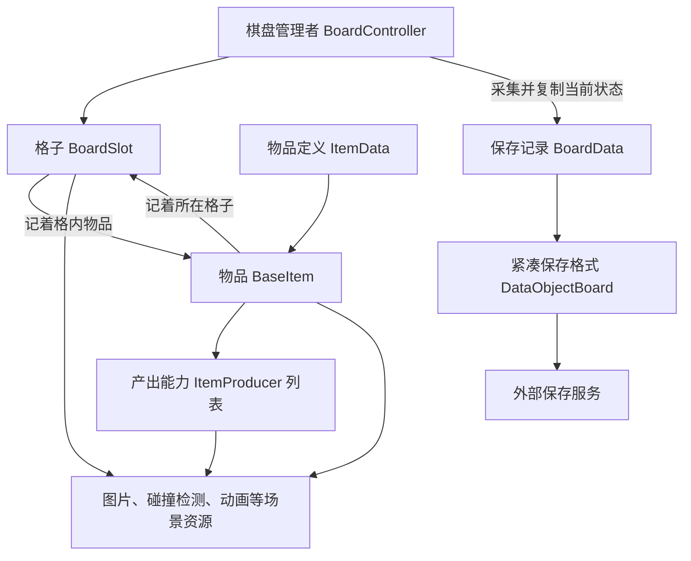

# Mergedom：棋盘、格子和物品分别记着什么

2026-09-25 · 基于目录标记 8.7.7 的静态分析，包版本未独立核实。

## 1. 游戏运行时，数据放在哪里

**最关键的事实是：场景中的格子和物品对象，直接记着游戏当前状态。** 格子记着“这里放了什么、有没有锁”；物品记着“我是什么、几级、在哪一格”。生成器另有产出能力对象，记录可用次数和冷却时间。保存记录则是在需要保存时，从这些对象中采集出来的。[E01](04_证据索引.md#e01)、[E20](04_证据索引.md#e20)

对应到代码，棋盘管理者叫 `BoardController`，格子叫 `BoardSlot`，物品基类叫 `BaseItem`，产出能力叫 `ItemProducer`。这里的 Producer 是一份能力，同一件物品可以拥有多份；它不等于屏幕上的整件生成器物品。下图中的箭头表示引用或可见调用。



移动和合成另由 `ItemMover`、`ItemMerger` 执行，但它们仍会直接操作物品和显示资源。`SignalBus` 用来通知其它对象发生了什么，例如合成完成；现有材料没有证明这些通知组成按先后排队执行的业务命令系统。[E21](04_证据索引.md#e21)、[E27](04_证据索引.md#e27)

### 谁能修改这些数据

下文的“占位”就是“哪一格放着哪件物品”。它会被移动、合成、产出和气泡转换等多条路径修改，并没有集中到一个统一入口。

| 事实 | 可见写入入口 |
| --- | --- |
| 占位 | Slot.SetItem、Controller 换位、Merger、Producer、Bubble 转换；SetItem 可同时改 Transform |
| 物品等级、物锁、归格 | BaseItem.Init／LevelUp／Unlock／Reset、合成状态机 |
| 格锁、是否允许交互 | Slot.SetLock、Merger、移动完成回调、Producer |
| 容量、充能与截止时间 | ItemProducer.Init、成功处理、计时协程、Stop／Resume |
| 费用／全局能量 | 产出读取 EnergyController／GameData，向 IGameManager 发请求；钱包落账实现缺失 |
| 保存记录 | 由运行对象采集，后经 Clone、SetBoardData；不随每次字段修改即时更新 |

依据：[E04](04_证据索引.md#e04)、[E08](04_证据索引.md#e08)、[E12–E15](04_证据索引.md#e12)、[E19–E22](04_证据索引.md#e19)。

这会带来一个重要差异：解锁和产出先改局部数据再播放表现，普通合成却先等待、再改格子内容。因此，不能假定所有操作都遵守“数据先一次改完，动画随后播放”的顺序。具体过程见 [02 的六条流程](02_功能扩展与执行流程.md#flows)。

## 2. 两件同样的物品，怎样区分“同类”与“同一个”

物品定义回答“这是什么种类”，等级回答“它现在几级”，运行对象才是当前棋盘上的那一件。两件同种同级物品可以共用配置，但不是同一个对象。对象池会把用完的场景对象收起来供以后复用，所以同一个 Unity 对象也不必永远代表同一件业务物品。

下面是字段速查表；先读概念和归属即可，需要对应源码时再看字段名。

| 概念 | 项目实际类型／字段 | 归属、身份与生命周期 | 证据 |
| --- | --- | --- | --- |
| 棋盘 | `BoardController.board : BoardSlot[][]`；BoardSettings、selected slot、chestsOnBoard、openingChest | 管理格子数组；未定位独立棋盘 ID 或多棋盘标识 | E01、E03 |
| 格子 | `BoardSlot.Row / Column / Item / IsLocked / IsInteractable` | 自身有行为和显示引用；以数组位置与对象引用定位，无可见业务实例 ID | E01、E04 |
| 物品 | `BaseItem.Data / Level / IsLocked / BoardSlot / Producers` | Unity 组件；移动时更新所在格，回池时重置；普通合成升级源对象 | E01、E09、E23 |
| 物品定义 | `ItemData.Id / UniqueKey / ItemType / ItemLevelsData` | ScriptableObject；定义层，不是物品实例；LevelData 选择等级外观与 Producer 配置 | E02 |
| 产出能力 | `ItemProducerData`＋`ItemProducer`＋`ActiveItemProducerData` | 定义、运行能力、保存能力三层；按宿主列表下标关联，无可见稳定能力实例 ID | E10、E15、E20 |
| 格子覆盖 | `BoardSlot.Lock` GameObject；`IsLocked` | 本地格子字段；SetLock 同时控制物品激活 | E17 |
| 物品限制 | `BaseItem.IsLocked`、`Lock` GameObject | 物品自身字段；不是通用 Effect 集合 | E17 |
| 气泡 | `BubbleItem : BaseItem`＋`BubbleComponent` | 专门占格物品及其组件；组件保存内含物品种类／等级、SpawnTime、IsPicked、计时器 | E19 |
| 显示对象 | BaseItem／BoardSlot 持有 SpriteRenderer、Collider、Animator、Transform | 未见独立 EntityView；业务对象与显示资源共用生命周期 | E01、E23 |
| 存档记录 | `BoardData.BoardSlots`、`BoardSlotData`、紧凑 `DataObjectBoard` | 每格记录物品种类、等级、两种锁和 Producer 列表；物品的持久位置即列表位置 | E20–E22 |

### 配置 ID 不是每件物品的身份证

**已确认（静态证据）**：普通物品以同一 `ItemData` 的多个 Level 表达升级链。`SetLevelProperties` 用 `Level-1` 读取 `ItemLevelsData`；`LevelUp` 增加 Level 并重装 Producer。`CanMergeWith` 调 `ItemIdExtensions.IsSame`，不是简单的整数相等；负号／教程等别名规则有专门处理。`UniqueKey` 位于 ScriptableObject 定义上，不能解释为每颗物品的 GUID。[E02](04_证据索引.md#e02)、[E07](04_证据索引.md#e07)、[E09](04_证据索引.md#e09)

本包核心物品与保存类型中，未找到能跨关闭重开保留的物品实例 ID。**较强推断**：读档是按“第几格、什么种类、几级、有哪些附加状态”重新取得对象，而不是找回上次内存里的那个对象。完整存档和仓库系统未提供，其它容器是否另有身份规则仍未知。

## 3. 棋盘存储、坐标与布局

### 游戏里按行列找格子，保存时逐行排成列表

棋盘创建方法 Create 从配置读取行数 R、列数 C，建立二维数组，行列从 0 开始计数。保存时用 `i=r*C+c` 算出列表位置：第 r 行前面已有 r×C 个格子，再加当前列 c。下面用 2 行 3 列说明，方括号是存档索引；**这不是实际地图尺寸**。[E03](04_证据索引.md#e03)、[E20](04_证据索引.md#e20)

```text
R=2, C=3
board[1] : (1,0)[3] (1,1)[4] (1,2)[5]   r 增大 → 世界 y 增大
board[0] : (0,0)[0] (0,1)[1] (0,2)[2]   c 增大 → 世界 x 增大
保存      : [slot0, slot1, slot2, slot3, slot4, slot5]
```

`DataObjectBoard.BOARD_ITEM_COUNT=63` 已确认，但目标中没有 BoardSettings 类型定义及实例资产，**不能把 63 反推为已验证的 7×9／9×7 布局**。

### 格子在画面上放在哪里

画面位置由行列和两个间距参数算出。把参数暂记为 a、b，则列增加一格，x 增加 `1+a`；行增加一格，y 增加 `1+b`。居中计算还用到棋盘行列数和棋盘自身的位置。参数原名和实际值缺失，精确偏移与公式保留在 [E03](04_证据索引.md#e03)，没有按常见网格公式擅自改写。

每格 sortingOrder 写为 `(R-r)*10+c`。该排序是可见实现，不表示任意大尺寸仍适用。Slot 的 Instantiate 与位置设置依赖 Unity Transform；没有 UGUI 锚点／CanvasScaler 的证据。实际缩放、相机投影、Sprite 尺寸和 Prefab 锚点待资源补证。[E03](04_证据索引.md#e03)

`GetBoardSlot` 对越界返回空；Create 创建完整矩形。没有找到独立洞格掩码、多格占位或多层内容容器。Lock、Objective 和粒子引用是覆盖显示，不等于另一个可占位层。主／活动棋盘是否共用该 Controller 未能贯通，场景模式检查只能证明产出受场景条件约束。[E01](04_证据索引.md#e01)、[E05](04_证据索引.md#e05)、[E12](04_证据索引.md#e12)

### 空格、锁格和暂时禁用是不同状态

| 情况 | 表示 | 不能混淆的点 |
| --- | --- | --- |
| 无效位置 | GetBoardSlot 越界返回 null | 不存在合法格对象 |
| 空格 | Slot.Item 满足 Unity 空对象判断；保存 ItemId=-1 | 空不保证解锁或可交互 |
| 锁格 | Slot.IsLocked=true | 可仍有 Item 引用，只是 SetLock 隐藏物品 GameObject |
| 暂时不可交互 | Slot.IsInteractable=false | 产出／移动／合成过程中会修改；未记录是哪次操作禁用，也不随 BoardSlotData 保存 |

依据：[E04](04_证据索引.md#e04)、[E05](04_证据索引.md#e05)、[E13](04_证据索引.md#e13)。

### 格子和物品都记位置，修改时要同时照顾两边

格子记着物品，物品也记着格子。只把格子清空，物品可能仍记着旧位置；后续代码必须把另一边也更新好。

`BoardSlot.SetItem(item)` 写 Slot.Item，并对非空 item 写 `item.BoardSlot=this`；可选 setPosition 同步位置。**SetItem(null) 不负责清旧物品的 BoardSlot**，反向引用要由后续重绑或 Reset 清理。`SwapBoardSlotsData` 交换 Item、IsLocked、IsInteractable，再以不移动位置的方式重绑 Item。它没有交换 Row／Column。[E04](04_证据索引.md#e04)

普通拖放入口排除锁格；扩展调用者仍须注意 Swap 会移动格锁值，不能仅按字段归属假定格锁永远留在原地。这是调用前提，未认定为线上缺陷。

### 生成物品时，怎样找空位

代码里有两种不同查询：一种按固定顺序找第一个空格，另一种先搜索附近，再从候选中选择。调用哪个方法会影响实际落点。

* `GetFirstEmptyBoardSlot` 从 `r=R-1` 向 0、每行 `c=0` 向 C-1 搜索，只检查 IsEmpty 和 IsInteractable，**该方法自身不检查 IsLocked**。调用者不能把它等同于产出落点查询。[E05](04_证据索引.md#e05)
* `TryGetClosestEmptyBoardSlot` 调局部搜索，从 degree=1 向外增大；按行列分段绕行收集可交互、未锁、空的候选，有候选的一层结束后通过随机索引取项。它不是按世界欧氏距离排序、也不是固定取第一个空格；Auto 的 degree=1，Tap 的 degree=10。随机 API 的符号缺失，但“调用整数随机式函数→按返回下标取列表”的控制流可见。[E05](04_证据索引.md#e05)、[E16](04_证据索引.md#e16)
* 输入定位使用 Collider 命中、投影坐标和到 Slot Transform 的距离；“指针选哪格”依赖实时表现位置，而邻格解锁用整数 r/c。[E06](04_证据索引.md#e06)
* `BoardHintChecker` 重建 `Dictionary<Pair<int,int>,BoardHintItemGroup>`，以规范化种类与等级分组，再分 LockedItems／UnlockedItems；它是提示缓存，不是权威物品容器。[E28](04_证据索引.md#e28)

从循环结构估计，直接按坐标取格子的工作量固定；全盘采集、首次空位搜索和提示重建随格子总数增长，分别记为 O(1) 和 O(RC)。附近搜索约为 O(d²)，单物品能力分发为 O(P)，d 是搜索半径，P 是能力数。这只是**静态估计**；临时列表、点击快照、异步状态机和逐能力计时的实际分配／耗时尚未测量。

<a id="save"></a>
## 4. 保存时，如何把场景状态变成文件数据

**保存是一条转换链。** 先从格子、物品和产出能力中采集当前值，再复制成独立记录，转成便于保存的格式，最后交给外部服务写入。“已经复制出快照”和“文件已经写成功”是两个时点，后者的具体实现不在本包。[E20](04_证据索引.md#e20)、[E21](04_证据索引.md#e21)、[E22](04_证据索引.md#e22)

```text
运行 BoardSlot / BaseItem / Producer
  → FillBoardDataUsingGameData：逐格 Reset 并重填现有 BoardData
  → BoardData.Clone：逐格复制，再复制 ActiveItemProducerData
  → BoardDataPiece.SetBoardData：新建 DataObjectBoard，SetDirty
  → 延迟序列化协程／暂停时直接请求 SerializeToLocal
  → 外部保存服务（具体文件提交与成功确认缺实现）
```

保存会由事件、定时和暂停触发，未找到“每次业务全部修改成功后，都从这里统一保存”的入口。另一个边界是全空棋盘：采集会返回 null，其目的不明。如果我们允许删除最后一件物品，就需要验证这种策略是否会漏存空盘。[E20](04_证据索引.md#e20)

### 哪些数据能沿保存链回来

下表中的 DTO 指“专门用于传递或保存的数据结构”，这里是 `DataObjectBoard` 等紧凑记录。它用几份平行列表保存种类、等级和锁：这些列表的相同位置共同描述同一格。

| 内容 | 运行／采集 | 紧凑 DTO 与恢复 | 结论 |
| --- | --- | --- | --- |
| 物品种类、等级 | Item.Data.Id、Level → BoardSlotData | `id / lvl` 平行列表 | 已确认（静态证据） |
| 格锁、物锁 | Slot.IsLocked、Item.IsLocked | `is_lck / is_i_lck` | 已确认（静态证据） |
| Producer 容量、充能、次数 | CurrentDropCapacity／IsRecharging／RechargeCount | `cpcty / rchrng / rch_cnt` | 已确认（静态证据） |
| Producer 时间、顺序游标 | DateTime 转字符串、OrderIndex | `strt_t / end_t / poi` | 已确认（静态证据）；格式、时区兼容性待验证 |
| 气泡内容与时间 | BubbleItemID／BubbleItemLevel／BubbleActivateTime 被采集且 Clone 保留 | DataObjectBoard 字段及 PreSerialize／PostDeserialize 主循环没有对应三项 | 转换遗漏已确认（静态证据）；实际重开后结果待验证 |
| IsInteractable、选中、动画、池对象引用 | 存在运行对象中 | 无对应 BoardSlotData 字段 | 不作为该棋盘记录恢复 |
| 物品／能力实例 ID、随机状态、schema 版本 | 所列核心类型未定位 | 所列 DTO 未定位 | 不能宣称整个游戏没有，但本路径未展示 |

气泡说明了为什么要检查整条保存链：采集时虽然拿到了气泡内容、等级和时间，中间格式也必须传递它们，读档才能拿回来。恢复方法 `BubbleItem.Init` 确实会读取这三项；正常时借用内含物品初始化气泡组件，无效 ID 或时间解析失败时则转金币。**转换缺口影响恢复是有依据的推断**，但必须核对实际保存文本、转换回调是否被调用和包版本，才能判断游戏中的后果。[E19](04_证据索引.md#e19)、[E22](04_证据索引.md#e22)

`BoardDataPiece.DeserializeFromLocal` 有当前格式读取、旧 `BoardJsonSaveLoad` 读取后包装迁移、初始棋盘路径。旧保存器标有 Obsolete；其 MaxSavedBoardCount=3 不能直接归给当前紧凑保存主链。Create 对无效物品 ID 有清锁／设空处理；通用 SchemaVersion、配置迁移表和不变量校验器未定位。[E21](04_证据索引.md#e21)

## 5. 能否脱离画面单独测试规则

目前不能确认已经支持。虽然代码通过接口接收部分外部服务，但产出仍依赖 Unity 计时显示、场景和 UI；移动依赖相机与碰撞检测，合成会访问可视对象和 Transform。**较强推断**：要在不开场景、不显示画面的条件下测试，需要抽出规则或替换较多依赖。[E27](04_证据索引.md#e27)

本包未找到测试工程、时钟／随机注入契约或存档往返测试；`TestProduce` 签名不构成测试证据。客户端产出选择与占位修改可见，服务端验证、反作弊及云存档权威未知。[E27](04_证据索引.md#e27)

## 资料定位与分析范围

目标版本：目录标记 8.7.7，未取得独立版本元数据；分析日期：2026-09-25。仓库根：`/Users/betta/Company/Projects/MergeTwo`。目标根（仓库相对）：`参考项目/Mergedom_8.7.7_APKPure/`；输出根（仓库相对）：`参考项目/Mergedom_8.7.7_APKPure/_分析实现方案/`。下文源码简称均相对目标根，链接相对本报告。全部为静态分析，置信度定义见 [README](README.md)。
