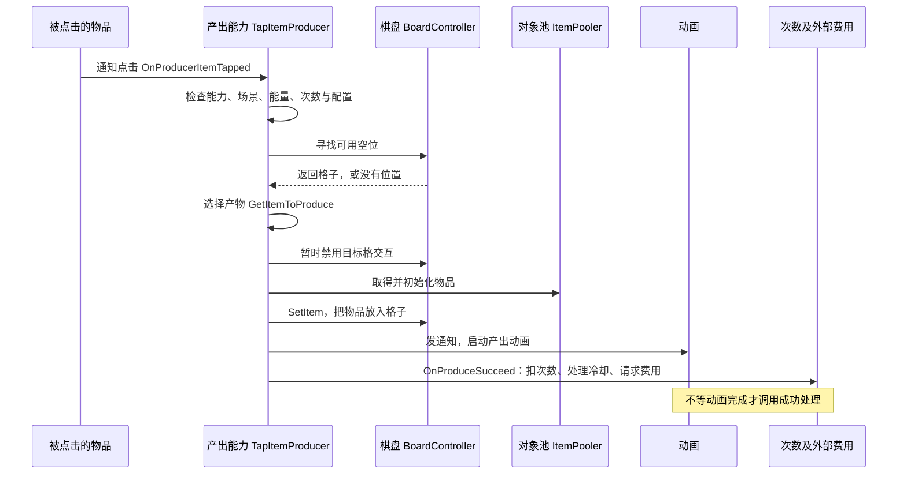

# Mergedom：一次合成、生成和解锁到底怎样发生

复核日期：2026-09-26 · Mergedom（目录标记 8.7.7）的静态实现分析。

## 1. 一个物品怎样获得产出能力

**项目同时使用两种扩展办法：特殊物品用子类，产出行为用能力列表。** 宝箱、气泡、工具各有专门类型；普通物品则可以装上若干份 `ItemProducer`。每份 Producer 负责一种产出行为，并保存自己的可用次数与冷却时间。下文“容量”指还能使用的产出次数，“充能”指冷却后恢复次数。

具体装哪些能力由当前等级配置决定：`ItemLevelData.IsProducer / ProducersData` 指明是否产出及能力参数；`ActionToProduce` 区分点击、合成触发、自动产出，枚举值分别是 0、1、2。代码没有展示任意效果系统或 ECS 架构，不能只凭“有组件、有列表”作此判断。

装配方法 `BaseItem.SetProducers` 先设置装配标记、重置计时显示，再清理旧能力，按当前等级配置逐项创建，并传入物品、保存记录和显示组件。升级会重新装配；不产出的等级会清空列表。因此，已看到的是特定时点重建能力，而非随时添加／移除能力的完整机制。

点击能力还按 `ProduceInOrder` 分成普通选择和顺序选择。各构造分支、参数及列表写入已经确认；但反编译缺少部分类型符号，匿名构造调用究竟对应哪个子类，仍是结合枚举和子类行为得到的**较强推断**。

### 多份能力能共存，但不是随意组合就能正确运行

* **保存靠顺序对应。** 第一个能力读第一份保存记录，第二个读第二份。若更新配置时调换顺序，旧次数和截止时间可能被分给另一能力；现有材料未见稳定能力标识或迁移规则。
* **显示只有有限的分配方式。** 第一项使用主计时器和能量图标，后续项使用副计时器且不传同一图标。三个以上能力的真实配置未取得，不能保证任意数量都能正确显示。
* **一次点击会依次尝试多份能力。** `BaseItem.OnTapped` 在 Monitor 保护区内复制列表后逐项调用。复制可避免遍历中的列表变化，但没有“一项成功就停止”或“全部成功才算成功”的通用协议；Monitor 也不能证明同线程的重复进入已被阻止。
* **能不能操作由多处判断。** 输入、格子、物品、Producer 和场景各自检查条件；未找到统一汇总所有限制的查询。

## 2. 点击生成器、自动生成器、宝箱和气泡有什么不同

| 产出方式 | 和玩家操作的关系 | 代码中额外保存什么 |
| --- | --- | --- |
| 点击生成 | TapItemProducer 只在 CanProduce=true 时调用 TryProduce；容量、充能增量、间隔和轮数由配置决定 | 剩余次数、起止时间；由 ActiveItemProducerData 保存 |
| 自动生成 | AutoItemProducer 在初始化、冷却结束或成功后尝试产出，失败会重试 | 复用基础保存状态，运行时另有重试协程；停止时清理。它不消耗能量，搜索范围为半径 1 的八邻格 |
| 顺序生成 | OrdererItemProducer 属于点击能力；先找到位置，再选择列表里的下一项 | OrderIndex 记录选到第几项，保存字段为 poi；到尾后按配置改走概率，否则返回空，不自动从头循环 |

这些能力升级时会重装，回收物品时会停止；耗尽后可能移除物品，也可能变成另一物品。

**宝箱是一件物品。** `Chest` 占据格子，使用第一份 Producer 的充能状态；`BaseChest` 管显示，棋盘记录宝箱集合与当前开启对象。点击时，如果未充能、可充能且容量为 0，会检查其它充能宝箱并提示，然后调用基础点击方法。开始／结束充能会通知棋盘、更新显示，时间与容量按 Producer 保存。**但真正发起开启请求、强制限制同时开几个的外部入口，还没有贯通。**

**格子锁和物品锁是两份状态。** 前者属于 `BoardSlot`，控制覆盖物与格内物品是否激活，保存为 `is_lck`；后者属于 `BaseItem`，影响操作权限、颜色和锁图，保存为 `is_i_lck`。两者都没有通用效果层数。底层交换方法会交换格锁值，不能仅凭字段归属推定它始终固定在地块上。

**气泡也是专门物品。** `BubbleItem` 配合 `BubbleComponent` 保存内含物品、等级、出生时间、寿命、IsPicked 标记、费用及转金币等级。拖动处理会修改 IsPicked；剩余时间由出生时间与寿命计算，到期转成金币。购买入口尚不完整，存档中间格式也有三字段缺口。

**未定位**：冰冻叠层、蜘蛛网专有规则、Buff 优先级和通用能力授予／抑制协议。`EffectsManager` 仅定位到粒子调用，不能据其名称推定 GameplayEffect 系统。

另有 `MergeItemProducer.OnProducerItemMerged` 使用 IsTransformingProducer、TransformItemData／Level 改变宿主／替换格内容的分支，说明扩展不止点击。这是专门能力回调直接写棋盘的例子；其与所有 Item 子类／OnMerge 委托组合的完整优先级尚未还原，不与普通 LevelUp 流程混写。

## 3. 为什么锁住的物品仍可能被合成

**“不能拖动”与“不能接受合成”不是同一条规则。** 物品锁会阻止主动拖动和点击，但拖放处理先判断两物是否匹配，再判断目标物锁。因此，一个锁住的物品仍可能成为合成目标。格子锁更靠前就被检查，会阻止该目标进入合成路径。

| 当前状态 | 拖动和点击 | 作为合成／换位目标 | 能否成为产出落点 |
| --- | --- | --- | --- |
| 格子暂时禁用交互 | 输入筛选和点击入口拒绝 | InteractWithBoardSlot 拒绝 | 近邻搜索与 TryProduce 检查并拒绝 |
| 格子锁定 | 格内物品被隐藏，输入和点击被限制 | 拒绝 | 近邻搜索排除 |
| 物品锁定 | OnDragStarting 与 IsTappable 拒绝 | 匹配时可合成；否则不能普通换位 | 已有物品，不是空位 |
| Producer 正在充能 | 未见一律禁拖；点击仍按能力条件和可用次数判断 | 物品子类可另设规则，仍需满足目标条件 | 与空位检查分别处理 |
| 气泡 | 有拖动钩子，未见统一禁拖；购买／弹窗入口不完整 | 自身 CanMergeWith 返回 false；特殊工具要另查，普通换位仍受物锁等条件限制 | 占据一格 |

这是对分散检查的汇总，不代表游戏已有统一权限接口。配置虽然有“可售出”等字段，但售出界面、金额与撤销管理者缺失，最终售出权限仍未知。

## 4. 从玩家操作到数据变化

下面重点区分“动画什么时候开始”和“格子、次数等数据什么时候改变”。`await` 只在任务未完成时暂停后续执行；已完成的任务会直接继续。回调是交给动画或服务调用的函数。必须检查任务和回调的实现，不能仅凭 async／await 名称认定每步都要等待动画。

### 4.1 载入棋盘

1. **读记录。** `BoardDataPiece.TryDeserializeFromLocal` 读取当前格式或迁移旧记录；只有参数允许时才尝试创建初始棋盘。上层怎样处理读取失败，仍依赖缺失的配置和保存服务。
2. **启动棋盘。** `BoardController.Initialize` 依次调用补偿入口、Create、SetBoardItems，随后处理日志并启动周期保存。补偿入口没有在本轮展开，不能视为通用错误恢复。
3. **建立格子。** Create 分配二维数组，写行列、画面位置和显示顺序，按保存列表找各格物品。无效物品 ID 会被清锁、设空，不会原样保留。
4. **取得物品并显示。** 从池取对象，依次 SetItem、SetLock、Init；设置所在格、锁和等级外观。气泡使用专门恢复方法。
5. **恢复能力。** SetBoardItems 跳过锁格、空格和物锁，其余物品按保存记录装配 Producer，并调用放上棋盘的处理。这里可能补充离线次数，自动能力甚至可能立即产出。
6. **何时允许玩家输入：待验证。** 初始化的上层调用者缺失，尚不能确认有一个“全部恢复成功才开放输入”的统一步骤。

资源未加载或 Instantiate 失败的整体撤销未定位，不能保证半初始化能自动恢复。

### 4.2 拖拽、移动、换位与普通合成

`ItemMover` 从输入／Collider 结果得到 Slot；OnDragStarting 拒绝缺物品和物锁，拖动更新 Transform。OnDragEnded 处理命中目标，InteractWithBoardSlot 先检查非自身、可交互、未格锁，然后依次分支：

```text
空目标             → 交换两格数据 → MoveItemToBoardSlot
非空且 CanMergeWith → ItemMerger.Merge
否则目标物未锁     → 交换两格数据 → 两物移动表现
否则／无有效目标   → 回到源格的移动表现
```

`CanMergeWith` 的基础分支检查规范化 Id 和 Level；一般要求未满级，另有对特定 Producer 子类型的分支。类型常量未完整恢复，不能把这一例外硬译为“所有生成器满级都可合成”。工具子类可以覆写判断。

用二级 A 拖到二级 B 上说明普通合成。代码中的 firstItem 是 A，secondItem 是 B。**A 最终升到三级并留在 B 的格子；这个结果分六步完成：**

1. 保存两物、两格以及旧种类／等级，暂时关闭两格交互。
2. 调用前置动画函数，提前恢复源格交互，再发 PreMergeSignal、启动位移并调用两物的 PreMerge。此时源格还记着 A，尚未清空。
3. 等待 PreMerge 任务和一个参数为 150 的延时。按 UniTask 用法推断单位是毫秒，但不能确认等待了所有动画结束；基础 PreMerge 发起表现后即完成。
4. **等待回来才改格子内容。** 清空两格，记录并清除目标物锁，再把 A 放到 B 的格子。
5. 调用并 await A 的 OnMerged。**普通 BaseItem 的实现没有再次挂起**：它 Reset 旧能力、升级、重建能力并立即返回 A 自己。因此，这一步不能写成普通合成的第二段动画等待；特殊物品的覆写需单独判断。
6. 更新结果显示顺序和位置，累计合成次数，发 PostMergeSignal，最后恢复目标格交互。已定位的棋盘订阅先解锁邻格，再请求保存。

上述顺序由异步状态机还原；源码的文本排列并非执行次序。B 最终由谁、何时回池尚未确认；把它移出合成提示列表，不等于已经回收它。

MoveItemToBoardSlot 先 SetItem，再注册回调并启动动画。完成回调将捕获 Slot 的 IsInteractable 设为 true，并读取 Mover 当前 pickedItem 发信号。局部无代际校验，外部动画取消协议缺失，旧回调安全性待验证。

**失败／中断**：无效目标会回原位；进入 Merge 后未定位统一回滚、事务锁或恢复快照。暂停、回池、资源／动画异常可能暴露中间状态，尚未运行验证；缺符号不构成原程序遗漏 finally 的证据。

### 4.3 点击产出与费用、随机的一致性

`BoardController.SelectBoardSlot` 排除锁格／空格后，新目标只更新 currentlySelectedBoardSlot 和选择显示；再次选择同一格，通过 IsTappable／IsInteractable 才调用点击虚函数。该槽位与 `BoardSlot.Tap` 一致，结合元数据及子类映射为 OnTapped。选择物品与触发产出因此是两步。



图为普通成功主链，省略活动分支。TryProduce 的能量检查包含余额／无限能量条件，落点必须可交互。OnProduceSucceed 减容量至不小于 0 并通知变化，再按耗尽条件 Dispose 或 StartRecharging，最后请求费用。TryProduce 还把配置 `ProduceItemLocked` 传给新物品的 Init，所以产出可以直接带物品锁，未见按产出数量阈值动态决定这一标志的证据。

将相关 IGameManager 调用解释为“费用请求”，依据是能量条件及传入参数，属于**较强推断**；实际钱包落账及成功返回语义缺失。动画或外部服务异常时，未见跨系统事务保证。Producer.Produce 会关闭落点交互，但可见的两个动画回调只操作 UI 服务并发出通知，没有直接恢复该格 IsInteractable。外部动画委托缺失，何时重新开放落点仍待验证。

失败也要分情况。场景不允许、能量不足或没有空位时，不进入成功扣次数／请求费用的路径，但可能显示提示或发通知。容量为 0 或没有产物配置时，失败处理反而可能清理已经耗尽的生成器，所以不能说“失败一定不改棋盘”。

满盘时不会选择这一次的产物，因而不会推进该次顺序掉落；但找落点本身也可能使用随机，不能推广成“所有随机状态都不变”。有位置以后，顺序游标会在真正产出前前进，异常时是否退回未知。多个 Producer 也分别执行，未见保证它们全部成功或全部失败的机制。

基础 GetItemToProduce 可取第一项或按概率选择；RngPicker 用 0..100 的整数采样调用，对每项概率×100 累加并比较。**较强推断**其使用 Unity 随机；边界范围的排他性、概率配置总和和随机种子未取得。不可声称确定性回放／服务器随机。

**保存入口**：Board 有 Save 回调、信号订阅和周期保存，但产出信号到 SaveBoard 的泛型映射未完全恢复。信号早于 OnProduceSucceed，保存是否已含容量扣减需核对订阅时点。

### 4.4 冷却结束、离线回来和暂停，各会发生什么

**在线冷却：记截止时间，定期检查。** StartRecharging 写入充能标记、开始与结束时间，再启动 UpdateRechargeTime 协程。每个正在充能的 Producer 各自约一秒检查一次，更新显示并比较是否到期；未见按到期先后统一调度的队列。时间数据由 Producer 保存，计时器负责显示。

**冷却完成：先恢复次数。** OnRechargeEnded 清充能标记，更新可用次数和充能轮数，必要时继续下一段冷却。点击生成器不会因此自动放出物品；如果还有储备次数，也不能仅因“正在充能”就认定不能点击。

**离线回来：按超出的时间补算，但两种上限分别处理。** Init 读取保存的开始／结束时间；在已经到期、时间差非负且间隔为正的普通分支中，算法可写成：

```text
n = floor((now - end) / interval) + 1
可用次数 = min(原可用次数 + n * 每轮增量, 最大容量)
已充能轮数 = min(原轮数 + n, 最大轮数)   // 最大轮数为 -1 时不截断
```

结束时已到一轮，再加超出的完整间隔。Init 的离线恢复和 OnRechargeEnded 的普通补时都采用这一核心计算。**代码没有先按“剩余允许轮数”截断 n，再据此补次数。** 例如假设只剩一轮、离线跨过三轮、每轮补 2 次且容量足够，公式会补 6 次，同时把已充能轮数封顶；这是静态算例，实际配置是否会进入这种组合待验证，不能直接宣布游戏存在多发问题。

树类物品另有特定分支。加速分支将容量直接赋为一次配置增量，不是沿普通公式累加；其在仍有储备次数时的实际效果也需结合配置核对。

**自动生成：恢复次数之后，再尝试放物品。** Auto 在充能结束、成功后，以及恢复暂停且仍有次数时调用 TryProduce。成功处理是直接再次调用，并未等待上一颗产物动画结束，因此一次调用链可能连续消耗储备次数并占据多个空位。满盘等失败会启动单个重试协程，停止时清掉；等待常数位于未提供的常量数据中，精确秒数未知。没有证据表明它会重演离线期间每一轮具体放到哪个格子。

**售出期间的暂停：把截止时间往后推。** Stop 停协程并记下时刻，Resume 将结束时间加上暂停时长，再启动协程。BaseItem.OnSell／OnUndoSell 调用这两个方法，表示这段暂停时间不计入冷却。

时间来源的完整实现仍缺，无法确认服务器授时、时区或时钟回拨处理。应用暂停时会请求保存，但对象隐藏、应用进后台与销毁是否都暂停计时，不能一概而论；全局恢复和关闭流程还不完整。

### 4.5 解锁与覆盖物解除

**邻格解锁先改状态，再播放粒子。** 普通合成完成通知进入 Board.OnPostMerge，再由 UnlockNeighbourBoardSlots 按行加一、行减一、列加一、列减一检查四邻。有效锁格先 SetLock(false)，关覆盖并激活格内物品；有物品时再发发现／提示通知、播放纸板解锁粒子。这里没有等待粒子结束才解锁。

物品锁独立：BaseItem.Unlock 清 IsLocked 后调用 SetVisual；SetVisual 选等级 Sprite，锁分支改变 RGB 并令 Lock 对象显隐。该方法设置 alpha=1，所以不能称为半透明规则；具体灰度常数和美术资源缺失。普通合成的目标物锁通过目标被消费处理，并把原锁标记带进 PostMerge 供断链表现使用；不能混同为格锁“降一层”。

PostMerge 订阅在 OnPostMerge 后调用 SaveBoard。粒子资源释放／完成回调因 EffectsManager 缺失而**待验证**。

气泡 ConvertBubbleToItem 先调用 WhilePicked，再取得原物、播放爆裂、从池初始化替换物并 SetItem 到同格，随后 await 和清理。拖动钩子写 IsPicked，但 WhilePicked 正文缺失，**拖起期间延后转换属较强推断**；IsPicked 是否也覆盖仅点击选中，以及等待的结束／取消条件，仍待验证。

### 4.6 删除／耗尽／回池／撤销

这里要分开两件事：**从棋盘上移除物品，以及把场景对象收回池里复用。** 回池函数不会自动把旧格子清空，调用者必须先处理格子关系。本包能追到生成器耗尽与对象池的主要片段，普通售出按钮、金额结算和完整撤销管理者仍缺。

1. **能力耗尽。** 成功或失败处理都可能调用 ItemProducer.Dispose。它先停止生产协程，再按配置变换或结束物品，不能一律理解为删除。
2. **清除格子关系。** 在“启用变换但没有替换物”的分支，先 SetItem(null)，再发移除通知并调用池接口。该接口是间接调用，完整动画回收协议尚未确定。
3. **重置并收进池。** ItemPooler.DisposeItem 停用物品，调用其 Reset，放进按 ItemData 分类的列表。基础 Reset 清物锁、等级回 1、清等级配置及所在格引用、重置显示，并停止和清空 Producer。
4. **需要时重新取出。** GetFromCache 从列表移除对象，再重置 Transform、调用 Reset 并激活。旧对象可以承载下一件物品，所以旧动画回调必须相应失效；现有材料未证明这部分已经完整处理。

移除通知的棋盘订阅会清理合成提示并调用 SaveBoard；其它删除入口是否都发相同通知仍需检查。Reset 中虽有动画相关辅助调用，但具体动画取消和全部事件退订实现缺失。

售出／撤销目前只确认 OnSell 停止 Producer、OnUndoSell 恢复并顺延时间。这些方法不能证明金额如何退回、是否恢复同一业务身份、原格被占时怎么办，或关闭后还能否撤销。
