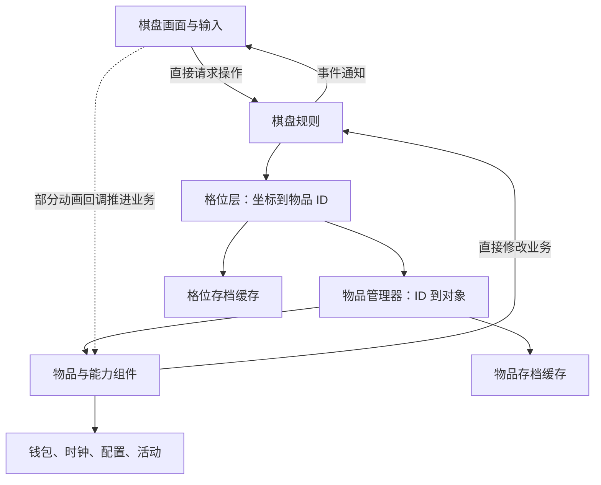

# 01 · Seaside Escape 2.6.0：架构与数据模型

复核日期：2026-09-26。分析对象为 `参考项目/SeasideEscape_2.6.0_APKPure/`，输出位于其 `_分析实现方案/`；两者均相对仓库 `/Users/betta/Company/Projects/MergeTwo`。

本项目以**轻量格位容器、有身份的物品对象、物品能力组件和绑定物品的画面对象**组织二合。规则主要在模型中直接执行，但部分画面回调也会推进业务。它具有逻辑与表现的分工，没有贯通所有操作的严格分离边界。[棋盘装配](../code/Lua/decompiled/Board/Model/Board/MainBoardModel.lua#L5)、[表现回调推进业务](../code/Lua/decompiled/Board/View/BaseBoardView.lua#L227)

## 1. 材料范围与结论可信度

当前资料有 178 个从 Lua 5.3 字节码恢复的 Lua 模块，以及对应 178 个字节码文件。356 个代码文件与原哈希清单一致。历史提取记录标识版本 2.6.0、包名 `com.gamedots.seasideescape`、Unity 2022.3.62f2；原 XAPK 不在目录内，未独立重验 Android 版本元数据。原语法检查记录保留，本次没有重新反编译、逐指令比对或运行游戏。

复核覆盖主盘数据、输入、工厂、代表能力、合成与生成、拆分与吞噬、售出撤销、事件和保存；活动、订单、同步只追到解释核心关系所需部分。检索全部模块不等于逐函数审计整个游戏。

正文的代码行为为**已确认（静态证据）**；由其推导的风险标为**较强推断**，缺少关键材料的标为**待验证**。主要缺口是实际配置、专用 View 与资源、对象池／动画桥接、顶层调度、撤销入口和原生数据库实现。反编译中的异常变量或调用形状不直接算原项目缺陷。

## 2. 谁负责什么

| 对象 | 实际职责 | 主要数据与身份 |
| --- | --- | --- |
| MainBoardModel | 主棋盘业务入口，处理移动、合成、存取、售出等 | 持有格位层、物品管理器、缓存、库存和订单模型；由 GM 管理 |
| SceneItemLayerModel | 记录哪个格子放了哪个物品，并维护查询缓存 | 二维 ID 矩阵、空位数、类型计数、类型／组件索引；没有独立物品数据 |
| ItemManager | 根据实例 ID 查找运行物品，生成保存数据 | `ID → ItemModel`；管理棋盘和库存中的物品 |
| ItemModel | 一件具体物品的身份、种类、位置和基础属性 | ID、Type、code、位置、成本、组件集合、临时锁 |
| 能力组件 | 实现生成、吞噬、变形、包装限制等行为 | 各自的次数、阶段、计时或进度；通常没有独立实例 ID |
| ItemView／BoardView | 处理图片、动画、选中与输入；维护物品到画面的绑定 | `ItemModel 对象 → ItemView`、Transform、表现组件与动画句柄；不进入棋盘存档 |
| 外部服务 | 提供配置、时钟、钱包、活动、同步等 | 组件通过全局 GM 直接访问 |

主棋盘继承链是 `MainBoardModel → BaseSceneBoardModel → BaseActionBoardModel → BaseBoardModel`，用于代码复用，不是一次操作必须依次通过的四个服务。



“Model”不等于纯数据或独立核心：物品模型会计算 Unity 向量，规则中存在直接打开 UI 的调用，组件依赖 GM。局部坐标、匹配和计时规则可能用替身服务测试，但目录中没有已确认的无画面宿主；剪刀和批量吞噬的现有执行路径还需要 View 回调。

## 3. 棋盘、格子和坐标

### 占位与物品位置是两份运行表示

主棋盘为 7 列、9 行，矩阵 `m_data[y][x]` 保存物品 ID，物品对象保存在 ItemManager。持久数据分开保存：Board 表以 `x_y` 为键记录 itemId，Item 表以实例 ID 为键记录物品数据。

下面是说明性示例，不是真实存档：

```text
matrix[2][3] = ID_A       第 2 行、第 3 列的占用
Board["3_2"].itemId=ID_A  对应的持久格位记录
ItemManager[ID_A]        运行物品，内部位置为 (3,2)
Item[ID_A]               保存 code、成本及能力数据，不保存 x/y
```

移动时必须同时更新格位占用和物品位置；恢复时先建物品，再由 Board 表回填位置。`SetItem` 维护计数和索引，但不是完整移动事务，也不会代替所有调用者清理旧关联。例如直接以新物覆盖旧物时，并非所有旧索引都会无条件摘除；正常移除、替换和换位依赖各自的调用顺序。[格位和索引维护](../code/Lua/decompiled/Board/Model/Board/SceneItemLayerModel.lua#L150)

### 格子没有独立业务身份，坐标也不是不可变值

主盘格子是数组槽位，没有自己的实例 ID、能力集合或独立生命过程。格背景是单独的表现对象，不是领域 Cell Entity。

`BoardPosition` 保存棋盘类、x、y，按这些字段比较相等。它是**可变、池化的坐标对象**：释放时字段被清空，之后可被重新使用。格子迭代器会释放上一次返回的位置；长期保存迭代位置必须复制。格背景创建时确实调用 `BoardPosition.Copy`，物品初始化也复制传入位置。把它简单称为“值对象”，容易忽略这个生命周期约束。[相关实现](../code/Lua/decompiled/Board/Model/Base/BoardPosition.lua#L44)

相等比较没有棋盘实例键。若同时存在两个同类棋盘，仅比较类与坐标不足以区分它们。现有主盘依赖固定类和全局 GM；把它改成多实例服务属于额外设计。

### 坐标转换

逻辑坐标从 1 开始，左上是 `(1,1)`，行号向下增加；Unity 棋盘局部 y 向上增加。主盘格宽 `S=142`，列数 W=7，行数 H=9：

| 转换 | 公式 |
| --- | --- |
| 格子左下角 | `localX=(x-1)*S`，`localY=(H-y)*S` |
| 主盘格背景／物品中心 | 在左下角基础上加 `(S/2,S/2)` |
| 局部点转格坐标 | `x=floor(localX)//S+1`，`y=H-floor(localY)//S` |
| 主盘物品 z 排序 | `(W*H-W*(y-1)-x+1)*10` |

据此，主盘 `(1,1)` 左下角为 `(0,1136)`，中心为 `(71,1207)`。这是公式计算，不是运行测量；142 也不是已确认的屏幕像素尺寸。屏幕点先转世界坐标，再经棋盘 Transform 逆变换得到局部位置；资源锚点、缩放和图标边距缺少材料。拖动跟手使用实时 Transform，最终匹配依据逻辑物品和位置。[坐标计算](../code/Lua/decompiled/Board/Model/Board/BaseBoardModel.lua#L40)

`IsValid` 只判断矩形边界 `1≤x≤W、1≤y≤H`，不检查解锁或教程禁区；输入取消可使用 `(0,0)` 这样的无效坐标。没有定位到主盘通用空洞、预留落点或多格物品协议。

### 空位、物品包装与地格锁

| 情况 | 实际归属 | 对操作的影响 |
| --- | --- | --- |
| 空位 | 矩阵没有有效物品 ID | 可用于生成；清格不一定删除整条 Board 记录，取决于数据库列表示 |
| 纸箱、蛛网、等级障碍 | 占格的包装 Item | 解除主要通过替换物品，不是修改 Cell.lock |
| 教程或暂时禁用位置 | View 的输入过滤数据 | 不能据此认作持久地格状态 |
| 活动云锁 | Board 的 `m_tileLock[y][x]` | 固定在坐标，锁住的格子内部仍可有物品 |

活动云锁由 cloud 配置和活动 `m_cloudState` 派生。普通 `GetItem` 会隐藏锁格中的物品，`force` 参数可读取底层对象；空位计数会扣除“锁住的空格”，搜索也跳过锁格。因此“查不到可操作物品”不能直接等同于“这是空格”。解锁状态交给活动模型保存，完整活动恢复和表现链未覆盖。[活动格位实现](../code/Lua/decompiled/Board/Model/Board/BaseUIBoardItemLayerModel.lua#L86)

部分活动还有独立变换层和额外生成器列表；这证明局部有多层数据，不证明主盘拥有通用多层实体体系。

## 4. 物品种类、身份与能力

### 实例 ID、Type、code、合成链各自表达什么

- **实例 ID**标识一件具体物品，是 Item 表主键。首次保存时分配，恢复时使用原行键。
- **Type**指配置种类，同种物品可以有不同实例 ID。
- **code**用于创建和保存，可能带 `c#`、`b#` 等包装前缀；普通物品的 code 通常就是 Type。
- **chainId／level**由配置 Type 的字符串规则派生。实际合成结果来自 `MergedType`，反向 `MergedFromType` 由配置关系生成，不是所有结果都按“等级加一”计算。配置缺目标或多个前驱会记录错误。
- **图鉴解锁**是 ItemDataModel 的独立种类记录，不是这件物品能否移动的锁。[种类配置](../code/Lua/decompiled/Board/Model/ItemDataModel.lua#L82)

ID 由“服务时间＋三位计数”组成。同一个分配器在时间不前进时递增计数，超 999 后推进内部秒数；初始化没有从已有 ID 恢复计数，也未在分配入口查重。NoCDTrain 与主盘共用分配器。**待验证：**同秒重建分配器、多个独立分配器或恢复旧数据时如何避免冲突，不能声称它提供了跨进程的全局唯一保证。[ID 分配](../code/Lua/decompiled/Model/DB/DBIdGenerator.lua#L10)

### 创建时装配能力，运行时显式协作

物品工厂按配置分支添加生成、变形、吞噬、选择、充能等组件；没有自动发现或反射注册过程。普通物、生成器、宝箱和大部分道具共用 ItemModel。这些能力组件是带数据和行为的 Lua 对象，不是 Unity 画面组件。

组件以元表作为类型键，每个具体类型只占一个位置；父类型查询返回首先登记者。组件派发用 `pairs` 遍历，不规定业务优先级，也不采纳返回值来终止传播。`GetMergedType` 等查询还会使用首先找到的组件实现，所以多个能力不能只靠添加顺序解决冲突。

生成、吞噬、变形的装配条件可以同时成立，组件通过显式互查协作。这里确认的是代码可组合的结构，不是所有组合都有真实配置。未找到逻辑侧 RemoveComponent；格位层的组件查询索引也没有自动跟随运行时增删。已有 Add 接口不等于完整热插拔能力。[组件管理](../code/Lua/decompiled/Board/Model/Item/ItemModel.lua#L48)

### 包装保存内层代码，不保存完整内层对象

例如蛛网对象的 Type 是 Cobweb，组件只保存解开后的 innerCode。工厂不会先创建完整生成器再给它加蛛网；解除时才按 innerCode 创建新物。嵌套前缀可以留待下一次解析，但不表示多个有状态内层物品同时运行。

外层也可能附加其它组件：主盘／Hunt 纸箱有 Sticker，主盘气泡有 ItemToken，Freefall 创建的物品还可加 ItemFall。因此“包装只允许一个组件”同样不准确。关键是**内层完整能力和状态没有被实例化保存**。[工厂实现](../code/Lua/decompiled/Board/Model/ItemModelFactory.lua#L3)

### 哪些操作保留身份

| 操作 | 身份与状态结果 |
| --- | --- |
| 移动、正常入库取出 | 保留对象、ID 和能力数据；入库退出格位层，但不清原位置字段 |
| 合成、普通变形、拆壳 | 移除旧物并创建新 ID；可显式传成本，没有通用的旧能力状态继承 |
| 普通移除 | 先清格，再调用组件 OnRemoved，最后摘物品索引和存档行；不统一调用 Destroy |
| 售出撤销 | 复用调用方传来的旧对象和 ID，再保存并占格 |
| 整盘 Destroy | 对仍在物品字典中的对象调用 Destroy；组件基类移除全局监听 |
| 转入产物缓存再取出 | 通常按 code 和部分附带数据创建新物，不等同于正常库存保留原对象 |

旧对象还可能被消息、View 或撤销记录引用。它们提供退场数据，但没有统一的 Active／Retiring／Released 协议。全局事件监听用弱键表，不能只凭普通移除没调用 Destroy 就判定内存泄漏；同样，弱引用也不能代替所有订阅、计时和旧回调清理。[移除顺序](../code/Lua/decompiled/Board/Model/Board/BaseBoardModel.lua#L245)、[物品管理器](../code/Lua/decompiled/Board/Model/Board/ItemManager.lua#L61)

## 5. 查找落点与更新成本

| 查询 | 实际顺序 |
| --- | --- |
| 逐格空位 | 从左上逐行；反向迭代从右下逆序 |
| 八邻空位 | 上、右上、右、右下、下、左下、左、左上，只查相邻一圈 |
| 方环扩散 | 从近到远逐层方环；首圈与八邻次序相同，外圈从顶边靠左处向右、下、左、上；不按欧氏距离排序 |
| 同链贴近 | 全盘找附近有空位的同链物品，优先等级差小，同差优先低等级；同等级命中即返回。候选周围按左、右、上、下、左上、左下、右上、右下查空位 |

方环全失败可返回调用方提供的备用位置，换位用源格作退路。贴近搜索会过滤包装 code。多类型查询 `FilterItemsWithTypes` 在首个有结果的类型处就返回，不是所有类型结果的并集；不能只根据函数名推断行为。[落点搜索](../code/Lua/decompiled/Board/Model/Board/BaseItemLayerModel.lua#L45)、[多类型查询](../code/Lua/decompiled/Board/Model/Board/SceneItemLayerModel.lua#L121)

**静态估计：**直接占位和计数近似 O(1)，按类型／组件取列表约 O(k)，全盘扫描 O(W×H)，方环最坏 O(max(W,H)²)，同链贴近约 O(W×H×8)。主盘每帧从索引创建物品列表再派发 Update，每秒逐格派发；两者不是相同的快照语义。逐格过程中替换或生成物品，可能影响后续格子的当次访问，不能预设“所有物品恰好更新一次”。未测帧率、分配量或 GC，不评价实际性能高低。

## 6. 保存、恢复与数据一致性

### 数据分别保存在哪里

| 数据 | 运行归属 | 持久表示 |
| --- | --- | --- |
| 占位 | 格位层矩阵 | Board：`x_y → itemId` |
| 基础物品和成本 | ItemModel | Item：code、成本／评分、创建时间、关联标识等 |
| 能力运行状态 | 各组件 | 写入同一 Item 行，例如生成次数、吞噬进度和计时起点 |
| 正常库存 | ItemStoreModel 的 ID／storeTime 列表 | Inventory 引用同一个 Item 对象 |
| 产物缓存 | ItemCacheModel 的缓存记录列表 | CacheItem：code、缓存类别和部分附带数据；有队列及多种栈顺序 |
| 位置奖励 | 主盘配置的奖励层／BoxTypeMap | 配置按坐标取值；不是独立 Cell 奖励实体 |
| 活动云状态 | 活动模型与 Board 派生锁矩阵 | 由活动模型保存，完整闭环待验证 |
| View 状态和临时锁 | 表现对象，以及 Item 的 `m_bLocked` | View 不存档；`m_bLocked` 未序列化 |
| 钱包、时钟 | 外部 GM 服务 | 不归格位或物品组件独占 |

组件序列化写到同一行，没有按组件类型分隔的通用数据包。不同组件可能复用列名，例如 Sand 和 Spread 都用 `spreadState`；现有装配分流避免了这对同时存在，任意组合则需要新的存档约束。

`SaveItemProperty` 把运行对象当前值写入 DBTable 缓存；DBTable 再排 SQL，稍后的 LateUpdate／TrySaveAll 才进入原生数据库 Transaction；Destroy 也尝试写入待保存数据。**业务写入、存档缓存、事务返回和真正落盘是不同边界。** 普通 Lua 字段赋值不会自动被 DBTable 观察；存在序列化方法，也不代表每个修改点都已保存。

数据库代码对成功、错误命令和忙分别处理，也有健康检查、上传及重建分支。原生 Transaction 的范围、部分写入和崩溃耐久性缺证据，不能把它等同于一次玩法操作的原子提交。[存档写入调度](../code/Lua/decompiled/Model/DB/DBTableManager.lua#L28)、[事务桥接返回处理](../code/Lua/decompiled/Model/DB/DatabaseModel.lua#L80)

### 主棋盘恢复的实际顺序

配置和数据库加载方法可见，但最外层 GM 的完整启动顺序缺失。进入 `MainBoardModel:OnSyncDataFinished` 后，可确认的同步恢复顺序是：

1. **先加载库存记录列表**，此时只是 ID／时间等记录。
2. ItemManager 遍历 Item 表，检查 code，按配置创建对象和能力，再读回基础及组件状态。
3. 格位层恢复 Board：首次无数据时用初始地图创建；已有数据时解析坐标、写矩阵、回填物品位置并登记索引。
4. 恢复产物缓存和订单模型，再尝试建立库存种类统计。

以上是方法内部的顺序。[同步恢复入口](../code/Lua/decompiled/Board/Model/Board/MainBoardModel.lua#L36)

此外，LateInit 负责清理没有棋盘／库存归属的孤立物，以及无有效物品的库存记录。主盘 View 的 Awake 绑定模型，复制坐标创建格背景和物品 View，注册事件与触摸。这两个阶段的顶层调用、资源就绪到开放输入的完整先后协议未保留，不能把它们补作 OnSyncDataFinished 的后续步骤。

工厂构造可能查询时钟、装配监听、选择随机阶段；之后才反序列化覆盖字段。恢复不是保证无副作用的数据拷贝。code 兼容转换还可能保留原 ID、重建为新种类并写回，而不是迁移全部旧能力字段。未知内容可退化为金币或链最高级，这是原项目修复策略，不是我方应默认照搬的规则。

**补充的恢复边界：**格位层 ResetData 只重置类型计数和空位数，没有清空矩阵与两类查询索引；ItemManager.ResetData 换掉对象字典，没有先 Destroy 旧对象；库存统计的 TryInit 只在尚未存在时创建。由此不能说这些恢复函数可以在同一实例上任意重复调用且结果相同。**较强推断：**若外部不重建对象而直接重载，可能残留旧占位／索引或统计。顶层重建调用链缺失，是否实际触发待验证。[恢复方法](../code/Lua/decompiled/Board/Model/Board/SceneItemLayerModel.lua#L25)

### 同步与服务端边界

客户端本地执行规则，并上传／下载物品、格位、库存、钱包等状态。下载数据通过同步入口覆盖 DBTable，存在强制采用服务器数据和冲突窗口分支。上传前调用的 `GM:SaveImmediately` 定义未保留。

这能证明客户端有本地规则和状态同步，不能证明服务端是否逐操作复算、如何校验或如何反作弊，也不能补造“同步完成后必定重建整个棋盘”的缺失调用。[同步上传与覆盖](../code/Lua/decompiled/Model/Sync/SyncModel.lua#L289)

## 7. 活动复用的边界

NoCDTrain 继承主场景棋盘，默认 5×5、格宽 156，可调整尺寸，与主盘共用 ID 分配器和库存；它会改写类表上的宽高。Freefall 继承 BaseUIBoardModel，默认 6×7，并按配置调整尺寸，拖放需消耗活动资源，失败回位，不采用主盘普通换位规则。[NoCDTrain 装配](../code/Lua/decompiled/NoCDTrain/Board/NoCDTrainBoardModel.lua#L1)、[Freefall 拖放](../code/Lua/decompiled/FreefallActivity/Board/FreefallActivityBoardModel.lua#L177)

它们复用了物品、组件和部分棋盘操作，但规则与存储层并非完全相同；活动尺寸、云锁、额外生成器、变换层都不能无条件推广到主盘。尤其主盘坐标公式和全局对象使用方式，不构成已经支持多棋盘实例隔离的证据。
