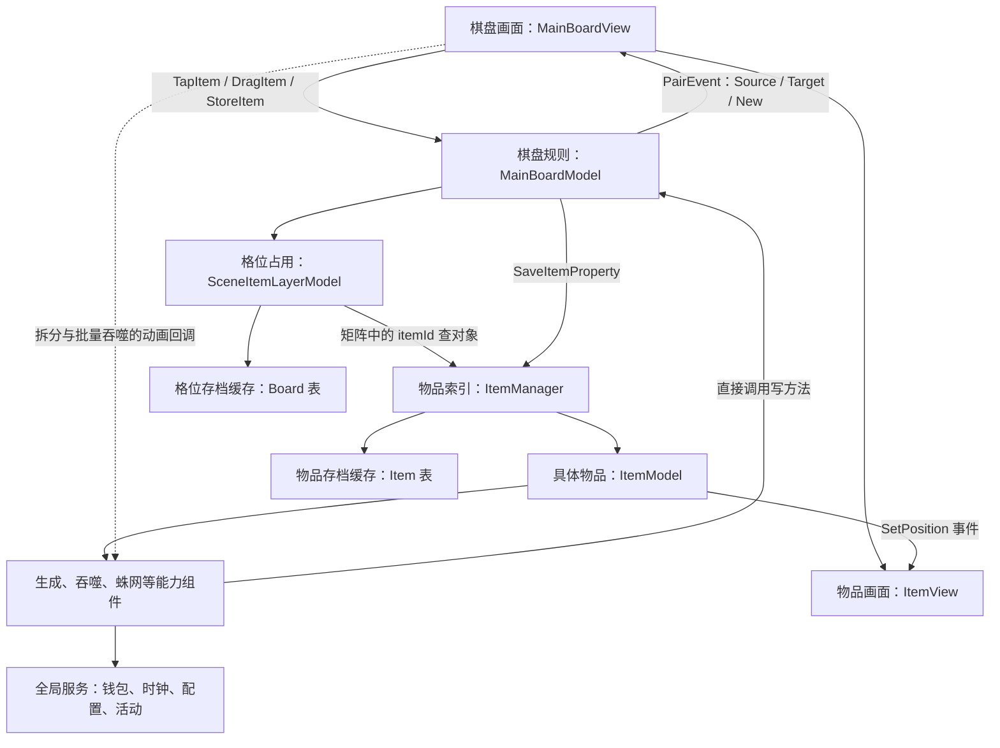
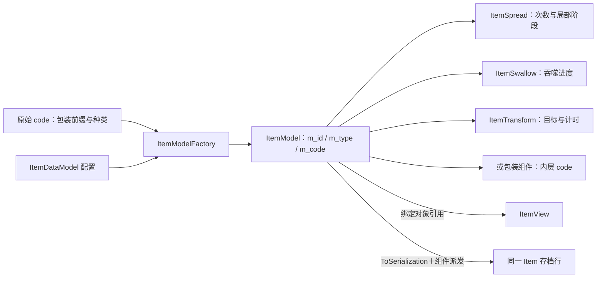

# Seaside Escape 2.6.0：架构、棋盘与物品模型

这篇先解释“谁负责什么”，再解释棋盘、物品和存档怎样配合。先读第 1–3 节，就能建立整体认识；坐标公式、搜索成本和字段表可在需要时查阅。

**最核心的关系是：格位层记录占用，物品管理器保存对象，物品携带能力，画面绑定物品对象。** 它们不是彼此完全隔离的层，部分画面回调会反过来修改业务。

本文仅做静态分析。“已确认”表示恢复源码直接可见；“较强推断”和“待验证”会单独注明。证据编号可到 [04](04_证据索引.md) 检索，项目版本与路径说明见文末。

## 1. 一次操作会经过哪些对象

**已确认（静态证据）：**玩家拖动物品时，画面先收集输入，再直接调用棋盘模型的方法。棋盘判断是移动、合成还是其它操作，修改物品与格位数据，然后通知画面。生成器等特殊行为，则由物品上的能力组件执行（[E02、E06、E07、E10–E12](04_证据索引.md#e02)）。

源码名称可以这样对应：`MainBoardModel` 是主棋盘的业务入口；`SceneItemLayerModel` 记录格位占用；`ItemManager` 按 ID 保存物品对象；`ItemModel` 代表一件物品；`ItemView` 是它在画面中的对应对象。工厂 `ItemModelFactory` 根据配置为物品添加生成、吞噬等能力。

主棋盘通过 Lua 元表继承共用行为，继承链是 `MainBoardModel → BaseSceneBoardModel → BaseActionBoardModel → BaseBoardModel`。这是代码复用关系，不表示一次操作依次穿过四层独立服务。



图中的虚线值得注意：剪刀与批量吞噬的动画回调确实会调用业务方法（[E23、E24](04_证据索引.md#e23)）。所以判断“逻辑与表现是否分开”，必须逐条看操作，不能只看类名。

下表比较的是**逻辑什么时候生效**，不是玩家什么时候看到动画结束：

| 流程 | 谁写业务，何时开始表现 | 分层判断 |
| --- | --- | --- |
| 普通移动／换位 | `DragItem` 先写 Layer，最后 `ItemModel:SetPosition` 改位置并通知 View | **已确认（静态证据）**：跟手 Transform 不作为落子后的权威位置；有短暂逐步写入窗口（[E09、E10](04_证据索引.md#e09)） |
| 普通合成 | 两旧物从活跃容器摘除，新物保存并占位，然后发 `MergeItem` | **已确认（静态证据）**：核心合成无需动画 ACK；四邻反应和额外产出却在该表现事件后继续执行（[E11–E13](04_证据索引.md#e11)） |
| 点击生成 | 扣次数并保存→生成物及占位→SpreadItem 表现事件→扣能量→耗尽／变形 | **已确认（静态证据）**：表现不必完成，但同步回调进入时整次业务尚未结束（[E15–E17](04_证据索引.md#e15)） |
| 剪刀拆分 | View 的 0.5 秒回调才调用 `DoSplitItem` | **已确认（静态证据）**：表现推进业务（[E23](04_证据索引.md#e23)） |
| 吞噬 | 拖入即时调用 `Swallow`；批量点击由飞行完成回调逐个调用 | **已确认（静态证据）**：同一组件有两种时序（[E24](04_证据索引.md#e24)） |
| Turnbox 变形 | 模型先 Replace；View 设置新物 `m_bLocked`，完成时清锁 | **已确认（静态证据）**：业务存在已成立，但可移动性受动画写锁影响（[E25](04_证据索引.md#e25)） |

`BaseSceneBoardModel:DragItem`、`ItemSplit:StartSplitItem` 还直接开确认窗；`ItemModel:GetLocalPosition` 使用 Unity 向量及 TileSize；组件广泛访问 `GM`。因此“规则多在 Model”成立，“Logic 不依赖具体 UI／引擎／全局服务”不成立（[E06、E10、E23、E29](04_证据索引.md#e06)）。

**较强推断：**小范围规则可以用 GM 替身测试，尤其坐标、匹配、次数恢复；但原代码没有已核对的无画面宿主。只跳过创建 View 并不能执行剪刀或点击批量吞噬。存在 `GameConfig.IsTestMode`／自动点击分支，也不等于存在独立单元测试（[E09、E14、E23、E24](04_证据索引.md#e09)）。

## 2. 棋盘、格子与坐标

### 格子和物品为什么要分开保存

**已确认（静态证据）：**主棋盘的 `Matrix.m_data[y][x]` 存物品 ID，`ItemManager.m_itemTable[id]` 存 `ItemModel`。`SceneItemLayerModel` 同时维护 DB `Board["x_y"].itemId`、矩阵、类型计数、空位数和按类型／组件查物品的索引（[E03–E05](04_证据索引.md#e03)）。

下面是**说明性数据示例，不是真实配置或存档**：

```text
Board 内存／持久映射：          ItemManager 运行对象：
matrix[2][3] = "ID_A"       → m_itemTable["ID_A"] = ItemModel
Board["3_2"].itemId="ID_A"      m_id="ID_A", m_position=(3,2), m_code="示例种类"
                               m_components[ItemSpread]=生成能力实例
Item 存档：
Item["ID_A"] = {code=..., spreadState=3, spreadStartTimer=..., ...}
```

可以把上面的例子读成：“第 2 行、第 3 列放着 ID_A；ID_A 对应一个能生成物品的对象。”格子不需要复制生成次数等全部物品数据。

但物品对象也保存自己的位置。因此移动 ID_A 时，既要更新格位占用，也要更新物品位置。恢复存档时，Item 表本身不保存 x/y：程序先根据 Item 表创建对象，再根据 Board 表调用 `SetPosition` 放回对应格位。两份运行表示由具体路径依次维护（[E02、E04、E06](04_证据索引.md#e02)）。

### 坐标怎样对应画面

阅读下面公式前，只需记住两个方向：**棋盘的行号向下增加，Unity 局部坐标的 y 向上增加。** 因此两者需要做一次翻转。公式中的 W/H 表示列数／行数，S 表示格宽。

主盘声明宽 7、高 9，基础格宽 `TileSize=142`。`BoardPosition:IsValid` 仅做 `1≤x≤W, 1≤y≤H`；没有在该方法检查地块解锁、教程禁区或洞。恢复读取的初始地图是 `m_initCodeMap[y][x]`，该配置文件未保留（[E02–E04](04_证据索引.md#e02)）。

| 含义 | 代码公式 |
| --- | --- |
| 格坐标→格左下角局部坐标 | `localX=(x-1)*S; localY=(H-y)*S` |
| 物品／格背景中心 | 在前式基础上加 `(S/2,S/2)`；ItemView 另计算 z 排序 |
| 局部坐标→格坐标 | `x=floor(localX)//S+1; y=H-floor(localY)//S` |
| 主盘物品 z 排序 | `(W*H-W*(y-1)-x+1)*10` |

来源：[BoardPosition](../code/Lua/decompiled/Board/Model/Base/BoardPosition.lua#L22)、[BaseBoardModel](../code/Lua/decompiled/Board/Model/Board/BaseBoardModel.lua#L54)、[ItemView](../code/Lua/decompiled/Board/View/Item/ItemView.lua#L427)（[E03、E22](04_证据索引.md#e03)）。`(1,1)` 是顶行左列，y 增大向下；Unity 局部 y 增大向上。主盘 `(1,1)` 左下角为 `(0,1136)`，中心为 `(71,1207)`；这是公式计算，不是运行测量。

```text
逻辑坐标               Unity 棋盘局部平面
(1,1) (2,1) … (7,1)    ↑ localY
(1,2) …                │
  …                    └──→ localX
(1,9) …       (7,9)
```

屏幕点经 Camera 转世界点，再经 `InverseTransformPoint` 转棋盘局部坐标；缩放、父级变换由 Unity 处理。拖拽跟手和库存按钮重叠检测使用实时 Transform；**主合成匹配本身读物品种类和逻辑位置**。具体 prefab 锚点、摄像机缩放及实际图标边距没有材料，不能把 142 称为屏幕像素尺寸（[E09、E22](04_证据索引.md#e09)）。

### 格子有没有独立身份和生命过程

**已确认（静态证据）：主棋盘逻辑格子是矩阵槽位＋BoardPosition 值对象，没有单独 Cell 实例 ID／能力／存档记录生命周期。** `BoardPosition` 只有 boardClass、x、y，且有对象池；View 单独实例化 tile prefab，把 `BoardPosition` 对象作为 `m_tileMap` 的键。这是格背景的表现对象，不是领域 Cell Entity（[E03、E04、E22](04_证据索引.md#e03)）。

`BoardPosition.__eq` 比较 boardClass 和坐标，没有 Board 实例键。主盘固定类＋全局 GM 的前提下够用；**较强推断：**若同时创建两个同类独立棋盘，需要明确实例隔离，不能直接依赖该比较。NoCDTrain、Freefall 还修改类表上的宽高，亦不应直接当成多实例配置隔离方案（[E03、E31](04_证据索引.md#e03)）。

### “格子锁住”与“物品被包住”分别归谁管理

从外观上看，等级障碍和活动云锁都可能挡住一格，但数据归属不同：前者用一个障碍物品占格，后者用棋盘坐标上的锁状态限制操作。这个差别决定了解锁时是“替换物品”还是“改变格子状态”。

| 情形 | 代码中的表示 | 边界 |
| --- | --- | --- |
| 空格 | 矩阵无 itemId，经 Manager 查到 nil | DB 空值的具体列类型未保留；不能声称每次清格都删除 Board 行（[E04、E26](04_证据索引.md#e04)） |
| 无效坐标 | `IsValid=false`，如输入取消用 `(0,0)` | 无效不是一个可持久化格子（[E03、E09](04_证据索引.md#e03)） |
| 主盘等级未解锁地块外观 | `ItemMapBlocker` 包装物占该格 | 不是 Cell.lock 字段；达到等级替换 Item（[E18](04_证据索引.md#e18)） |
| 纸箱／蛛网 | `ItemPaperBox/ItemCobweb` 包装物占格，持内层 code | 不能据名称认作覆盖层 Entity（[E07、E18](04_证据索引.md#e07)） |
| 教程／临时禁用格 | View `m_disabledPosList`／教程强制坐标 | 是输入过滤，不是持久地格模型（[E09](04_证据索引.md#e09)） |
| 活动云锁 | `BaseUIBoardModel.m_tileLock[y][x]`，从 cloud.board 和 m_cloudState 派生 | 是真正留在坐标的规则层；锁格内也可存物，普通 GetItem 隐藏，force 可读（[E33](04_证据索引.md#e33)） |
| 暂时保留落点、多格主盘对象 | 本次主盘路径未定位到独立表示 | 待验证，不能用 toBeRemoved 表现标记代替预留占位 |

活动 `BaseUIBoardItemLayerModel` 会从总空数扣除 `m_lockedEmptyPositionCount`，空位搜索也检查云锁。活动还有可选 `HuntActivityItemTransformLayerModel` 和额外生成器列表。因此本项目**局部支持多层数据**，但没有证据把活动隐藏层推广为主盘通用多层／多格 Entity 系统（[E33](04_证据索引.md#e33)）。

## 3. 一件物品怎样拥有能力，又怎样结束生命

### 同一物品对象可以携带多个能力

生成器、宝箱和普通合成物大多共用 `ItemModel`，差别主要来自配置和附带的能力。下面的 Spread、Swallow、Transform 分别表示生成、吞噬材料和变形；并不意味着每件物品都有这三种能力（[E07](04_证据索引.md#e07)）。



**已确认（静态证据）：**普通物、生成器、宝箱、道具大多共用 ItemModel，没有为每类物品建业务 Item 子类。组件以自身元表为键——在这里可把元表理解为组件类型的标识。登记时还沿继承链添加查询别名，所以代码可以按基类能力查找组件。`DispatchComponentEvent` 对所有具体组件调用同名方法；BaseItemComponent 的默认空方法是明确的继承钩子，不能误认为反编译遗漏（[E06、E07、E24](04_证据索引.md#e06)）。

### 包装物没有同时运行一个完整的内层物品

包装是另一条装配路径。例如 `c#某种类` 构造 `Type=Cobweb` 的 ItemModel，再附 ItemCobweb(innerCode)。它**不会先创建完整生成器再叠蛛网**。纸箱、气泡、冰也各走包装分支；只有解除后 `ReplaceItem` 才按内层 code 构造新物。嵌套前缀可作为内层 code 留待下一次替换解析，不等于多个有状态内层对象同时存在（[E07、E18、E19](04_证据索引.md#e07)）。

### 能力共存后，仍需要明确的协调规则

普通配置可同时触发 Spread、Transform、Swallow；Spread 会检查 Swallow 是否完成，Transform 在存在 Spread 时放弃自行处理 Tap。这意味着“组件仍然存在”与“当前能否使用”是分开的：喂料没完成时，生成能力没有被删除，只是查询到条件不满足。各能力通过直接询问和调用对方来协调，并保留自己的阶段数据。

组件派发使用 Lua 的 `pairs` 遍历，没有定义业务优先级；一个组件响应后，也不会自动阻止其它组件继续响应。因此它不能直接当成支持任意叠加、稳定排序的效果系统（[E06、E14、E24、E25](04_证据索引.md#e06)）。

### 移动、合成、入库和撤销，哪些保留原身份

`DBIdGenerator` 用服务时间和计数组合字符串：同一实例内时钟不前进则递增计数，超 999 推进保存的秒数。ID 在首次 `ItemManager:SetItem` 分配，恢复使用 DB 行键。没有第二个显式运行句柄；View map 直接用 Lua 物品对象作键（[E05、E22、E27](04_证据索引.md#e05)）。

| 动作 | 身份及能力状态处理 |
| --- | --- |
| 移动／正常入库取出 | 同 ItemModel、同 ID，保留能力对象和字段；入库不清 m_position，但退出棋盘 Layer（[E10/E28](04_证据索引.md#e10)） |
| 合成／包装解除／普通变形 | 旧物从 Layer/Manager/DB 移除，工厂创建新 ID；可显式传成本，未通用复制旧能力次数和计时（[E11/E12/E18/E25](04_证据索引.md#e11)） |
| 普通移除 | 先 `OnRemoved`，再摘 ItemManager；并非统一 Destroy。旧对象仍可由事件消息、View、撤销调用方引用（[E05/E12](04_证据索引.md#e05)） |
| 售出撤销 | 调用方传旧 ItemModel，重新保存相同 ID、重新占位；并非从序列化副本构造（[E28](04_证据索引.md#e28)） |
| 整盘 Destroy | ItemManager 对尚在字典中的物品调用 Destroy，组件基类移除全局监听（[E05/E06](04_证据索引.md#e05)） |

**较强推断：**旧对象引用提供退场数据，但没有统一的 Active/Retiring/Released 协议。组件专用 `OnRemoved` 和主动 `Destroy` 必须逐项检查；移除后仍被引用的组件可能需要额外清理。不能简单宣称“GC 会解决所有订阅”，也不能只凭没有 Destroy 就认定已发生内存泄漏（[E05、E18、E19、E21、E22](04_证据索引.md#e05)）。

## 4. 生成物放哪里：搜索顺序与成本

落点并不是随便找一个空格。这个项目保留了几种不同搜索规则，手动产出、邻格自动产出和换位会选择不同入口。顺序会影响玩家观察到的摆放行为，也应成为可验证的规则。

`BaseItemLayerModel` 的搜索已逐步核对（E42，源码 [45–129 行](../code/Lua/decompiled/Board/Model/Board/BaseItemLayerModel.lua#L45)）：

- `FindEmptyPositionInValidOrder`：默认从左上逐行扫描；反向迭代从右下逆序（[E03](04_证据索引.md#e03)）。
- `FindEmptyPositionInCircleOrder`：只扫八邻，按上、右上、右、右下、下、左下、左、左上。自动邻格产出使用它（[E16](04_证据索引.md#e16)）。
- `FindEmptyPositionInSpreadOrder`：逐层方环；第一环与上述八邻次序一致；更外层从该环顶边靠左处向右走，再下、左、上。不以欧氏距离排序；全失败返回调用方 `openedPosition`，换位可把源格作退路（[E10](04_证据索引.md#e10)）。
- `FindEmptyPositionInAutoAttach`：全盘找同链对象，优先等级差更小，同差优先较低等级；遇同等级且附近有空位即返回。候选附近按左、右、上、下、左上、左下、右上、右下检查（[E16](04_证据索引.md#e16)）。

**静态估计，未实测：**计数／直接占位查询近似 O(1)，按类型／组件查对象 O(k) 并分配返回列表；普通全盘扫描 O(W×H)，方环最坏 O(max(W,H)²)，自动贴近约 O(W×H×8)。`BaseSceneBoardModel:Update` 会新取所有棋盘物品列表并派发组件 Update；每秒仍扫格派发。事件派发也会复制／暂存列表。63 格有可理解的简单成本，但没有帧率／GC 数据支撑“高性能”或“性能差”结论（[E03/E04/E21/E29](04_证据索引.md#e03)）。

## 5. 从运行数据到存档，还要经过哪些步骤

理解保存时，需要分清三件事：物品当前是什么状态、内存中准备保存什么、数据库是否已经写成功。这个项目为它们使用了不同对象和入口。

**已确认（静态证据）：**运行 Item、Layer 与 DBTable 内存缓存分开；各业务路径显式调用 SaveItemProperty/SetItem，不是所有字段 setter 自动映射存档。序列化把基础字段和全部组件字段写到同一行，没有按组件类型分隔的通用数据包（[E05、E06、E14、E26](04_证据索引.md#e05)）。这解释了“必须知道状态归谁写”的重要性。

`DBTable:Set/BatchSet/Remove` 先改缓存、排 SQL。`DBTableManager:LateUpdate → _TrySave → _WriteToDB(true)` 与 `TrySaveAll/Destroy` 调用 `DatabaseModel:DatabaseTransaction`，再进入缺失的 SQLiteDatabase 桥接。**业务 Apply、DBTable 更新、数据库 Transaction 返回及物理落盘，是不同边界。**不能从函数名推导每次合成／生成都独占一个跨表事务（[E26](04_证据索引.md#e26)）。

恢复有主动兼容：`ItemUtility.CheckData` 先查转换配置；未知种类／链可换成 Coin01 或链最高级，ItemManager 更新原 ID 对应记录；MainBoardModel 清掉不在棋盘／库存的孤立 Item。这是商业版本迁移／修复策略的事实，不是建议我们的未知配置也静默换金币（[E34](04_证据索引.md#e34)）。

客户端会上传物品、棋盘、钱包等，下载时动态 `SyncItemData/SyncItemLayerData` 覆盖 DBTable，存在冲突窗口和强制使用服务器数据的分支。因此可以说**客户端执行了本地规则并同步状态**；无法判断服务端是否逐操作复算、是否权威验证或如何反作弊（[E35](04_证据索引.md#e35)）。

时间使用服务端校正起点，恢复次数无需记录每秒扣减；但主盘只在当前模式推进，库存退出棋盘扫描。**较强推断：**已经保存的计时起点能在取出／重开后按时间差恢复到就绪，不能推出“离线累计产出完整批次”。顶层时钟／调度及后台生命周期未保留，具体补时顺序留待验证（[E14/E28/E29](04_证据索引.md#e14)）。

## 6. 字段速查：需要核对实现时再读

这张表用于从概念返回源码，不必逐行记忆。列出的结构均有静态证据；“归属”指谁保存并修改这份数据，ID 指具体实例的身份（[E02–E08、E14、E18–E20、E26–E28、E32–E33](04_证据索引.md#e02)）。

| 层 | 实际类型／关键字段 | 归属、身份和写入者 | 持久表示／证据 |
| --- | --- | --- | --- |
| Board | MainBoardModel：m_itemManager、m_itemLayerModel、m_itemCacheModel、m_itemStoreModel、m_gameMode | GM 管理的主盘；业务方法及组件可调用写操作 | Item/Board/Inventory/CacheItem 各 DBTable，E02 |
| Cell | 无领域 Cell 类；Matrix.m_data[y][x]；BoardPosition.m_x/m_y/m_boardClass | 坐标槽位；Layer 写 itemId | Board 的 `x_y→itemId`，E03/E04 |
| Item | ItemModel：m_id、m_type、m_code、m_position、成本数据、m_components、m_bLocked | ItemManager 持活跃／库存对象；棋盘和组件写，部分 View 写 m_bLocked | ID 为 Item 表主键；code/成本及能力字段；位置另表，E05/E06 |
| 配置／链 | ItemDataModel.m_modelConfigs[Type]；MergedType、MergedFromType、chainId、level | 全局配置及派生索引；种类 ID 不是实例 ID | 由配置重新加载，配置实值缺失，E08 |
| 生成能力 | ItemSpread：m_state、m_startTimer、m_itemRestNumber、m_storageRestNumber、m_spreadCount | Item 下唯一同型组件，无自身实例 ID | 写入宿主 Item 行的 spread* 字段，E14 |
| 包装／限制 | ItemCobweb/PaperBox/MapBlocker：m_innerItemCode；MapBlocker.m_unlockLevel | 包装 Item 的组件，内部仅 code，不是完整的内层 ItemModel | 原始 code 编码；解除创建新 Item，E07/E18 |
| 限时包装 | ItemBubble.m_startTimer、m_lockBreak；ItemIce.m_startTimer/m_countDown | 随宿主 Item；不等同冻结原生成器 | Bubble 起点入 Item 表；Ice 时间从活动装配，无独立序列化覆盖，E19 |
| 位置奖励／活动云锁 | m_boardExtraRewardLayers、m_tileLock、m_cloudState | 前者配置按坐标选奖励；后者 Board 派生限制 | 云状态交活动模型；不是主盘 Item 限制，E32/E33 |
| View | ItemView.m_model、m_components、m_tweens；BoardView.m_modelViewMap | 绑定运行对象；Transform、SpriteRenderer、toBeRemoved、cantClick 为表现／输入协调 | 不作为棋盘存档；池生命周期待补，E20/E22 |
| 库存 | ItemStoreModel.m_itemDataList：itemId/storeTime | 引用同一 ItemManager 物品，入库不改 ID | Inventory 表以 itemId 为键，E28 |
| 存档缓存 | DBTable.m_mapCacheValue、变更标记和 SQL 队列 | 业务 setter 写内存并排队；DBTableManager 推送桥接写库 | 不等于不可变快照，不等于磁盘已成功，E26 |
| 钱包／时钟 | GM.PropertyDataManager、EnergyModel、UserModel；GameModel 时间 | 属于外部模型；组件通过公开方法消耗 | 同步和本地保存另有路径，E29/E35/E36 |

## 7. 带着哪些判断进入方案比较

本项目证实了“有身份的物品＋轻量位置容器＋组合能力＋局部阶段”可以承载复杂二合，不要求每格都是完整 Entity。它也给出了更严格写入边界的具体反例：事件中途进入表现、View 决定拆分时点、共享布尔锁、组件扁平存档。对应我方 Entity/Function/Effect/Operation 的比较及适用条件放在 [03](03_借鉴评估与待验证问题.md)；上述事实不直接决定我方最终方案。

## 项目与证据说明

分析及可读性整理日期：2026-09-25；项目：Seaside Escape 2.6.0，版本依据目录与历史溯源记录，未独立核验原 APK。仓库根 `/Users/betta/Company/Projects/MergeTwo`；目标根 `参考项目/SeasideEscape_2.6.0_APKPure/`；输出根为目标下 `_分析实现方案/`。源码短路径从目标的 `code/Lua/decompiled/` 起算，本地链接相对本文。没有运行游戏；编号对应 [证据索引](04_证据索引.md)，总览见 [README](README.md)。
