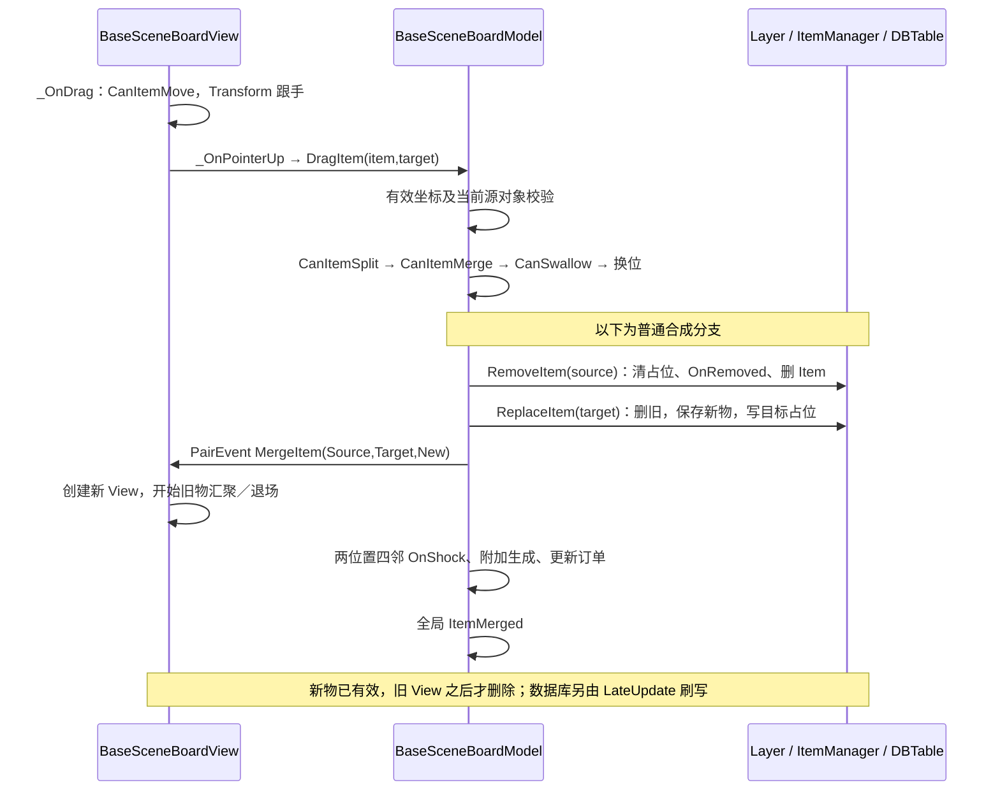

# Seaside Escape 2.6.0：能力怎样工作，一次操作怎样完成

这篇从玩家能看到的行为出发，解释生成器、箱子、蛛网、气泡等功能的实际实现，再把它们串进六条完整流程。

**阅读重点是三个时点：什么时候判断允许操作，什么时候真正修改棋盘，什么时候开始或结束动画。** 它们在这个项目中并不总是连在一起。方法名用于查证，不需要先记住。

正文事实均指恢复 Lua 的**已确认（静态证据）**；推断和待验证项另行标注。架构背景见 [01](01_架构与数据模型.md)，原始依据见 [04](04_证据索引.md)，项目路径和版本说明见文末。

## 1. 它怎样给物品增加一种能力

### 工厂决定“创建时带哪些能力”

物品工厂 `ItemModelFactory` 检查配置字段，再显式添加相应组件。例如，存在 `Spread_Auto` 就添加生成能力 `ItemSpread`，存在变形或吞噬配置就添加对应能力。纸箱、蛛网等包装物走另一组分支。源码没有自动发现组件或反射注册的装配过程（[E07](04_证据索引.md#e07)）。

这里的组件是带数据和行为的 Lua 对象，不是 Unity 的画面组件。`ItemModel:AddComponent` 按组件类型登记，同一种具体组件只能有一份；还登记继承关系，让调用方可以按基类查找。画面也有自己的组件集合，但专用 View 工厂和脚本大多缺失，不能由此确认两侧组件完整对应（[E06/E20/E22/E41](04_证据索引.md#e06)）。

### “能同时存在”不等于“任意组合都有效”

普通物品可以同时拥有生成、吞噬和变形能力。不过，它们是通过明确的业务约定协作：生成前询问吞噬是否完成；吞噬完成后通知生成能力；存在生成能力时，变形能力不自行处理点击（[E14/E24/E25](04_证据索引.md#e14)）。

所有组件响应同一事件时，使用 `pairs` 遍历，没有规定业务先后顺序，也不因某个组件返回 false 就停止派发。若新增两个必须先后执行的能力，需要另外解决顺序问题（[E06](04_证据索引.md#e06)）。

### 能力的数据和生命周期仍需要管理

生成器保留阶段和次数，充能物保留 Initializing/Charging 阶段，吞噬物保留进度，气泡保留“暂不破裂”的标志。组件并没有替代这些业务状态（[E14/E19/E24/E37](04_证据索引.md#e14)）。

本次主路径是在创建物品时装配能力，没有找到逻辑侧 `RemoveComponent`；格位层的组件索引也只在物品进入／离开时维护。因此，已有 Add 方法并不等于运行时任意增删已经完整支持（[E04/E06/E07/E41](04_证据索引.md#e04)）。组件保存时共用一行物品数据，Sand 和 Spread 都写 `spreadState`；当前工厂把它们分在不同路径，不能据此认定已有冲突，但未来若允许共存就必须改保存协议（[E05/E14/E37](04_证据索引.md#e05)）。

`ShowCollapseEffect`、`PlayUpgradeEffect` 等名称中的 Effect 是粒子、材质或动画操作。在已读主盘路径中，没有定位到通用的业务效果实例系统，不能因为名字相似就对应我方 Effect（[E20/E22/E25](04_证据索引.md#e20)）。

## 2. 从具体功能理解能力、限制和外观

### 2.1 生成器和可开启宝箱：同一个能力，不同的阶段

**先理解归属。** 生成能力 `ItemSpread` 附在物品上，没有自己的独立 ID。普通生成器和需要打开的宝箱复用这个组件：配置决定能否自动生成、是否需要初始化或开启、次数、恢复时长、能量费用及产物列表；运行时记录当前阶段、计时起点、剩余次数、储备次数、累计产出数和列表剩余项（[E07/E14](04_证据索引.md#e07)）。

创建时，如果有初始化时长，先进入 Initializing；否则，有开启时长就进入 Closed；都没有则进入 Opened。几个名称可这样阅读：

| 阶段名 | 含义 |
| --- | --- |
| Initializing | 等待首次准备完成 |
| Closed | 还没有开始开启 |
| Opening | 已开始开启，正在计时 |
| Opened | 已开启；能否产出仍取决于次数、空间等条件 |
| OpenFinish | 这类不可循环生成器已经结束 |

**触发和权限。** 手动点击进入 `OnTap → _TrySpread(false)`；自动生成由 `Update → _TrySpread(true)` 触发。每秒更新只负责开启计时和恢复次数。`m_auto>=1` 表示自动，`==2` 的自动模式可以找全盘落点，其余自动路径只找周围八格（[E14/E16](04_证据索引.md#e14)）。

手动入口先检查是否结束、配置的点击锁及 NoCDTrain 限制；自动入口会检查物品的临时锁。共用的生成函数还检查吞噬进度、空间、阶段、次数，手动模式再检查费用。因此 `m_bLocked` 不是所有激活入口共同遵守的禁令。移动权限则另由物品的 `CanMove` 汇总配置、组件和临时锁（[E06/E14/E16](04_证据索引.md#e06)）。

**执行和表现。** 组件选择产物，棋盘创建物品并占格，事件通知画面播放跳跃；之后才扣能量，再处理耗尽或变形。完整顺序见流程 C。组件会发布阶段变化事件，棋盘画面还会根据是否有正在开启的箱子显示叹号；专用生成器 View、开启按钮缺失，所以不能复原完整倒计时界面（[E15–E17/E40/E41](04_证据索引.md#e15)）。

**组合、解除和保存。** 吞噬进度可暂时阻止产出，达到产出次数可触发变形，HuntExtraSpread 还有自动入口排除分支。移动和入库保留组件；合成或替换创建新组件，不通用继承旧次数。一次性物品耗尽会删除，负恢复值对应的非循环类型可进入 OpenFinish。阶段、起点、两级次数、累计产出和列表序列都保存到宿主 Item 行，恢复时按配置重建组件，再读回这些数据（[E05/E07/E12/E14/E16/E24/E28](04_证据索引.md#e05)）。

这里有两个容易混淆的地方：

- **可开启宝箱与纸箱不同。** 前者是正常物品上的生成阶段；`OnOpen` 开始 Opening 计时。已经产出过的开启箱会被 `IsChestUsedOnce` 阻止继续合成。是否同时只允许开一个箱子，需要缺失的按钮入口补证；显示叹号的判断还不够（[E10/E14/E40/E41](04_证据索引.md#e10)）。
- **恢复次数与自动产出不同。** 冷却好后，还要等 Update 尝试产出。满盘或周围八格都满时可能不产；有多次可用次数时，也可能连续多个 Update 尝试，自动入口没有统一的“每颗固定 N 秒”限制（[E14/E16](04_证据索引.md#e14)）。

### 2.2 纸箱、蛛网和等级障碍：外壳本身就是物品

**它们保存什么。** PaperBox、Cobweb、MapBlocker、Gray 都是占格的包装物品。组件保存内层 code；这个字符串表示解除后创建什么，不代表里面已经运行着另一个完整物品。MapBlocker 还保存解锁等级和临时倒计数，Gray 没有层数。工厂根据前缀创建外层种类，主盘和 Hunt 的纸箱可同时附带 Sticker 奖励组件（[E07/E18/E32](04_证据索引.md#e07)）。

**它们怎样解除。** 四类组件都声明不能主动移动，但解除入口不同：

| 包装物 | 触发方式 | 真正的业务变化 |
| --- | --- | --- |
| PaperBox 纸箱 | 邻近合成产生的 OnShock | 替换为内层 code 对应的新物品 |
| Cobweb 蛛网 | 与普通物合成，或付费破网 | 合成时直接得到升级结果；破网则扣费后替换成内层物品 |
| MapBlocker 等级障碍 | 等级事件／教程事件，之后倒计时或点击 | 达到等级后替换物品，移除监听 |
| Gray 灰物 | OnShock | 替换物品；部分活动还继续震动邻格 |

依据 E10/E12/E18。售出等权限由其它条件决定，不能从“不能拖”推导成“所有操作都禁止”。Gray 的邻格扩散要求棋盘提供 `ShockNearby`，本次只在活动方向定位到，不能说主盘一定配置了它。

**蛛网是“不能拖动，但能被合成”的明确例子。** 输入层不允许拖它；但把正常物拖到蛛网上时，合成判断会读取蛛网的内层种类。程序先尝试合成，失败后才判断目标是否能换位。两个蛛网／冰包装同时参与时又有专门拒绝分支（[E06/E09/E10](04_证据索引.md#e06)）。

**画面与逻辑怎样错开。** 蛛网画面读取内层图片，并使用颜色 `(0.63,0.533,0.467)`；这是颜色证据，不是透明度证据。解除外壳时，新物品和新 View 已创建，旧壳还会继续播放约 1.2 秒的退场动画。这条路径没有看到等待退场结束才解锁的统一逻辑锁；实际点击命中谁，还取决于缺失的专用 View 和输入桥接（[E12/E18/E20](04_证据索引.md#e12)）。

**组合和保存有什么边界。** 包装路径通常不装内层的生成能力；纸箱＋Sticker 是可确认的共存组合。两者都响应 OnShock，派发顺序来自 pairs，Sticker 以 `m_hasAcquired` 防重复领取。合成分别检查源和目标四邻，没有本地统一去重集合，不过已替换的外壳不会再从当前格查到（[E06/E07/E11/E32](04_证据索引.md#e06)）。

存档保存包装 code，恢复时重新解析。MapBlocker 的临时摇动倒计数不保存，恢复时若已经达到等级，工厂可直接创建内层物品；Sticker 奖励从坐标配置重取。解除外壳会换 ID，不保留一份完整内层历史状态（[E07/E18/E32](04_证据索引.md#e07)）。

### 2.3 气泡与冰：看起来相近，期限和结果不同

两者也都是物品上的包装组件，没有独立效果 ID，内部主要保存 code。它们本身都没有声明 `canMove=false`，实际能否拖动还要看缺失的 Fixed 配置；库存入口明确拒绝气泡和冰（[E07/E19/E28](04_证据索引.md#e07)）。

**气泡。** `b#` 前缀创建气泡，主盘还附加 ItemToken。它根据内层物品价格决定费用和持续时间，保存开始时间 `m_startTimer`，运行时还有 `m_lockBreak` 标志。每秒检查到期，或由 OnBreak／OnSpeedUp 主动处理；不同活动有各自分支（[E07/E19](04_证据索引.md#e07)）。

付费破泡的主要顺序是扣款、替换内层物、减少气泡计数，再通知画面；到期则按 BubbleBroken 配置的权重选择转换产物。旧气泡淡出时，新物已经存在。画面使用内层图片并播放气泡空闲动画，但专用资源缺失，无法确认精确材质和点击遮挡（[E19/E20](04_证据索引.md#e19)）。

气泡把 `bubbleStartTimer` 保存到 Item 行，期限按配置重算；`m_lockBreak` 不保存。这个标志能阻止到期分支，却不会让时间比例暂停，而且调用者未找到，所以“选中气泡会被保护”仍待验证。常量 60 秒只是兜底，不能说所有气泡都持续 60 秒（[E19/E41](04_证据索引.md#e19)）。

**冰。** `ice#` 或临时前缀创建冰，开始时间和时长由活动提供；取不到时间时，工厂直接返回 Coin01。每秒到期或 OnSpeedUp 会处理转换，临时活动状态变化还可触发移除（[E07/E19](04_证据索引.md#e07)）。

普通冰到期换金币；临时冰取活动指定的转换种类，没有种类就删除。画面同样可显示内层图片；合成爆冰会给旧 View 多加 0.5 秒演出，但不会推迟新业务物的建立。冰没有自己的序列化字段覆盖，恢复时从活动重新获得期限；活动期限的完整保存链尚未追完（[E19/E20](04_证据索引.md#e19)）。

**对建模的含义。** 气泡解除显式清计数并调用 Destroy；冰替换或删除，都会结束原包装身份。两者都没有保留一个仍在运行的内层生成器，因此冰不能直接解释为“临时冻结已有生成能力”。气泡的外层合成规则仍取决于配置；冰可按内层种类参与匹配，但也不能把蛛网的不可拖结论套给冰（[E10/E19](04_证据索引.md#e10)）。

### 2.4 吞噬与变形：能力还在，只是使用条件变化

吞噬组件 `ItemSwallow` 记录所需 Code、Count、已吞数量及重复／逐次喂料标志；变形组件 `ItemTransform` 记录目标类型、权重、时长和起点。它们由普通配置装配，可以与生成能力共存（[E07/E24/E25](04_证据索引.md#e07)）。

设想一件需要先喂料才能生产的物品：未喂满时，Spread 查询 Swallow 进度，拒绝生成；喂满后，Swallow 通知 Spread 开始初始化／恢复次数，或者直接触发变形。整个过程不需要先删除 Spread 再重新添加。重复喂料会清零已吞数量；存在 Spread 时，Transform 不独自处理点击（[E14/E16/E24/E25](04_证据索引.md#e14)）。

但吞噬本身有两套执行顺序：

| 操作 | 业务与动画的顺序 |
| --- | --- |
| 拖入一件材料 | 先增加吞噬进度和成本、保存目标、删除来源，再播放飞行 |
| 点击批量吞入 | 先找到材料并发事件，逐个飞行到达后再调用 Swallow 消费 |

这是同一能力里逻辑与表现边界不同的直接证据（[E24](04_证据索引.md#e24)）。批量飞行中断后怎样处理未到达材料，需要额外验证。

吞噬进度保存为 `swallowInfo` 字符串，变形时间保存为 `transformStartTimer`，都归宿主物品。普通变形先用 Replace 创建新物；Turnbox 的画面随后直接设置新物的临时锁，动画结束再解锁。这个锁不构成通用持久状态，也不通用迁移旧能力数据（[E12/E24/E25](04_证据索引.md#e12)）。

这些功能证明，“保留能力、根据当前事实判断能否使用”是可行的。但它们靠显式互查协调，新增限制时仍要审查手动、自动、批量和动画回调等入口。

## 3. 把输入、数据、画面与保存串起来

下面六条流程是查阅用的完整路径。每条先说明应该观察什么，再列函数和写入顺序。这里只展开已经追到的方法，缺失环节明确留空。

### 流程 A：载入棋盘

先恢复物品对象，再根据格位记录把它们放回棋盘，之后才创建画面对象。可以确认这几个局部步骤，但最外层 GM 怎样把初始化、资源加载和开放输入串起来，材料不全。

| 顺序 | 关键函数／读写 | 状态与表现时点、缺口 |
| --- | --- | --- |
| 1 | `DBTableManager:Init/_LoadTables` 载入表；`ItemDataModel:LoadConfigs` 构造种类和链；MainBoardModel.Init 绑定分表 | 各方法可见，GM 总装配调用顺序未保留，不能补画已证明的全局先后（[E02/E08/E26](04_证据索引.md#e02)） |
| 2 | `BaseSceneBoardModel:OnSyncDataFinished → ItemManager:OnSyncDataFinished` | Item 行→CheckData→Factory.CreateWithData→基础及组件 FromSerialization。旧数据转换会写回（[E05/E07/E34](04_证据索引.md#e05)） |
| 3 | `SceneItemLayerModel:OnSyncDataFinished` | 初次用 BoardModelConfig 创建；已有存档解析 x_y，写矩阵 ID、回填物品位置、建索引（[E04](04_证据索引.md#e04)） |
| 4 | Cache/Order 恢复；主盘库存引用整理；LateInit `_RestoreErrorData` | 孤立 Item 会被删除；不是补偿式事务恢复（[E02/E28/E34](04_证据索引.md#e02)） |
| 5 | `MainBoardView:Awake → BaseSceneBoardView.Init → BaseBoardView.Init` | 遍历格背景和当前物，调用工厂建 View；再注册事件／触摸、置 m_initialized（[E22/E40](04_证据索引.md#e22)） |
| 6 | 外部开放输入、资源加载完毕 | **待验证**：输入桥接、ItemViewFactory 与资源完成协议缺失；没有证据证明一切失败都有回滚或重建 |

恢复本身可调用构造逻辑、配置查找、解锁及序列初始化，不是单纯无副作用 DTO 拷贝。涉及正常随机状态时，应单独验证“载入是否消耗随机序列”，不要从恢复方法名称猜测（[E07/E14/E30/E37](04_证据索引.md#e07)）。

### 流程 B：拖拽、移动、换位与合成

手指拖动时先改变图标位置；松手后，棋盘才判断结果并修改逻辑占位。以下时序图重点看 MergeItem 通知的位置：它晚于核心替换，却早于部分连带变化。



依据 E09–E13/E21/E26。无效目标或源对象被替换时，只 `SetPosition(原位)` 通知回位，不改棋盘；目标空格则先清原位、写目标位、再更新 Item 位置。换位受 `ItemSwitch` 开关选择直接互换或把目标安置至附近空格／源格。

拆分先判断：源有 ItemSplit、目标不是 ItemSplit 时，第二返回值才携带组件，才进入拆分专用分支；目标也是剪刀可继续尝试剪刀合并。确认窗回调会检查两个 Item 是否仍在当前位置（[E10/E23](04_证据索引.md#e10)）。

**一致性边界：**核心物品替换在 MergeItem 事件前生效；完整连锁／附加物并未全部求解后统一提交。PairEvent 同步调用，没有局部异常隔离；若 View 创建抛错，后续 Shock／额外生成／全局事件可能未执行。这是**较强推断的异常路径风险**，不是已复现线上缺陷（[E11–E13/E21](04_证据索引.md#e11)）。

### 流程 C：点击产出

最容易误读的是 `GenerateItemCode`：它的名字像“选一个结果”，实际上已经改次数、随机序列并保存。另一个需要留意的点是 `_TrySpread` 的 false 返回值，有时表示“已经产出，但生成器结束了”。

| 顺序 | 函数和变化 | 普通拒绝／异常边界 |
| --- | --- | --- |
| 1 | 输入再次点击选中物，`TapItem` 动态宏派发所有组件 OnTap | UI 开启按钮优先、订单旁路和选择箱另路；本报告不扩展订单需求（[E09/E40](04_证据索引.md#e09)） |
| 2 | `ItemSpread:OnTap → _TrySpread(false)` 依次查吞噬、空间、阶段、次数、余额 | 这些前置拒绝尚未调用 GenerateItemCode，普通次数／产物无变化；可发表现失败原因（[E14/E16](04_证据索引.md#e14)） |
| 3 | `GenerateItemCode` 改次数／spreadCount、启动恢复、选择产物／推进序列、保存生成器 | **不是只读求解**，物品尚未生成就已有状态变化（[E15/E30](04_证据索引.md#e15)） |
| 4 | `FindEmptyPositionInAttach`，失败再方环搜索 | 手动及全盘自动先选产物后求落点；邻格自动先求空位。若前者因后续重入导致没落点，没有可见回退次数／序列代码（[E16](04_证据索引.md#e16)） |
| 5 | `SpreadItem → GenerateItem`：存 Item，新 ID，写 Board，再通知 View | 新物逻辑存在；动画开始。缺 View 的正常 early return 不等于生成失败；未捕获的表现异常另论（[E12/E17/E21](04_证据索引.md#e12)） |
| 6 | 修正实际多倍费用，`PropertyDataManager:Consume` | 在 Spread 事件之后；返回值未使用。故不能声称扣费／产物／次数是原子提交（[E16/E36](04_证据索引.md#e16)） |
| 7 | 达指定次数变形，耗尽 Remove 或 OpenFinish，或重置 Swallow | `_TrySpread` 返回 false 可能表示已经产出但生成器结束／变形；不得解释成“无副作用失败”（[E16](04_证据索引.md#e16)） |
| 8 | 各 setter 已排 DB 更新，统一写库 | 没有本方法专属事务／撤销；具体 SQL flush 边界见 E26 |

正常满盘拒绝与“异常发生在选择之后”必须区分。没有观察到异常并不证明事务安全；恢复代码的可疑局部变量也不直接证明原游戏有 bug。

### 流程 D：时间、冷却与自动产出

这条流程分成两支：一支让生成器恢复可用，另一支尝试放出物品。只有把两支分开，才能正确讨论满盘和离线行为。

```text
GameModel.GetServerTime（校正后的当前秒，顶层驱动未保留）
  → 当前模式的 BaseSceneBoardModel.UpdatePerSecond
  → BaseBoardModel 遍历格子，逐组件 UpdatePerSecond
  → ItemSpread：起点未设则设置并保存；比例到 1 则恢复／开箱并保存

另一条 Update：取当前盘物品列表 → ItemSpread.Update
  → 自动配置＋有次数＋非 Item 锁＋非 HuntExtraSpread
  → _TrySpread(true)
  → 空位失败静默返回；成功一次生成，无手动体力检查／消耗
```

E14/E16/E29。恢复的两级容量并非简单 `count++`：短周期补满本轮次数并扣内部 storage；storage 到零后从前起点加短恢复时长进入长恢复，可能递归 `UpdatePerSecond`，长恢复完成补满两级。必须按这段控制流理解离线差值，不能用“每过 N 秒无限累加物品”描述。

**较强推断：**有计时起点时，长期离开后可在重新推进时恢复次数；逻辑扫描仅处理棋盘对象，库存物仍留 ItemManager 但不在常规扫格中。**待验证：**GM 的隐藏／后台调度、进程重启到首次 Update 的次序及是否有另外的离线补产系统。本次所读主盘没有发现按离线时长累计生成物循环，不能据此宣布整个游戏不存在该系统。

### 流程 E：解除覆盖／解锁

对这里的包装物，解除主要意味着替换业务对象。旧外壳是否还在画面中，不决定新物品是否已经占格。

| 示例 | 数据变化→权限→表现→保存 | 中断边界 |
| --- | --- | --- |
| 合成震开纸箱 | `_MergeItem` 发 OnShock → PaperBox.ReplaceItem → 新种类按配置拥有权限 → CollapseItem → 新 View 立即创建、旧壳 1.2 秒后删除 | 解除不等动画；新物能力依新配置，非复原内层旧实例。写 Item/Board 已排队（[E11/E12/E18/E20](04_证据索引.md#e11)） |
| 普通物合进蛛网 | CanItemMerge 取内层同种类 → `_MergeItem` 创建更高种类 | 无单独“先解除蛛网再执行第二次合成”的物品身份；同时消费包装及源（[E10/E11/E18](04_证据索引.md#e10)） |
| 付费破蛛网／泡泡 | 余额判断／扣款 → Replace → 新权限由新物得出 → BubbleBreak 动画 | 破蛛网价格可能未提供时，调用前置条件在缺失 UI；不能断言直接调用始终安全（[E18/E19/E20](04_证据索引.md#e18)） |
| 等级障碍 | `_CheckLevel` 设计数 5，发 Shake；每秒减到 <0 或 OnTap → Replace→Collapse→移除监听 | 是倒计数门禁，不是解锁粒子 ACK；恢复 factory checkLv 可直接去掉外层（[E07/E18](04_证据索引.md#e07)） |
| 限时冰到期 | ItemIce.UpdatePerSecond → 替换金币／活动产物或删除 → IceDisappear／BatchRemove | 不等价“冻结结束恢复原生成能力”（[E19](04_证据索引.md#e19)） |

活动云锁是另一归属：m_cloudState→m_tileLock，再更新锁空格数；其可选变换层／活动存档属于 E33，本次只用于区别真正的地格限制，不宣称已完成云锁全链运行验证。

### 流程 F：删除、售出、撤销与清理

“从棋盘删除”“旧画面退场”“彻底释放资源”是不同步骤。售出撤销还会重新使用旧物品对象，因此旧动画不能误删恢复后的新画面。

1. `SellItem` 先通过钱包 Acquire 售出收益，然后 `RemoveItem`。普通 Remove 清 Layer → 组件 OnRemoved → Manager/Item DB 删除，旧 Item 对象保留给消息；此时不再是活跃棋盘物（[E05/E12/E28](04_证据索引.md#e05)）。
2. `SellItem` 发事件。有价格分支直接 RemoveSelf；零价分支缩小 0.5 秒后删除旧 View。动画回调核对 `GetItemView(message.Source)==旧View`；不相等则只清旧资源，避免该分支删掉已恢复的新映射（[E22](04_证据索引.md#e22)）。
3. `UndoSellItem(oldItem)` 读原位置：空则复用；被占且有其它空位则恢复到其它空位；全盘满则先移除占位物，将其 code/成本等推缓存。然后 Consume 扣回收益、旧 Item.SetPosition、SaveItemProperty、SetItem、发 UndoSellItem，View 重新创建（[E28](04_证据索引.md#e28)）。
4. 扣款返回 false 没有阻止上述恢复写入；方法本身没有可见的单次凭据校验。**待验证**：上层是否保证金额、记录仅用一次、是否禁止满盘时撤销。只可说本方法缺少这些检查，不能说玩家一定能重复利用（[E28/E36/E41](04_证据索引.md#e28)）。
5. ItemView.OnDestroy 解绑事件／调度并 Kill 已保存 Tween；BoardView.OnDestroy 解绑 Board 事件。RemoveSelf 是否回池、回池是否执行这些钩子、无归属的 DelayExecuteFunc 是否取消，尚缺桥接／工厂证据（[E22/E41](04_证据索引.md#e22)）。

物品存档可恢复，不表示 Undo 记录可跨关闭恢复；本目录未找到该记录结构或持久入口。对我方专用撤销的启发和不适用处见 [03](03_借鉴评估与待验证问题.md)。

## 4. 动画没结束，又来了新操作，会怎样

这里需要分别看三件事：事件触发事件时怎样排队、旧回调怎样识别当前物品，以及动画取消后谁负责收尾。已有局部保护，但不能合并成“整个系统都安全”的结论。

**已确认（静态证据）：**全局 EventDispatcher 会把嵌套 DispatchEvent 缓存后按 FIFO 取出，但这不替 `DragItem/_TrySpread` 等直接业务调用排队；监听者顺序来自 pairs，且一次派发内没有异常收口。PairEvent 则复制列表立即同步调用；组件内部派发又是第三套 pairs 循环（[E06/E21](04_证据索引.md#e06)）。因此不能把全局事件缓存等同于 CommandRuntime。

局部防护确实存在：PointerUp／确认窗核对物品仍在原位；旧售出 View 回调核对当前绑定；添加 View 检查逻辑占位并清理重叠 View；位置动画尝试停止跳跃 Tween；批量拆分用 UI EventLock；MapBlocker／Bubble 有专用清理（[E09/E10/E18/E19/E22/E23](04_证据索引.md#e09)）。这些机制值得分别学习，不能概括为“没有处理重入”。

**较强推断的风险：**如果取消操作不补执行完成回调，剪刀动画在 0.5 秒前取消就会绕过 DoSplitItem 和 onEnd 解锁；Turnbox 也会绕过清除 m_bLocked。批量吞噬中，已到达的来源已消费，未到达的来源尚未消费。对应方法没有局部 OnKill 收尾协议，仍需排查外部统一 Complete/Kill 和界面销毁路径，不能直接判定运行必然卡住（[E23–E25](04_证据索引.md#e23)）。

`m_bLocked` 是单一布尔：清除它不会越过配置 Fixed 或组件 canMove=false，但会覆盖同一个布尔位上的其它临时持有者。要区分“多个独立组件否决可以共存”和“多个动画共用一个锁位没有所有权”这两个事实（[E06/E25](04_证据索引.md#e06)）。

## 项目与证据说明

分析及可读性整理日期：2026-09-25；项目：Seaside Escape 2.6.0，版本依据本地历史提取记录。仓库根 `/Users/betta/Company/Projects/MergeTwo`；目标根 `参考项目/SeasideEscape_2.6.0_APKPure/`；输出根为目标下 `_分析实现方案/`。源码短名相对目标的 `code/Lua/decompiled/`，链接相对本文。没有运行游戏或进行故障注入，所有风险复现均待验证。
