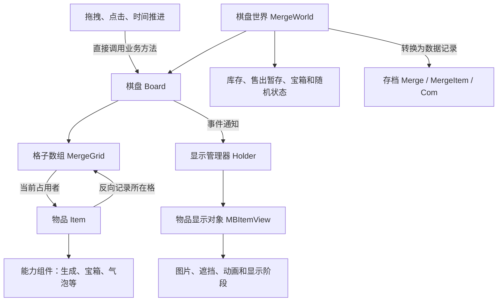

# Tasty Travels：棋盘、物品和画面如何分工

Tasty Travels 的核心分工是：**格子记录占用，物品保存身份与能力，棋盘执行规则，显示对象负责画面。** 普通合成先改变业务数据，再播放动画；部分业务判断仍依赖界面，因此不能把这套分工等同于完全独立的逻辑核心。

分析依据为本地保留的 64.0.0 逆向材料，复核日期为 2026-09-26，未运行游戏。正文的“已确认”指包内原实现的静态行为；“推断”指尚缺配置或实验支持的解释；“待验证”指材料仍不足。热补丁可能改变运行行为，“未找到”也不表示整个游戏没有该功能。

## 1. 从一次合成理解整体结构

玩家把一个物品拖到另一个物品上时，输入管理器会直接调用棋盘的业务方法。棋盘先检查条件，再移除旧占位、创建结果物品，最后通知显示管理器播放合成。**数据中的合成先成立，画面随后演出。**

理解这条流程，只需先记住五个对象：

| 代码名称 | 负责什么 |
| --- | --- |
| `MergeWorld`：棋盘世界 | 组织棋盘、库存、随机产出、等待宝箱、售出暂存物和待清理物品。 |
| `Board`：棋盘 | 管理格子占用，并执行移动、合成、生成、售出等操作。 |
| `MergeGrid`：格子记录 | 记录这里的物品、格类型和所属区域。它是轻量数据单元。 |
| `Item`：物品实例 | 保存实例身份、种类、位置、限制，以及点击生成等能力组件。 |
| `MBBoardItemHolder`／`MBItemView`：显示管理器与物品显示对象 | 前者按物品 ID 管理显示对象；后者管理图片、动画和显示阶段。 |



图中省略了工具类和外部服务，只展示主要数据关系。

### 分工存在，但业务仍有界面依赖

**已确认（静态证据）**：显示对象直接引用正在运行的 Item，并非只能读取一份不可修改的结果快照。反过来，解锁判断 `CanUnlock／isReachBoardLevel` 会读取界面管理器的 `IsLevelDirty`；物品使用工具函数会打开 UI；气泡交互也会读取全局棋盘管理器。这里的“分开”是对象职责分开，并不能直接推出业务代码可脱离界面运行。

**较强推断**：数组、Item 和部分能力可以抽成独立可测核心，但需要替换上述依赖。目标包没有保留测试工程，不能说它已经支持无画面测试。

### 它怎样控制输入和连续操作

已追踪的拖放、点击和时间更新都直接调用模型方法。没有定位到“先排入统一命令队列，再收集整批修改，最后统一应用”的执行器。`UserMergeOperation` 只是操作分类枚举；生成和状态变化的 Context 只是通知参数，不能据此认定存在我方讨论的 Command／Operation 框架。

**较强推断**：主要控制方式是直接调用，加上显示对象的局部输入限制。例如抓取时会检查显示对象是否可拖动；Idle（空闲）和 SpawnMerge（合成生成）阶段可以通过其中一项显示检查。Holder 还记录点击间隔。这些证据不能证明全局禁止重入——这里的“重入”是指某次事件通知又触发新的操作，而前一次操作还没结束。

## 2. 格子怎样保存物品和位置

### 一维数组也可以表达二维棋盘

Board 使用一维 `MergeGrid[]` 存格子。合法坐标从 0 开始，越界返回 -1；`_SetSize` 创建“列数×行数”个格子及云标记数组。

```text
索引 = 行号 × 列数 + 列号
列号 = 索引 % 列数
行号 = 索引 / 列数（整数除法）

             第0列    第1列    第2列
第0行        索引0    索引1    索引2
第1行        索引3    索引4    索引5
```

这只是一个 **3×2 的说明例子，不是已核验的游戏地图尺寸**。

显示格从对象池取得，也就是重复使用已有显示对象。其局部中心坐标为 `(S/2 + 列号*S, -S/2 - 行号*S)`，S 是公共格尺寸，因此列向右、行向下。界面管理器另算原点和缩放；缺少 Prefab，不能确认屏幕原点、Canvas 锚点或实际像素尺寸。拖动图片的位置只用来寻找候选格，最终占位和合成资格仍看 Item／Grid 数据。

### “空着”不等于“可以放这个产物”

格子的 `item == null` 仅表示没有物品。重算空格数时，`mEmptyGridCount` 还会排除锁定位置集合中的格子，但不会按本次生成的规则逐格筛选。

**锁定位置集合已有明确用途。** 刷新云覆盖时，棋盘重建 `mGridsCloud`；若开启 `LockCloudEmptyGrid`，尚未解锁的云区域还会加入 `mLockedPosIdx`，供空格统计和落点搜索排除。这个集合不能解释成已证实的动画预留格；显示层的 `HoldItem` 也不等于逻辑锁格。

通用找格方法可以检查指定物品种类与格类型是否匹配，并检查生成器列出的可能产物是否全部适合该格。但**点击和普通自动生成的入口没有传入本次产物种类，而是把目标种类设为 0**。结合格类型判断，这两条路径只接受 `gridTid == 0` 的默认格。因此，“还有空格”与“本次生成能找到落点”仍可能不同，原因不能笼统写成“本次随机产物不适配”。

物品的 locked／frozen 跟着 Item，云覆盖和格类型留在棋盘位置；两层限制应分别理解。受限物仍可能禁止拖动，不能由“状态跟着物品”推出玩家可以搬走它。当前格类型支持单物品槽与独立覆盖；多格机关、地图孔洞及具体活动形状仍待验证。

### 怎样找附近空位，怎样避免格子与物品位置不一致

空位搜索先检查中心，再逐圈扩大半径；每个候选位置还要通过上述过滤。实现使用 `_WalkNearestFirstForEmptyIdxes` 和 `_TryAddEmptyIdx`，候选列表会缓存。最大距离默认与棋盘最长边有关；圈内的精确方向依赖未还原的 `kSearchRange` 数据，不能写成固定顺时针。静态估计搜索成本约为 O(半径²)，扫全盘约为 O(格数)，没有性能实测。

物品与格子都记录位置关系：格子知道占用者，Item 也知道自己在哪一格。`_SetItemPos` 先更新 Item 位置，确认旧格仍指向该物品后才清旧格，再写新格、维护空格数，最后通知组件和监听者。交换会做两次移动，每次都可能通知别人。**完成后的两边一致，不等于过程中其它代码看不到半次交换。** 是否产生有害重入仍需实验。

### 字段归属速查

下表区分运行时由谁持有数据，以及保存后怎样恢复。

| 对象和身份 | 关键数据／谁能写 | 保存或重建方式 |
| --- | --- | --- |
| 世界 `MergeWorld` | Board、Inventory、LastItemId、待清理列表、售出槽、宝箱及随机状态；世界分配物品 ID | `Merge`；本 DTO 不含售出槽。 |
| 棋盘 `Board` | mGrids、Rows／Cols、空格数、LockedPosIdx、Clouds／Areas；棋盘业务方法写占位 | BoardId、配置和存档共同重建。 |
| 格子 `MergeGrid` | item、gridTid、area；由 Board 维护；gridTid 是格类型，不是格实例 ID | 由格配置与物品位置重建；未声明独立能力或生命周期。 |
| 物品 `Item` | id、tid、coord／parent／grid、dead／locked／frozen、组件字典；Board 和组件可写相关数据 | `MergeItem`。 |
| 点击／自动产出组件 | 次数、计数、产出序列；每类型一份，组件与 Source 基类、世界协作修改 | 各自的 `Com*` 记录。 |
| 云与地块限制 | Cloud／Area、mGridsCloud[]、mLockedPosIdx；棋盘／区域流程维护 | 另存或重建；全部状态迁移未覆盖。 |
| 加速效果 | 创建者、范围、剩余时间与倍率缓存；通用速度工具和邻接倍率是不同路径 | 不应视为通用效果存档方案。 |
| 显示管理器与 `MBItemView` | 显示格、ID→View、活跃 Item 引用、显示阶段及遮挡缓存 | 不保存动画播放进度，重新绑定当前数据。 |
| 存档 `Merge／MergeItem／Com*` | 世界、实例、组件的 Protobuf 数据记录 | 与运行对象分开；字段存在不证明所有读取路径已生效。 |
| 钱包／体力 | 数据在棋盘外；Board 经 Env.CanUse／Use／Sell 调宿主服务 | 未证明与棋盘一起全成全败地保存。 |

## 3. 一个物品怎样拥有不同能力

Item 是普通业务对象。普通物品、生成器、宝箱、箱子、气泡和技能，主要由同一种 Item 配上不同能力组件组成，不必各建一种 Item 子类。显示对象则另用 Unity 的 MonoBehaviour 和显示状态类。这里的组件组合不能仅凭名称归类为 ECS。

**实例身份与合成链是两回事。** `id` 指某一个物品；`tid` 查询物品种类及能力配置。合成组件装上物品后，用 `GetNextItem(tid)` 缓存下一种类，先查系列列表，再走配置回退；等级由 `GetItemLevel` 另行查询。普通同种合成使用缓存结果，双方技能 type=8 还有特殊分支，不能概括成所有合成都只能同种。

**“物品已经消耗”和“画面已经清掉”也是两回事。** 普通消费先用 `BeginDispose` 标记业务死亡，世界更新的清理阶段再用 `EndDispose` 释放能力组件；旧画面可以继续完成动画。售出却保留原 Item 到一个暂存槽，撤销时取回同一对象和 ID。

## 4. 配置、运行状态和存档分别是什么

三者可以这样区分：**配置描述某种物品的规则，运行对象记录这一刻的实际情况，存档记录用于以后重建它。** 当前目录保留配置类型，却缺实际表值，因此不能给出独立核验的掉率、冷却秒数和地图尺寸。

恢复物品时，要还原 ID、种类、位置和限制，再依据组件记录完成能力装配与局部状态恢复，并补齐常驻配置组件。越界、重复坐标或能力验证失败有警告分支；完整坏档修复和未知类型升级政策仍待验证。

### 保存了什么，为什么不能只看字段名

组件种类用 `MergeItem.Com` 的 uint 位图记录，即用整数中的不同位标记组件是否存在；当前类型数为 26。运行字典每类型也只有一份。因此超过位容量、同类型多实例或动态新增类型，都需要同时考虑存档兼容。

点击生成器保存可用次数、待补次数、已用次数、输出与复活计数、免冷却状态（NoCD）、首轮标志，以及随机种子和序列位置。一个容易误读的细节是：旧字段 OutputStart／ReviveStart 当前被写成 0，不能据其名字认定冷却按绝对截止时间保存。编码上，NextIdx 保存时加 1、恢复时减 1，NoCD 在秒和运行毫秒间转换。恢复逻辑已用原生指令核实，不能采信该方法伪 C 中失真的提前返回。

世界层还保存最后活动时间、最后分配的物品 ID、宝箱等待、配置版本、禁用组件类型、各容器物品与随机参数。`LastActiveTime=lastTickMilli/1000`，恢复后用时间差补进度。保存随机参数有助于延续产出序列，但还不能证明“重放相同输入必得相同结果”：外部智能掉落、配置变化和全部随机调用尚未查完。

产出选择也并非每次做一次独立均匀抽奖。Source 基类包含固定物品／类别序列、有序输出、两种随机列表、权重选择及待执行动作；`ConsumeNextOutput` 在这些模式间分支。`PeekNext` 遇到无效或耗尽索引会重置、更新种子并重建列表，`TakeNext` 才推进位置。具体概率和智能替换仍需原表及外部策略。

### 从“形成记录”到“真正存到磁盘”，证据在哪里停止

已定位的存档汇总调用为：

```text
ArchiveMan.SerializeArchive        建立新的 LocalSaveData / ClientData
  → IUserDataHolder.FillData       向各数据模块收集内容
  → MainMergeMan.FillData          收集主棋盘世界
  → MergeWorld.Serialize          转换世界状态
  → Item.Serialize                转换物品及组件状态
```

ArchiveMan 有定时、立即请求及上传路径。**已确认的是形成数据记录的过程；实际本地文件写入及成功确认尚未贯通。** 所以不能把一次合成返回、生成内存记录、真正保存成功看成同一时点，也未证明钱包与棋盘能一起全成全败地持久保存。

## 5. 复用和性能可以判断到哪里

主棋盘和部分活动复用 World／Board，通过不同环境与初始化入口装载。`MergeBoardMan.InitializeBoard` 支持不同装载方向，但这不代表所有活动规则相同。活动只用于说明依赖，不加入我方首期需求。

更新时间时，Board 按效果检查点切成若干时间段，每段逐格、逐组件扫描。因此静态成本约为“格数×每物组件数×时间段数”，再加产出搜索和奖励处理。组件引用、空位列表、View 字典和对象池可减少重复查找／分配，但没有帧耗时、内存回收或压力实测。

## 6. 材料范围与结论边界

来源记录为 64.0.0 XAPK、Unity IL2CPP ARM32、metadata 31。保留材料包含 563 个 C# 类型结构文件、497 个伪 C 文件、10,346 条原生方法记录；其中 10,344 条标记反编译成功、2 条失败，另有 226 条无地址签名。**结构文件中的空方法不代表原方法没有逻辑，反编译“成功”也不保证伪 C 准确。** 本轮用类型、调用关系、伪 C 和关键原生指令交叉核对，没有逐条审完全部方法。

覆盖重点是棋盘、合成、生成器、时间、邻接解锁、售出撤销、组件装配、保存和显示回收；宝箱、气泡及活动只覆盖代表分支。所有技能、奖励处理器、服务器和异步资源回调没有全量审计。

缺少原配置表、Prefab（预制显示资源）、图集、安装包及 IFix 热补丁。因此版本沿用提取记录，具体地图尺寸、掉率、冷却秒数和美术效果不能独立核验。历史分析中的地图数值不作为确认事实；其合成顺序与原实现冲突的部分，已按“先创建结果，再处理旧物消费奖励”更正。
