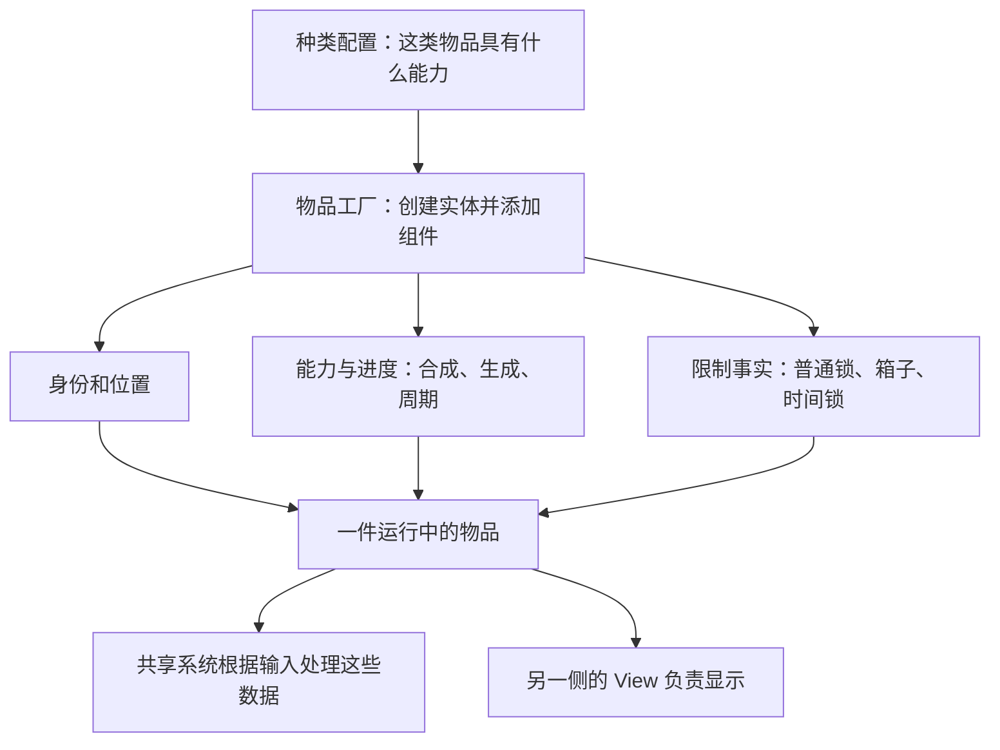
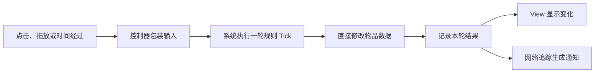

# Travel Town 2.12.1751：架构与数据模型

复核日期：2026-09-26。版本：2.12.1751（87571），arm64-v8a。
目标：`参考项目/TravelTown_2.12.1751_APKPure_arm64/`；本文保存在该目录的 `_分析实现方案/`。

正文默认是**已确认（静态证据）**：保留的字段和方法支持结论，但未运行游戏验证。**较强推断**表示局部证据成立、关键调用或配置尚缺；**待验证**表示现有资料不足。说明性例子与扩展假设另行标明。

资料来自该版本的占位 C#、类型元数据、ARM64 指令和部分伪代码，缺少实际配置、场景、美术资源及部分装配、表现实现。已复核模型、布局、工厂、恢复、合成、产出、周期、解锁、耗尽、售出撤销和相关表现、保存路径；未逐一审计全包。伪代码存在遗漏分支和越过函数边界的情况，关键写入与先后关系以原生指令交叉确认。

<a id="ecs"></a>
## 1. 先看懂 ECS：物品存数据，系统执行规则

**本报告重点还原的这套棋盘实现采用 ECS。**在这里，ECS 是把物品、物品的数据、处理数据的规则分成三部分：

| 名称 | 在这个棋盘中是什么 | 用两个低级物品合成来理解 |
| --- | --- | --- |
| Entity，实体 | 一件运行中的物品，也是容纳组件的对象 | 棋盘上两件同种物品是两个 Entity |
| Component，组件 | 附在物品上的一组业务数据 | 身份、所在格、合成能力、生成次数、是否被箱子盖住，各有自己的组件 |
| System，系统 | 为一类物品执行某项规则的共享代码 | 合成系统读取两件物品的数据，判断后创建新物品，标记旧物品退出 |

这种划分由实现支持：Entity 内部按组件类型保存数据；工厂给它添加组件；合成、生成、时间推进等规则在独立的 System 中执行。因此，这里的 ECS 不只是类名里出现了 Entity 和 Component。

先想象两件待合成的“一级物品”：

```text
物品 A（一个 Entity）
  身份数据：种类 = 一级物品，实例编号 = A
  位置数据：格子 = 1
  合成数据：具有合成能力

物品 B（另一个 Entity）
  身份数据：种类 = 一级物品，实例编号 = B
  位置数据：格子 = 4
  合成数据：具有合成能力

共享的合成系统
  读取 A、B → 判断能否合成 → 按配置建立 C → 标记 A、B 退出
```

这是省略了锁等字段的**说明性示例**。关键在于：A、B 各保存自己的数据，由同一个合成系统读取两者并处理棋盘变化。源码中的对应名称分别是 `ContextualizedECS.Entity`、`IdComponent`、`BoardTilePositionComponent`、合成能力组件及合成系统。

### 1.1 “查询组件”是在做什么

可以把它理解为筛选物品。例如，“从棋盘物品中找出有生成能力、满足本次触发条件的物品，再执行生成规则”。组件回答“这件物品具有什么数据和能力”，系统回答“遇到这次输入，应怎样处理这些数据”。实际查询还会带排除条件；不能仅凭“有生成组件”就认定它现在一定能生成。

Entity 内部实际采用“组件类型 → 组件数据”的字典。同一种组件类型只有一个位置：一件物品可以同时有生成组件和锁组件，但不能仅靠添加两份同类型锁组件，就自动表示两个独立来源的锁。要支持来源、层数和独立到期，需要额外的数据设计。（[实体字段](/Users/betta/Company/Projects/MergeTwo/参考项目/TravelTown_2.12.1751_APKPure_arm64/metadata_blocks/TravelTown.ECSInstance/TypeDef_033678.txt:1)）

这里的业务组件也不同于挂在 Unity 场景物体上的表现组件。Entity 本身不是 MonoBehaviour；物品的图片、拖动和动画由另一侧的 View 管理。已见存储是对象、列表和字典，不能由“采用 ECS”进一步推断它使用了 Unity DOTS、连续内存或多线程并行计算。

### 1.2 同一资料包中保留了两套实现

目录同时保留两套 ECS 相关实现。为避免把不同实现拼成一个不存在的方案，本篇以索引分类中的**新路径**为主：

| 路径 | 结构区别 |
| --- | --- |
| 新路径：Merger.MergeBoard / ContextualizedECS，主要位于 TravelTown.MergeBoard、TravelTown.ECSInstance | 本篇的主体：物品组件字典、实体集合、共享系统、执行后的结果通知 |
| 旧路径：MergeEngine.ECS，主要位于 TravelTown.Main | 棋盘还有二维占位数组；BoardSystem 直接依赖棋盘界面和动画相关数据 |

“旧／新”沿用材料分类，不代表已证明替换先后或哪套正在驱动主棋盘。**待验证：**缺少安装器和实际场景配置，暂不能确定主棋盘、活动棋盘各启用哪套。两者复用一些配置、存档和 View 接口，也不等于共用同一份运行棋盘。新路径另有 ViewportMergeBoardModel 包装外部模型和有效格集合，但这只能证明局部视口结构，不能证明主棋盘与活动棋盘全量复用。

## 2. 棋盘怎样知道“哪件物品在哪一格”

新路径首先保存一份**物品集合**；每件物品的位置组件记录它所在的格子编号。格子本身则通过配置、可用编号集合和界面布局关联起来。已读创建链中，没有找到“每一格也创建一个完整 Entity”的做法。（[棋盘模型](/Users/betta/Company/Projects/MergeTwo/参考项目/TravelTown_2.12.1751_APKPure_arm64/metadata_blocks/TravelTown.MergeBoard/TypeDef_025812.txt:1)、[有效格集合](/Users/betta/Company/Projects/MergeTwo/参考项目/TravelTown_2.12.1751_APKPure_arm64/metadata_blocks/TravelTown.MergeBoard/TypeDef_025804.txt:1)）

下面仍是说明性数据：

```text
可用格子编号：0、1、4、7
物品集合：
  A：位置 1
  B：位置 7

由这些信息得到：
  格子 1、7 有物品
  格子 0、4 可作为空位候选
  编号 2、3 不在可用格集合，不能当作空格使用
```

这里的“空位候选”还要经过实际布局和规则筛选。“没有物品”和“允许放置”不是同一个条件。暂时保留格、多层内容、多格占位，未在本次模型、布局、工厂和移动链中定位到，不能据此断言全游戏没有这些功能。

### 2.1 格子编号不直接等于行列坐标

已读的自由布局实现（FreeformMergeBoardLayout）从格子列表的索引 0 开始编号，再按配置选出有效格。因此索引可以不连续，不能直接套用“编号除以宽度得到行号”的公式。

**格子画在哪里，由布局中的 RectTransform 提供。**RectTransform 是 Unity 中记录界面矩形位置和尺寸的对象。找最近空位时，这套实现比较参照格与候选格的二维距离；判断邻格时，也使用格子的矩形空间关系，而不是简单地用编号加减 1。（[最近格与几何布局](/Users/betta/Company/Projects/MergeTwo/参考项目/TravelTown_2.12.1751_APKPure_arm64/native_arm64/TravelTown.MergeBoard/025700_FreeformMergeBoardLayout.s:278)）

这同时说明一个分层边界：虽然物品规则与图片对象已分开，但找落点、找邻格仍依赖界面布局数据。要把规则拿到没有画面的测试环境中运行，就需要提供等价的纯数据布局服务。

新旧接口之间还有一层位置适配：已见分支将编号编码为 `BoardItemPosition(index, 0)`，反向读取 Col；它不是“棋盘只有一行”的证据。方法还有布局类型分支，不能推广到所有布局。实际棋盘行列数、原点、轴向、尺寸、缩放和锚点仍缺资源与配置证据。

### 2.2 锁住的是物品，还是格子

已还原的普通锁和箱子覆盖数据在**物品**上，分别叫 LockComponent 和 BoxComponent。它们描述“这件物品受什么限制”，而不是一份独立地格进度。初始格配置可以决定放入什么物品、给它什么锁，但配置来源在格子上，不代表运行状态也属于格子。

**较强推断：**若某物品获准移动，普通移动修改位置，不会把它的 Box／Lock 留在原地块。这不表示带锁物品一定能移动，也不证明合成后的新物一定继承旧锁。若要实现“物品走了，地格仍然锁着”，需要独立表达地格状态。

## 3. 不同种类的物品，怎样共用一套实体结构

创建物品时，工厂读取种类配置，然后决定添加哪些组件。这里的“装配”就是**根据配置，把需要的数据放到实体上**。代码中存在明确的添加分支，不是配置里写一个新名称，系统就会自动理解新玩法。（[工厂装配](/Users/betta/Company/Projects/MergeTwo/参考项目/TravelTown_2.12.1751_APKPure_arm64/native_arm64/TravelTown.MergeBoard/025903_MergeBoardItemsEntityFactory.s:510)）

例如，生成器保存产物队列和周期进度，被箱子盖住的物品保存覆盖状态、解除次数或资源条件。生成、周期、拆箱系统分别处理这些数据。



它使用共同的实体容器，再组合不同的数据，并不要求每一种物品都建立一个不同的运行子类。主要业务组件多为结构体，但其中仍可能包含引用对象；“组件是结构体”不能等同于“复制后完全独立”。

### 3.1 能力、限制、阶段各解决什么问题

以生成器为例：

- **能力**回答“它会不会生成物品”。生成组件保存与产物选择相关的数据。
- **进度**回答“还剩多少次、冷却多久、已经产生多少件”。这些数值主要由周期组件管理。
- **阶段**回答“当前处在周期中的哪一步”。TimeCycleState 使用冷却、容量等阶段值。
- **限制**回答“能力还在，但现在是否允许执行”。普通锁、箱子、冷却阻挡等分别参与判断。
- **临时标记**记录“这一轮发生了什么”。例如已移动、已合成、待交互，方便后续系统继续处理。

上述数据同时存在，并不互相替代。因此，锁住生成器不需要先删除它的生成能力；解除箱子也不能顺便清掉另一个普通锁。时间锁系统确实会动态添加或移除阻挡标记，但没有证据表明任意能力都支持完整的动态装卸。

### 3.2 种类、实例、位置和运行对象要分开

| 需要回答的问题 | 对应数据 | 举例及变化方式 |
| --- | --- | --- |
| 它是哪一种物品？ | IdComponent.Id，配置 Id | A 和 B 可以都是“一级物品”；合成链和等级从配置查询 |
| 它是这一种里的哪一件？ | IdComponent.Uuid，实例身份 | 同种的 A、B 也有不同实例身份；恢复时可从保存记录回填 |
| 它现在在哪里？ | BoardTilePositionComponent.Position，位置编号 | 移动改变位置，位置不适合作为永久身份 |
| 当前程序正在操作哪个对象？ | Entity 对象引用 | 运行集合和 View 映射会用它；售出撤销可创建新的 Entity 对象 |

合成会按下一阶配置创建新 Entity，不是把 A 的种类原地改成 C。UUID 的具体生成算法、运行绑定版本协议尚未确认。（[身份字段](/Users/betta/Company/Projects/MergeTwo/参考项目/TravelTown_2.12.1751_APKPure_arm64/metadata_blocks/TravelTown.MergeBoard/TypeDef_026001.txt:1)）

## 4. 玩家操作一次，系统怎样工作

当玩家点击或结束拖拽，界面把操作交给棋盘控制器。控制器将“点击了谁”“从哪里拖到哪里”装成输入，再让系统管理器执行一轮规则。源码把这一轮称为 **Tick**。

这里的 Tick 可以由一次点击、一次移动或一次时间推进触发，**不等于所有业务系统每个画面帧都运行**。控制器暂停时，会跳过规则执行。



一轮可以由多个系统共同完成。例如点击生成，涉及交互资格、实际生成、费用处理；“一个系统”不等于“一个完整玩家操作”。系统之间也会通过临时标记传递进展。

### 4.1 结果通知记录的是“已经发生了什么”

合成和拆箱的方法体都显示：**先修改数据，再记录结果**。执行结束后的通知叫 PostTick，View 从中得知要创建、更新或删除哪些显示对象。网络追踪也会消费这些结果。（[Tick 与 PostTick](/Users/betta/Company/Projects/MergeTwo/参考项目/TravelTown_2.12.1751_APKPure_arm64/native_arm64/TravelTown.MergeBoard/025984_BoardController.s:705)）

ItemsMergedResult 描述的是合成方法已经写入的结果，后续处理者据此播放表现或发送通知；它不是等待统一提交的修改计划。

代码中的 TickArgs 是按类型保存输入或结果列表的容器；TickContext 则把本轮输入、实体集合、结果和临时标记登记放在一起，供系统使用。它们并没有因为名称抽象，就自动提供事务或失败回滚。

**待验证：**已确认单个方法内部的调用顺序，也确认管理器按系统列表执行；但列表中最终有哪些具体系统、排除哪些实体、装饰器怎样改变执行，还未完整恢复。连续输入是否在外层排队、执行中异常如何恢复，也不能从“同步执行一轮”直接推出。

## 5. 逻辑物品和画面物品为什么要分开

Entity 保存业务数据，View 是屏幕上看到、拖动和播放动画的对象。容器记录“这件 Entity 对应哪个 View”；创建 View 时，系统会结合布局、外观适配器、表现配置和对象池完成绑定。View 内还可以组合多个表现行为，业务组件和表现行为不要求一一对应。（[物品显示与绑定](/Users/betta/Company/Projects/MergeTwo/参考项目/TravelTown_2.12.1751_APKPure_arm64/native_arm64/TravelTown.MergeBoard/025709_MergeBoardItemsContainer.s:230)）

在已读流程中，合成先改变逻辑，界面随后呈现结果。因此，画面上的两件旧物还在退场，并不代表它们仍然有效。生命周期至少要区分三件事：

1. **宣布旧物退出。**合成调用的 RemoveEntity 先给旧物加 Dead 标记。
2. **移出运行集合。**KillSystem 找到这些标记，移除旧物并记录退出结果；它另有清理本轮临时组件的入口。
3. **清理画面对象。**View 消费结果，相关回调随后调用 DeleteItems；局部释放链包括清表现行为、取消拖拽和解除容器绑定。

这三个时点不能合并成一个“删除”。合成方法还会先加入新物，再标记两件旧物，所以方法执行中间新旧对象可短暂共存；其它查询怎样排除旧物，依赖尚未完全还原的顺序与过滤规则。

**待验证：**动画调度和对象池后端有缺失，不能确认回调一定等到所有动画结束，也不能确认取消动画后总会正确清理。旧回调是否可能影响撤销后重新绑定的 View，仍需验证。

锁的外观适配器会读取业务组件来判断能否拖动；但具体使用箱子、蜘蛛网、灰色还是半透明资源，不能由这些字段名确定。资料缺少相应资源与部分表现实现。

<a id="persistence"></a>
## 6. 关闭再打开时，怎样把物品恢复回来

运行中的 Entity、保存记录、物品配置是三种不同东西：

- **配置**说明“这一种物品通常有什么能力、合成后是什么”。
- **保存记录**说明“这一件物品已经走到哪里”：实例编号、位置，以及锁、次数、剩余时间和生成队列进度等。
- **运行实体**由工厂按配置重新创建，再把保存的进度填回组件。

负责填回数据的代码称为 state updater，可理解为“状态恢复器”。因此，恢复生成器不能只创建一个相同图标，还要恢复它的额度和产物序列进度；否则业务行为会改变。

**恢复路径有证据，但新棋盘完整的本地保存路径仍待验证。**已见新棋盘在 PostTick 后构建网络通知；旧路径存在本地存储调用。两者尚未接成同一条链，不能把“发了网络通知”或“改了内存”写成“已保存到磁盘”。（[结果转网络通知](/Users/betta/Company/Projects/MergeTwo/参考项目/TravelTown_2.12.1751_APKPure_arm64/native_arm64/TravelTown.MergeBoard/025875_BoardOperationsTracker.s:5)、[旧保存入口](/Users/betta/Company/Projects/MergeTwo/参考项目/TravelTown_2.12.1751_APKPure_arm64/native_arm64/TravelTown.Main/000673_PersistenceSystem.s:1882)）

| 边界 | 已经确认什么 | 还缺什么 |
| --- | --- | --- |
| 内存修改 | 系统直接修改组件、添加实体 | 异常时的通用恢复或回滚 |
| 记录恢复 | 保存记录经工厂和状态恢复器重建物品 | 完整输出序列化、未知配置处理、旧存档迁移 |
| 网络同步 | 操作结果可转成通知，再交 WebSocket 发送服务 | 服务端校验、最终裁决权、重试去重和纠正策略 |
| 本地保存 | 旧 PersistenceSystem 经存储服务保存，有缓存、脏数据键和存储锁 | 新控制器到保存的连接，以及每次操作何时真正持久化 |

## 7. 数据归属、查询成本与测试边界

### 7.1 每份数据由谁持有

以下汇总实际类型及其职责。格子的配置、显示对象和物品的位置各有用途，不应误认为三份可以独立修改的占位状态。

| 层次 | 实际类型与关键字段 | 归属／身份 |
| --- | --- | --- |
| Board | MergeBoardModel：EntitiesManager、IsInitialized、LastBoardTimeSyncTimestamp | 模型对象持有整个运行实体集合；此类型本身未见持久 Board UUID |
| 可用格范围 | ActiveTilesModel：HashSet<int> | 棋盘索引集合；不是每格一个领域 Entity |
| Cell 配置 | TileConfigurationModel：Dictionary<int,DynamicBoardCellConfiguration>；后者含 Index 并沿用初始格配置 | 配置键；初始物品／锁等信息不等于独立运行 Cell 状态机 |
| 逻辑位置 | BoardTilePositionComponent.Position | 归 Item Entity；int 位置，非持久 Item 身份 |
| Item 运行对象 | ContextualizedECS.Entity：Type→IComponent | 对象引用用于集合／View 映射；相同配置可有多个实例 |
| 配置／实例身份 | IdComponent：Id、Uuid、Origin、Created/Merged/QueueAddedTimestamp | Id 指物种配置，Uuid 表实例；链／等级由配置模型查询 |
| 能力数据 | Producer／Spawner／Merge／Interaction／TimeCycle 等组件 | 附着 Item；不是每项独立 UUID；共享 System 处理行为 |
| 限制／覆盖事实 | BoxComponent、LockComponent、FixedPositionComponent、TimeLockBlockComponent 等 | 归 Item；Box 中还有交互次数、资源、拆箱类型 |
| 短期阶段标记 | Born、Dead、ItemMoved、ItemMerged、Unboxed、PendingInteraction 等 | 同 Tick 或生命周期标记；含临时登记／清理机制 |
| Cell 表现 | MergeBoardLayout.Tiles；MergeBoardView 的 int→BoardCellView | 索引对应 RectTransform／View；资源不在目录中 |
| Item View | MergeBoardItemsContainer：Dictionary<Entity,IBoardItemView>；BoardItemView2：Behaviour 字典 | 表现实例和绑定；含拖拽／tween 等显示状态 |
| 存档／同步记录 | ItemPayloadBase、MergeBoardItemState、SerializedMergeBoardItemPositionComponent | 保存／传输记录（DTO）中有 id、uuid、index 与可选能力数据；与运行对象分开 |
| 旧 Board／位置 | BoardComponent 的 TwoDArray<PositionComponent>；PositionComponent 的 BoardItemPosition、OnBoard | 旧模型同时持占位与物品位置；MoveItem 负责同步旧／新格 |

### 7.2 空位搜索与运行成本

已读最近空位方法在参照格无效时返回失败；合法时逐个比较二维直线距离，只在候选更近时替换结果，等距时保留先遇到的候选。因此，要知道等距时优先哪个方向，还必须知道候选枚举顺序。邻接接口包含 GetTouchingTiles 和 GetHorizontalVerticalTouchingTiles，精确边缘容差、maxDistance 配置和资源缩放仍待验证。

**静态估计：**有 T 个候选格时，距离比较本身遍历 T 个候选；若每格又遍历 N 件物品检查占位，组合成本可能达到 O(TN)。集合是否提前生成、实际耗时和分配量均未验证，不能只据此评价性能。旧实现有距离缓存，不能拿来证明新布局也有同样缓存。运行中还可见组件字典查询、每轮输入／结果集合和迭代器分配；这些是应测量的成本，不是 ECS 必然更快或更慢的证据。按 UUID 常数时间查找也未得到证明。

### 7.3 能否独立运行、谁能修改状态

**较强推断：**主要规则可抽成测试核心，但至少要替换界面坐标依赖，并提供配置、钱包、时钟和系统装配。当前材料不是可编译工程，本次没有完成无画面运行验证。

组件不是只有某一个系统能写。工厂、恢复器和多个系统都有写入入口；费用描述放在交互组件中，真正的资源余额由宿主资源服务处理。业务事实主要集中在这些数据与服务中，但这不证明已经实现“所有业务只能从一个入口修改”，也不证明全部界面路径都只读。

资料清单记录包名 `io.randomco.travel`、Unity 2022.3.62f2，共 1355 个类型、7578 个方法声明、5871 个常规 RVA、1044 个泛型地址，1791 个地址至少保留一种伪代码。这些是材料覆盖数，不是本次阅读数；版本和哈希依保留清单，未重新核验原 XAPK。（[版本清单](/Users/betta/Company/Projects/MergeTwo/参考项目/TravelTown_2.12.1751_APKPure_arm64/source_manifest.json:1)）
